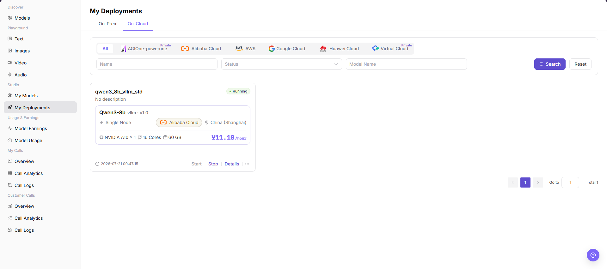
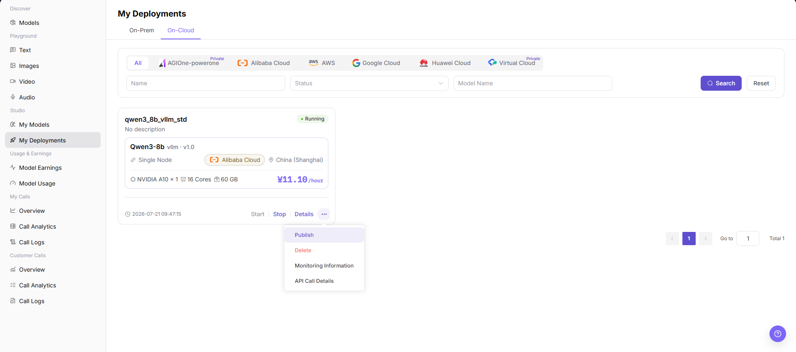
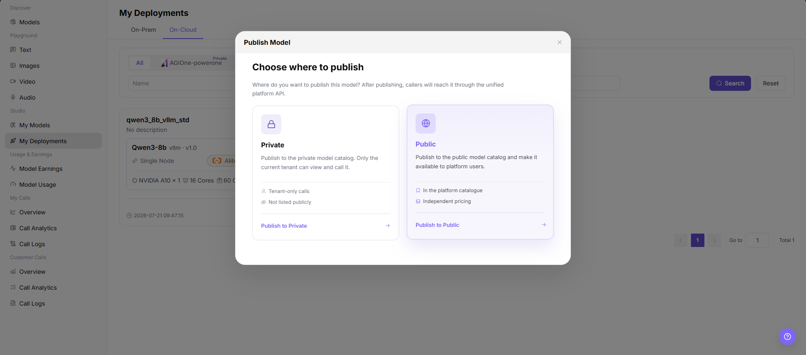
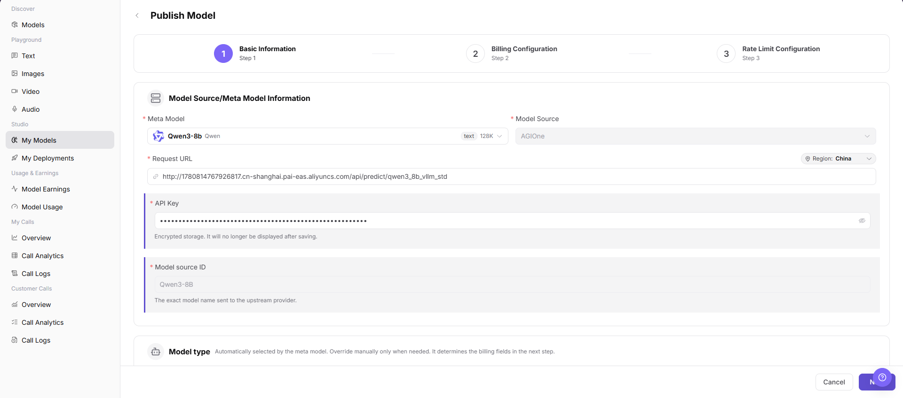

# My Deployments

::: info Document Information
Version: v1.0
Updated: 2026-07-21
:::

## Feature Overview

`My Deployments` is used to view model deployment records in Studio and enter the model publishing flow from eligible deployments. Users can verify deployment status, model name, region, resource specification, and operation entries in the deployment list, then select a publish region and continue on the `My Models` publish model page.

| Item | Content |
| --- | --- |
| Applicable role | Model provider or user with deployment publishing permissions |
| Navigation path | Model Services > Studio > My Deployments |
| Page route | `/modelone/my-deployments/models` |
| Managed objects | Self-hosted models, on-cloud deployment records, deployment status, resource specifications, and publish entry |
| Typical use | View deployment information, enter the publish model flow, and select a publish region |

#### Beginner Explanation

`My Deployments` is the deployment record entry for model providers. Users first confirm that a model service has been deployed and is eligible for publishing, then use `Publish` to choose `Private` or `Public` and continue with the publish model configuration flow in `My Models`.

#### Terms Quick Reference

| Term | Description |
| --- | --- |
| My Deployments | Shows model deployment records visible to the current account, including On-Prem and On-Cloud deployments. |
| Publish Model | Sends the target deployment into the publishing flow, where model information, billing, and rate limits are configured in `My Models`. |
| Publish Region | Publishes the model to `Private` or `Public`. |
| Publish Entry | The `Publish` action in the deployment card's more actions menu, used to open the publish region dialog. |
| Redirect Target | The `My Models > Publish Model` page opened after a publish region is selected. |

## Prerequisites

1. The current account has permission to view `Studio > My Deployments`.
2. At least one deployment record is available on the page.
3. The target deployment meets the conditions for displaying the publish entry, and `Publish` is visible in the more actions menu.
4. Before publishing, the publish region, visibility scope, billing configuration, and call configuration risks have been confirmed.
5. For learning or page validation only, view fields, dialogs, and redirect results without performing final publish, submit, or save actions.

::: warning High-Risk Operation Boundary
Publishing a model may affect model visibility, call methods, billing configuration, and user access. Selecting the wrong publish region may publish the model to the wrong site, region, or business scope. The final `Publish`, `Submit`, and `Save` actions after the redirect are high-risk final actions. For learning or page validation only, confirm the redirect and field display without final confirmation.
:::

## Page Description

The page title is `My Deployments`. It includes the `On-Prem` and `On-Cloud` tabs. The page supports filters by `Name`, `Status`, and `Model Name`, and refreshes the list with `Search` and `Reset`. Each deployment card shows deployment name, model, inference engine, version, deployment mode, cloud platform, region, resource specification, cost, deployment status, and operation entries such as `Start`, `Stop`, `Details`, and the more actions menu.

In the more actions menu of the target deployment, the page shows entries such as `Publish`, `Delete`, `Monitoring Information`, and `API Call Details`. This document only describes the `Publish` entry for viewing and redirecting to the publish flow.

After clicking the publish entry, the page shows the `Publish Model` dialog and asks the user to choose where to publish. Available destinations include `Private` and `Public`, with buttons `Publish to Private` and `Publish to Public`.

After a publish region is selected, the page redirects to the `Publish Model` page under `Model Services > Studio > My Models`. The page includes the `Basic Information`, `Billing Configuration`, and `Rate Limit Configuration` steps, and shows fields such as `Meta Model`, `Model Source`, `Request URL`, `API Key`, `Model source ID`, and `Region`.

## Main Operations

### Publish Model

1. Go to `Model Services > Studio > My Deployments`.
2. On the `On-Cloud` tab, find the target deployment and verify deployment name, model name, deployment status, region, and resource specification.
3. Click the more actions menu `...` on the target deployment card, and select `Publish`.
4. In the `Publish Model` dialog, review `Choose where to publish`.
5. Select `Private` or `Public` according to the publish target.
6. Click `Publish to Private` or `Publish to Public`. The page redirects to the `Publish Model` page under `Model Services > Studio > My Models`.
7. On the publish model page, continue checking `Basic Information`, `Billing Configuration`, `Rate Limit Configuration`, and fields such as `Meta Model`, `Model Source`, `Request URL`, `API Key`, `Model source ID`, and `Region`.
8. For learning or page validation only, confirm the redirect and field display. Do not perform the final `Publish`, `Submit`, or `Save`.

## Parameter Reference

| Field Name | Required | Field Type | Example | Description |
| --- | --- | --- | --- | --- |
| Deployment Name | Yes | Text | Displayed on page | Identifies the target deployment record. |
| Model Name | Yes | Text | `Qwen3-8b` | Model associated with the target deployment. |
| Deployment Status | Yes | Status tag | `Running` | Indicates whether the deployment may show a publish entry or meet later publishing conditions. |
| Region | Yes | Text | `China (Shanghai)` | Region where the target deployment is running. Verify it against the publish region and business scope before publishing. |
| Resource Specification | Yes | Text | `NVIDIA A10 x 1` | Shows GPU, CPU, memory, and other resource specifications used by the deployment. |
| Publish Entry | Yes | More actions | `Publish` | Entry from the target deployment to the publish region selection flow. |
| Publish Region | Yes | Card selection | `Private` / `Public` | Determines the publish target and visibility scope after the redirect. |
| Redirect Target | Yes | Page redirect | `My Models > Publish Model` | Target page after a publish region is selected. |
| Publish Scope | Conditionally required | Page configuration | Displayed on the publish model page | Confirms the model visibility scope on the publish model page. |
| Billing Configuration | Conditionally required | Step configuration | Displayed on the publish model page | Confirms pricing, free quota, or billing method on the publish model page. |
| Call Configuration | Conditionally required | Step configuration | Displayed on the publish model page | Confirms request URL, API key, model source ID, rate limits, and other call-related settings. |
| Actions | No | Row buttons / more menu | `Start` / `Stop` / `Details` / `Publish` | Page entries for viewing, controlling, or entering the publish flow. |

## Result Validation

| Check Item | Success Criteria | Troubleshooting |
| --- | --- | --- |
| Page is accessible | The `My Deployments` page opens normally, and the `On-Prem` and `On-Cloud` tabs are visible. | Check account permissions, navigation path, and page loading status. |
| Deployment list loads | The target deployment card shows deployment name, model name, status, region, and resource specification. | Click `Search` or `Reset` and retry. Check filters and deployment permissions if needed. |
| Target deployment status is visible | The target deployment status is shown as the real page status, such as `Running`. | Confirm whether the deployment task is complete, or open `Details` to view deployment status. |
| Publish entry is visible | Eligible deployments show `Publish` in the more actions menu. | Check deployment status, account permissions, and available page actions. |
| Publish region can be selected | The `Publish Model` dialog opens and shows `Private`, `Public`, and the corresponding publish buttons. | Close the dialog and retry, or check whether the account has permission for the selected publish region. |
| Redirect target is correct | After selecting a publish region, the page opens the `Publish Model` page under `Model Services > Studio > My Models`. | Check publish region permissions, page route, and browser redirect status. |
| Publish fields display normally | `Basic Information`, `Billing Configuration`, `Rate Limit Configuration`, and key fields are displayed normally. | Go back and select the publish region again, or refresh the publish model page. |
| High-risk actions are not triggered | During learning or page validation, the final `Publish`, `Submit`, or `Save` is not clicked. | If a real publish action is triggered by mistake, immediately record the time, deployment name, and publish region, then notify the owner for review or rollback. |

## FAQ

#### Why is the publish entry not visible in the deployment list?

Common causes include a deployment status that does not meet publishing conditions, missing publishing permissions for the current account, or a deployment type that does not support direct publishing from `My Deployments`. Check deployment status and account permissions first, then confirm the actual entry in the more actions menu.

#### Why does the page not redirect after selecting a publish region?

The selected publish region may be unavailable to the account, the page route may fail to load, or the target deployment information may be incomplete. Close the dialog and start the publish flow again, and confirm that the browser is not blocking the redirect.

#### What is the risk difference between publishing to Private and Public?

`Private` usually affects visibility and calls within a controlled scope. `Public` may expand the model's external visibility. Before selecting a destination, verify the target site, region, business scope, billing configuration, and call configuration to avoid publishing the model to the wrong scope.

#### Can real Request URLs or API Keys be recorded in this document?

No. Do not write real accounts, secrets, tokens, AK/SK, Endpoints, API Keys, customer names, pricing strategies, cloud resource IDs, or internal test parameters in the document. Before screenshots or export, also confirm that sensitive fields are redacted.

## Next Steps

1. Return to `My Models` to view the publish model configuration progress.
2. Verify model visibility, billing configuration, and call configuration according to the selected publish region.
3. If a real publish action has been performed, open model details or the call page to confirm status and access control.

## Notes

- Publishing a model affects model visibility, call methods, billing configuration, and user access.
- Selecting the wrong publish region may publish the model to the wrong site, region, or business scope.
- `发布 / Publish`, `提交 / Submit`, and `保存 / Save` are high-risk final actions.
- Do not write real accounts, secrets, tokens, AK/SK, Endpoints, API Keys, customer names, pricing strategies, cloud resource IDs, or internal test parameters.
