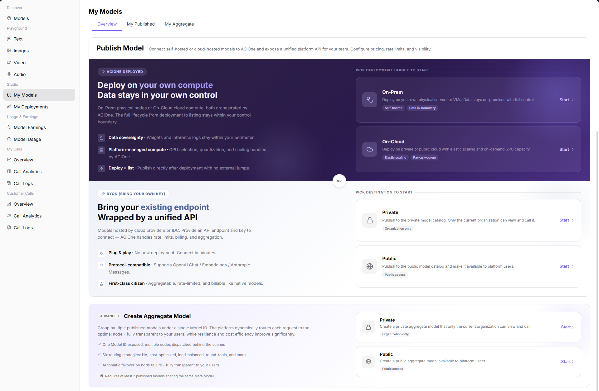
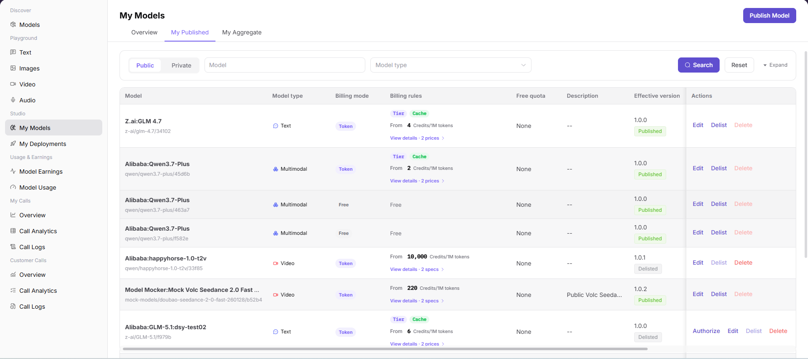
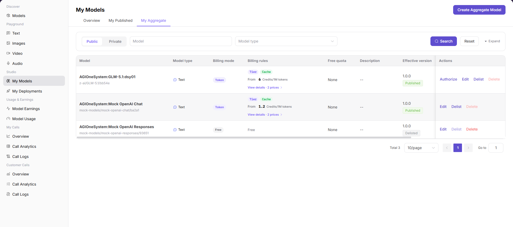
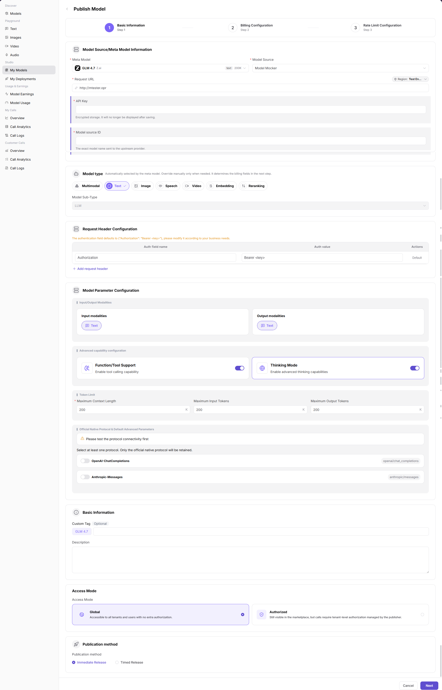
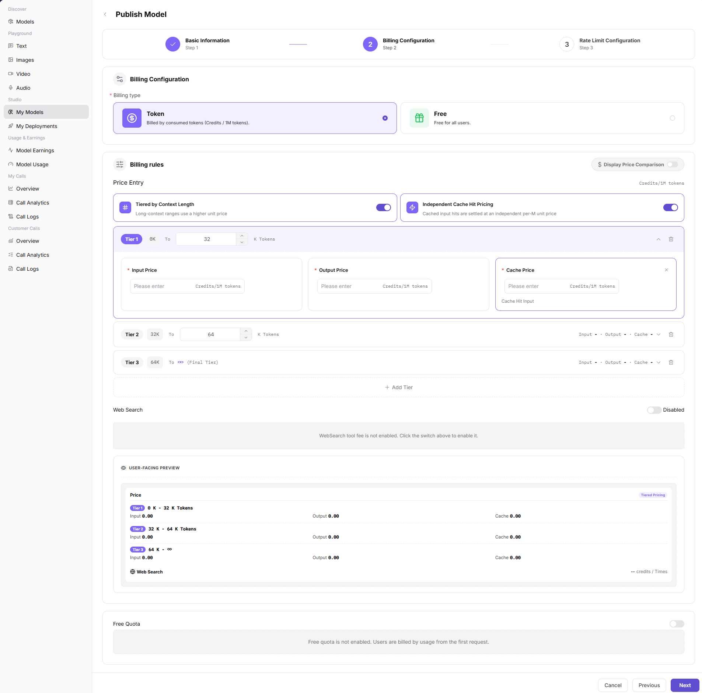
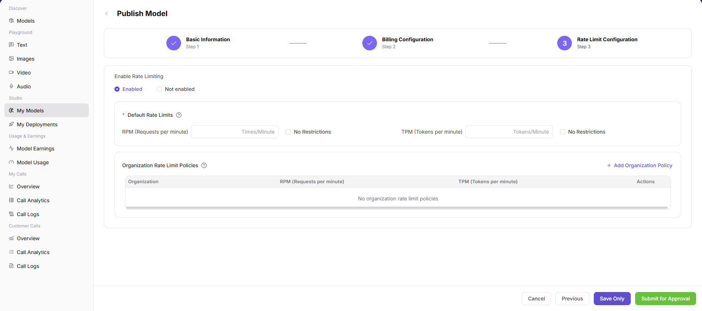
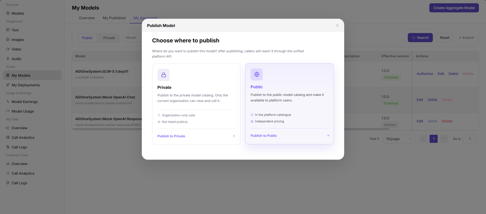
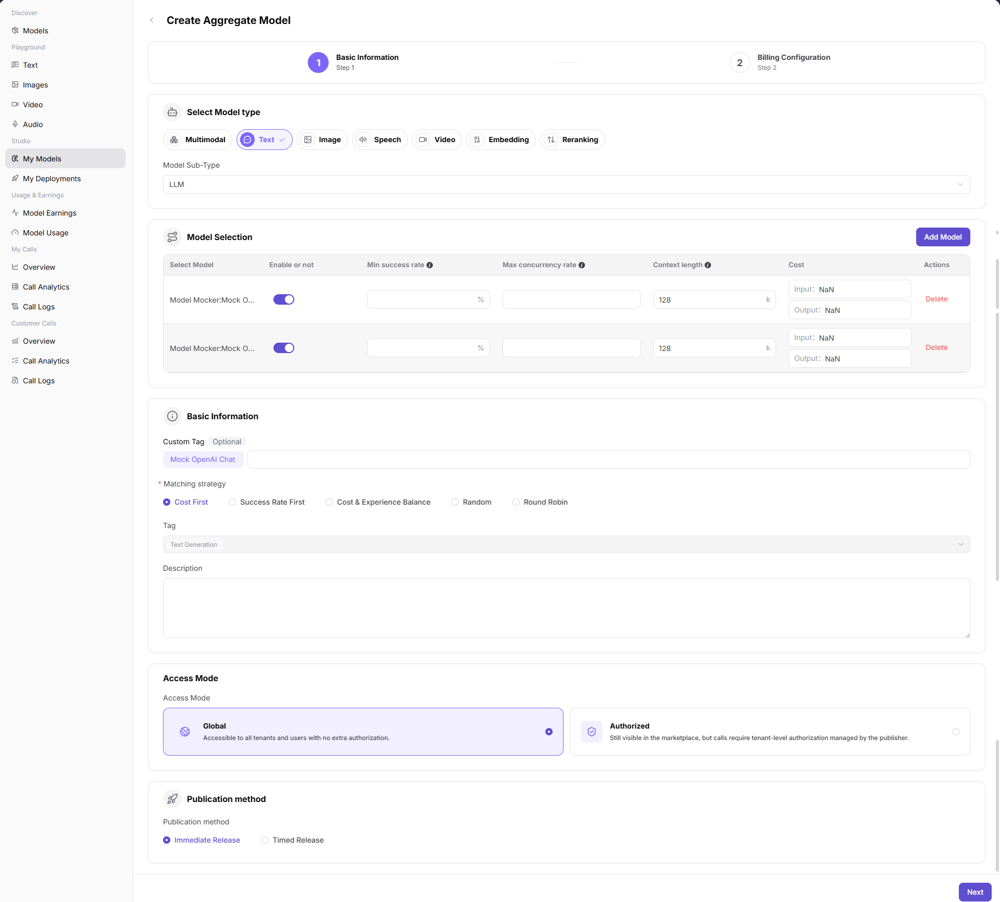
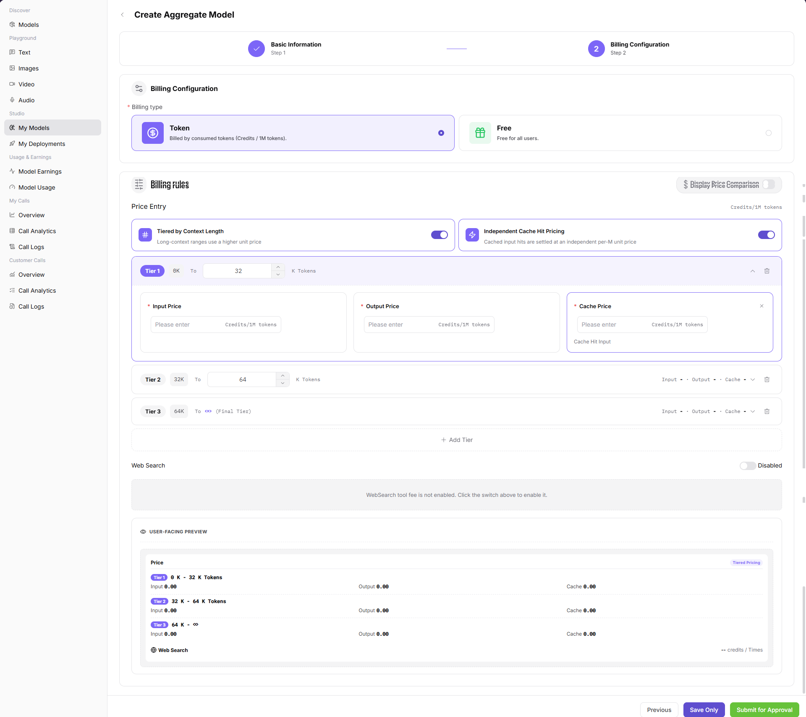

# My Models

::: info Document Information
Version: v1.0
Updated: 2026-07-08
:::

## Feature Overview

`My Models` is the workspace for model providers to maintain and publish models. It supports publishing models, managing published models, and creating aggregate models. Users can select a publishing destination, configure model basic information, billing rules, rate limits, and visibility.

| Item | Content |
| --- | --- |
| Applicable role | Model provider |
| Navigation path | Model Services > Studio > My Models |
| Page route | `/modelone/model` |
| Managed objects | Published models, aggregate models, model sources, meta models, protocols, billing, rate limits, and visibility |
| Typical use | Publish models, delist models, edit models, and create aggregate models |

#### Beginner Explanation

`My Models` is the publishing console for model providers. `My Published` is used to manage published or pending single models. `My Aggregate` is used to combine multiple published models into one external model and improve availability, cost control, or call stability through routing strategies.

#### Terms Quick Reference

| Term | Description |
| --- | --- |
| Publish Model | Connect a self-hosted or cloud-hosted model to AGIOne and publish it to a private or public destination. |
| Aggregate Model | Combines multiple models of the same type under one Model ID, with the platform routing requests by strategy. |
| Publishing destination | Publishes the model to `Private` or `Public`. |
| Access Mode | Controls whether the model is accessible to all tenants or requires authorization before calls. |
| Matching strategy | Routing strategy for an aggregate model, such as Cost First, Success Rate First, Cost & Experience Balance, Random, or Round Robin. |
| Billing Configuration | Defines Token billing, free access, tiered pricing, cache price, free quota, and other billing rules. |
| Rate Limit Configuration | Defines request frequency, concurrency, quota, or other call control policies. |

## Prerequisites

1. The current account has access to the `My Models` page.
2. Before publishing a model, the meta model, model source, request URL, authentication information, protocol, and billing plan are prepared.
3. Before creating an aggregate model, at least two compatible published models are available for aggregation.
4. Publishing, saving, submitting, creating, delisting, or deleting can affect real model services. For page validation only, do not perform final confirmation.

::: warning High-Risk Operation Boundary
`Publish`, `Submit`, `Save`, `Create`, `Delist`, `Delete`, changing billing type, pricing, Web Search, free quota, visibility, call configuration, or routing strategy may affect real model services, customer calls, billing results, or user quota. For learning or screenshots, only open the page, dialog, or configuration step to view fields, and close it with `Cancel`, back navigation, or the close button without final confirmation.
:::

## Page Description

The page includes three tabs: `Overview`, `My Published`, and `My Aggregate`. `Overview` shows entries for publishing models and creating aggregate models. `My Published` shows the published model list and operation entries. `My Aggregate` shows the aggregate model list and operation entries.

## Main Operations

### Publish Model

1. Go to `Model Services > Studio > My Models`.
2. On `Overview`, select a publishing entry, or go to `My Published` and click `Publish Model`.
3. In the `Publish Model` dialog, choose a publishing destination, such as `Private` or `Public`.
4. On the `Publish Model` page, in `Basic Information`, maintain meta model, model source, request URL, API key, model source ID, model type, request header configuration, input/output modalities, advanced capabilities, Token limits, protocol, custom tag, description, Access Mode, and publication method as required by the page.
5. Click `Next` to enter `Billing Configuration`, and configure Billing type, Price Entry, Input Price, Output Price, Cache Price, Web Search, Free Quota, or other pricing or free quota settings as required by the page.
6. Verify that model information, billing type, pricing, Web Search, free quota, and visibility are correct.
7. Continue to `Rate Limit Configuration`, and configure rate-limit policies as required by the page.
8. Before clicking the final `Publish`, `Save`, or `Submit`, verify model source, protocol, pricing, visibility, and rate limits again. For page validation only, go back or close the page without final submission.

### Create Aggregated Model

1. Go to `Model Services > Studio > My Models`.
2. On `Overview`, select a create aggregate model entry, or go to `My Aggregate` and click `Create Aggregate Model`.
3. In the `Publish Model` dialog, choose a publishing destination, such as `Private` or `Public`.
4. On the `Create Aggregate Model` page, in `Basic Information`, select model type, model sub-type, and models to aggregate.
5. In `Model Selection`, confirm whether each model is enabled, minimum success rate, maximum concurrency rate, context length, and cost.
6. In `Basic Information`, configure custom tag, matching strategy, tag, and description. Matching strategy can use options shown on the page, such as Cost First, Success Rate First, Cost & Experience Balance, Random, or Round Robin.
7. Configure Access Mode, publication method, and Billing Configuration.
8. Before clicking the final `Create`, `Save`, or `Submit`, verify selected models, routing strategy, pricing, and visibility again. For page validation only, go back or close the page without final submission.

## Parameter Reference

| Field Name | Required | Field Type | Example | Description |
| --- | --- | --- | --- | --- |
| Publishing destination | Yes | Card selection | `Private` / `Public` | Determines the catalog and call scope after publishing. |
| Meta Model | Required for publishing | Dropdown | `GLM 4.7` | Defines model capability, protocol, and base type. |
| Model Source | Required for publishing | Dropdown | `Model Mocker` | Model request source or provider connection source. |
| Request URL | Required for publishing | Input | `https://example.com` | Model service access URL. Do not write real internal URLs in the document. |
| API Key | Conditionally required | Secret input | `Bearer <key>` | Authenticates model source requests and is not shown after saving. |
| Model Source ID | Conditionally required | Input | `model-id` | Model identifier sent to the upstream provider. |
| Model Type | Yes | Radio / tag | `Text` | Model capability type, such as Text, Image, Speech, Video, Embedding, or Reranking. |
| Protocol | Yes | Toggle / tag | `OpenAI-ChatCompletions` | Call protocol supported by the model. |
| Access Mode | Yes | Radio card | `Global` / `Authorized` | Controls whether calls require authorization. |
| Publication method | Yes | Radio | `Immediate Release` / `Timed Release` | Controls when publishing takes effect. |
| Billing type | Yes | Selector | Displayed on page | Sets the model call billing method. |
| Price Entry | No | Selector / toggle | Displayed on page | Sets the pricing configuration entry or how pricing takes effect. |
| Input Price | Conditionally required | Number | Displayed in page unit | Sets the billing price for input Tokens, characters, or requests. |
| Output Price | Conditionally required | Number | Displayed in page unit | Sets the billing price for output Tokens, characters, or results. |
| Cache Price | No | Number | Displayed in page unit | Sets the price for cache hits or cache-related calls. |
| Web Search | No | Toggle / selector | `On` / `Off` | Sets whether the model supports Web Search and related billing capabilities. |
| Free Quota | No | Number | Displayed in page unit | Sets the quota that users can use for free. |
| Aggregate Model | Required for aggregation | Model selection | `Model Mocker:Mock ...` | Published model included in the aggregate model. |
| Matching strategy | Required for aggregation | Radio | `Cost First` | Strategy used by the platform to choose aggregate nodes. |
| Weight / success rate / concurrency | Conditionally required | Number input | `50%` | Controls aggregate routing and node availability. |
| Status | No | Tag | `Published` / `Delisted` | Current publishing status of the model. |
| Actions | No | Row buttons | `Authorize` / `Edit` / `Delist` / `Delete` | View or manage a model record. |

## Result Validation

| Check Item | Success Criteria | Troubleshooting |
| --- | --- | --- |
| Page is accessible | The `My Models` page opens normally, and `Overview`, `My Published`, and `My Aggregate` tabs are visible. | Check account permissions, navigation path, and page loading status. |
| Model list loads | `My Published` or `My Aggregate` shows model records, status, version, and operation entries. | Click `Search` or `Reset` and retry. Check permissions and filters if needed. |
| Publish Model entry is visible | The `Publish Model` button or publishing entry is visible and can open the publishing destination dialog. | Check whether the account has model publishing permission. |
| Create Aggregate Model entry is visible | The `Create Aggregate Model` button or entry is visible and can open the publishing destination dialog. | Confirm that compatible published models are available. |
| Publish fields display normally | Basic Information, Billing Configuration, and Rate Limit Configuration steps are displayed normally. | Go back to select the publishing destination again, or refresh the page. |
| Aggregate fields display normally | Model Selection, Matching strategy, Access Mode, publication method, and Billing Configuration are displayed normally. | Check whether selected models meet the same meta model requirement. |
| High-risk actions are not triggered | During learning or screenshots, final `Publish`, `Submit`, `Save`, `Create`, `Delist`, or `Delete` is not clicked. | If a real change is triggered by mistake, immediately record the time and model information and notify the owner for rollback or review. |

## FAQ

#### Why is a model not visible after publishing?

The model may still be under review, the publishing task may not have completed, visibility may be set to private, or the model version may not be associated with a valid template, source, or meta model. Check status and review records first, then verify visibility, provider information, and version configuration.

#### Why are no models selectable when creating an aggregate model?

Common causes include too few aggregatable models, inconsistent model type or meta model, or target models that are not published. Confirm that at least two compatible published models are available before starting the create flow.

#### Can pricing or routing strategy be changed freely?

Not recommended. Billing type, Input Price, Output Price, Cache Price, Web Search, Free Quota, visibility, rate limits, call configuration, and routing strategy affect customer calls, billing results, user quota, and model quality. Confirm the impact scope before changing them, and review carefully before final save.

## Next Steps

1. After publishing, view model status, review records, and effective version.
2. Go to Model Marketplace or Playground to verify model name, capability, pricing, and visibility.
3. Track call quality and billing results through call logs, usage details, and model earnings.
4. After an aggregate model is live, continue monitoring success rate, latency, cost, and routing hits.

## Notes

- Do not write real accounts, passwords, access parameters, API keys, tokens, AK/SK, private keys, or internal test processes in the document.
- Before screenshots or export, confirm that the page does not contain real secrets, unredacted request headers, internal Endpoints, or sensitive business data.
- Publishing models and creating aggregate models may affect real services. For learning, view fields only and do not perform final confirmation.
- Pricing, billing type, Web Search, and free quota affect real call costs, billing statistics, and user quota. The document only describes the configuration flow and does not record real pricing strategies.
