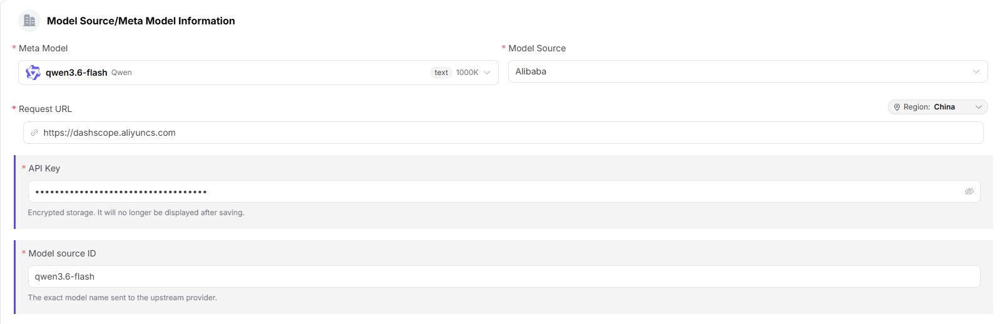
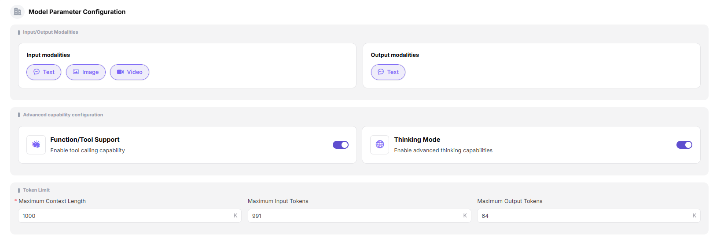
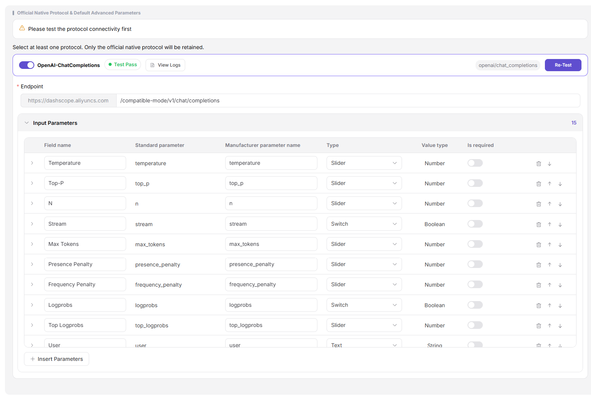
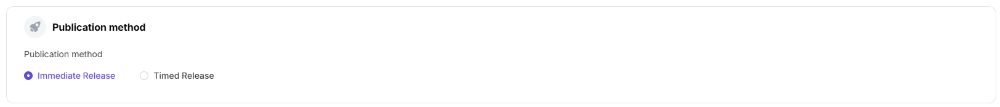
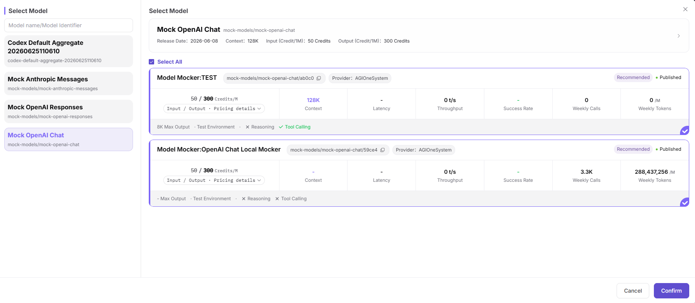
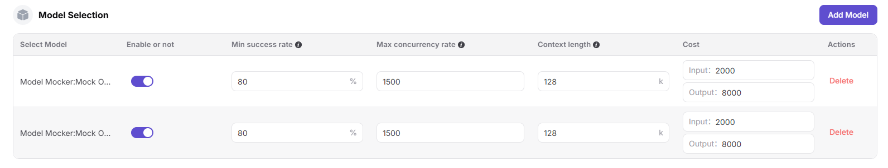
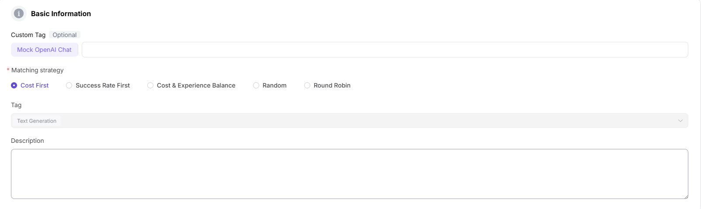
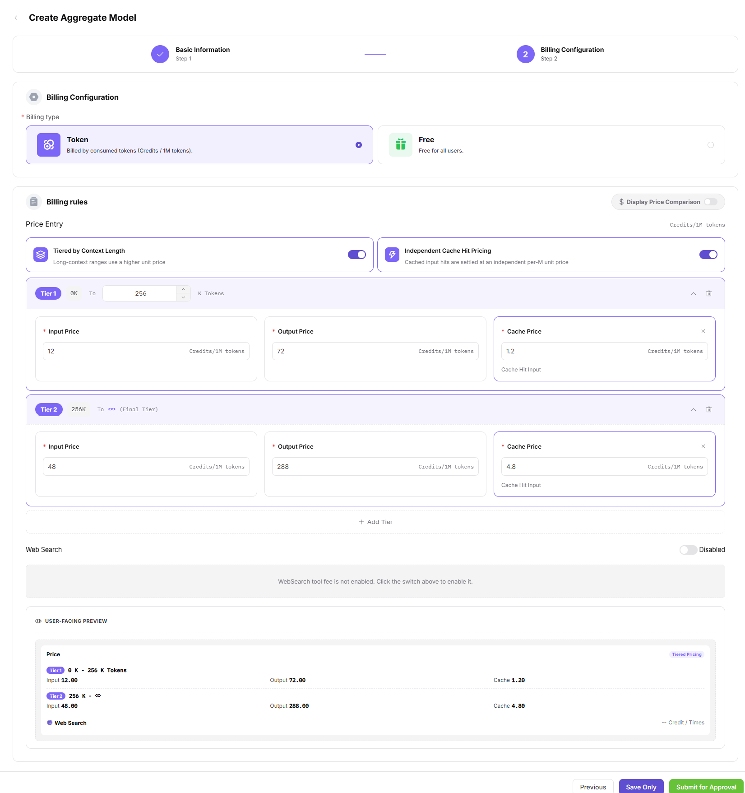

# My Models

## Preface

| Item | Content |
|------|------|
| Applicable Role | Provider, User |
| Navigation Path | Studio > My Models |
| Feature Positioning | Manage and publish owned models, supporting AGIOne-hosted deployment, third-party BYOK access, and multi-model aggregation |

## Page Structure

### Search Area

The top of the page supports multidimensional filtering by public / private models, model name, and model type.

### Action Button Area

- The upper-right corner of the page provides the **"Publish Model"** button.
- The **"My Aggregations"** Tab provides the **"Create Aggregation Model"** button.
- Each model provides details, edit, list / delist, and delete operations.

### Data List Description

The page is divided into three Tabs: **"Overview"**, **"My Published"**, and **"My Aggregations"**, which respectively display the unified model access and publishing entry, published single-instance models, and created aggregation models.

### Tab Switch Description

- **"Overview"** Tab: Unified entry for model access and publishing, providing full-scenario model deployment and access solutions, supporting platform-hosted deployment, third-party service access, and multi-model aggregation.
- **"My Published"** Tab: Unified management view for all single-instance published models. You can switch between **"Public Models / Private Models"** at the top to view models in different areas.
- **"My Aggregations"** Tab: Dedicated management view for aggregation models. You can switch between **"Public Models / Private Models"** at the top to view aggregation models in different areas.

## Operations

### Publish Model (Multimodal Model)

1. Enter the platform homepage and click **"Studio > My Models"** in the left navigation bar to enter the model management page.
2. The page enters the **"Overview"** Tab by default. Switch to the **"My Published"** Tab to view models in different areas through the top **"Public Models / Private Models"** switch; you can also switch to the **"My Aggregations"** Tab.

3. Click the **"Publish Model"** button in the upper-right corner of the page to open the "Choose where to publish" dialog.
4. Select the publishing area:
   - **"Publish to Private"**: Visible and callable only within the current team or tenant, added to the private catalog and not listed in the public catalog. Suitable for internal business and security-sensitive scenarios;
   - **"Publish to Public"**: Listed in the public catalog and open for calls by EUs of all tenants. Independent pricing and rate limits can be configured.
5. Click **"Publish to Public"** to enter the publishing configuration flow (Step 1: Basic Information).

#### **Step 1: Basic Information**
- **Model Source / Meta-model Information**:
    - Select **"Meta-model"** (for example, Qwen3.6-plus);
    - Select **"Model Source"** (for example, Alibaba-China);
    - Fill in **"Request URL"** (for example, `https://dashscope.aliyuncs.com`; region defaults to "China");
    - Fill in **"API Key"** (for example, `sk-***`);
    - Fill in **"Model Source ID"** (for example, `qwen3.6-plus`, the exact model name sent to the upstream vendor).

- **Model Type**: In the "Model Type" block, **"Chat Model"** is selected by default.

- **Request Header Configuration**: The authentication field defaults to `Authorization: Bearer <key>`. Click **"Add Request Header"** to add custom fields.

- **Model Parameter Configuration**:
    - Default **"Input Modalities"** (Text / Image / Video);
    - Default **"Output Modalities"** (Text);
    - Enable **"Advanced Capabilities"**: Function / tool support, thinking mode.
    - **Token Limits**: Set **"Maximum Context"** (for example, 1024K), **"Maximum Input"** (for example, 991K), and **"Maximum Output"** (for example, 64K).

- **Supported Protocols and Default Parameters**: Select at least one protocol (OpenAI-ChatCompletions / OpenAI-Responses / Anthropic-Messages). Protocol connectivity testing must be performed first; subsequent operations are available only after the connectivity test succeeds. After the test passes, fill in **"Endpoint"** (for example, `https://dashscope.aliyuncs.com/compatible-mode/v1/chat/completions`) and configure **"Input Parameters"** (Temperature, Top-P, N, Stream, Max Tokens, Presence Penalty, Frequency Penalty, User, Seed, Parallel Tool Calls, etc.).

- **Basic Information**:
   - Fill in **"Personalized Identifier"** (for example, Qwen3.6-plus) and **"Description"**.

   - **Publishing Method**: Select **"Publish Now"** or **"Scheduled Publishing"**.

- Click **"Next"** to enter Step 2: Billing Configuration.

#### **Step 2: Billing Configuration**:
- **Billing Configuration**:
    - Select **"Billing Method"**:
        - **"Token-based Billing"** (charged by consumed Tokens, Credit / M tokens)
        - **"Free"** (open to all users for free, no billing; commonly used for public beta / open source / promotion / trial);
- **Billing Rules**:
    - Enable **"Show Price Comparison"** to display strikethrough original prices;
    - In the **"Billing Rules - Price Entry"** block, configure:
        - Enable **"Tier by Context Length"** (long-context intervals use higher unit prices);
        - Enable **"Separate Cache Hit Pricing"** (cache-hit input is settled by an independent per-M unit price);
        - **Set Tier Prices**: For each tier (for example, Tier 1: 0K-256K Tokens, Tier 2: 256K-∞), configure **"Input Selling Price / Output Selling Price / Cache Hit Selling Price"** and **"Input Original Price / Output Original Price / Cache Hit Original Price"** (all units are Credits/1M tokens). Click **"Add Tier"** to add more intervals;
    - **Web Search**: Enable WebSearch tool fees;
    - **Free Quota**: After enabling, configure claimable quota, number of users, and total amount;

- Click **"Next"** to enter Step 3: Rate Limit Configuration.

#### **Step 3: Rate Limit Configuration**:
- Select **"Whether to Enable Rate Limit"**: **"Enable Rate Limit"** or **"Do Not Enable"**;
- Configure **"Default Rate Limit"**:
    - **"RPM (Requests Per Minute)"**: enter a value (for example, 2 requests/minute), or check **"Unlimited"**;
    - **"TPM (Tokens Per Minute)"**: enter a value (for example, 100 Tokens/minute), or check **"Unlimited"**.

- Click **"Save Only"** or **"Submit for Review"** to complete publishing.

#### Parameters - Publishing Flow Configuration Items

| Field Name | Field Type | Example | Description |
|--------------|--------|--------------------------------------------------------------------------------------------------------------------------|----------------------------------------------|
| Meta-model | Dropdown | `Qwen3.6-plus` (with text 1024K tag) | Required. Select the base meta-model |
| Model Source | Dropdown | `Alibaba-China` | Required. Source channel of the model |
| Request URL | URL | `https://dashscope.aliyuncs.com` | Required. API address of the model service (region can be switched) |
| API Key | Text | `sk-***` | Required. Key used to call the model |
| Model Source ID | Text | `qwen3.6-plus` | Required. Exact model name sent to the upstream vendor |
| Model Type | Radio | `Chat Model` | Required. Functional type of the model |
| Request Headers | Key-Value | `Authorization: Bearer <key>` | Optional. Authentication and custom request headers |
| Input Modalities | Multi-select | `Text / Image / Video` | Required. Input data types supported by the model |
| Output Modalities | Multi-select | `Text` | Required. Output data types supported by the model |
| Advanced Capabilities | Switch | `Function/Tool Support / Thinking Mode` | Optional. Extended capabilities of the model |
| Maximum Context | Number | `1024K` | Required. Token context limit |
| Maximum Input | Number | `991K` | Required. Maximum Token input per request |
| Maximum Output | Number | `64K` | Required. Maximum Token output per request |
| Supported Protocols | Multi-select | `OpenAI-ChatCompletions / OpenAI-Responses / Anthropic-Messages` | Required. API protocols compatible with the model; connectivity test must be performed first |
| Endpoint | URL | `https://dashscope.aliyuncs.com/compatible-mode/v1/chat/completions` | Required. Endpoint address corresponding to the protocol |
| Input Parameters | Parameter List | `Temperature / Top-P / N / Stream / Max Tokens / Presence Penalty / Frequency Penalty / User / Seed / Parallel Tool Calls` | Optional. Input parameters preset by protocol |
| Personalized Identifier | Text | `Qwen3.6-plus` | Required. Custom identifier displayed externally |
| Description | Text | `Qwen3.6 native vision...` | Optional. Model description |
| Publishing Method | Radio | `Publish Now / Scheduled Publishing` | Required. Model go-live timing |
| Billing Method | Radio | `Token-based Billing / Free` | Required. Charging method of the model |
| Tier by Context Length | Switch | `On / Off` | Optional. Use higher unit prices for long-context intervals |
| Separate Cache Hit Pricing | Switch | `On / Off` | Optional. Cache-hit input is settled by an independent per-M unit price |
| Tier Prices | Group | `Tier 1 0K-256K: input 20/output 120/cache 2; Tier 2 256K-∞: input 80/output 480/cache 8` | Required. Input/output/cache selling prices and strikethrough original prices by context length (Credits/1M tokens) |
| Web Search | Switch | `On / Not enabled` | Optional. Enable WebSearch tool fees |
| Free Quota | Switch | `On / Not enabled` | Optional. Configure free call quota of the model |
| Whether to Enable Rate Limit | Radio | `Enable Rate Limit / Do Not Enable` | Optional. Configure call frequency limits of the model |
| RPM (Requests Per Minute) | Number / Unlimited | `2 requests/minute` | Optional. Maximum requests per minute; "Unlimited" can be checked |
| TPM (Tokens Per Minute) | Number / Unlimited | `100 Tokens/minute` | Optional. Maximum Tokens per minute; "Unlimited" can be checked |

### Add Aggregation Model

1. Enter the platform homepage and click **"My Models"** in the left navigation bar to enter the model management page.
2. Switch to the **"My Aggregations"** Tab. You can switch between **"Public Models / Private Models"** at the top to view aggregation models in different areas.
3. Click the **"Create Aggregation Model"** button in the upper-right corner of the page to open the "Choose where to publish" dialog.
4. Select the publishing area:
   - **"Publish to Private"**: Visible and callable only within the current team or tenant, added to the private catalog and not listed in the public catalog;
   - **"Publish to Public"**: Listed in the public catalog and open for calls by EUs of all tenants. Independent pricing and rate limits can be configured.
5. Click **"Publish to Public"** to enter the publishing configuration flow (Step 1: Basic Information).

#### **Step 1: Basic Information**
- Select **"Model Type"** (Multimodal / Chat Model / Image Model / Audio Model / Video Model / Embedding Model / Rerank Model);
- Select **"Model Subtype"** (for example, LLM).

- **Model Selection**: In the "Model Selection" list, click **"Add Model"** to open the "Select Model" dialog:
   - The left side is a **Model Name / Model Identifier** list, where keywords can be entered for quick filtering;
   - The right side displays multiple provider instances under the model (including release date, context, input/output Credit/1M Tokens, throughput, success rate, weekly calls, weekly Token volume, maximum output, region, capability tags, and other metrics);
   - Check the target provider instances (multi-select supported, with **"Select All"** in the list header), then click **"Confirm"** to finish adding.

- **Configure Member Model Parameters**: Configure each added member model:
   - **Whether Enabled**: controlled by switch;
   - **Minimum Success Rate**: percentage (for example, 80%);
   - **Maximum Concurrency Rate**: number (for example, 1500);
   - **Maximum Context Length**: number (for example, 128K);
   - **Cost**: set input Token cost and output Token cost separately;
   - Click **"Delete"** to remove the member model.

- **Basic Information**:
   - Fill in **"Personalized Identifier"** (for example, Qwen3-235b-a22b-instruct-2507);
   - Select **"Matching Strategy"**: **"Cost First"** / **"Success Rate First"** / **"Cost & Experience Balance"** / **"Random"** / **"Round Robin"**;
   - Select **"Tags"** (for example, Text Generation);
   - Fill in **"Description"**.

- **Publishing Method**: Select **"Publish Now"** or **"Scheduled Publishing"**.

- Click **"Next"** to enter Step 2: Billing Configuration.

#### **Step 2: Billing Configuration**
- Select **"Billing Method"**: **"Free"** or **"Paid"**;
- Select **"Billing Mode"**: **"Unified Billing"** / **"Input/Output Billing"** / **"Tiered Billing"**;
- Set prices (Credits/1M tokens):
- **"Input Original Price"**: reference original price of model input, used to display price comparison;
- **"Input Selling Price"**: selling price of model input, used as the settlement price when users actually use the model;
- **"Output Original Price"**: reference original price of model output, used to display price comparison;
- **"Output Price"**: selling price of model output, used as the settlement price when users actually use the model.

- Click **"Save Only"** or **"Submit for Review"** to complete publishing.

#### Parameters - Aggregation Model Configuration Items

| Field Name | Field Type | Example | Description |
|----------|----------|------|------|
| Model Type | Radio | `Chat Model / Image Model` | Required. Functional type of the aggregation model |
| Model Subtype | Dropdown | `LLM` | Required. Specific subtype of the aggregation model |
| Member Models | List Selection | `Baidu AI Cloud / Alibaba-China and multiple provider instances` | Required. Select 2 or more published models (multi-select) |
| Whether Enabled | Switch | `Enabled / Disabled` | Required. Controls whether the member model participates in routing |
| Minimum Success Rate | Percentage | `80%` | Required. Member models below this success rate will be removed |
| Maximum Concurrency Rate | Number | `1500` | Required. Maximum concurrency limit of the member model |
| Maximum Context Length | Number | `128K` | Required. Context upper limit supported by the member model |
| Input Token Cost | Number | `2000` | Required. Reference cost per million input Tokens |
| Output Token Cost | Number | `8000` | Required. Reference cost per million output Tokens |
| Personalized Identifier | Text | `Qwen3-235b-a22b-instruct-2507` | Required. Custom identifier displayed externally for the aggregation model |
| Matching Strategy | Radio | `Cost First / Success Rate First / Cost & Experience Balance / Random / Round Robin` | Required. Routing strategy when the model is called |
| Tags | Dropdown | `Text Generation` | Optional. Tags of the aggregation model |
| Description | Text | `Aggregation model...` | Optional. Description of the aggregation model |
| Publishing Method | Radio | `Publish Now / Scheduled Publishing` | Required. Go-live timing of the aggregation model |
| Billing Method | Radio | `Free / Paid` | Required. Charging method of the aggregation model |
| Billing Mode | Radio | `Unified Billing / Input/Output Billing / Tiered Billing` | Required. Pricing method when charged |
| Input Original Price | Number | `40.00 Credits/1M tokens` | Optional. Reference original price of model input, used to display price comparison |
| Input Selling Price | Number | `20.00 Credits/1M tokens` | Required. Selling price of model input, used as the actual settlement price |
| Output Original Price | Number | `160.00 Credits/1M tokens` | Optional. Reference original price of model output, used to display price comparison |
| Output Price | Number | `80.00 Credits/1M tokens` | Required. Selling price of model output, used as the actual settlement price |

## Other Operations

| Operation | Steps |
| -------- | ----- |
| View Details | Click **"Details"** on the target model -> View complete configuration information -> Click the back arrow in the upper-left corner to exit |
| Edit Model | Click **"Edit"** on the target model -> Modify configuration information -> Submit for review |
| List / Delist Model | Click **"List"** / **"Delist"** on the target model -> Confirm the status change |
| Delete Model | Click **"Delete"** on the target model -> The delete operation is irreversible. Please operate with caution |
| View Aggregation Model Details | Click **"Details"** on the target aggregation model -> View complete configuration information -> Click the back arrow in the upper-left corner to exit |
| Edit Aggregation Model | Click **"Edit"** on the target aggregation model -> Modify member models, routing strategy, and billing configuration -> Submit for review |
| List / Delist Aggregation Model | Click **"List"** / **"Delist"** on the target aggregation model -> Confirm the status change |
| Delete Aggregation Model | Click **"Delete"** on the target aggregation model -> The delete operation is irreversible. Please operate with caution |

## Notes

- **Delete operations are irreversible**. Please operate with caution.
- Aggregation models must select at least 2 published models as member models.
- Before listing a model, ensure the configuration information is accurate to avoid affecting service quality.
- Before publishing a model, protocol connectivity testing must be completed; otherwise, subsequent configuration cannot proceed.
