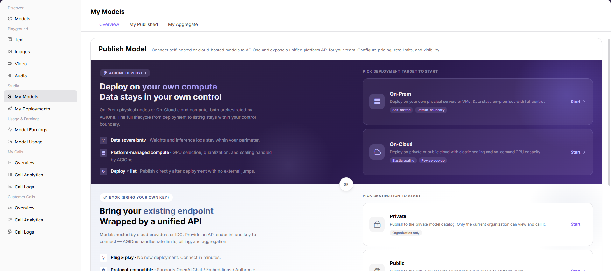
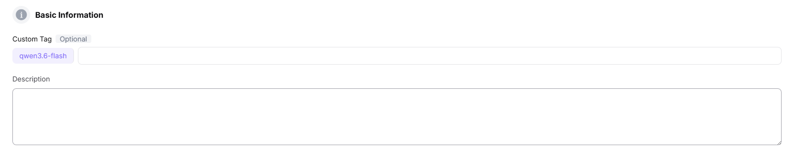
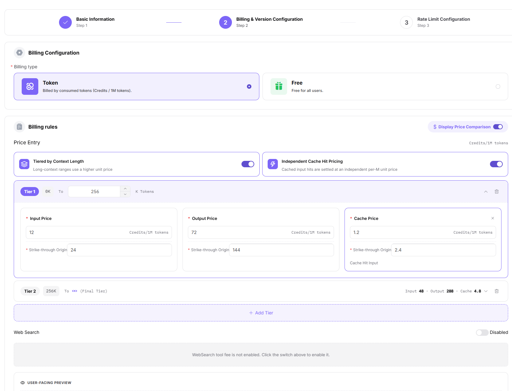

# My Models

::: info Document Information
Version: v1.0
Updated: 2026-07-08
:::

## Feature Overview

My Models is the publishing workspace for model providers to maintain owned models, source connections, request headers, Endpoints, publishing methods, billing rules, and rate limits.

| Item | Content |
| --- | --- |
| Applicable role | Model provider |
| Navigation path | Studio > My Models |
| Page route | /user/studio/my-models |
| Managed objects | Owned models, model sources, request headers, Endpoints, publishing methods, billing, and rate-limit configuration |
| Typical use | Publish single models, BYOK models, or aggregation models |

### Beginner Explanation

My Models is the publishing workspace for model providers. You can organize materials, sources, pricing, and rate-limit rules for single models, BYOK models, or aggregation models, then submit them for review or publishing.

If the model marketplace is the external shelf, this page is the backstage before listing. Incorrect Endpoint, request header, protocol, or billing configuration affects later Playground, calls, and revenue statistics.

### Terms Quick Reference

| Term | Description |
| --- | --- |
| BYOK | Use your own Endpoint or API Key to connect a model service. |
| Aggregation model | Combines multiple provider instances into one external model. |
| Publishing method | Determines whether the model is published as a single model, BYOK model, or aggregation model. |
| Billing configuration | Defines billing rules for input, output, or call volume. |

## Prerequisites

1. The current account has model publishing or model management permission.
2. The publishing method for a single model, BYOK model, or aggregation model has been determined.
3. Endpoint, request headers, meta-model, billing, and rate-limit parameters are prepared and redacted.
## Page Description

This page is used by model providers to publish and maintain owned models. It supports single models, BYOK access, and aggregation models. Different publishing methods have different source, billing, rate-limit, and review requirements.

Page screenshot:

Used to view model status, publishing method, and review entry points.

## Main Operations

### Steps

1. Go to `Studio > My Models`.
2. Select single-model, BYOK model, or aggregation model publishing.
3. Fill in basic information, meta-model, model source, and request headers.
4. Configure billing, rate limits, protocol, and default parameters.
5. After submission, enter the review or publishing flow.

Key screenshots:

Fill in model name, description, and publishing information.

Model source, meta-model, and protocol must be consistent.

Confirm billing rules and provider costs before submission.

Rate limits affect customer call experience and cost control.

### Parameters

| Field Name | Required | Field Type | Example | Description |
| --- | --- | --- | --- | --- |
| Publishing Method | Yes | Enum | `BYOK` | Single model, BYOK, or aggregation model. |
| Meta-model | Yes | Dropdown | `Qwen Text` | Defines capability and protocol. |
| Model Source | Conditionally required | Dropdown | `dashscope-cn` | BYOK or single-model call source. |
| Aggregation Strategy | Conditionally required | Enum | `By weight` | Provider selection policy for aggregation models. |
| Rate-limit Configuration | No | Number | `100 QPM` | Controls model call rate. |

### Pitfalls

- BYOK models must first validate Endpoint and request headers.
- Any unavailable provider in an aggregation model affects overall quality.
- Before submitting billing configuration, reconcile it with provider costs.

### Result Checks

1. Model draft, review status, or publishing status matches the operation result.
2. BYOK models pass connectivity or protocol tests.
3. Aggregation model candidate models and routing policy are saved correctly.
## FAQ

### Model Is Not Visible After Publishing

**Symptom:**

After a model is submitted for publishing, the corresponding record cannot be found in My Models or the model marketplace.

**Possible Causes:**

- The model is still under review or the publishing task has not completed.
- Visibility scope is set to private, specified customers, or specified tenants.
- The model version is not associated with a valid template, source, or meta-model.

**Handling:**

1. First check model status, review records, and publishing time.
2. Verify visibility scope, provider information, and version configuration.
3. If review has passed but the marketplace is still invisible, contact the operator to check the publishing index and visibility scope.

### Model Version Review Is Rejected

**Symptom:**

A submitted new model or new version is rejected and cannot enter the publishing flow.

**Possible Causes:**

- Model materials, samples, pricing, or usage boundaries are missing.
- Endpoint, API Key, or request header connectivity validation failed.
- Model output has security, privacy, or compliance risks.

**Handling:**

1. Read review comments and complete model descriptions, call examples, and authorization materials.
2. Revalidate source connectivity, authentication method, and return format.
3. For sensitive content, supplement security policies or adjust model visibility scope before resubmitting.

### Model Status Stays Publishing

**Symptom:**

The model stays in publishing status for a long time, the marketplace page is unavailable, or call examples cannot be generated.

**Possible Causes:**

- The publishing task is synchronizing model index, template, or pricing information.
- Model source health check did not pass.
- Review, billing, or visibility configuration required by the publishing flow is incomplete.

**Handling:**

1. Wait for the publishing task to complete and check the latest update time.
2. Verify that model source, template, meta-model, and pricing configuration are complete.
3. If it still does not complete after the expected time, provide model ID, version number, and publishing time to the operator for troubleshooting.

## Next Steps

1. View review records and publishing results to confirm whether the model version is available.
2. Search for the model in the model marketplace and verify name, tags, pricing, and visibility scope.
3. Use Playground or call logs to validate model output quality, latency, and error rate.
4. After launch, continuously track usage, revenue, and customer feedback, and publish a new version if needed.

## Notes

- Request headers, Endpoints, API Keys, and model source IDs must not appear in screenshots or ticket bodies.
- Confirm billing, rate limits, and visibility scope before publishing.
- Aggregation model changes affect customer call quality, so record the reason for changes.
