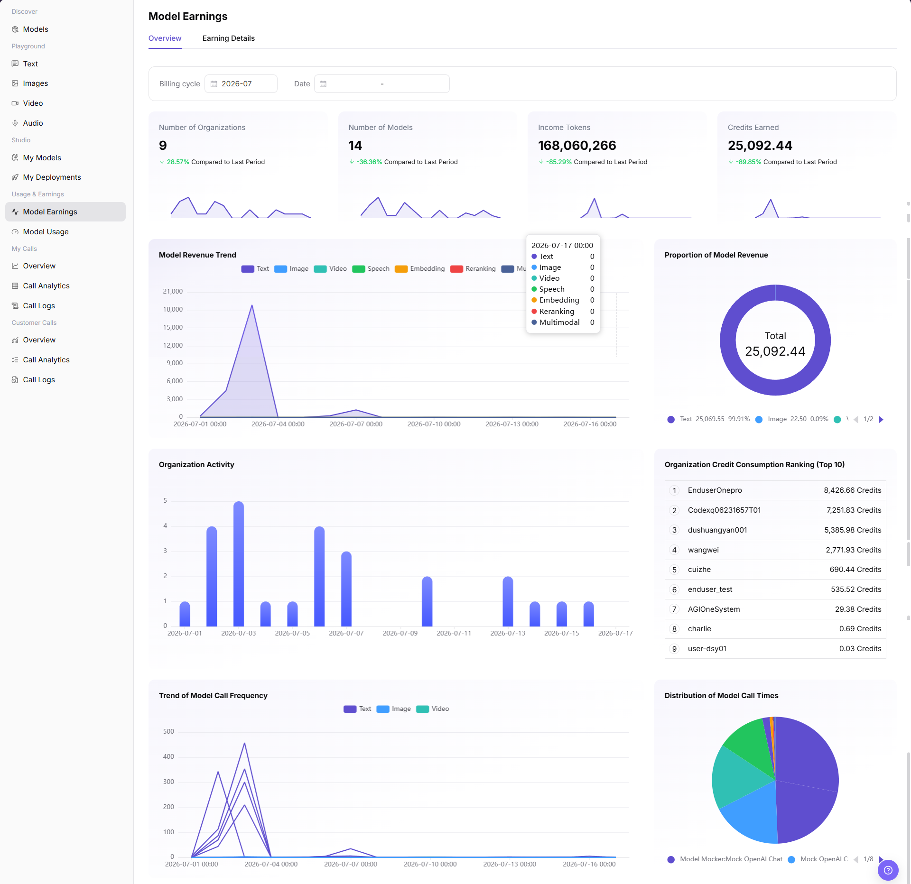
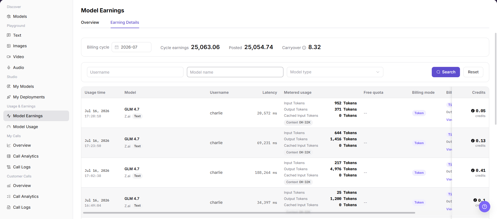

# Model Earnings

::: info Document Information
Version: v1.0
Updated: 2026-07-08
:::

## Feature Overview

`Model Earnings` helps model providers view earnings overview and earning details generated by model calls. It supports filtering by billing cycle, date, username, model name, and model type, so providers can reconcile earnings, posted amount, carryover, and metered usage.

| Item | Content |
| --- | --- |
| Applicable role | Model provider |
| Navigation path | Model Services > Usage & Earnings > Model Earnings |
| Page route | /modelone/accounting/useage/overview/model |
| Managed objects | Earnings overview, earning details, billing cycle, date, metered usage, Credits, posted amount, and carryover |
| Typical use | View model revenue trends, revenue proportion, organization consumption ranking, and earning details |

#### Beginner Explanation

`Model Earnings` is an income dashboard for model providers. `Overview` shows overall earnings trends and distribution. `Earning Details` is used to reconcile each earning record by user, model, and call record.

#### Terms Quick Reference

| Term | Description |
| --- | --- |
| Overview | Shows number of organizations, number of models, income tokens, Credits Earned, revenue trends, and revenue proportion. |
| Earning Details | Shows cycle earnings, posted amount, carryover, and detailed earning records by call. |
| Billing cycle | Month that the earnings statistics and settlement belong to. |
| Metered usage | Usage measured for billing, such as input tokens, output tokens, and cached input tokens. |
| Free quota | Free or deducted quota applied to the call. |
| Billing mode | Billing method used by the earning record, such as Token. |
| Credits | Unit used by the page to display earnings or consumption. |

## Prerequisites

1. The current account has access to the `Model Earnings` page.
2. The target model has generated statistical calls or earning records.
3. The billing cycle, date range, user, model, or model type to view has been confirmed.
4. Earning amount, username, organization ranking, and settlement status are sensitive information and must be redacted before screenshots or export.

::: warning High-Risk Operation Boundary
Settlement, account adjustment, exporting sensitive data, or sending earning details externally may affect financial reconciliation or expose commercially sensitive information. This document only describes viewing the earnings overview and earning details. It does not guide settlement, adjustment, or sensitive data export, and does not write real accounts, pricing policies, internal test parameters, or sensitive data.
:::

## Page Description

The page includes two tabs: `Overview` and `Earning Details`. `Overview` shows Billing cycle, Date, Number of Organizations, Number of Models, Income Tokens, Credits Earned, Model Revenue Trend, Proportion of Model Revenue, Organization Activity, Organization Credit Consumption Ranking (Top 10), Trend of Model Call Frequency, and Distribution of Model Call Times. `Earning Details` shows cycle summaries, filters, and earning detail records.

## Main Operations

### View My Revenue Overview

1. Go to `Model Services > Usage & Earnings > Model Earnings`.
2. Open the `Overview` tab.
3. Select `Billing cycle` and `Date` in the filter area.
4. View overview metrics such as `Number of Organizations`, `Number of Models`, `Income Tokens`, and `Credits Earned`.
5. View `Model Revenue Trend`, `Proportion of Model Revenue`, `Organization Activity`, `Organization Credit Consumption Ranking (Top 10)`, `Trend of Model Call Frequency`, and `Distribution of Model Call Times`.
6. When checking charts and rankings, do not capture or send unredacted user, organization, amount, or Credit details externally.

### View Revenue Details

1. On the `Model Earnings` page, switch to the `Earning Details` tab.
2. View the top billing-cycle summary, including `Billing cycle`, `Cycle earnings`, `Posted`, and `Carryover`.
3. Enter or select `Username`, `Model name`, and `Model type` in the filter area.
4. Click `Search` to view matching earning details. To clear filters, click `Reset`.
5. In the earning details list, view `Usage time`, `Model`, `Username`, `Latency`, `Metered usage`, `Free quota`, `Billing mode`, and `Credits`.
6. If the page provides view, export, settlement, or adjustment entries, view only fields and status. Do not perform settlement, account adjustment, or sensitive data export.

## Parameter Reference

| Field Name | Required | Field Type | Example | Description |
| --- | --- | --- | --- | --- |
| Billing cycle | Yes | Month selector | `2026-07` | Month that the earnings statistics and settlement belong to. |
| Date | No | Date range | Select on page | Limits the statistical time range for overview charts. |
| Username | No | Input | Enter on page | Filters earning details by calling user. |
| Model name | No | Input | Enter on page | Filters earning details by model. |
| Model type | No | Dropdown | `Text` | Filters earning details by model capability type. |
| Revenue Amount | System-generated | Number | `Credits` | Earnings amount or Credit value displayed on the page. |
| Call Volume | System-generated | Number | `Tokens` | Metered usage, such as input tokens, output tokens, or cached input tokens. |
| Billing Type | System-generated | Tag | `Token` | Billing method used by the earning record. |
| Settlement Status | System-generated | Status | `Posted` / `Carryover` | Whether the amount has been posted or remains as carryover. |
| Time Range | No | Date / month | Select on page | Controls the overview or detail statistical period. |
| Caller | System-generated | Text | User or organization name | User or organization that generated the earning. |
| Actions | No | Row entry | `View` | View earning records or related billing information. |

## Result Validation

| Check Item | Success Criteria | Troubleshooting |
| --- | --- | --- |
| Page is accessible | The `Model Earnings` page opens normally, and `Overview` and `Earning Details` tabs are visible. | Check account permissions, navigation path, and page loading status. |
| Earnings overview displays normally | Number of Organizations, Number of Models, Income Tokens, Credits Earned, and charts are displayed normally. | Switch Billing cycle or Date and retry. Confirm whether the current period has earning data. |
| Filters are available | Billing cycle, Date, Username, Model name, and Model type can be entered or selected. | Check filter format, or click `Reset` and query again. |
| Earning list loads normally | The details list shows Usage time, Model, Username, Metered usage, Billing mode, and Credits. | Confirm whether the billing cycle contains earning records, or broaden filters. |
| Earning details can be viewed | Amount, status, time, and metered usage in details match the filter conditions. | Compare model usage and call logs to confirm statistical delay or billing-rule differences. |
| High-risk actions are not triggered | During learning or screenshots, settlement, adjustment, or sensitive data export is not performed. | If a real financial operation is triggered by mistake, immediately record the time and record scope and notify the owner for review. |

## FAQ

#### What if earning data is empty?

Check whether the billing cycle and date range are correct, and confirm that the model has successful calls and billing configuration. Earning data may have statistical or settlement delay.

#### What if overview and detail amounts do not match?

Confirm that filters are consistent, then check billing cycle, time range, and statistical rules. Overview and details may differ briefly because of posted amount, carryover, or statistical delay.

#### Can I export earning details for reconciliation?

Earning details contain users, amounts, and call information, so they are sensitive data. Before export, confirm permissions, redaction requirements, and usage scope. Do not export when only learning the page.

## Next Steps

1. Cross-check with model usage, call analytics, and call logs.
2. Use redacted earning details for reconciliation.
3. Optimize model operations based on revenue trends, model-type proportion, and organization consumption ranking.

## Notes

- Do not write real accounts, pricing policies, internal test parameters, or sensitive data in the document.
- Before screenshots or export, confirm that usernames, organization names, earning amounts, and Credit details are redacted.
- Settlement, account adjustment, and sensitive data export are outside the scope of this document.
