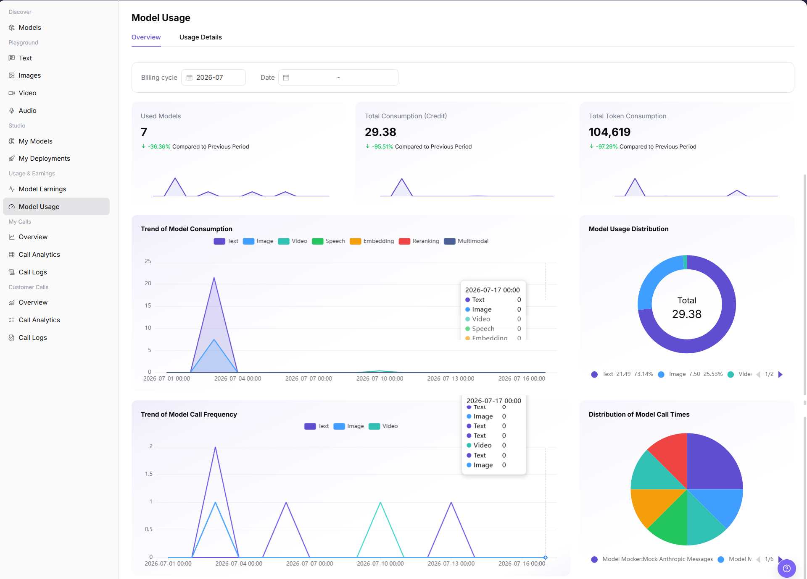
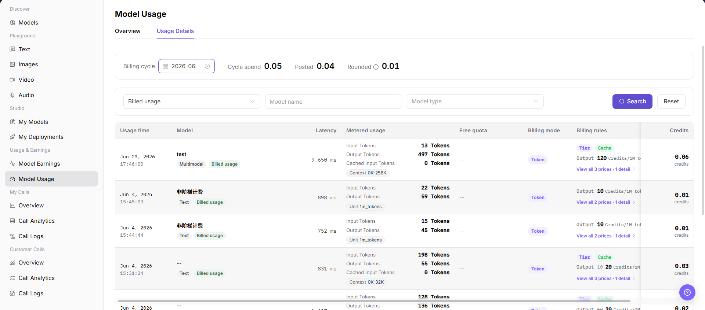

# Model Usage

::: info Document Information
Version: v1.0
Updated: 2026-07-08
:::

## Feature Overview

`Model Usage` helps model providers view usage overview and usage details for model calls. It supports filtering by billing cycle, date, billed usage, model name, and model type, so providers can reconcile model usage, Credit consumption, Token consumption, and billing rules.

| Item | Content |
| --- | --- |
| Applicable role | Model provider |
| Navigation path | Model Services > Usage & Earnings > Model Usage |
| Page route | /modelone/accounting/deduction/overview/model |
| Managed objects | Usage overview, usage details, billing cycle, date, metered usage, free quota, billing mode, billing rules, and Credits |
| Typical use | View model call consumption, Token consumption trends, model usage distribution, and usage details |

#### Beginner Explanation

`Model Usage` is the consumption ledger for model calls. `Overview` shows overall consumption and trends. `Usage Details` is used to reconcile each request by Tokens, cost, billing rules, and posted status.

#### Terms Quick Reference

| Term | Description |
| --- | --- |
| Overview | Shows Used Models, Total Consumption, Total Token Consumption, consumption trends, and usage distribution. |
| Usage Details | Shows Cycle spend, Posted, Rounded, and usage details by call record. |
| Metered usage | Usage included in billing, such as input tokens, output tokens, and cached input tokens. |
| Free quota | Free or deducted quota applied to the call. |
| Billing mode | Billing method used by the usage record, such as Token. |
| Billing rules | Pricing rule matched by the usage record, such as tier, cache, or output price. |
| Credits | Unit used by the page to display consumption. |

## Prerequisites

1. The current account has access to the `Model Usage` page.
2. The target model has call records in the statistical period.
3. The billing cycle, date range, billed usage status, model name, or model type to view has been confirmed.
4. Consumption amount, model call records, request content, and request IDs are sensitive information and must be redacted before screenshots or export.

::: warning High-Risk Operation Boundary
Exporting sensitive data, charging, account adjustment, settlement, or sending usage details externally are high-risk operations and may affect financial reconciliation or expose call information. This document only describes viewing the usage overview and usage details. It does not guide export, charging, adjustment, or settlement, and does not write real accounts, request content, amounts, secrets, request IDs, or internal test parameters.
:::

## Page Description

The page includes two tabs: `Overview` and `Usage Details`. `Overview` shows Billing cycle, Date, Used Models, Total Consumption (Credit), Total Token Consumption, Trend of Model Consumption, Model Usage Distribution, Trend of Model Call Frequency, and Distribution of Model Call Times. `Usage Details` shows billing-cycle summaries, filters, and usage detail records.

## Main Operations

### View Usage Overview

1. Go to `Model Services > Usage & Earnings > Model Usage`.
2. Open the `Overview` tab.
3. Select `Billing cycle` and `Date` in the filter area.
4. View overview metrics such as `Used Models`, `Total Consumption (Credit)`, and `Total Token Consumption`.
5. View `Trend of Model Consumption`, `Model Usage Distribution`, `Trend of Model Call Frequency`, and `Distribution of Model Call Times`.
6. When checking trends or distribution data, do not capture or send unredacted model, amount, Credit, request, or business identifier information externally.

### View Usage Details

1. On the `Model Usage` page, switch to the `Usage Details` tab.
2. View the top billing-cycle summary, including `Billing cycle`, `Cycle spend`, `Posted`, and `Rounded`.
3. Select `Billed usage`, and enter or select `Model name` and `Model type` in the filter area.
4. Click `Search` to view matching usage details. To clear filters, click `Reset`.
5. In the usage details list, view `Usage time`, `Model`, `Latency`, `Metered usage`, `Free quota`, `Billing mode`, `Billing rules`, and `Credits`.
6. If the page provides view, export, charging, adjustment, or settlement entries, view only fields and status. Do not perform real charging, adjustment, settlement, or sensitive data export.

## Parameter Reference

| Field Name | Required | Field Type | Example | Description |
| --- | --- | --- | --- | --- |
| Billing cycle | Yes | Month selector | `2026-07` | Month that the usage statistics and posting belong to. |
| Date | No | Date range | Select on page | Limits the statistical time range for overview charts. |
| Billed usage | No | Dropdown | Select on page | Filters usage details by whether the record is billed. |
| Model Name | No | Input | Enter on page | Filters usage records by model. |
| Model Type | No | Dropdown | `Text` | Filters usage details by model capability type. |
| Input Usage | System-generated | Number | `Input Tokens` | Request input tokens or input-side usage. |
| Output Usage | System-generated | Number | `Output Tokens` | Model output tokens or output-side usage. |
| Cache Usage | System-generated | Number | `Cached Input Tokens` | Cached input hits or cache-related usage. |
| Web Search Usage | System-generated | Number | Displayed on page | Consumption generated by Web Search tools or related capabilities. |
| Cost | System-generated | Number | `Credits` | Credit consumption generated by the call. |
| Status | System-generated | Tag | `Billed usage` | Billing or posting status of the usage record. |
| Actions | No | Row entry | `View` | View usage records, pricing rules, or related billing information. |

## Result Validation

| Check Item | Success Criteria | Troubleshooting |
| --- | --- | --- |
| Page is accessible | The `Model Usage` page opens normally, and `Overview` and `Usage Details` tabs are visible. | Check account permissions, navigation path, and page loading status. |
| Usage overview displays normally | Used Models, Total Consumption, Total Token Consumption, and charts are displayed normally. | Switch Billing cycle or Date and retry. Confirm whether the current period has usage data. |
| Filters are available | Billing cycle, Date, Billed usage, Model name, and Model type can be entered or selected. | Check filter format, or click `Reset` and query again. |
| List data loads normally | The usage details list shows Usage time, Model, Metered usage, Billing mode, Billing rules, and Credits. | Confirm whether the billing cycle contains usage records, or broaden filters. |
| Details entry can be opened | Pricing rules, detail, or view entries display related information normally. | Check whether the record is complete, or refresh the page and retry. |
| Fields match filters | Usage, cost, status, and time fields match the filter conditions. | Compare call logs and model earnings to confirm statistical delay or billing-rule differences. |
| High-risk actions are not triggered | During learning or screenshots, export, charging, adjustment, or settlement is not performed. | If a real financial operation is triggered by mistake, immediately record the time and record scope and notify the owner for review. |

## FAQ

#### What if usage data is empty?

Check whether the billing cycle, date range, billed usage status, and model filters are correct, then confirm that the model has successful calls. Usage statistics may have delay.

#### Why do usage and earnings not match?

Align billing cycle, date range, and model filters first, and then check free quota, rounded amount, cache price, settlement delay, and billing rules. Usage details and model earnings may differ because of posting or statistical timing.

#### Can I export usage details?

Usage details may include model, amount, request, and billing information, so they are sensitive data. Before export, confirm permissions, redaction requirements, and usage scope. Do not export when only learning the page.

## Next Steps

1. Cross-check with model earnings, call analytics, and call logs.
2. Use redacted usage details for reconciliation.
3. Adjust rate limits, pricing, or model operations strategy based on consumption trends, model usage distribution, and call frequency distribution.

## Notes

- Do not write real accounts, request content, amounts, secrets, request IDs, or internal test parameters in the document.
- Before screenshots or export, confirm that model names, business identifiers, Credits, and billing details are redacted.
- Exporting sensitive data, charging, account adjustment, and settlement are outside the scope of this document.
