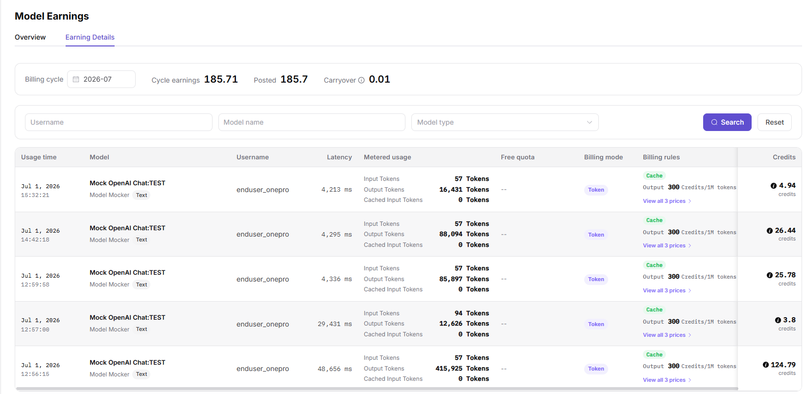

# Model Revenue

:::: info Document Information
Version: v1.0
Updated: 2026-07-08
::::

## Feature Overview

`Model Revenue` is used to maintain or view model income, revenue details, settlement periods, currencies, and customer contribution. It supports model publishing, experimentation, calling, statistics, and operational governance.

| Item | Content |
| --- | --- |
| Applicable role | Model provider |
| Navigation path | Usage & Revenue > Model Revenue |
| Page route | /user/usage-revenue/model-revenue |
| Managed objects | Model income, revenue details, settlement periods, currencies, and customer contribution |
| Typical use | View revenue generated by model calls |

### Beginner Explanation

Model Revenue is an income dashboard for model providers. It shows which models, customers, and time periods contributed revenue, and whether revenue matches call volume.

### Terms Quick Reference

| Term | Description |
| --- | --- |
| Revenue overview | Revenue overview aggregated by time, model, or customer. |
| Revenue details | Model, customer, time, and amount details used for reconciliation. |
| Settlement status | Whether revenue has completed statistics, confirmation, or settlement. |
| Customer contribution | Customer revenue share or amount during the statistical period. |
## Prerequisites

1. The current account has permission to view model revenue.
2. The target model has generated statistical calls or revenue records.
3. Statistical time range, currency unit, and settlement status have been confirmed.
4. Before exporting revenue data, customer and amount field redaction requirements have been confirmed.
## Page Description

This page is used to view model revenue, customer contribution, settlement status, revenue trends, and exported details. Users should filter by model, customer, and time range, and cross-check statistical rules with the model usage page.

Page screenshot:

Used to view revenue overview, customer contribution, and time trends.

## Main Operations

### Steps

1. Go to `Usage & Revenue > Model Revenue`.
2. Select time range, model, and customer dimension.
3. View total revenue, customer contribution, and trend chart.
4. Drill down by model or customer to view revenue details.
5. Export redacted statistical data when reconciliation is needed.

Key screenshot:

Used to check model, customer, period, and revenue details.

### Parameters

| Field Name | Required | Field Type | Example | Description |
| --- | --- | --- | --- | --- |
| Time Range | Yes | Date range | `2026-07` | Revenue statistical period. |
| Model | No | Dropdown | `qwen-plus` | Filter revenue by model. |
| Customer | No | Dropdown | `customer-a` | View revenue contribution by customer. |
| Revenue Amount | System-generated | Number | `120 Credits` | Revenue converted according to currency settings. |
| Settlement Status | System-generated | Enum | `Settled` | Whether revenue has been settled. |

### Pitfalls

- Revenue data is commercially sensitive. Customer names and amounts must be redacted before screenshots and export.
- Revenue usually has settlement delay. Do not infer settled amount directly from real-time call volume.
- Different models may use different billing rules. Align time ranges before comparison.

### Result Checks

1. Revenue overview totals match revenue detail summaries.
2. After switching model, customer, or time range, trend charts and details update together.
3. Settlement status, currency unit, and display precision match currency settings.
## FAQ

### Revenue Data Is Empty

**Symptom:**

The model has call volume, but the revenue page has no amount.

**Possible Causes:**

- The settlement task has not completed.
- Billing or revenue rules are not configured for the model.
- The filter time range does not include settled data.

**Handling:**

1. Confirm time range and settlement status.
2. Check model billing configuration.
3. Wait for settlement task completion and view again.

### Customer Contribution Amount Is Abnormal

**Symptom:**

Revenue from a customer is significantly higher or lower than expected.

**Possible Causes:**

- Customer call volume increased or decreased sharply.
- Free quota, discount, or deduction exists.
- Statistical rules or currency settings changed.

**Handling:**

1. Compare model usage trends.
2. View customer call analytics.
3. Check currency settings and revenue rules.

## Next Steps

1. Cross-check with the model usage page.
2. Export redacted details for reconciliation.
3. Adjust model operations strategy based on customer contribution.
## Notes

- Revenue amount, customer name, and settlement status are sensitive information.
- Revenue data may be recorded later than call usage.
- For external communication, provide only redacted summaries and not raw customer details.
