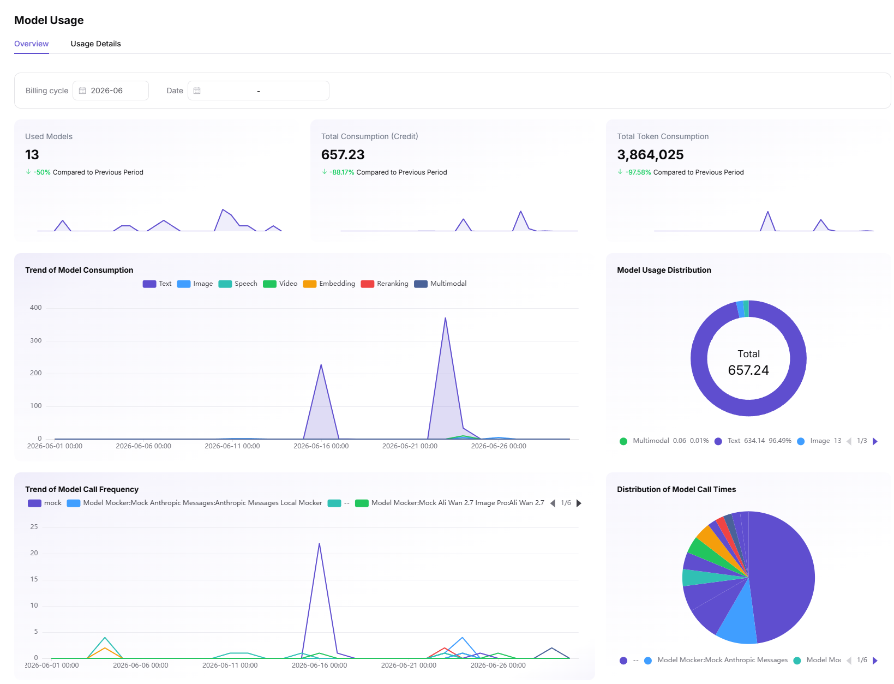
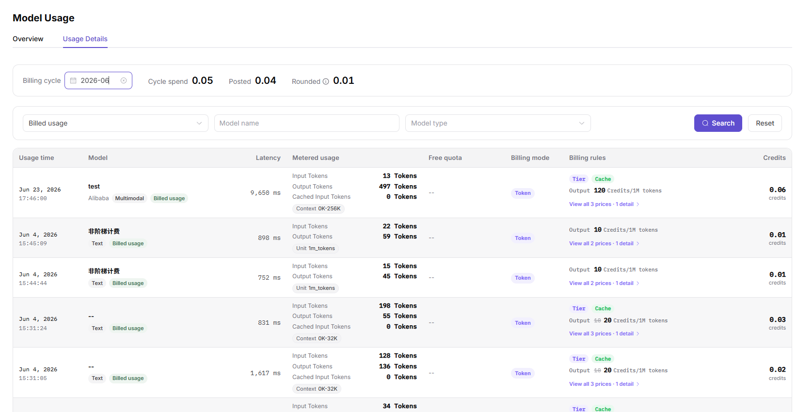

# Model Usage

## Preface

| Item | Content |
|------|------|
| Applicable Role | User |
| Navigation Path | Usage & Earnings > Model Usage |
| Feature Positioning | Entry for consuming users to view usage overview and consumption details (English UI title **Model Usage**), including **2 sub-tabs**: **Consumption Overview** (default) + **Consumption Details** |

## Page Structure

### Top Toolbar

The fixed area at the top of the page provides filtering and query tools:
- **"Consumption Overview" / "Consumption Details"** Tab switch (Consumption Overview by default)
- **"Data Granularity"** dropdown selector (**"Day"** by default)
- **"Time Range"** selector (default `2026-06-01 00:00:00 - 2026-06-23 15:57:00`)

### Consumption Overview (Default Tab)

The page is divided into 2 major blocks: 3 core metric cards + 4 charts (2x2 grid layout).

- **3 core metric cards** (each with a mini line chart + comparison with the previous period):
  - **Models Used** (for example, `2`, down 0% from previous period) - Total number of models called during the statistical period
  - **Total Consumption (Credit)** (for example, `0.01`, down 0% from previous period) - Total Credit consumed during the statistical period
  - **Total Token Consumption** (for example, `122`, down 0% from previous period) - Total Tokens consumed during the statistical period
- **4 charts** (2x2 grid):
  - **Model Consumption Trend** (line chart, multi-line comparison) - Consumption time series by model type (Audio Model / Chat Model / Image Model / Video Model / Embedding Model / Rerank Model)
  - **Model Usage Distribution** (donut chart) - Contribution percentage of different model types to total consumption (for example, Audio Model 0.01 100%)
  - **Model Call Count Trend** (line chart, multi-line comparison) - Call volume time series by model instance (for example, `--` / `audio-dsy-1.1`)
  - **Model Call Count Distribution** (pie chart) - Percentage distribution of call counts across models

### Consumption Details Tab

The page is divided into 2 sections: 3 billing data cards + a 7-column consumption detail table.

- **3 billing data cards** (top):
  - **Current Billing Cycle Consumption** (for example, `0`) - Total consumption in the current billing cycle
  - **Recorded** (for example, `0`) - Consumption that has completed settlement
  - **Pending Carryover (+)** (for example, `0`) - Consumption in the current billing cycle that has not yet been settled
- **Filter toolbar** (below the billing cycle):
  - **"Billing Cycle"** selector (default `2026-06`, YYYY-MM format)
  - Time range (locked to the start and end time of the billing cycle by default)
  - **"Model Name"** input box
  - **"Model Type"** dropdown
  - **"Search"** / **"Reset"** buttons
- **7-column consumption detail table** (sorted by time descending, each row shows consumption details of one call): Usage Time / Model / Latency / Metered Usage / Free Quota / Billing Mode / Credit

## Operations

### View Consumption Overview (Consumption Overview Tab, Default)

1. Enter the platform homepage, click **"Usage & Earnings > Model Usage"** in the left navigation bar, and enter the **"Consumption Overview"** Tab by default.
2. Use the top **"Data Granularity"** selector (**"Day"** by default) + **"Time Range"** selector (for example, `2026-06-01 00:00:00 - 2026-06-23 15:57:00`).
3. View **3 core metric cards** (each with a mini line chart + comparison with the previous period):
   - **Models Used** (for example, `2`, down 0% from previous period) - Total number of models called during the statistical period
   - **Total Consumption (Credit)** (for example, `0.01`, down 0% from previous period) - Total Credit consumed during the statistical period
   - **Total Token Consumption** (for example, `122`, down 0% from previous period) - Total Tokens consumed during the statistical period
4. View **4 charts** (2x2 grid layout):
   - **Model Consumption Trend** (line chart, multi-line comparison): consumption changes over time by model type (Audio Model / Chat Model / Image Model / Video Model / Embedding Model / Rerank Model); hover to show the specific consumption value of each model type on that day
   - **Model Usage Distribution** (donut chart): contribution percentage of different model types to total consumption (for example, Audio Model 0.01 100%)
   - **Model Call Count Trend** (line chart, multi-line comparison): call volume changes over time by model instance (for example, `--` / `audio-dsy-1.1`)
   - **Model Call Count Distribution** (pie chart): percentage distribution of call counts across models

### View Consumption Details (Consumption Details Tab)

1. Click the **"Consumption Details"** Tab to switch to the billing detail view.
2. Use the top **"Billing Cycle"** selector (default `2026-06`, YYYY-MM format). After switching the billing cycle, the data below refreshes by billing cycle.
3. View **3 billing data cards**:
   - **Current Billing Cycle Consumption** (for example, `0`) - Total consumption in the current billing cycle
   - **Recorded** (for example, `0`) - Consumption that has completed settlement
   - **Pending Carryover (+)** (for example, `0`) - Consumption in the current billing cycle that has not yet been settled
4. Use the time range (locked to the start and end time of the billing cycle by default, for example, `2026-06-01 00:00:00 - 2026-06-23 15:58:00`) + filter toolbar (**Model Name** input box + **Model Type** dropdown + **Search** / **Reset** buttons).
5. View the **7-column consumption detail table** (Usage Time / Model / Latency / Metered Usage / Free Quota / Billing Mode / Credit), sorted by time descending to show consumption details of each call:
   - **Usage Time**: Time when the call occurred (for example, `2026-06-23 09:41:02`)
   - **Model**: Model name + model type tag (for example, `--` + `Chat Model` / `audio-dsy-1.1` + `Audio Model`)
   - **Latency**: Time consumed by this call (ms, for example, `888`)
   - **Metered Usage**: 4 rows of Token information (**Input Tokens** + **Output Tokens** / **Tokens**)
   - **Free Quota**: Whether the call is within the free quota (`--` means used up / within quota)
   - **Billing Mode**: Token / Tiered, etc.
   - **Credit**: Credit consumed by this call (for example, `0 credits` / `0.01 credits`)
6. The bottom of the table provides pagination controls (for example, 7 total / 10 per page / go to page 1).

#### Parameters - Consumption Overview

| Field Name | Field Type | Example | Description |
|----------|----------|------|------|
| Data Granularity | Dropdown | `Day` / `Hour` / `Minute` | Required. Time aggregation granularity of the charts |
| Time Range | Date Range | `2026-06-01 ~ 2026-06-23` | Required. Statistical time window |
| Models Used | Number | `2` | Total number of models called during the statistical period (including comparison with previous period) |
| Total Consumption (Credit) | Number | `0.01` | Total Credit consumed during the statistical period |
| Total Token Consumption | Number | `122` | Total Tokens consumed during the statistical period |
| Model Consumption Trend - Model Type | Line Chart | Audio Model / Chat Model / Image Model / Video Model / Embedding Model / Rerank Model | Consumption time series by model type |
| Model Usage Distribution | Donut Chart | Audio Model 0.01 100% | Percentage of each model type in total consumption |
| Model Call Count Trend | Line Chart | `--` / `audio-dsy-1.1` | Call count time series by model instance |
| Model Call Count Distribution | Pie Chart | Percentage of call counts by model | Call percentage of different models |

#### Parameters - Consumption Details

| Field Name | Field Type | Example | Description |
|----------|----------|------|------|
| Billing Cycle | Dropdown | `2026-06` | Required. YYYY-MM format. After switching, data below refreshes by billing cycle |
| Current Billing Cycle Consumption | Number | `0` | Total consumption in the current billing cycle |
| Recorded | Number | `0` | Consumption that has completed settlement |
| Pending Carryover | Number | `0` | Consumption in the current billing cycle that has not yet been settled |
| Usage Time | Timestamp | `2026-06-23 09:41:02` | Time when the call occurred |
| Model | Text | `--` (with "Chat Model" tag) / `audio-dsy-1.1` (with "Audio Model" tag) | Model used by this call |
| Latency | Number | `888 ms` | Time consumed by this call |
| Metered Usage - Input Tokens | Number | `9` | Number of Tokens consumed by input in this call |
| Metered Usage - Output Tokens | Number | `11` | Number of Tokens consumed by output in this call |
| Metered Usage - Tokens | Number | `2` | Total Token count for audio models (audio models do not split Input/Output) |
| Free Quota | Tag | `--` | Whether the call is within the free quota (`--` means used up / within quota) |
| Billing Mode | Tag | `Token` / `Tiered` | Billing mode (pure Token / tiered) |
| Billing Rule | Text + Link | `5 Credits/1M tokens` + `View full details` | Brief rule + detail link |
| Credit | Number | `0.01 credits` | Credit consumed by this call |

## Other Operations

| Operation | Steps |
|----------|----------|
| Switch Data Granularity | Switch `Day / Hour / Minute` in the top **"Data Granularity"** selector -> All charts and cards refresh by the new granularity |
| Switch Time Range | Use the top time range selector (default `2026-06-01 ~ 2026-06-23`) -> After customizing the start and end time, charts and cards refresh by the new range |
| Switch Billing Cycle | Consumption Details Tab -> Top **"Billing Cycle"** selector (default `2026-06`, YYYY-MM format) -> After switching the billing cycle, data below refreshes by billing cycle |
| Filter Model | Consumption Details Tab -> **"Model Name"** input box -> Enter keywords and click **"Search"** to filter details of that model |
| Filter Model Type | Consumption Details Tab -> **"Model Type"** dropdown (for example, Chat Model / Image Model / Audio Model, etc.) -> Click **"Search"** to filter details of that type |
| Reset Filters | Consumption Details Tab -> Click **"Reset"** -> Clear Model Name / Model Type filter conditions |
| View Billing Rule Details | Consumption Details Tab -> Click **"View full details"** / **"View all N prices"** in the table -> View the complete billing rule |

## Notes

- **Page name vs menu name**: The menu shows **"Model Usage"** (Chinese: 用量明细), and the page Tabs show **"Consumption Overview"** / **"Consumption Details"**; "consumption details" is the old internal name of "model usage", and both refer to the same feature.
- **Billing cycle**: Consumption is usually settled monthly (billing cycle = YYYY-MM). The exact cycle follows platform rules.
- **Data latency**: Consumption data usually has a 1-2 day settlement delay. Calls that just occurred are not reflected immediately.
- **Current billing cycle vs Recorded vs Pending Carryover**:
  - **Current Billing Cycle Consumption** = Total consumption in the current billing cycle
  - **Recorded** = Consumption that has completed settlement
  - **Pending Carryover** = Consumption in the current billing cycle that has not yet been settled
- **Token field differences**:
  - Chat / image and similar models: split into **Input Tokens** + **Output Tokens**
  - Audio models: use a single **Tokens** field (no Input/Output split)
- **Free quota marker**: `--` means the free quota has been used up or the call is within the quota (interpret together with the billing mode).
- **Missing screenshots**: This module is written based on 2 screenshots under `AGIONE-template screenshots\Model Services\User\Usage & Earnings\Model Usage\`. **Pending addition to the docs directory: `images/usage-overview.png` / `images/usage-details.png`**.
