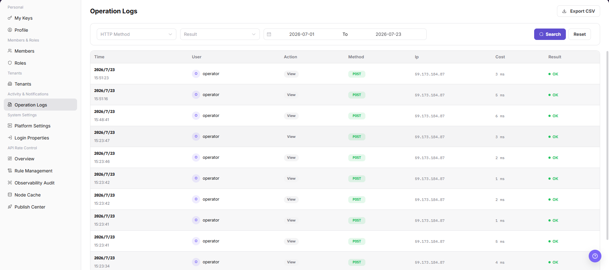

# Operation Logs

::: info Document Information
Version: v1.0
Updated: 2026-07-10
:::

## Feature Overview

`Operation Logs` is used to view, filter, and maintain operation logs information. It helps operator admin work with operation logs records and related status from a consistent page entry.

| Item | Content |
| --- | --- |
| Applicable role | Operator admin |
| Navigation path | Settings > Activity & Notifications > Operation Logs |
| Page route | `/user/user-space/operation-logs` |
| Managed objects | Operation Logs records and related status |
| Typical use | View, filter, and maintain operation logs information |

#### Beginner Explanation

Operation Logs is part of the settings and access-control workspace. Treat it as a place to confirm identities, permissions, organization rules, audit records, or rate-control status before changing configuration.

#### Terms Quick Reference

| Term | Meaning | Handling tip |
| --- | --- | --- |
| Member | A user account that belongs to an organization or team. | Check role and status before troubleshooting access. |
| Role | A permission set assigned to members. | Use least privilege and review scope before changes. |
| Operation log | An audit record of user or platform actions. | Use it to trace risky or abnormal operations. |
| API rate control rule | A policy that limits API request patterns. | Publish and verify rules carefully. |

## Prerequisites

1. The current account can access `Activity & Notifications > Operation Logs`.
2. The target organization, member, customer, billing cycle, rule, or record scope has been confirmed.
3. Required upstream data is already available and the page has finished loading.
4. For high-risk changes, confirm the impact scope and rollback path before continuing.

## Page Description

The page usually includes filters, summary cards, data tables, detail entries, status fields, and related operation buttons for operation logs records and related status.

| Area | Description |
| --- | --- |
| Filters | Narrow records by keyword, status, time range, organization, customer, member, or billing cycle. |
| Summary area | Displays key balances, counts, trends, warnings, or processing progress when available. |
| List or table | Shows records, statuses, timestamps, owners, amounts, and row-level actions. |
| Details or dialog | Provides more context before follow-up operations. |

The following screenshot shows operation logs.

## Main Operations

Use the following operations to work with operation logs records and related status. Complete view-only checks before opening dialogs that may create, save, submit, activate, transfer, settle, publish, or delete data.

### View Operation Logs

1. Go to `Activity & Notifications > Operation Logs`.
2. Select `HTTP Method`, `Result`, and the time range.
3. Click `Search` to query operation logs.
4. Review `Time`, `User`, `Action`, `Method`, `IP`, `Cost`, and `Result` in the log table.
5. Click `Reset` when you need to clear the filters.
6. Before exporting logs, confirm the time range and desensitization requirements, then click `Export CSV`.

## Parameter Reference

| Field | Required | Type | Example | Description |
| --- | --- | --- | --- | --- |
| HTTP Method | No | Enum | `GET` | Filters logs by HTTP request method. |
| Result | No | Enum | `Success` | Filters logs by operation result. |
| Start Time | No | Date time | `2026-07-13 09:00` | The start time of the query range. |
| End Time | No | Date time | `2026-07-13 10:00` | The end time of the query range. |
| Time | System generated | Date time | `2026-07-13 09:30` | The time when the operation occurred. |
| User | System generated | Text | `Example user` | The account or user that performed the operation. |
| Action | System generated | Text | `Update configuration` | The operation behavior or API meaning. |
| Method | System generated | Text | `POST` | The method used by this request. |
| IP | System generated | Text | `192.0.2.1` | The source IP of the operation. Desensitize it in documentation. |
| Cost | System generated | Number | `120 ms` | The request or operation processing duration. |
| Result | System generated | Enum | `Success` | The operation execution result. |

## Pitfalls

- Do not change roles, members, login policies, Keys, or API rate-control rules without confirming the affected users and systems.
- UI entries can differ by role and organization scope; verify the current account context before troubleshooting.
- Never copy complete Keys, AK/SK, tokens, or secrets into documentation, tickets, or screenshots.
- Operation logs may contain sensitive audit information such as accounts, IP addresses, API paths, and operation results.
- `Export CSV` exports real log data and is a high-risk action.
- Before exporting, narrow the time range and confirm the recipient.
- Do not write real accounts, IP addresses, API paths, customer names, tenant IDs, or internal error details in documentation.

## Result Validation

| Check item | Success signal | If abnormal |
| --- | --- | --- |
| Page access | The `Activity & Notifications > Operation Logs` page opens and data loads normally. | Check role permissions and refresh the page. |
| Filter result | The list changes according to the selected filters. | Reset filters and search again. |
| Record detail | Details, status, amount, permission, or configuration values are visible. | Confirm the record scope and permissions. |
| Follow-up path | Related pages or dialogs can be opened from visible entries. | Return to the sidebar and enter the downstream page directly. |
| Reset filters | Clicking `Reset` restores filters to defaults. | Refresh the page and set query conditions again. |
| Export entry | The export button is visible according to permissions. | Confirm whether log data is allowed to be shared before export. |

## FAQ

#### Target settings entry is not visible in Operation Logs

The expected account, project, member, role, organization, key, operation log, system configuration, or API rate-control entry does not appear on this page.

**How to check:**

1. Confirm the current tenant, organization, project, role, and account permission scope.
2. Check page filters such as keyword, status, project, member, role, organization, time range, and configuration type.
3. Verify that prerequisite objects, such as projects, members, roles, keys, or system configurations, have been created and enabled.
4. If the entry was just changed, refresh the page and compare it with operation logs or related settings pages.

#### Configuration change does not take effect in Operation Logs

A permission, project, role, key, notification, system setting, or rate-control change was submitted, but the page or downstream behavior still shows the old result.

**How to check:**

1. Confirm that the save operation completed and the target object status is enabled or active.
2. Check whether the change applies to the correct organization, project, member, role, API key, or policy scope.
3. Compare downstream behavior with operation logs and related settings pages to rule out cache, permission, or synchronization delay.
4. For security-sensitive settings, verify impact scope before repeating the operation or escalating with desensitized page paths and timestamps.

#### Why cannot the target record be found in operation logs?

Check the current tenant, organization, project, role permissions, object status, feature switch, and operation logs. Do not repeat save, submit, publish, rollback, disable, or delete actions until the scope and impact are confirmed.

## Next Steps

1. Recheck the affected users, organizations, projects, roles, keys, policies, or configuration objects.
2. Verify operation logs and downstream behavior after the configuration is saved or refreshed.
3. Keep only desensitized page paths, timestamps, object names, and status values when escalating.

## Notes

- Permission, Key, login, organization, and rate-control changes can affect real users. Confirm scope before changes.
- Keep page routes, API fields, Key, AK/SK, License, and other product terms in their UI form.
- Keep credentials, private operational details, and sensitive customer data out of the manual.
- `Export CSV` exports real log data and is a high-risk action.
- Before exporting, confirm the time range, desensitization requirements, and recipient.
- Do not write real accounts, IP addresses, API paths, customer names, tenant IDs, or internal error details in documentation.
