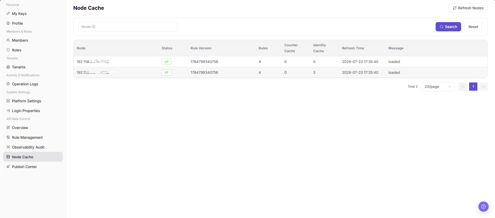

# Node Cache

::: info Document Information
Version: v1.0
Updated: 2026-07-10
:::

## Feature Overview

`Node Cache` is used to view API rate-control node cache status, including node status, rule version, rule count, counter cache, identity cache, refresh time, and messages.

| Item | Content |
| --- | --- |
| Applicable role | Operator admin |
| Navigation path | Settings > API Rate Control > Node Cache |
| Page route | `/user/system/rate-control/node-cache` |
| Managed objects | API rate-control nodes, rule versions, rule counts, and cache status |
| Typical use | View node cache status, refresh time, counter cache, and identity cache |

#### Beginner Explanation

Node Cache works like a synchronization status table for rate-control rules on each node. Use it to confirm whether rules have been delivered to nodes and whether node versions are consistent.

#### Terms Quick Reference

| Term | Meaning | Handling tip |
| --- | --- | --- |
| Node cache | Rate-control rule status stored locally on a node. | Check versions after publishing. |
| Rule version | The rule version currently loaded by a node. | Troubleshoot publishing when versions differ. |
| Synchronization status | Whether a node has completed rule synchronization. | Check Publish Center when abnormal. |
| Refresh | Reload node cache status. | Use it after publishing to confirm status. |

## Prerequisites

1. The current account has permission to view API rate-control nodes.
2. You have opened `API Rate Control > Node Cache`.
3. When troubleshooting rule effectiveness, the target rule version and publish time have been recorded.

## Page Description

The following screenshot shows the Node Cache page. Node addresses and cache details are desensitized.

| Area | Description |
| --- | --- |
| Refresh Nodes | Fetch node cache status again. |
| Node ID | Filter by node. |
| Node table | Displays node, status, rule version, rule count, counter cache, identity cache, refresh time, and message. |

## Main Operations

Use this operation to query node cache status. Do not add create or publish operations to this query-oriented workflow.

### View Node Cache

1. Go to `API Rate Control > Node Cache`.
2. Review node status, rule version, rule count, counter cache, identity cache, refresh time, and messages in the node list.
3. Compare the rule version with the published version on the rule management page to confirm whether rules have been synchronized to nodes.
4. Click `Refresh Nodes` to fetch node cache status again.
5. If the page provides clear or rebuild cache entries, confirm node scope, business impact, and approval requirements first.
6. For learning or screenshots, only view the list and refresh status. Do not clear, rebuild, or perform other high-risk operations.

## Parameter Reference

| Field | Required | Type | Example | Description |
| --- | --- | --- | --- | --- |
| Node | No | Text | `<node_name>` | Identifies an API rate-control node. |
| Node Status | System generated | Enum | `Normal` | Shows whether the node is online, abnormal, or synchronized. |
| Rule Version | System generated | Version | `<rule_version>` | The rule version currently loaded by the node. |
| Rule Count | System generated | Number | `10` | Number of rules currently cached on the node. |
| Counter Cache | System generated | Number / status | `Loaded` | Shows rate-limit counter cache status. |
| Identity Cache | System generated | Number / status | `Loaded` | Shows identity or access-subject cache status. |
| Refresh Time | System generated | Time | `Refresh Time` | Latest refresh time of node cache status. |
| Message | System generated | Text | `Synchronized` | Shows synchronization or abnormal node-cache information. |
| Refresh Nodes | No | Button | `Refresh Nodes` | Fetches node cache status again. |
| Actions | No | Button / menu | `Clear` | Provides node-cache operation entries. |

## Pitfalls

- Node cache reflects the synchronization status of rate-control rules on each node. Abnormal status may cause rules to be ineffective or node behavior to be inconsistent.
- `Refresh Nodes` fetches node status again and should not be used too frequently.
- `Clear`, `Rebuild`, and `Refresh Cache` are high-risk actions and may affect rule synchronization, counter cache, and identity cache.
- Do not write real node addresses, internal IP addresses, tokens, tenant IDs, customer names, node names, internal error details, or load-test parameters in the manual.

## Result Validation

| Check item | Success signal | If abnormal |
| --- | --- | --- |
| Page access | The `API Rate Control > Node Cache` page opens and data loads normally. | Check role permissions and refresh the page. |
| Node visibility | The node list is displayed normally. | Check the Node ID filter. |
| Version consistency | The node rule version matches the published version on the rule management page. | Open Publish Center and check release records. |
| Normal status | Node status, counter cache, identity cache, and messages are normal. | Use Observability Audit to troubleshoot node issues. |
| Controlled refresh | Refresh time or messages update as expected after `Refresh Nodes`. | Avoid frequent refreshes and confirm node status and permissions. |

## FAQ

#### Node version is not updated after rule publishing

Rule Management shows that the rule is published, but the rule version in Node Cache is still old.

**How to check:**

1. Click `Refresh Nodes`.
2. Open Publish Center and check the corresponding publish status.
3. Confirm whether the target node is online.
4. Compare the rule version with the rule management page.

#### Why is the target node missing from the node cache list?

The Node Cache page does not display the target node or cache status.

**How to check:**

1. Clear filters and confirm the node access status.
2. Check cache reporting time and node health status.
3. Confirm whether the node is connected to the API rate-control component.
4. If it is still empty, check rate-control service logs with desensitized context.

#### Why are the node cache refresh or clear buttons unavailable?

The node cache record is visible, but refresh, clear, or rebuild cache buttons cannot be clicked. Confirm rate-control operation permissions and node online status. Before clearing cache, record the impact scope and let an authorized administrator perform the operation.

## Next Steps

1. To view publish records, go to [Publish Center](../publish-center/).
2. To view rule hit status, go to [Observability Audit](../observability-audit/).

## Notes

- Node Cache is used to troubleshoot rule synchronization. It does not replace rule publishing operations.
- `刷新节点 / Refresh Nodes` fetches node status again and should not be used too frequently.
- `清理 / Clear`, `重建 / Rebuild`, and `刷新缓存 / Refresh Cache` are high-risk actions and may affect rule synchronization, counter cache, and identity cache.
- Do not write real node addresses, internal IP addresses, tokens, tenant IDs, customer names, node names, internal error details, or load-test parameters in the manual.
