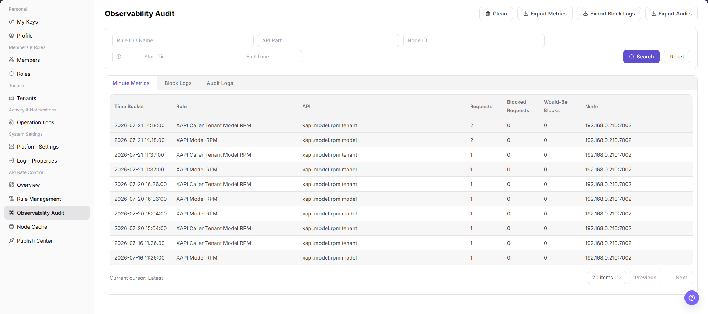

# Observability Audit

::: info Document Information
Version: v1.0
Updated: 2026-07-10
:::

## Feature Overview

`Observability Audit` is used to view API rate-control minute statistics, blocked logs, and audit logs. It also provides cleanup and export entries for observability and audit data.

| Item | Content |
| --- | --- |
| Applicable role | Operator admin |
| Navigation path | Settings > API Rate Control > Observability Audit |
| Page route | `/user/system/rate-control/observation` |
| Managed objects | Minute statistics, blocked logs, and audit logs |
| Typical use | View rate-control statistics, blocked records, audit details, cleanup entries, and export entries |

#### Beginner Explanation

Observability Audit works like a detail viewer for API rate control. Use it to check which requests were counted or blocked, then locate issues by rule, node, API, and time range.

#### Terms Quick Reference

| Term | Meaning | Handling tip |
| --- | --- | --- |
| Audit record | Details generated by rate-control statistics or blocked requests. | Filter by time during troubleshooting. |
| Node | The service node that executes rate-control rules. | Check node cache when node results differ. |
| Rule hit | A request matches and triggers a rule. | Compare with Rule Management. |
| Clean data | An action that deletes or archives audit data. | Confirm the scope before continuing. |

## Prerequisites

1. The current account has permission to access API rate-control observability audit data.
2. You have opened `API Rate Control > Observability Audit`.
3. The scope and purpose are confirmed before cleanup or export.

## Page Description

The following screenshot shows the Observability Audit page. API, node, and log details are desensitized.

| Area | Description |
| --- | --- |
| Minute Statistics | View request, blocked, and over-limit statistics aggregated by minute. |
| Blocked Logs | View request records blocked by rate-control rules. |
| Audit Logs | View rule audit records. |
| API Path | Filter by API path. |
| Node ID | Filter by node. |
| Start Time / End Time | Filter by time range. |
| Clean | Entry for cleaning observability or audit data. |
| Export Statistics / Export Blocked Logs / Export Audit Logs | Export the corresponding data. |

## Main Operations

Use this operation to query observability and audit data. Do not add create, publish, or save operations to this query-oriented workflow.

### View Observability Audit

1. Go to `API Rate Control > Observability Audit`.
2. Select the `Minute Statistics`, `Blocked Logs`, or `Audit Logs` tab.
3. Select a time range, API, node, rule, or result status according to page fields.
4. Click `Search` to query the corresponding observability or audit data.
5. Click `Reset` when you need to restore default filters.
6. Review API, node, rule, hit count, blocked result, cost, or audit details in the list.
7. To export statistics, blocked logs, or audit data, confirm the time range, desensitization requirements, and recipient before clicking the corresponding export entry.
8. To clean data, confirm compliance retention and troubleshooting needs before continuing. For learning or screenshots, do not perform cleanup.

## Parameter Reference

| Field | Required | Type | Example | Description |
| --- | --- | --- | --- | --- |
| Tab | Yes | Tab | `Minute Statistics` | Switches between statistics, blocked logs, and audit data views. |
| Time Range | No | Time range | `Start Time` / `End Time` | Filters observability or audit records by time. |
| API | No | Text | `<api_path>` | Filters by API path. |
| Node | No | Text | `<node_name>` | Filters by execution node. |
| Rule | No | Text | `<rule_name>` | Filters by matched rule. |
| Hit Count | System generated | Number | `10` | Shows rule or API hit count. |
| Blocked Result | System generated | Enum | `Blocked` | Shows whether the request was blocked by a rule. |
| Cost | System generated | Number | `120 ms` | Shows request or processing cost. |
| Audit Details | System generated | Text / link | `View Details` | Opens context information for an audit record. |
| Export | No | Button | `Export Audit Logs` | Exports statistics, blocked logs, or audit data. |
| Clean | No | Button | `Clean` | Cleans observability or audit data. |

## Pitfalls

- Observability audit data may expose API paths, nodes, rules, account clues, IP addresses, abnormal requests, and internal capacity information.
- `Export Statistics`, `Export Blocked Logs`, and `Export Audit Logs` export real audit data and are high-risk actions.
- `Clean` affects later troubleshooting and compliance retention and is a high-risk action.
- Do not write real API paths, tokens, IP addresses, accounts, tenant IDs, customer names, node names, internal error details, or load-test parameters in the manual.

## Result Validation

| Check item | Success signal | If abnormal |
| --- | --- | --- |
| Page access | The `API Rate Control > Observability Audit` page opens and data loads normally. | Check role permissions and refresh the page. |
| Tab switching | The three data tabs can be switched normally. | Refresh the page and re-enter it. |
| Filter result | The list refreshes according to API, node, rule, or time range. | Check filters, click `Reset`, and search again. |
| Export entry | Export buttons are displayed according to permissions. | Confirm time range, desensitization requirements, and recipient before exporting. |
| Clean entry | The cleanup entry is displayed according to permissions and has a clear scope confirmation before execution. | Stop cleanup if retention requirements are unclear. |

## FAQ

#### Overview shows blocked requests, but audit records are not found

The overview shows an increase in blocked requests, but no corresponding record appears in Observability Audit.

**How to check:**

1. Confirm that the time range is consistent.
2. Switch to the `Blocked Logs` tab.
3. Expand the time range and search again.
4. Compare the result with Rule Management and node cache status.

#### What should be checked before cleaning data?

The page provides a `Clean` entry.

**How to check:**

1. Confirm data retention requirements.
2. Confirm whether the data is still needed for troubleshooting.
3. Confirm the cleanup scope and operator permission.
4. For learning or screenshots only, do not perform cleanup.

#### Why are observability audit records empty?

The selected time range may not contain requests that triggered rate-control rules, requests may not have passed through the rate-control gateway, or the audit collection chain may be delayed. Expand the time range, confirm the request path, check rule publishing and gateway access, and then compare node cache reporting status.

## Next Steps

1. To adjust rules, go to [Rule Management](../rule-management/).
2. To check node status, go to [Node Cache](../node-cache/).

## Notes

- Observability audit data may expose API paths, nodes, rules, account clues, IP addresses, abnormal requests, and internal capacity information.
- `导出统计 / Export Statistics`, `导出拦截 / Export Blocked Logs`, and `导出审计 / Export Audit Logs` export real audit data and are high-risk actions.
- `清理 / Clean` affects later troubleshooting and compliance retention and is a high-risk action.
- Do not write real API paths, tokens, IP addresses, accounts, tenant IDs, customer names, node names, internal error details, or load-test parameters in the manual.
