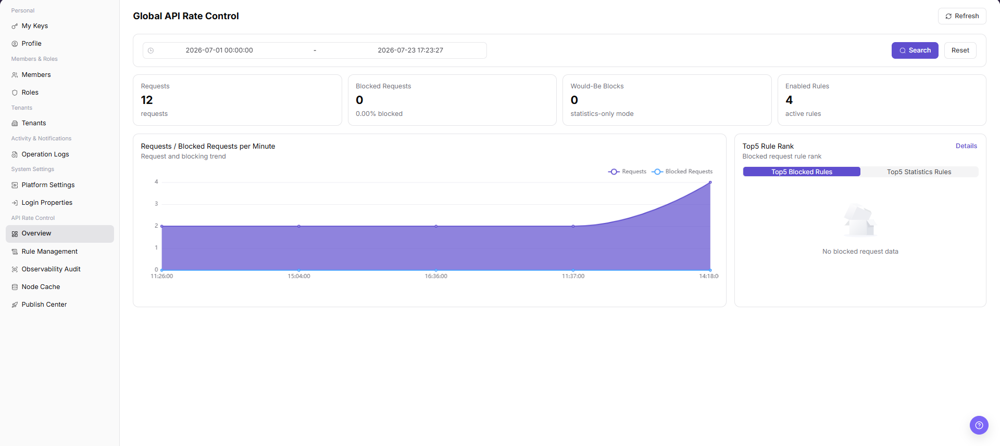

# Overview

::: info Document Information
Version: v1.0
Updated: 2026-07-10
:::

## Feature Overview

`Overview` is used to view, filter, and maintain overview information. It helps operator admin work with overview records and related status from a consistent page entry.

| Item | Content |
| --- | --- |
| Applicable role | Operator admin |
| Navigation path | Settings > API Rate Control > API Rate Control Overview |
| Page route | `/user/system/rate-control/overview` |
| Managed objects | Overview records and related status |
| Typical use | View, filter, and maintain overview information |

#### Beginner Explanation

Overview is part of the settings and access-control workspace. Treat it as a place to confirm identities, permissions, organization rules, audit records, or rate-control status before changing configuration.

#### Terms Quick Reference

| Term | Meaning | Handling tip |
| --- | --- | --- |
| Member | A user account that belongs to an organization or team. | Check role and status before troubleshooting access. |
| Role | A permission set assigned to members. | Use least privilege and review scope before changes. |
| Operation log | An audit record of user or platform actions. | Use it to trace risky or abnormal operations. |
| API rate control rule | A policy that limits API request patterns. | Publish and verify rules carefully. |

## Prerequisites

1. The current account can access `API Rate Control > API Rate Control Overview`.
2. The target organization, member, customer, billing cycle, rule, or record scope has been confirmed.
3. Required upstream data is already available and the page has finished loading.
4. For high-risk changes, confirm the impact scope and rollback path before continuing.

## Page Description

The page usually includes filters, summary cards, data tables, detail entries, status fields, and related operation buttons for overview records and related status.

| Area | Description |
| --- | --- |
| Filters | Narrow records by keyword, status, time range, organization, customer, member, or billing cycle. |
| Summary area | Displays key balances, counts, trends, warnings, or processing progress when available. |
| List or table | Shows records, statuses, timestamps, owners, amounts, and row-level actions. |
| Details or dialog | Provides more context before follow-up operations. |

The following screenshot shows api rate control overview.

## Main Operations

Use the following operations to work with overview records and related status. Complete view-only checks before opening dialogs that may create, save, submit, activate, transfer, settle, publish, or delete data.

### View API Rate Control Overview

1. Go to `Settings > API Rate Control > API Rate Control Overview`.
2. Review request volume, blocked volume, matched rules, API distribution, or trend data on the overview page.
3. Select a time range, API, rule, or result status according to available filters.
4. Click `Search` or the actual query entry on the page to refresh overview data.
5. Click `Reset` when you need to restore default filters.
6. View trends and statistics only. Do not publish, disable, or delete rules from the overview workflow.

## Parameter Reference

| Field Name | Required | Field Type | Example | Description |
| --- | --- | --- | --- | --- |
| Time Range | No | Date time | `2026-07-13 09:00 to 10:00` | The time window for API request, blocked, and hit statistics. |
| API | No | Text | `/api/example` | Filters overview data by API or API path. Desensitize it in documentation. |
| Rule | No | Text | `Example rule` | Filters hit or blocked data by rate-control rule. |
| Request Volume | System generated | Number | `12,000` | The total request volume in the current time range. |
| Blocked Volume | System generated | Number | `320` | The number of requests blocked by rate-control rules. |
| Hit Count | System generated | Number | `800` | The number of rule hits. |
| Result Status | No | Enum | `Blocked` | Filters data by request result or processing status. |
| Trend Chart | System generated | Chart | `Requests per minute` | Shows request, blocked, or hit trends over time. |
| Search | Operation button | Button | `Search` | Refreshes overview data by current filters. |
| Reset | Operation button | Button | `Reset` | Restores default filters. |

## Pitfalls

- Do not change roles, members, login policies, Keys, or API rate-control rules without confirming the affected users and systems.
- UI entries can differ by role and organization scope; verify the current account context before troubleshooting.
- Never copy complete Keys, AK/SK, tokens, or secrets into documentation, tickets, or screenshots.
- API rate-control overview may expose API paths, calling trends, abnormal requests, rule hits, and internal capacity information.
- The overview page is for observation and troubleshooting. It should not replace the rule configuration page for publish, disable, or delete decisions.
- Do not write real API paths, tokens, tenant IDs, accounts, customer names, internal error details, or load-test parameters in documentation.
- If the page provides export or rule-configuration jump entries, export, publish, disable, and delete are high-risk actions.

## Result Validation

| Check Item | Success Signal | If Abnormal |
| --- | --- | --- |
| Page access | The `API Rate Control > API Rate Control Overview` page opens and data loads normally. | Check role permissions and refresh the page. |
| Filter result | The list changes according to the selected filters. | Reset filters and search again. |
| Record detail | Details, status, amount, permission, or configuration values are visible. | Confirm the record scope and permissions. |
| Follow-up path | Related pages or dialogs can be opened from visible entries. | Return to the sidebar and enter the downstream page directly. |
| Reset filters | Clicking `Reset` restores default filters. | Refresh the page and select query conditions again. |

## FAQ

#### Target settings entry is not visible in Overview

The expected account, project, member, role, organization, key, operation log, system configuration, or API rate-control entry does not appear on this page.

**How to check:**

1. Confirm the current tenant, organization, project, role, and account permission scope.
2. Check page filters such as keyword, status, project, member, role, organization, time range, and configuration type.
3. Verify that prerequisite objects, such as projects, members, roles, keys, or system configurations, have been created and enabled.
4. If the entry was just changed, refresh the page and compare it with operation logs or related settings pages.

#### Configuration change does not take effect in Overview

A permission, project, role, key, notification, system setting, or rate-control change was submitted, but the page or downstream behavior still shows the old result.

**How to check:**

1. Confirm that the save operation completed and the target object status is enabled or active.
2. Check whether the change applies to the correct organization, project, member, role, API key, or policy scope.
3. Compare downstream behavior with operation logs and related settings pages to rule out cache, permission, or synchronization delay.
4. For security-sensitive settings, verify impact scope before repeating the operation or escalating with desensitized page paths and timestamps.

#### Why is the rate-control overview action entry unavailable?

Check the current tenant, organization, project, role permissions, object status, feature switch, and operation logs. Do not repeat save, submit, publish, rollback, disable, or delete actions until the scope and impact are confirmed.

## Next Steps

1. Recheck the affected users, organizations, projects, roles, keys, policies, or configuration objects.
2. Verify operation logs and downstream behavior after the configuration is saved or refreshed.
3. Keep only desensitized page paths, timestamps, object names, and status values when escalating.

## Notes

- Permission, Key, login, organization, and rate-control changes can affect real users. Confirm scope before changes.
- Keep page routes, API fields, Key, AK/SK, License, and other product terms in their UI form.
- Keep credentials, private operational details, and sensitive customer data out of the manual.
- Do not write real API paths, tokens, tenant IDs, accounts, customer names, internal error details, or load-test parameters in documentation.
- If the page provides export or rule-configuration jump entries, export, publish, disable, and delete are high-risk actions.
