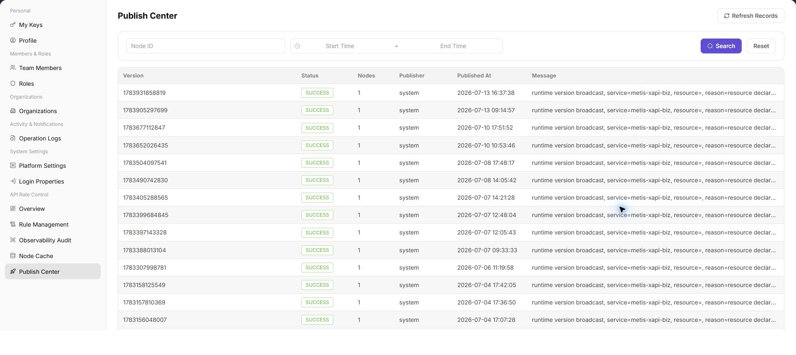

# Publish Center

::: info Document Information
Version: v1.0
Updated: 2026-07-10
:::

## Feature Overview

`Publish Center` is used to view, filter, and maintain publish center information. It helps operator admin work with publish center records and related status from a consistent page entry.

| Item | Content |
| --- | --- |
| Applicable role | Operator admin |
| Navigation path | API Rate Control > Publish Center |
| Page route | /operator/api-rate-control/publish-center |
| Managed objects | Publish Center records and related status |
| Typical use | View, filter, and maintain publish center information |

### Beginner Explanation

Publish Center is part of the settings and access-control workspace. Treat it as a place to confirm identities, permissions, organization rules, audit records, or rate-control status before changing configuration.

### Terms Quick Reference

| Term | Meaning | Handling tip |
| --- | --- | --- |
| Member | A user account that belongs to an organization or team. | Check role and status before troubleshooting access. |
| Role | A permission set assigned to members. | Use least privilege and review scope before changes. |
| Operation log | An audit record of user or platform actions. | Use it to trace risky or abnormal operations. |
| API rate control rule | A policy that limits API request patterns. | Publish and verify rules carefully. |

## Prerequisites

1. The current account can access `API Rate Control > Publish Center`.
2. The target organization, member, customer, billing cycle, rule, or record scope has been confirmed.
3. Required upstream data is already available and the page has finished loading.
4. For high-risk changes, confirm the impact scope and rollback path before continuing.

## Page Description

The page usually includes filters, summary cards, data tables, detail entries, status fields, and related operation buttons for publish center records and related status.

| Area | Description |
| --- | --- |
| Filters | Narrow records by keyword, status, time range, organization, customer, member, or billing cycle. |
| Summary area | Displays key balances, counts, trends, warnings, or processing progress when available. |
| List or table | Shows records, statuses, timestamps, owners, amounts, and row-level actions. |
| Details or dialog | Provides more context before follow-up operations. |

The following screenshot shows publish center.

## Main Operations

Use the following operations to work with publish center records and related status. Complete view-only checks before opening dialogs that may create, save, submit, activate, transfer, settle, publish, or delete data.

### View Publish Center

1. Go to `API Rate Control > Publish Center`.
2. Use filters or tabs to locate the target record.
3. Select the target row or entry related to publish center records and related status.
4. Click the visible `View Publish Center` entry when it is available.
5. Before confirming any high-risk dialog, review the affected scope, amount, permission, or configuration and cancel if the impact is unclear.

## Parameters

| Field | Required | Type | Example | Description |
| --- | --- | --- | --- | --- |
| Keyword or name | No | Text | `Example name` | Used to locate a specific record. |
| Status | No | Enum | `Enabled` | Used to determine the current processing or availability state. |
| Time range or billing cycle | No | Date / Month | `2026-07` | Used to narrow statistics, logs, bills, or settlements. |
| Organization / customer / member | No | Text | `Example organization` | Used to identify the business ownership scope. |
| Operation | System generated | Button / link | `View Details` | Provides row-level entry points for follow-up checks. |

## Pitfalls

- Do not change roles, members, login policies, Keys, or API rate-control rules without confirming the affected users and systems.
- UI entries can differ by role and organization scope; verify the current account context before troubleshooting.
- Never copy complete Keys, AK/SK, tokens, or secrets into documentation, tickets, or screenshots.

## Result Checks

| Check item | Success signal | If abnormal |
| --- | --- | --- |
| Page access | The `API Rate Control > Publish Center` page opens and data loads normally. | Check role permissions and refresh the page. |
| Filter result | The list changes according to the selected filters. | Reset filters and search again. |
| Record detail | Details, status, amount, permission, or configuration values are visible. | Confirm the record scope and permissions. |
| Follow-up path | Related pages or dialogs can be opened from visible entries. | Return to the sidebar and enter the downstream page directly. |

## FAQ

### Target settings entry is not visible in Publish Center

The expected account, project, member, role, organization, key, operation log, system configuration, or API rate-control entry does not appear on this page.

**How to check:**

1. Confirm the current tenant, organization, project, role, and account permission scope.
2. Check page filters such as keyword, status, project, member, role, organization, time range, and configuration type.
3. Verify that prerequisite objects, such as projects, members, roles, keys, or system configurations, have been created and enabled.
4. If the entry was just changed, refresh the page and compare it with operation logs or related settings pages.

### Configuration change does not take effect in Publish Center

A permission, project, role, key, notification, system setting, or rate-control change was submitted, but the page or downstream behavior still shows the old result.

**How to check:**

1. Confirm that the save operation completed and the target object status is enabled or active.
2. Check whether the change applies to the correct organization, project, member, role, API key, or policy scope.
3. Compare downstream behavior with operation logs and related settings pages to rule out cache, permission, or synchronization delay.
4. For security-sensitive settings, verify impact scope before repeating the operation or escalating with desensitized page paths and timestamps.

## Notes

- Permission, Key, login, organization, and rate-control changes can affect real users. Confirm scope before changes.
- Keep page routes, API fields, Key, AK/SK, License, and other product terms in their UI form.
- Keep credentials, private operational details, and sensitive customer data out of the manual.
