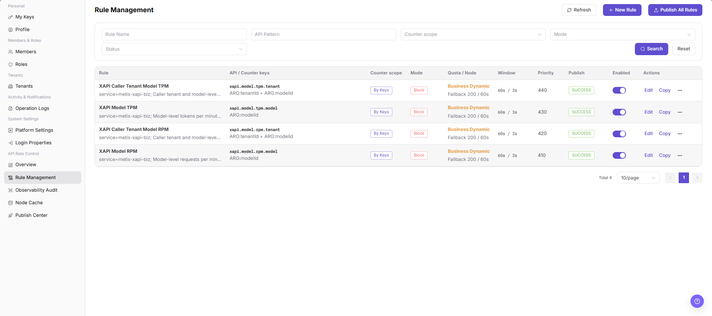
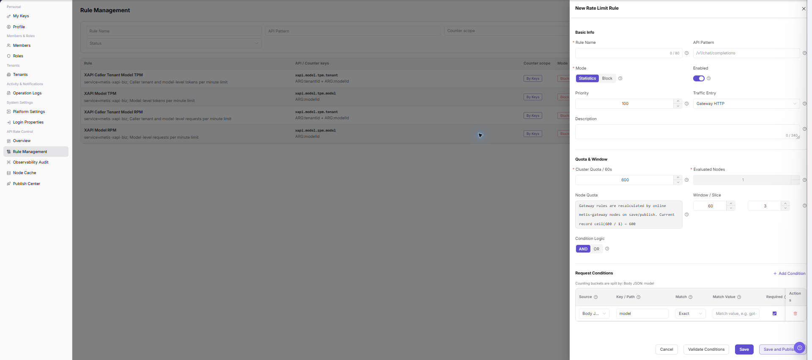

# Rule Management

::: info Document Information
Version: v1.0
Updated: 2026-07-10
:::

## Feature Overview

`Rule Management` is used to view, filter, and maintain rule management information. It helps operator admin work with rule management records and related status from a consistent page entry.

| Item | Content |
| --- | --- |
| Applicable role | Operator admin |
| Navigation path | Settings > API Rate Control > Rule Management |
| Page route | `/user/system/rate-control/rules` |
| Managed objects | Rule Management records and related status |
| Typical use | View, filter, and maintain rule management information |

#### Beginner Explanation

Rule Management is part of the settings and access-control workspace. Treat it as a place to confirm identities, permissions, organization rules, audit records, or rate-control status before changing configuration.

#### Terms Quick Reference

| Term | Meaning | Handling tip |
| --- | --- | --- |
| Member | A user account that belongs to an organization or team. | Check role and status before troubleshooting access. |
| Role | A permission set assigned to members. | Use least privilege and review scope before changes. |
| Operation log | An audit record of user or platform actions. | Use it to trace risky or abnormal operations. |
| API rate control rule | A policy that limits API request patterns. | Publish and verify rules carefully. |

## Prerequisites

1. The current account can access `API Rate Control > Rule Management`.
2. The target organization, member, customer, billing cycle, rule, or record scope has been confirmed.
3. Required upstream data is already available and the page has finished loading.
4. For high-risk changes, confirm the impact scope and rollback path before continuing.

## Page Description

The page usually includes filters, summary cards, data tables, detail entries, status fields, and related operation buttons for rule management records and related status.

| Area | Description |
| --- | --- |
| Filters | Narrow records by keyword, status, time range, organization, customer, member, or billing cycle. |
| Summary area | Displays key balances, counts, trends, warnings, or processing progress when available. |
| List or table | Shows records, statuses, timestamps, owners, amounts, and row-level actions. |
| Details or dialog | Provides more context before follow-up operations. |

The following screenshot shows rule management.

## Main Operations

Use the following operations to work with rule management records and related status. Complete view-only checks before opening dialogs that may create, save, submit, activate, transfer, settle, publish, or delete data.

### Create Rate Control Rule

1. Go to `Settings > API Rate Control > Rule Management`.
2. Click `Create Rule`, `Create Rate Control Rule`, or the actual create entry on the page.
3. In the rule creation page or dialog, review the rule configuration fields.

4. Fill in rule name, API path, request method, match conditions, rate limit threshold, and time window.
5. Select effective scope, result handling policy, enabled status, or priority according to page fields.
6. Before clicking the final `Save`, `Submit`, or `Publish`, verify that the rule will not block normal business requests by mistake.
7. For learning or screenshots only, view fields and click `Cancel` or return without submitting real rule configuration.

## Parameter Reference

| Field Name | Required | Field Type | Example | Description |
| --- | --- | --- | --- | --- |
| Rule Name | Yes | Text | `Example Rule A` | Identifies the rate control rule. |
| API Path | Yes | Text | `/api/example` | The API path matched by the rule. Desensitize it in documentation. |
| Request Method | No | Enum | `GET` | The HTTP request method matched by the rule. |
| Match Condition | Yes | Condition expression | `tenant = example` | The condition set used to match the rule. |
| Rate Limit Threshold | Yes | Number | `100 requests/minute` | The request limit that triggers statistics or blocking. |
| Time Window | Yes | Time | `1 minute` | The time window used to count requests. |
| Effective Scope | Yes | Enum / Multi-select | `Global` | The API, tenant, user, or service scope where the rule applies. |
| Handling Policy | Yes | Enum | `Block` | The processing policy after the rule is hit. |
| Enabled Status | Yes | Enum | `Enabled` | Indicates whether the rule participates in rate control. |
| Priority | No | Number | `10` | The processing order when multiple rules match. |
| Actions | System generated | Button / link | `Edit / Copy / Publish / Delete` | Provides rule maintenance entry points. |

## Pitfalls

- Do not change roles, members, login policies, Keys, or API rate-control rules without confirming the affected users and systems.
- UI entries can differ by role and organization scope; verify the current account context before troubleshooting.
- Never copy complete Keys, AK/SK, tokens, or secrets into documentation, tickets, or screenshots.
- Creating or publishing a rate control rule affects real API access, user request success rate, and business availability.
- Incorrect API paths, match conditions, thresholds, or time windows may block normal business requests by mistake.
- `Save`, `Submit`, `Publish`, `Publish All`, `Disable`, and `Delete` are high-risk actions.
- Do not write real API paths, tokens, accounts, tenant IDs, customer names, internal error details, or load-test parameters in documentation.

## Result Validation

| Check Item | Success Signal | If Abnormal |
| --- | --- | --- |
| Page access | The `API Rate Control > Rule Management` page opens and data loads normally. | Check role permissions and refresh the page. |
| Filter result | The list changes according to the selected filters. | Reset filters and search again. |
| Record detail | Details, status, amount, permission, or configuration values are visible. | Confirm the record scope and permissions. |
| Follow-up path | Related pages or dialogs can be opened from visible entries. | Return to the sidebar and enter the downstream page directly. |
| Create entry | Clicking `Create Rule` opens the rule creation page or dialog. | Check whether the current account has rule creation permission. |

## FAQ

#### Target settings entry is not visible in Rule Management

The expected account, project, member, role, organization, key, operation log, system configuration, or API rate-control entry does not appear on this page.

**How to check:**

1. Confirm the current tenant, organization, project, role, and account permission scope.
2. Check page filters such as keyword, status, project, member, role, organization, time range, and configuration type.
3. Verify that prerequisite objects, such as projects, members, roles, keys, or system configurations, have been created and enabled.
4. If the entry was just changed, refresh the page and compare it with operation logs or related settings pages.

#### Configuration change does not take effect in Rule Management

A permission, project, role, key, notification, system setting, or rate-control change was submitted, but the page or downstream behavior still shows the old result.

**How to check:**

1. Confirm that the save operation completed and the target object status is enabled or active.
2. Check whether the change applies to the correct organization, project, member, role, API key, or policy scope.
3. Compare downstream behavior with operation logs and related settings pages to rule out cache, permission, or synchronization delay.
4. For security-sensitive settings, verify impact scope before repeating the operation or escalating with desensitized page paths and timestamps.

#### Why are rate limiting rules not visible?

Check the current tenant, organization, project, role permissions, object status, feature switch, and operation logs. Do not repeat save, submit, publish, rollback, disable, or delete actions until the scope and impact are confirmed.

## Next Steps

1. Recheck the affected users, organizations, projects, roles, keys, policies, or configuration objects.
2. Verify operation logs and downstream behavior after the configuration is saved or refreshed.
3. Keep only desensitized page paths, timestamps, object names, and status values when escalating.

## Notes

- Permission, Key, login, organization, and rate-control changes can affect real users. Confirm scope before changes.
- Keep page routes, API fields, Key, AK/SK, License, and other product terms in their UI form.
- Keep credentials, private operational details, and sensitive customer data out of the manual.
- `Save`, `Submit`, `Publish`, `Publish All`, `Disable`, and `Delete` are high-risk actions.
- Do not write real API paths, tokens, accounts, tenant IDs, customer names, internal error details, or load-test parameters in documentation.
