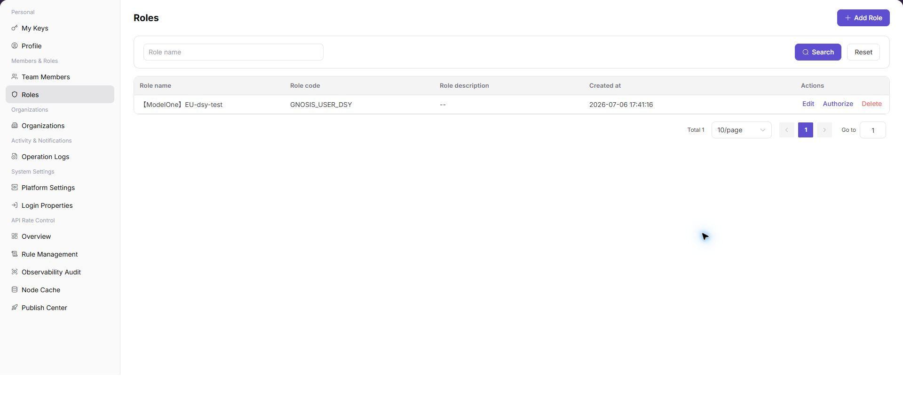
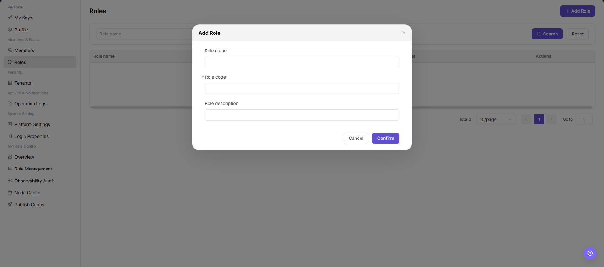

# Roles

::: info Document Information
Version: v1.0
Updated: 2026-07-10
:::

## Feature Overview

`Roles` is used to view, filter, and maintain roles information. It helps operator admin work with roles records and related status from a consistent page entry.

| Item | Content |
| --- | --- |
| Applicable role | Operator admin |
| Navigation path | Settings > Members & Roles > Roles |
| Page route | `/user/user-space/roles` |
| Managed objects | Roles records and related status |
| Typical use | View, filter, and maintain roles information |

#### Beginner Explanation

Roles is part of the settings and access-control workspace. Treat it as a place to confirm identities, permissions, organization rules, audit records, or rate-control status before changing configuration.

#### Terms Quick Reference

| Term | Meaning | Handling tip |
| --- | --- | --- |
| Member | A user account that belongs to an organization or team. | Check role and status before troubleshooting access. |
| Role | A permission set assigned to members. | Use least privilege and review scope before changes. |
| Operation log | An audit record of user or platform actions. | Use it to trace risky or abnormal operations. |
| API rate control rule | A policy that limits API request patterns. | Publish and verify rules carefully. |

## Prerequisites

1. The current account can access `Members & Roles > Roles`.
2. The target organization, member, customer, billing cycle, rule, or record scope has been confirmed.
3. Required upstream data is already available and the page has finished loading.
4. For high-risk changes, confirm the impact scope and rollback path before continuing.

## Page Description

The page usually includes filters, summary cards, data tables, detail entries, status fields, and related operation buttons for roles records and related status.

| Area | Description |
| --- | --- |
| Filters | Narrow records by keyword, status, time range, organization, customer, member, or billing cycle. |
| Summary area | Displays key balances, counts, trends, warnings, or processing progress when available. |
| List or table | Shows records, statuses, timestamps, owners, amounts, and row-level actions. |
| Details or dialog | Provides more context before follow-up operations. |

The following screenshot shows roles.

## Main Operations

Use the following operations to work with roles records and related status. Complete view-only checks before opening dialogs that may create, save, submit, activate, transfer, settle, publish, or delete data.

### Add Role

1. Go to `Settings > Members & Roles > Roles`.
2. Click `Add Role` in the upper-right corner of the page.
3. In the `Add Role` dialog, review the role creation fields.

4. Fill in `Role name`.
5. Fill in the required `Role code`. Use a stable, readable, lowercase English code that is easy to audit.
6. Fill in `Role description` according to the intended role usage.
7. Before clicking the final `Confirm`, verify that the role name, role code, and later authorization scope follow the least-privilege principle.
8. For learning or screenshots only, view the fields and click `Cancel` to close the dialog without submitting real role configuration.

## Parameter Reference

| Field Name | Required | Field Type | Example | Description |
| --- | --- | --- | --- | --- |
| Role name | Yes | Text | `Audit Admin` | The display name of the operator role. |
| Role code | Yes | Text | `audit_admin` | The unique role identifier. Use a stable, readable code that is easy to audit. |
| Role description | No | Text | `View audit logs and basic operator information` | Describes the role purpose and authorization boundary. |
| Permission items | Yes | Multi-select | `View Operation Logs` | Controls menus and operations available to the role. |
| Member count | No | Number | `3` | Shows how many members are bound to the role. |
| Role status | No | Enum | `Enabled` | Controls whether the role can continue to be assigned. |
| Actions | System generated | Button / link | `Edit / Authorize / Delete` | Provides role maintenance entry points. |

## Pitfalls

- Do not change roles, members, login policies, Keys, or API rate-control rules without confirming the affected users and systems.
- UI entries can differ by role and organization scope; verify the current account context before troubleshooting.
- Never copy complete Keys, AK/SK, tokens, or secrets into documentation, tickets, or screenshots.
- Adding a role creates a new platform permission template. Later authorization and member binding can affect platform management permissions.
- `Confirm` is the final submit action. For learning or screenshots, only view fields and use `Cancel` to exit.
- Once `Role code` is referenced, later changes may affect permission identification, auditing, and automation configuration.
- Do not write real internal role codes, accounts, member IDs, customer names, or internal test data.

## Result Validation

| Check Item | Success Signal | If Abnormal |
| --- | --- | --- |
| Page access | The `Members & Roles > Roles` page opens and data loads normally. | Check role permissions and refresh the page. |
| Filter result | The list changes according to the selected filters. | Reset filters and search again. |
| Record detail | Details, status, amount, permission, or configuration values are visible. | Confirm the record scope and permissions. |
| Follow-up path | Related pages or dialogs can be opened from visible entries. | Return to the sidebar and enter the downstream page directly. |
| Add dialog | Clicking `Add Role` opens the same-name dialog. | Check whether the current account has role creation permission. |
| Cancel exit | Clicking `Cancel` closes the dialog without submitting role configuration. | Refresh the page and confirm no test role was added. |

## FAQ

#### Target settings entry is not visible in Roles

The expected account, project, member, role, organization, key, operation log, system configuration, or API rate-control entry does not appear on this page.

**How to check:**

1. Confirm the current tenant, organization, project, role, and account permission scope.
2. Check page filters such as keyword, status, project, member, role, organization, time range, and configuration type.
3. Verify that prerequisite objects, such as projects, members, roles, keys, or system configurations, have been created and enabled.
4. If the entry was just changed, refresh the page and compare it with operation logs or related settings pages.

#### Configuration change does not take effect in Roles

A permission, project, role, key, notification, system setting, or rate-control change was submitted, but the page or downstream behavior still shows the old result.

**How to check:**

1. Confirm that the save operation completed and the target object status is enabled or active.
2. Check whether the change applies to the correct organization, project, member, role, API key, or policy scope.
3. Compare downstream behavior with operation logs and related settings pages to rule out cache, permission, or synchronization delay.
4. For security-sensitive settings, verify impact scope before repeating the operation or escalating with desensitized page paths and timestamps.

#### Why is the operator role list empty?

Check the current tenant, organization, project, role permissions, object status, feature switch, and operation logs. Do not repeat save, submit, publish, rollback, disable, or delete actions until the scope and impact are confirmed.

## Next Steps

1. Recheck the affected users, organizations, projects, roles, keys, policies, or configuration objects.
2. Verify operation logs and downstream behavior after the configuration is saved or refreshed.
3. Keep only desensitized page paths, timestamps, object names, and status values when escalating.

## Notes

- Permission, Key, login, organization, and rate-control changes can affect real users. Confirm scope before changes.
- Keep page routes, API fields, Key, AK/SK, License, and other product terms in their UI form.
- Keep credentials, private operational details, and sensitive customer data out of the manual.
- `Confirm` is the final submit action. Before adding a role, verify the role name, role code, and later authorization scope.
- Once `Role code` is referenced, later changes may affect permission identification, auditing, and automation configuration.
- For learning or screenshots only, open the dialog to view fields and use `Cancel` to exit.
- Do not write real internal role codes, accounts, member IDs, customer names, or internal test data.
