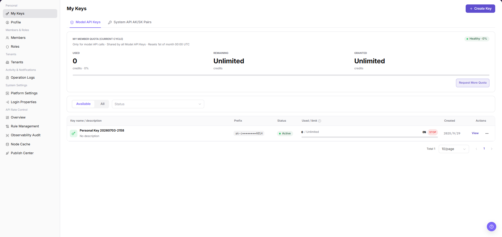
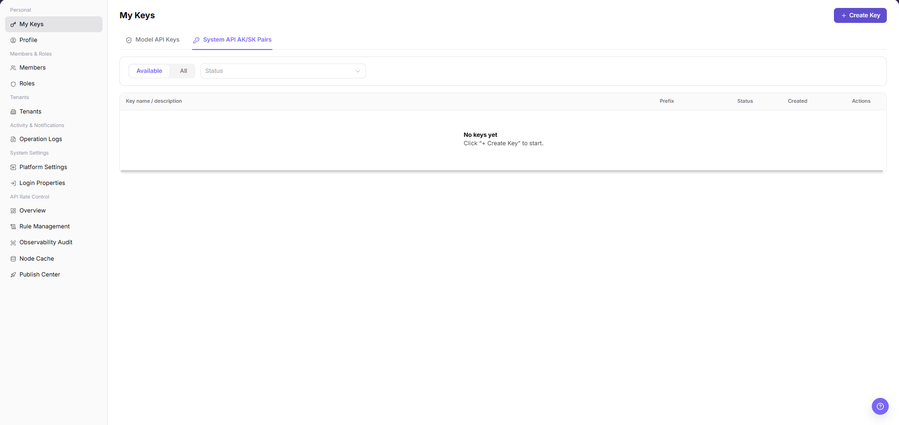
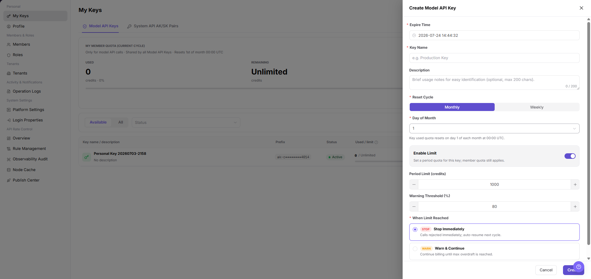
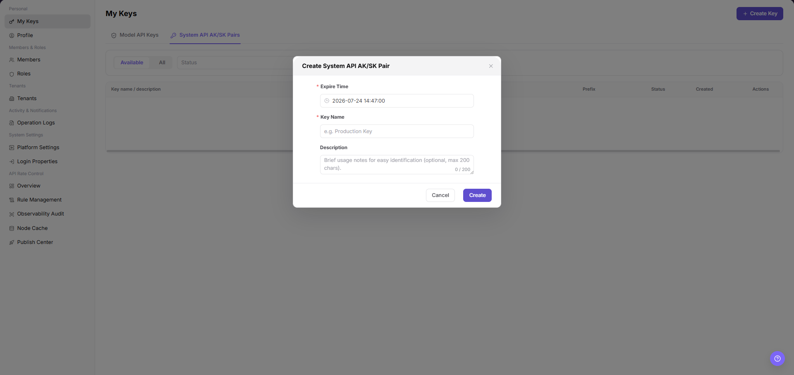

# My Keys

::: info Document Information
Version: v1.0
Updated: 2026-07-10
:::

## Feature Overview

`My Keys` is used to view, filter, and maintain my keys information. It helps operator admin work with my keys records and related status from a consistent page entry.

| Item | Content |
| --- | --- |
| Applicable role | Operator admin |
| Navigation path | Settings > Personal > My Keys |
| Page route | `/user/user-space/my-keys` |
| Managed objects | My Keys records and related status |
| Typical use | View, filter, and maintain my keys information |

#### Beginner Explanation

My Keys is part of the settings and access-control workspace. Treat it as a place to confirm identities, permissions, organization rules, audit records, or rate-control status before changing configuration.

#### Terms Quick Reference

| Term | Meaning | Handling tip |
| --- | --- | --- |
| Member | A user account that belongs to an organization or team. | Check role and status before troubleshooting access. |
| Role | A permission set assigned to members. | Use least privilege and review scope before changes. |
| Operation log | An audit record of user or platform actions. | Use it to trace risky or abnormal operations. |
| API rate control rule | A policy that limits API request patterns. | Publish and verify rules carefully. |

## Prerequisites

1. The current account can access `Personal > My Keys`.
2. The target organization, member, customer, billing cycle, rule, or record scope has been confirmed.
3. Required upstream data is already available and the page has finished loading.
4. For high-risk changes, confirm the impact scope and rollback path before continuing.

## Page Description

The page usually includes filters, summary cards, data tables, detail entries, status fields, and related operation buttons for my keys records and related status.

| Area | Description |
| --- | --- |
| Filters | Narrow records by keyword, status, time range, organization, customer, member, or billing cycle. |
| Summary area | Displays key balances, counts, trends, warnings, or processing progress when available. |
| List or table | Shows records, statuses, timestamps, owners, amounts, and row-level actions. |
| Details or dialog | Provides more context before follow-up operations. |

The following screenshot shows my keys.

## Main Operations

Use the following operations to work with my keys records and related status. Complete view-only checks before opening dialogs that may create, save, submit, activate, transfer, settle, publish, or delete data.

### Create Model API Key

1. Go to `Settings > Personal > My Keys`.
2. Click `Create Key` in the upper-right corner of the page.
3. In the `Create Model API Key` dialog, fill in `Expire Time`, `Key Name`, and `Description`.
4. In `Reset Cycle`, select `Monthly` or `Weekly`. When `Monthly` is selected, verify `Day of Month`.
5. To limit this key separately, enable `Enable Limit`, then fill in `Period Limit (credits)` and `Warning Threshold (%)`.
6. In `When Limit Reached`, select the handling policy: `Stop Immediately` rejects calls after the quota is reached; `Warn & Continue` keeps calls running and records warnings.
7. Before clicking the final `Create`, verify the purpose, quota, reset cycle, and limit-reached policy again.
8. For learning or screenshots only, view the fields and click `Cancel`. Do not create a real key.

### Create System API AK/SK Pair

1. Go to `Settings > Personal > My Keys`.
2. Switch to the `System API AK/SK Pairs` tab.
3. Click `Create System API AK/SK Pair` or the actual create entry on the page.
4. In the creation dialog, review the fields.

5. Fill in name, description, expiration time, permissions, or quota-related settings according to the page fields.
6. Before clicking the final `Create` or `Confirm`, verify the AK/SK purpose, permission scope, validity period, and credential handoff method.
7. For learning or screenshots only, view the fields and click `Cancel` to close the dialog without submitting real configuration.

## Parameter Reference

| Field Name | Required | Field Type | Example | Description |
| --- | --- | --- | --- | --- |
| Expire Time | No | Date time | `2026-12-31 23:59` | Defines when the Model API Key or System API AK/SK Pair expires. |
| Key Name | Yes | Text | `Production Key` | Identifies the purpose of the key. |
| Name | Yes | Text | `Backend job credential` | Identifies the purpose of the System API AK/SK Pair. |
| Description | No | Text | `Model service calls` | Describes the key usage for later identification. |
| Reset Cycle | Yes | Enum | `Monthly` | Defines when key usage is reset. |
| Day of Month | Conditionally required | Number | `1` | Required when `Reset Cycle` is `Monthly`. |
| Enable Limit | No | Switch | `Enabled` | Enables a period quota for this key. |
| Period Limit (credits) | Conditionally required | Number | `1000` | The quota value used after `Enable Limit` is enabled. |
| Warning Threshold (%) | No | Number | `80` | Triggers warning when usage reaches the threshold. |
| When Limit Reached | Yes | Enum | `Stop Immediately` | Defines how calls are handled after the quota is reached. |
| AK | System generated | Text | `AK example prefix` | The System API access identifier. Save it only through the platform security process. |
| SK | System generated | Secret | `Only displayed after creation` | The System API secret key. Do not write it into documentation, screenshots, or tickets. |
| Permission Scope | Yes | Enum / Multi-select | `Read-only APIs` | Controls which system APIs the AK/SK can call. |
| Status | System generated | Enum | `Enabled` | Indicates whether the key can continue to call services. |
| Actions | System generated | Button | `View` | Opens details or follow-up operations. |

## Pitfalls

- Creating a Model API Key generates a real credential that can call model services.
- A System API AK/SK Pair generates credentials for system API calls, and its permission scope is usually more sensitive than a normal calling key.
- `Create` and `Confirm` are final high-risk actions. Do not click them during learning, screenshots, or page validation.
- `Stop Immediately` rejects calls after the quota is reached; `Warn & Continue` keeps calls running and records warnings.
- Complete Keys and AK/SK pairs may only be saved once through controlled channels. Do not write them into documentation, screenshots, tickets, or examples.
- Do not write real Keys, AK/SK, tokens, accounts, endpoints, customer names, or internal test parameters.

## Result Validation

| Check Item | Success Signal | If Abnormal |
| --- | --- | --- |
| Page access | The `Personal > My Keys` page opens and data loads normally. | Check role permissions and refresh the page. |
| Filter result | The list changes according to the selected filters. | Reset filters and search again. |
| Record detail | Details, status, amount, permission, or configuration values are visible. | Confirm the record scope and permissions. |
| Follow-up path | Related pages or dialogs can be opened from visible entries. | Return to the sidebar and enter the downstream page directly. |
| Create dialog | Clicking `Create Key` opens the `Create Model API Key` dialog. | Check whether the current account has key creation permission. |
| AK/SK creation dialog | After switching to `System API AK/SK Pairs`, the creation dialog can be opened. | Check whether the current account has System API credential creation permission. |

## FAQ

#### Target settings entry is not visible in My Keys

The expected account, project, member, role, organization, key, operation log, system configuration, or API rate-control entry does not appear on this page.

**How to check:**

1. Confirm the current tenant, organization, project, role, and account permission scope.
2. Check page filters such as keyword, status, project, member, role, organization, time range, and configuration type.
3. Verify that prerequisite objects, such as projects, members, roles, keys, or system configurations, have been created and enabled.
4. If the entry was just changed, refresh the page and compare it with operation logs or related settings pages.

#### Configuration change does not take effect in My Keys

A permission, project, role, key, notification, system setting, or rate-control change was submitted, but the page or downstream behavior still shows the old result.

**How to check:**

1. Confirm that the save operation completed and the target object status is enabled or active.
2. Check whether the change applies to the correct organization, project, member, role, API key, or policy scope.
3. Compare downstream behavior with operation logs and related settings pages to rule out cache, permission, or synchronization delay.
4. For security-sensitive settings, verify impact scope before repeating the operation or escalating with desensitized page paths and timestamps.

#### Why is the target Key missing from operator Keys?

Check the current tenant, organization, project, role permissions, object status, feature switch, and operation logs. Do not repeat save, submit, publish, rollback, disable, or delete actions until the scope and impact are confirmed.

## Next Steps

1. Recheck the affected users, organizations, projects, roles, keys, policies, or configuration objects.
2. Verify operation logs and downstream behavior after the configuration is saved or refreshed.
3. Keep only desensitized page paths, timestamps, object names, and status values when escalating.

## Notes

- Permission, Key, login, organization, and rate-control changes can affect real users. Confirm scope before changes.
- Keep page routes, API fields, Key, AK/SK, License, and other product terms in their UI form.
- Keep credentials, private operational details, and sensitive customer data out of the manual.
- Do not include real Keys, AK/SK, tokens, accounts, endpoints, customer names, or internal test parameters in documentation, screenshots, tickets, or examples.
- A System API AK/SK Pair generates credentials for system API calls. AK/SK values may only be saved once through controlled channels.
- `Create` and `Confirm` are final high-risk actions.
