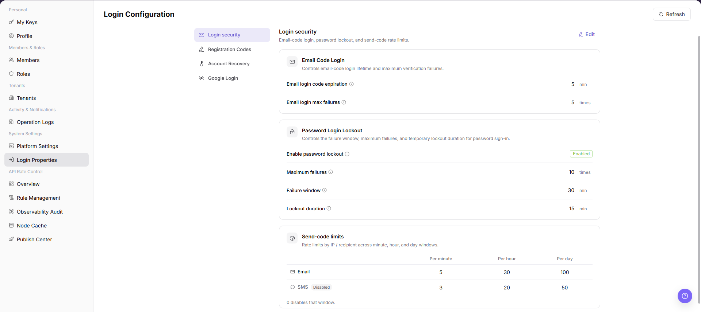
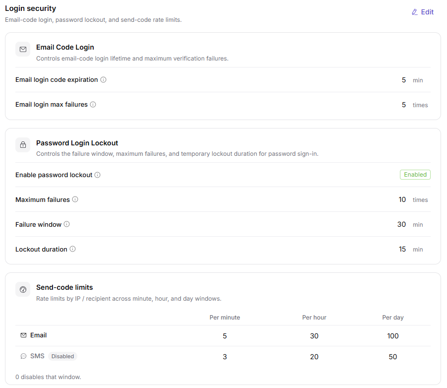
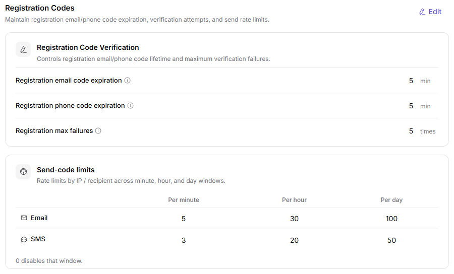
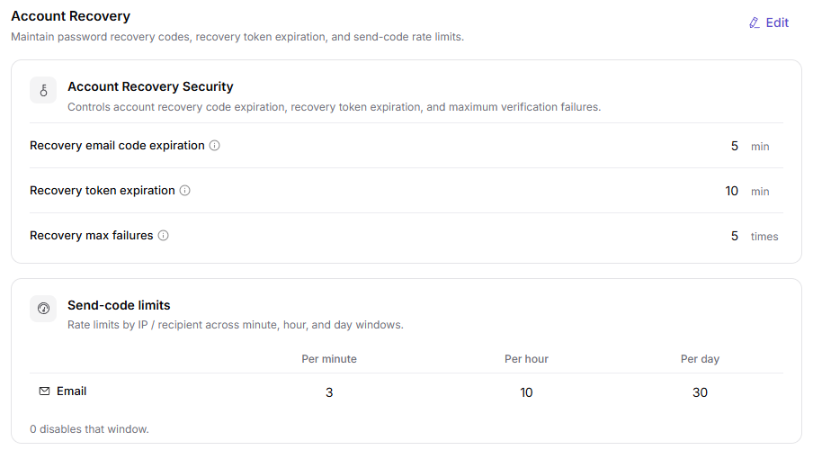
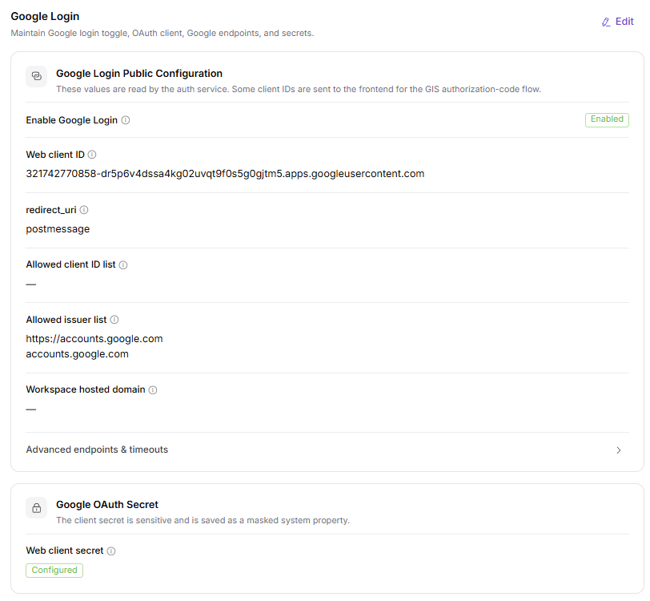

# Login Properties

::: info Document Information
Version: v1.0
Updated: 2026-07-10
:::

## Feature Overview

`Login Properties` is used to view, filter, and maintain login properties information. It helps operator admin work with login properties records and related status from a consistent page entry.

| Item | Content |
| --- | --- |
| Applicable role | Operator admin |
| Navigation path | Settings > System Settings > Login Properties |
| Page route | `/user/system/login-properties` |
| Managed objects | Login Properties records and related status |
| Typical use | View, filter, and maintain login properties information |

#### Beginner Explanation

Login Properties is part of the settings and access-control workspace. Treat it as a place to confirm identities, permissions, organization rules, audit records, or rate-control status before changing configuration.

#### Terms Quick Reference

| Term | Meaning | Handling tip |
| --- | --- | --- |
| Member | A user account that belongs to an organization or team. | Check role and status before troubleshooting access. |
| Role | A permission set assigned to members. | Use least privilege and review scope before changes. |
| Operation log | An audit record of user or platform actions. | Use it to trace risky or abnormal operations. |
| API rate control rule | A policy that limits API request patterns. | Publish and verify rules carefully. |

## Prerequisites

1. The current account can access `System Settings > Login Properties`.
2. The target organization, member, customer, billing cycle, rule, or record scope has been confirmed.
3. Required upstream data is already available and the page has finished loading.
4. For high-risk changes, confirm the impact scope and rollback path before continuing.

## Page Description

The page usually includes filters, summary cards, data tables, detail entries, status fields, and related operation buttons for login properties records and related status.

| Area | Description |
| --- | --- |
| Filters | Narrow records by keyword, status, time range, organization, customer, member, or billing cycle. |
| Summary area | Displays key balances, counts, trends, warnings, or processing progress when available. |
| List or table | Shows records, statuses, timestamps, owners, amounts, and row-level actions. |
| Details or dialog | Provides more context before follow-up operations. |

The following screenshot shows login properties.

## Main Operations

Use the following operations to work with login properties records and related status. Complete view-only checks before opening dialogs that may create, save, submit, activate, transfer, settle, publish, or delete data.

### Login Security Configuration

1. Go to `System Settings > Login Properties`.
2. Click or locate `Login Security`.
3. Review password policy, login restrictions, session validity, MFA, or security verification settings.

### Registration Verification Code Configuration

1. Go to `System Settings > Login Properties`.
2. Locate `Registration Verification Code`.
3. Review verification code type, sending method, validity period, rate limits, and enabled status.

### Account Recovery Configuration

1. Go to `System Settings > Login Properties`.
2. Locate `Account Recovery`.
3. Review email, phone, verification code, identity verification, and recovery flow settings.

### Google Login Configuration

1. Go to `System Settings > Login Properties`.
2. Locate `Google Login`.
3. Review Client ID, callback URL, enabled status, and login entry settings.

## Parameter Reference

| Field | Required | Type | Example | Description |
| --- | --- | --- | --- | --- |
| Configuration Category | System displayed | Text | `Login Security` | The configuration group in login properties. |
| Configuration Item | System displayed | Text | `Verification Code Validity Period` | The login policy parameter to view or maintain. |
| Default Value | System displayed | Text | `5 minutes` | The default or system-provided value of the configuration item. |
| Current Value | System displayed / Editable | Text | `5 minutes` | The currently effective configuration value. |
| Enabled Status | System displayed / Editable | Enum | `Enabled` | Indicates whether the configuration item or login capability is enabled. |
| Save | Operation button | Button | `Save` | Saves the current login configuration change. |
| Reset | Operation button | Button | `Reset` | Restores the configuration to the default value or last saved state. |
| Actions | System generated | Button / link | `Edit / Enable / Disable` | Provides login configuration view or maintenance entries. |

## Pitfalls

- Do not change roles, members, login policies, Keys, or API rate-control rules without confirming the affected users and systems.
- UI entries can differ by role and organization scope; verify the current account context before troubleshooting.
- Never copy complete Keys, AK/SK, tokens, or secrets into documentation, tickets, or screenshots.
- Login properties affect user sign-in, registration, account recovery, verification code delivery, and third-party login entries.
- `Save`, `Reset`, `Enable`, and `Disable` are high-risk actions.
- Client Secret, callback URLs, internal domains, test accounts, and tokens in Google Login configuration must not be written into documentation or screenshots.
- For learning or screenshots, only view configuration items and do not submit real configuration changes.

## Result Validation

| Check item | Success signal | If abnormal |
| --- | --- | --- |
| Page access | The `System Settings > Login Properties` page opens and data loads normally. | Check role permissions and refresh the page. |
| Filter result | The list changes according to the selected filters. | Reset filters and search again. |
| Record detail | Details, status, amount, permission, or configuration values are visible. | Confirm the record scope and permissions. |
| Follow-up path | Related pages or dialogs can be opened from visible entries. | Return to the sidebar and enter the downstream page directly. |
| Screenshots | Login security, registration verification code, account recovery, and Google Login screenshots render normally. | Check whether image paths exist. |

## FAQ

#### Target settings entry is not visible in Login Properties

The expected account, project, member, role, organization, key, operation log, system configuration, or API rate-control entry does not appear on this page.

**How to check:**

1. Confirm the current tenant, organization, project, role, and account permission scope.
2. Check page filters such as keyword, status, project, member, role, organization, time range, and configuration type.
3. Verify that prerequisite objects, such as projects, members, roles, keys, or system configurations, have been created and enabled.
4. If the entry was just changed, refresh the page and compare it with operation logs or related settings pages.

#### Configuration change does not take effect in Login Properties

A permission, project, role, key, notification, system setting, or rate-control change was submitted, but the page or downstream behavior still shows the old result.

**How to check:**

1. Confirm that the save operation completed and the target object status is enabled or active.
2. Check whether the change applies to the correct organization, project, member, role, API key, or policy scope.
3. Compare downstream behavior with operation logs and related settings pages to rule out cache, permission, or synchronization delay.
4. For security-sensitive settings, verify impact scope before repeating the operation or escalating with desensitized page paths and timestamps.

#### Why does the login configuration not load?

Check the current tenant, organization, project, role permissions, object status, feature switch, and operation logs. Do not repeat save, submit, publish, rollback, disable, or delete actions until the scope and impact are confirmed.

## Next Steps

1. Recheck the affected users, organizations, projects, roles, keys, policies, or configuration objects.
2. Verify operation logs and downstream behavior after the configuration is saved or refreshed.
3. Keep only desensitized page paths, timestamps, object names, and status values when escalating.

## Notes

- Permission, Key, login, organization, and rate-control changes can affect real users. Confirm scope before changes.
- Keep page routes, API fields, Key, AK/SK, License, and other product terms in their UI form.
- Keep credentials, private operational details, and sensitive customer data out of the manual.
- `Save`, `Reset`, `Enable`, and `Disable` are high-risk actions.
- Client Secret, callback URLs, internal domains, test accounts, and tokens in Google Login configuration must not be written into documentation or screenshots.
- For learning or screenshots, only view configuration items and do not submit real configuration changes.
