# Platform Settings

::: info Document Information
Version: v1.0
Updated: 2026-07-10
:::

## Feature Overview

`Platform Settings` is used to view, filter, and maintain platform settings information. It helps operator admin work with platform settings records and related status from a consistent page entry.

| Item | Content |
| --- | --- |
| Applicable role | Operator admin |
| Navigation path | Settings > System Settings > Platform Settings |
| Page route | `/user/system/platform-settings/config` |
| Managed objects | Platform Settings records and related status |
| Typical use | View, filter, and maintain platform settings information |

#### Beginner Explanation

Platform Settings is part of the settings and access-control workspace. Treat it as a place to confirm identities, permissions, organization rules, audit records, or rate-control status before changing configuration.

#### Terms Quick Reference

| Term | Meaning | Handling tip |
| --- | --- | --- |
| Member | A user account that belongs to an organization or team. | Check role and status before troubleshooting access. |
| Role | A permission set assigned to members. | Use least privilege and review scope before changes. |
| Operation log | An audit record of user or platform actions. | Use it to trace risky or abnormal operations. |
| API rate control rule | A policy that limits API request patterns. | Publish and verify rules carefully. |

## Prerequisites

1. The current account can access `System Settings > Platform Settings`.
2. The target organization, member, customer, billing cycle, rule, or record scope has been confirmed.
3. Required upstream data is already available and the page has finished loading.
4. For high-risk changes, confirm the impact scope and rollback path before continuing.

## Page Description

The page usually includes filters, summary cards, data tables, detail entries, status fields, and related operation buttons for platform settings records and related status.

| Area | Description |
| --- | --- |
| Filters | Narrow records by keyword, status, time range, organization, customer, member, or billing cycle. |
| Summary area | Displays key balances, counts, trends, warnings, or processing progress when available. |
| List or table | Shows records, statuses, timestamps, owners, amounts, and row-level actions. |
| Details or dialog | Provides more context before follow-up operations. |

The following screenshot shows platform settings.

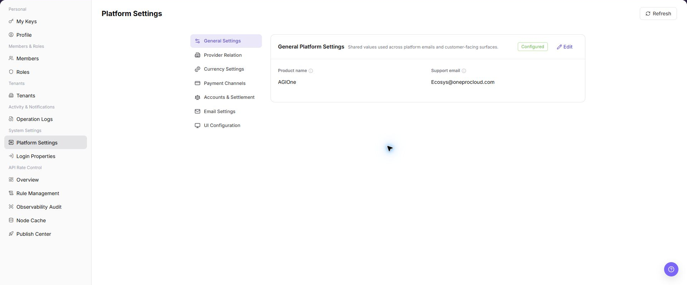

## Main Operations

Use the following operations to work with platform settings records and related status. Complete view-only checks before opening dialogs that may create, save, submit, activate, transfer, settle, publish, or delete data.

### General Configuration

1. Go to `Settings > System Settings > Platform Settings`.
2. Click `General Configuration`.
3. Review general platform display and shared settings.

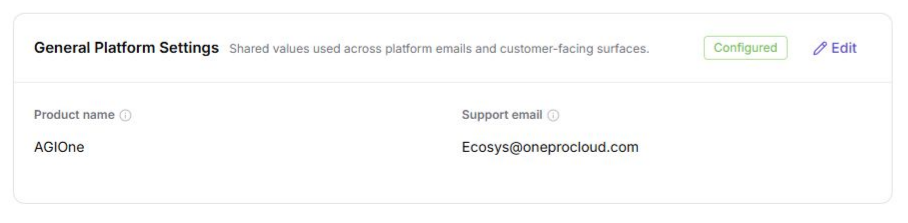

### Provider Relationship Configuration

1. Go to `Settings > System Settings > Platform Settings`.
2. Click `Provider Relationship`.
3. Review provider relationships, enabled status, and settlement ownership settings.

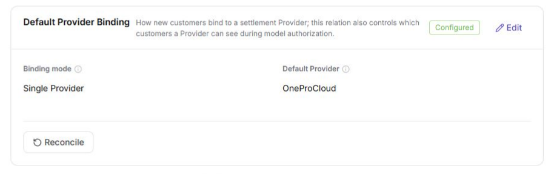

::: details Additional screenshot file

:::

### Currency Settings

1. Go to `Settings > System Settings > Platform Settings`.
2. Click `Currency Settings`.
3. Review default currency, display rules, precision, or conversion-related settings.

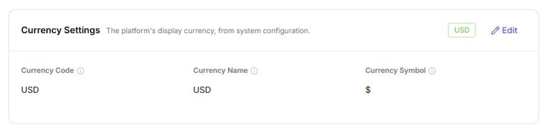

### Payment Channel Configuration

1. Go to `Settings > System Settings > Platform Settings`.
2. Click `Payment Channel`.
3. Review payment channel list, enabled status, and available maintenance entries.

::: details Additional screenshot file
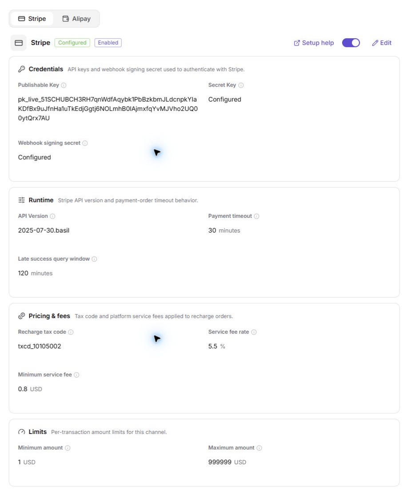
:::

4. In the Stripe area, click `Setup Help` to review required fields and integration guidance.

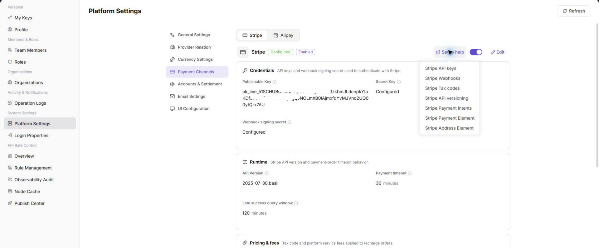

5. Click Stripe `Edit`, and use placeholders to fill in or verify `<stripe_publishable_key>`, `<stripe_secret_key>`, `<stripe_webhook_signing_secret>`, and related fields.

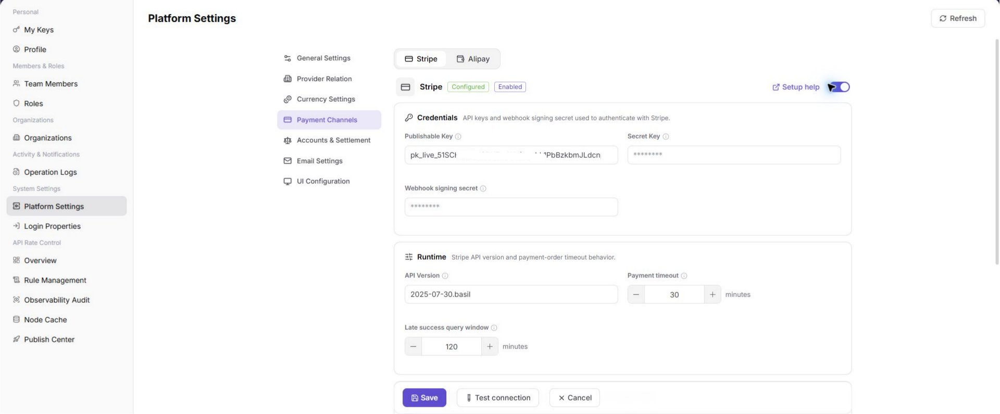

6. Before clicking `Test Connection` for Stripe, confirm that no real transaction or production callback will be triggered.

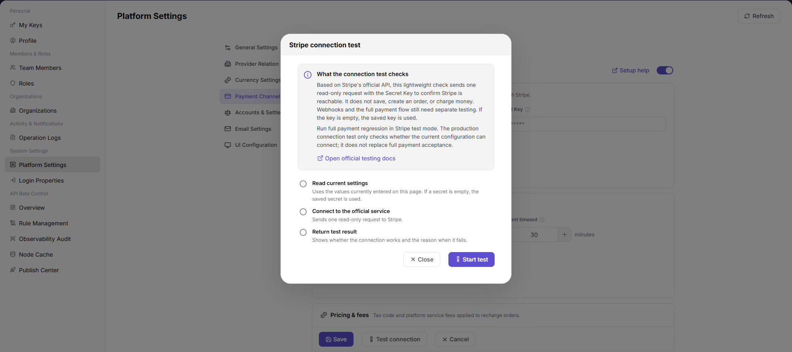

7. In the Alipay area, click `Setup Help` to review application, private key, and public key requirements.

8. Click Alipay `Edit`, and use placeholders to fill in or verify `<alipay_app_id>`, `<alipay_app_private_key>`, `<alipay_public_key>`, and related fields.

9. Before clicking `Test Connection` for Alipay, confirm that no real payment or production callback will be triggered.

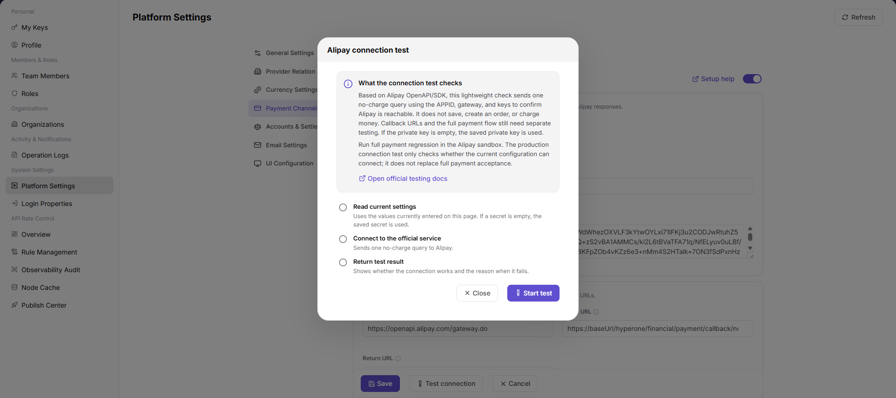

10. Before clicking `Save`, verify credential source, permission scope, callback address, settlement impact, and rollback plan.
11. For learning or screenshots only, view setup help, edit pages, and test connection entries without submitting real payment channel configuration.

### Account and Settlement Configuration

1. Go to `Settings > System Settings > Platform Settings`.
2. Click `Account and Settlement`.
3. Review account, settlement cycle, recharge, or credits-related parameters.

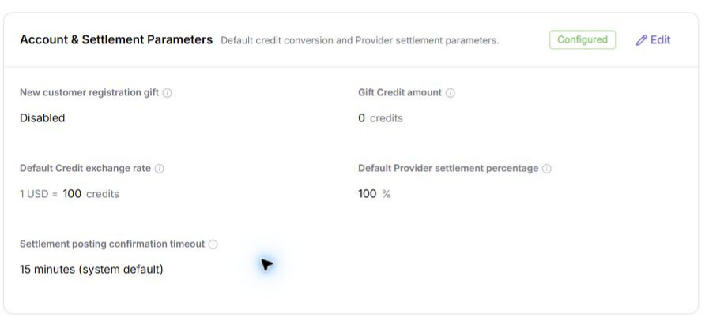

### Email Settings

1. Go to `Settings > System Settings > Platform Settings`.
2. Click `Email Settings`.
3. Review mail service, sender configuration, notification templates, or verification email settings.

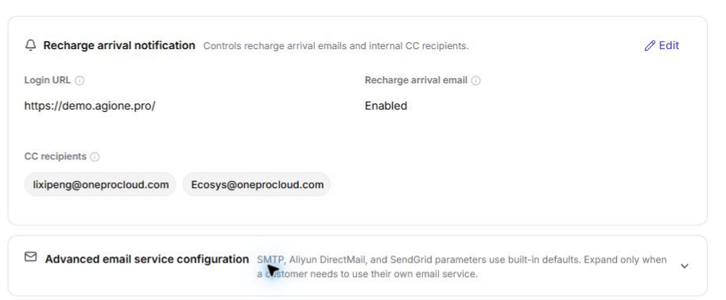

### UI Configuration

1. Go to `Settings > System Settings > Platform Settings`.
2. Click `UI Configuration`.
3. Review login page, platform identity, theme, or display-related settings.

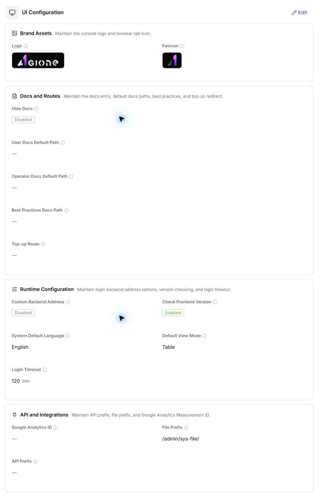

## Parameter Reference

| Field Name | Required | Field Type | Example | Description |
| --- | --- | --- | --- | --- |
| Configuration Category | System displayed | Text | `General Configuration` | The configuration group in platform settings. |
| Configuration Item | System displayed | Text | `Default Currency` | The system parameter to view or maintain. |
| Default Value | System displayed | Text | `USD` | The default or system-provided value of the configuration item. |
| Current Value | System displayed / Editable | Text | `USD` | The currently effective configuration value. |
| Enabled Status | System displayed / Editable | Enum | `Enabled` | Indicates whether the configuration item or capability is enabled. |
| Test Connection | Operation button | Button | `Test Connection` | Verifies connectivity for email, payment, or external service configuration. |
| Save | Operation button | Button | `Save` | Saves the current configuration change. |
| Reset | Operation button | Button | `Reset` | Restores the configuration to the default value or last saved state. |
| Actions | System generated | Button / link | `Edit / Enable / Disable` | Provides configuration view or maintenance entries. |

## Pitfalls

- Do not change roles, members, login policies, Keys, or API rate-control rules without confirming the affected users and systems.
- UI entries can differ by role and organization scope; verify the current account context before troubleshooting.
- Never copy complete Keys, AK/SK, tokens, or secrets into documentation, tickets, or screenshots.
- Platform settings affect sign-in, display, provider relationships, currencies, payment, billing, settlement, email notifications, and user-visible UI.
- `Save`, `Reset`, `Enable`, `Disable`, and `Test Connection` are high-risk actions.
- For learning or screenshots, only view configuration items and do not submit real configuration changes.
- Stripe / Alipay keys, private keys, Webhook secrets, SMTP passwords, internal addresses, accounts, tokens, customer names, and settlement parameters must not be written into documentation, screenshots, tickets, or chats.

## Result Validation

| Check Item | Success Signal | If Abnormal |
| --- | --- | --- |
| Page access | The `System Settings > Platform Settings` page opens and data loads normally. | Check role permissions and refresh the page. |
| Filter result | The list changes according to the selected filters. | Reset filters and search again. |
| Record detail | Details, status, amount, permission, or configuration values are visible. | Confirm the record scope and permissions. |
| Follow-up path | Related pages or dialogs can be opened from visible entries. | Return to the sidebar and enter the downstream page directly. |
| Screenshots | General configuration, provider relationship, currency settings, payment channel, account and settlement, email settings, and UI configuration screenshots render normally. | Check whether image paths exist. |

## FAQ

#### Target settings entry is not visible in Platform Settings

The expected account, project, member, role, organization, key, operation log, system configuration, or API rate-control entry does not appear on this page.

**How to check:**

1. Confirm the current tenant, organization, project, role, and account permission scope.
2. Check page filters such as keyword, status, project, member, role, organization, time range, and configuration type.
3. Verify that prerequisite objects, such as projects, members, roles, keys, or system configurations, have been created and enabled.
4. If the entry was just changed, refresh the page and compare it with operation logs or related settings pages.

#### Configuration change does not take effect in Platform Settings

A permission, project, role, key, notification, system setting, or rate-control change was submitted, but the page or downstream behavior still shows the old result.

**How to check:**

1. Confirm that the save operation completed and the target object status is enabled or active.
2. Check whether the change applies to the correct organization, project, member, role, API key, or policy scope.
3. Compare downstream behavior with operation logs and related settings pages to rule out cache, permission, or synchronization delay.
4. For security-sensitive settings, verify impact scope before repeating the operation or escalating with desensitized page paths and timestamps.

#### Why is the platform configuration save button unavailable?

Check the current tenant, organization, project, role permissions, object status, feature switch, and operation logs. Do not repeat save, submit, publish, rollback, disable, or delete actions until the scope and impact are confirmed.

## Next Steps

1. Recheck the affected users, organizations, projects, roles, keys, policies, or configuration objects.
2. Verify operation logs and downstream behavior after the configuration is saved or refreshed.
3. Keep only desensitized page paths, timestamps, object names, and status values when escalating.

## Notes

- Permission, Key, login, organization, and rate-control changes can affect real users. Confirm scope before changes.
- Keep page routes, API fields, Key, AK/SK, License, and other product terms in their UI form.
- Keep credentials, private operational details, and sensitive customer data out of the manual.
- `Save`, `Reset`, `Enable`, `Disable`, and `Test Connection` are high-risk actions.
- For learning or screenshots, only view configuration items and do not submit real configuration changes.
- Stripe / Alipay keys, private keys, Webhook secrets, SMTP passwords, internal addresses, accounts, tokens, customer names, and settlement parameters must not be written into documentation, screenshots, tickets, or chats.
