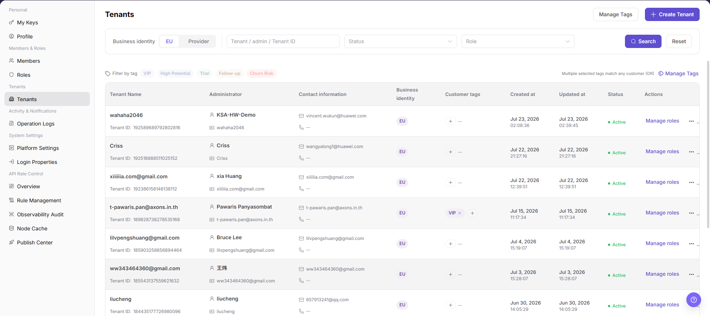
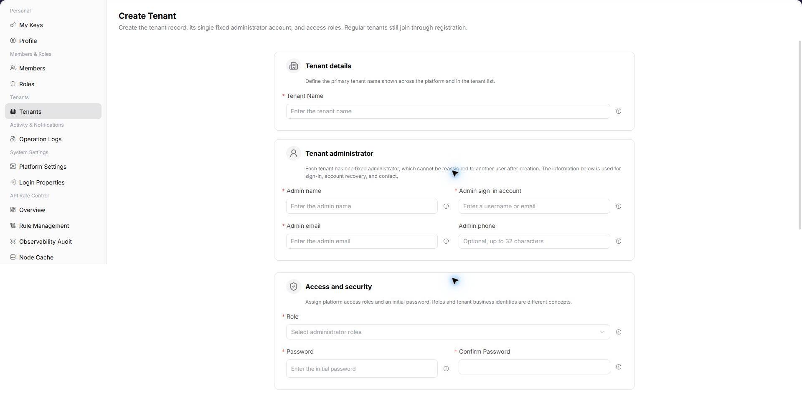

# Tenants

::: info Document Information
Version: v1.0
Updated: 2026-07-10
:::

## Feature Overview

`Tenants` is used to view, filter, and maintain tenants information. It helps operator admin work with tenants records and related status from a consistent page entry.

| Item | Content |
| --- | --- |
| Applicable role | Operator admin |
| Navigation path | Settings > Tenants > Tenants |
| Page route | `/user/tenant` |
| Managed objects | Tenant records and related status |
| Typical use | View, filter, and maintain tenants information |

#### Beginner Explanation

Tenants is part of the settings and access-control workspace. Treat it as a place to confirm identities, permissions, tenant rules, audit records, or rate-control status before changing configuration.

#### Terms Quick Reference

| Term | Meaning | Handling tip |
| --- | --- | --- |
| Member | A user account that belongs to an organization or team. | Check role and status before troubleshooting access. |
| Role | A permission set assigned to members. | Use least privilege and review scope before changes. |
| Operation log | An audit record of user or platform actions. | Use it to trace risky or abnormal operations. |
| API rate control rule | A policy that limits API request patterns. | Publish and verify rules carefully. |

## Prerequisites

1. The current account can access `Tenants > Tenants`.
2. The target tenant, member, customer, billing cycle, rule, or record scope has been confirmed.
3. Required upstream data is already available and the page has finished loading.
4. For high-risk changes, confirm the impact scope and rollback path before continuing.

## Page Description

The page usually includes filters, summary cards, data tables, detail entries, status fields, and related operation buttons for tenants records and related status.

| Area | Description |
| --- | --- |
| Filters | Narrow records by keyword, status, time range, tenant, customer, member, or billing cycle. |
| Summary area | Displays key balances, counts, trends, warnings, or processing progress when available. |
| List or table | Shows records, statuses, timestamps, owners, amounts, and row-level actions. |
| Details or dialog | Provides more context before follow-up operations. |

The following screenshot shows tenants.

## Main Operations

Use the following operations to work with tenants records and related status. Complete view-only checks before opening dialogs that may create, save, submit, activate, transfer, settle, publish, or delete data.

### Create Tenant

1. Go to `Tenants > Tenants`.
2. Click `Create Tenant` in the upper-right corner of the page.
3. On the `Create Tenant` page, review the tenant creation fields.

4. In `Tenant details`, fill in the required `Tenant Name`.
5. In `Tenant administrator`, fill in `Admin name`, `Admin sign-in account`, and `Admin email`. Fill in `Admin phone` as needed.
6. In `Access and security`, select `Role`, then fill in `Password` and `Confirm Password`.
7. Before final submission, verify the tenant name, administrator account, email, role, and initial password.
8. For learning or screenshots only, view the fields without submitting real tenant configuration.

## Parameter Reference

| Field | Required | Type | Example | Description |
| --- | --- | --- | --- | --- |
| Tenant Name | Yes | Text | `Example Tenant A` | Identifies the tenant entity. |
| Admin name | Yes | Text | `Example Admin` | The display name of the tenant administrator. |
| Admin sign-in account | Yes | Text | `tenant-admin` | The sign-in account of the tenant administrator. |
| Admin email | Yes | Text | `admin@example.com` | The email address of the tenant administrator. |
| Admin phone | No | Text | `188****8888` | The contact number of the tenant administrator. |
| Role | Yes | Dropdown | `Tenant Admin` | Controls the platform access scope of the tenant administrator. |
| Password | Yes | Password | `******` | The initial password of the tenant administrator. |
| Confirm Password | Yes | Password | `******` | Re-entered password used to confirm both password entries match. |
| Status | System generated | Enum | `Enabled` | Indicates whether the tenant is available. |
| Actions | System generated | Button / link | `Manage Roles / Manage Tags` | Provides tenant maintenance entry points. |

## Pitfalls

- Do not change roles, members, login policies, Keys, or API rate-control rules without confirming the affected users and systems.
- UI entries can differ by role and tenant scope; verify the current account context before troubleshooting.
- Never copy complete Keys, AK/SK, tokens, or secrets into documentation, tickets, or screenshots.
- Creating a tenant creates a real tenant entity and a fixed administrator account.
- Initial passwords, administrator emails, and phone numbers are sensitive information. Do not write them into documentation or screenshots.
- Role selection affects the platform access scope of the tenant administrator.
- Final submission is a high-risk action. Do not submit real tenant configuration during learning or screenshots.

## Result Validation

| Check item | Success signal | If abnormal |
| --- | --- | --- |
| Page access | The `Tenants > Tenants` page opens and data loads normally. | Check role permissions and refresh the page. |
| Filter result | The list changes according to the selected filters. | Reset filters and search again. |
| Record detail | Details, status, amount, permission, or configuration values are visible. | Confirm the record scope and permissions. |
| Follow-up path | Related pages or dialogs can be opened from visible entries. | Return to the sidebar and enter the downstream page directly. |
| Create page | Clicking `Create Tenant` opens the same-name creation page. | Check whether the current account has tenant creation permission. |
| Learning exit | Real tenant configuration is not submitted when only reviewing fields. | Refresh the list and confirm no test tenant was added. |

## FAQ

#### Target settings entry is not visible in Tenants

The expected account, project, member, role, organization, key, operation log, system configuration, or API rate-control entry does not appear on this page.

**How to check:**

1. Confirm the current tenant, organization, project, role, and account permission scope.
2. Check page filters such as keyword, status, project, member, role, organization, time range, and configuration type.
3. Verify that prerequisite objects, such as projects, members, roles, keys, or system configurations, have been created and enabled.
4. If the entry was just changed, refresh the page and compare it with operation logs or related settings pages.

#### Configuration change does not take effect in Tenants

A permission, project, role, key, notification, system setting, or rate-control change was submitted, but the page or downstream behavior still shows the old result.

**How to check:**

1. Confirm that the save operation completed and the target object status is enabled or active.
2. Check whether the change applies to the correct organization, project, member, role, API key, or policy scope.
3. Compare downstream behavior with operation logs and related settings pages to rule out cache, permission, or synchronization delay.
4. For security-sensitive settings, verify impact scope before repeating the operation or escalating with desensitized page paths and timestamps.

#### Why is the target tenant missing from the tenant list?

Check the current tenant, organization, project, role permissions, object status, feature switch, and operation logs. Do not repeat save, submit, publish, rollback, disable, or delete actions until the scope and impact are confirmed.

## Next Steps

1. Recheck the affected users, tenants, projects, roles, keys, policies, or configuration objects.
2. Verify operation logs and downstream behavior after the configuration is saved or refreshed.
3. Keep only desensitized page paths, timestamps, object names, and status values when escalating.

## Notes

- Permission, Key, login, tenant, and rate-control changes can affect real users. Confirm scope before changes.
- Keep page routes, API fields, Key, AK/SK, License, and other product terms in their UI form.
- Keep credentials, private operational details, and sensitive customer data out of the manual.
- Creating a tenant creates a real tenant entity and a fixed administrator account.
- Initial passwords, administrator emails, and phone numbers are sensitive information. Do not write them into documentation or screenshots.
- Final submission is a high-risk action. Do not submit real tenant configuration during learning or screenshots.
