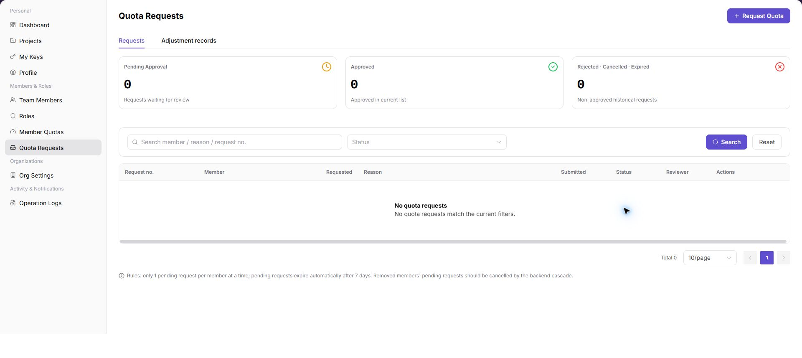
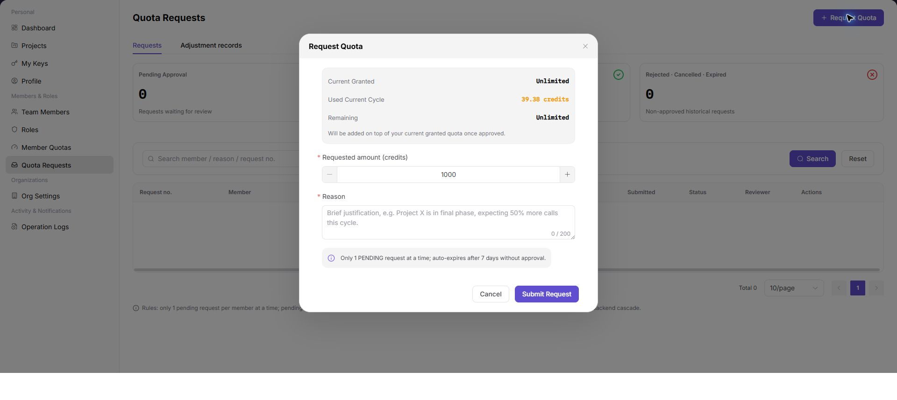

# Quota Requests

::: info Document Information
Version: v1.0
Updated: 2026-07-13
:::

## Feature Overview

`Quota Requests` is used to view, filter, and maintain quota requests information. It helps provider admin or provider account work with quota requests records and related status from a consistent page entry.

| Item | Content |
| --- | --- |
| Applicable role | Provider admin or provider account |
| Navigation path | Members & Roles > Quota Requests |
| Page route | /user/members-roles/quota-requests |
| Managed objects | Quota Requests records and related status |
| Typical use | View, filter, and maintain quota requests information |

### Beginner Explanation

Quota Requests is part of the settings and access-control workspace. Treat it as a place to confirm identities, permissions, organization rules, audit records, or rate-control status before changing configuration.

### Terms Quick Reference

| Term | Meaning | Handling tip |
| --- | --- | --- |
| Member | A user account that belongs to an organization or team. | Check role and status before troubleshooting access. |
| Role | A permission set assigned to members. | Use least privilege and review scope before changes. |
| Operation log | An audit record of user or platform actions. | Use it to trace risky or abnormal operations. |
| API rate control rule | A policy that limits API request patterns. | Publish and verify rules carefully. |

## Prerequisites

1. The current account can access `Members & Roles > Quota Requests`.
2. The target organization, member, customer, billing cycle, rule, or record scope has been confirmed.
3. Required upstream data is already available and the page has finished loading.
4. For high-risk changes, confirm the impact scope and rollback path before continuing.

## Page Description

The page usually includes filters, summary cards, data tables, detail entries, status fields, and related operation buttons for quota requests records and related status.

| Area | Description |
| --- | --- |
| Filters | Narrow records by keyword, status, time range, organization, customer, member, or billing cycle. |
| Summary area | Displays key balances, counts, trends, warnings, or processing progress when available. |
| List or table | Shows records, statuses, timestamps, owners, amounts, and row-level actions. |
| Details or dialog | Provides more context before follow-up operations. |

The following screenshot shows quota requests list.

The following screenshot shows request quota.

## Main Operations

Use the following operations to work with quota requests records and related status. Complete view-only checks before opening dialogs that may create, save, submit, activate, transfer, settle, publish, or delete data.

### Manage Quota Requests

1. Go to `Members & Roles > Quota Requests`.
2. Use filters or tabs to locate the target record.
3. Select the target row or entry related to quota requests records and related status.
4. Click the visible `Manage Quota Requests` entry when it is available.
5. Before confirming any high-risk dialog, review the affected scope, amount, permission, or configuration and cancel if the impact is unclear.

## Parameters

| Field | Required | Type | Example | Description |
| --- | --- | --- | --- | --- |
| Keyword or name | No | Text | `Example name` | Used to locate a specific record. |
| Status | No | Enum | `Enabled` | Used to determine the current processing or availability state. |
| Time range or billing cycle | No | Date / Month | `2026-07` | Used to narrow statistics, logs, bills, or settlements. |
| Organization / customer / member | No | Text | `Example organization` | Used to identify the business ownership scope. |
| Operation | System generated | Button / link | `View Details` | Provides row-level entry points for follow-up checks. |

## Pitfalls

- Do not change roles, members, login policies, Keys, or API rate-control rules without confirming the affected users and systems.
- UI entries can differ by role and organization scope; verify the current account context before troubleshooting.
- Never copy complete Keys, AK/SK, tokens, or secrets into documentation, tickets, or screenshots.

## Result Checks

| Check item | Success signal | If abnormal |
| --- | --- | --- |
| Page access | The `Members & Roles > Quota Requests` page opens and data loads normally. | Check role permissions and refresh the page. |
| Filter result | The list changes according to the selected filters. | Reset filters and search again. |
| Record detail | Details, status, amount, permission, or configuration values are visible. | Confirm the record scope and permissions. |
| Follow-up path | Related pages or dialogs can be opened from visible entries. | Return to the sidebar and enter the downstream page directly. |

## FAQ

### The Action Button Is Unavailable

**Issue Symptom:**

The expected result is not visible on the `Quota Requests` page, or the available action does not match the current business expectation.

**Possible Causes:**

- The current role, organization scope, status filter, time range, or billing cycle does not match the target record.
- Upstream data, permissions, synchronization, or review status has not finished updating.
- The action may be restricted because it affects quota requests records and related status.

**Handling:**

1. Reset filters and search again from `Members & Roles > Quota Requests`.
2. Open the target detail page and verify status, owner, time range, and related fields.
3. If the issue remains, provide desensitized page route, record ID, time range, and symptom summary for troubleshooting.

### Cannot Find the Target Data

**Issue Symptom:**

The expected result is not visible on the `Quota Requests` page, or the available action does not match the current business expectation.

**Possible Causes:**

- The current role, organization scope, status filter, time range, or billing cycle does not match the target record.
- Upstream data, permissions, synchronization, or review status has not finished updating.
- The action may be restricted because it affects quota requests records and related status.

**Handling:**

1. Reset filters and search again from `Members & Roles > Quota Requests`.
2. Open the target detail page and verify status, owner, time range, and related fields.
3. If the issue remains, provide desensitized page route, record ID, time range, and symptom summary for troubleshooting.

### The Action Button Is Unavailable

**Issue Symptom:**

The expected result is not visible on the `Quota Requests` page, or the available action does not match the current business expectation.

**Possible Causes:**

- The current role, organization scope, status filter, time range, or billing cycle does not match the target record.
- Upstream data, permissions, synchronization, or review status has not finished updating.
- The action may be restricted because it affects quota requests records and related status.

**Handling:**

1. Reset filters and search again from `Members & Roles > Quota Requests`.
2. Open the target detail page and verify status, owner, time range, and related fields.
3. If the issue remains, provide desensitized page route, record ID, time range, and symptom summary for troubleshooting.

## Next Steps

1. Open the related member, role, organization, operation log, or API rate-control page based on the issue.
2. Recheck permissions and audit records after configuration changes.
3. Escalate with desensitized account, organization, page route, time range, and issue symptom when needed.

## Notes

- Permission, Key, login, organization, and rate-control changes can affect real users. Confirm scope before changes.
- Keep page routes, API fields, Key, AK/SK, License, and other product terms in their UI form.
- Keep credentials, private operational details, and sensitive customer data out of the manual.
