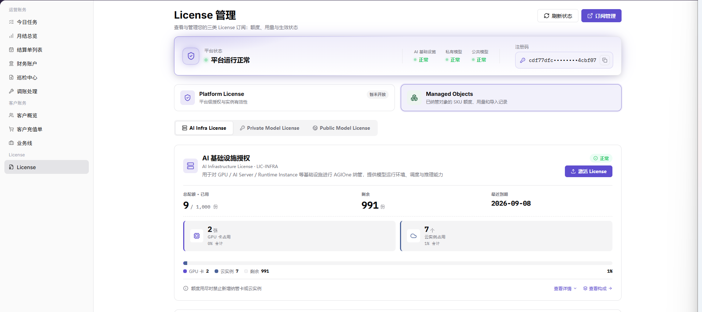
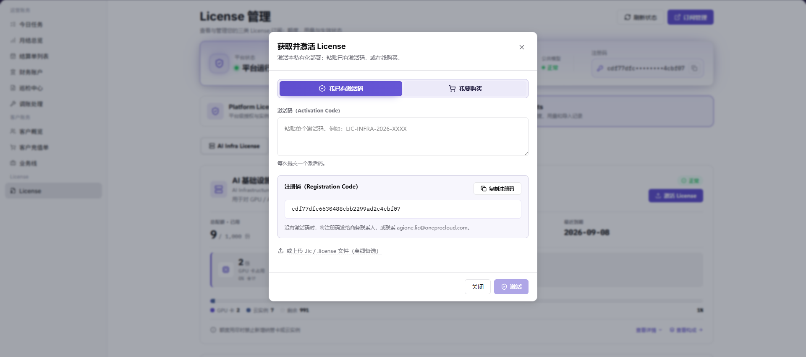

# License 激活

::: info 文档信息
版本：v1.0
更新日期：2026-07-15
:::

## 功能概述

本文说明如何通过 `注册码` 获取 `激活码（Activation Code）`，并在 `License 管理` 页面完成 `AI 基础设施授权` 激活。

该流程适用于需要通过线下或邮件方式获取激活码后再激活 License 的场景。文档只描述操作位置、字段含义和校验方法，不展示任何注册码、激活码或登录凭据的具体值。

## 适用场景

- 首次激活 `AI 基础设施授权`。
- 需要通过线下或邮件方式获取 `Activation Code`。
- License 在线激活不可用，需要使用激活码方式完成授权。
- 授权到期、扩容或重新授权时，需要重新提交注册码并获取新的激活码。

## 前提条件

1. 当前账号具备 `账务` 模块和 `License > License` 页面的访问权限。
2. 当前平台实例已生成可用于申请激活码的 `注册码`。
3. 已确认目标授权区域为 `AI 基础设施授权`。
4. 已准备可接收激活码的线下沟通方式或邮箱。
5. 已确认不会在文档、截图、工单或群聊中暴露完整注册码和激活码。

::: warning 安全提醒
不要在文档、截图、工单或群聊中暴露完整注册码和激活码。激活码通常与当前实例的注册码绑定，不能跨环境复用。点击 `激活` 会影响当前实例授权状态，执行前必须确认当前页面属于目标环境和目标实例。
:::

## 流程总览

| 步骤 | 操作角色 | 操作内容 | 预期结果 |
| --- | --- | --- | --- |
| 1 | operator | 进入 License 管理页面 | 可查看 License 信息 |
| 2 | operator | 复制注册码 | 获取完整注册码 |
| 3 | operator / 支持人员 | 发送注册码并获取激活码 | 收到 Activation Code |
| 4 | operator | 在 AI 基础设施授权处激活 License | 授权状态更新 |
| 5 | operator | 核对授权状态、有效期和额度 | 激活结果可验证 |

## 一、获取注册码

1. 运营方管理员登录平台。
2. 进入 `账务 > License  >License`。
3. 确认页面中可以看到平台状态、License 分类和已纳管对象授权信息。
4. 在 `License 管理` 页面找到 `注册码`。
5. 复制完整注册码。
6. 检查复制内容是否完整，避免缺少字符、额外换行或多余空格。
7. 不要将注册码写入公开文档或截图。

页面截图：



## 二、发送注册码并获取激活码

将注册码通过线下方式或邮件发送给 License 支持人员。

如通过邮件发送，可发送至：

```text
Ecosys@oneprocloud.com
```

邮件中建议包含以下信息：

| 信息 | 说明 |
| --- | --- |
| 注册码 | 从 `License 管理` 页面复制的完整注册码。 |
| 公司或组织名称 | 申请激活码所属的组织。 |
| 联系人 | 便于支持人员回传激活码。 |
| 联系方式 | 邮箱、电话或其他可联系渠道。 |
| 激活场景 | 说明需要激活 `AI 基础设施授权`。 |

收到回复后，获取 `激活码（Activation Code）`。不要将激活码写入公开文档或截图。

## 三、激活 AI 基础设施授权

1. 回到 `账务 > License > License`。
2. 在 `License 管理` 页面找到 `AI 基础设施授权` 区域。
3. 点击 `激活 License`。
4. 在激活窗口中找到 `激活码（Activation Code）` 输入框。
5. 粘贴收到的激活码。
6. 核对激活码内容是否完整。
7. 点击 `激活`。
8. 等待页面返回激活结果。

页面截图：



## 四、核对激活结果

激活完成后，在 `License 管理` 页面核对 `AI 基础设施授权` 的状态、有效期和授权额度。

重点检查：

1. `AI 基础设施授权` 是否显示已激活、有效或平台定义的可用状态。
2. 页面是否显示 License 到期时间或有效期信息。
3. 页面是否显示总额度、已用额度和剩余额度。
4. 激活后页面是否没有错误提示。
5. 如页面状态未立即更新，先刷新页面后重新检查。

## 参数说明

| 参数 | 说明 |
| --- | --- |
| 注册码 | `License 管理` 页面生成的实例标识，用于申请激活码。 |
| 激活码（Activation Code） | 支持人员根据注册码返回的授权激活码。 |
| AI 基础设施授权 | `License 管理` 页面中的授权区域，点击 `激活 License` 后输入激活码。 |
| 有效期 | License 生效后的到期时间或授权有效范围。 |
| 授权额度 | License 可用总额度、已用额度和剩余额度。 |

## 结果校验

| 检查项 | 成功表现 | 异常处理 |
| --- | --- | --- |
| 注册码 | License 管理页面可查看并复制注册码。 | 确认 operator 权限和页面加载状态。 |
| 激活码 | 已通过线下或邮件方式获取 Activation Code。 | 核对发送的注册码是否完整。 |
| 激活操作 | 点击激活后页面无错误提示。 | 检查激活码是否完整、是否匹配当前注册码。 |
| 授权状态 | AI 基础设施授权显示已激活或有效。 | 刷新页面后重新检查，必要时联系支持人员。 |
| 有效期 | 页面显示 License 到期时间或有效期信息。 | 确认激活码是否对应目标实例和目标授权类型。 |
| 总额度 | 页面显示授权总额度。 | 联系支持人员确认激活码对应的授权范围。 |
| 已用额度 | 页面显示当前已使用额度。 | 核对当前已纳管资源数量。 |
| 剩余额度 | 页面显示剩余可用额度。 | 如剩余额度不足，确认是否需要扩容或重新授权。 |

## 常见问题

### 找不到注册码

**问题现象：**

进入 `License 管理` 页面后，没有看到 `注册码`。

**可能原因：**

- 当前账号没有 License 管理权限。
- 页面尚未加载完成。
- 当前实例暂未生成注册码。

**处理方式：**

1. 确认当前账号具备 operator 权限。
2. 刷新 `账务 > License > License` 页面。
3. 如仍未显示，联系平台管理员或 License 支持人员确认实例状态。

### 未收到激活码

**问题现象：**

已发送注册码，但未收到激活码回复。

**可能原因：**

- 注册码未发送完整。
- 邮件信息缺少组织、联系人或激活场景。
- 邮件被拦截或进入垃圾邮件。

**处理方式：**

1. 检查邮件是否已发送至 `Ecosys@oneprocloud.com`。
2. 确认邮件中包含完整注册码和联系方式。
3. 检查垃圾邮件或拦截记录。
4. 必要时重新发送申请邮件。

### 激活码无效

**问题现象：**

点击 `激活` 后，页面提示激活码无效或激活失败。

**可能原因：**

- 激活码与当前注册码不匹配。
- 激活码复制不完整。
- 激活码已过期或已被使用。
- 当前激活区域不是 `AI 基础设施授权`。

**处理方式：**

1. 重新复制完整激活码，避免多余空格或换行。
2. 确认申请激活码时发送的是当前页面的注册码。
3. 确认当前激活区域为 `AI 基础设施授权`。
4. 重新联系 License 支持人员核对激活码。

### 激活后状态未更新

**问题现象：**

激活完成后，页面仍显示旧状态或授权额度未变化。

**可能原因：**

- 页面缓存未刷新。
- 激活结果同步延迟。
- 当前查看的授权区域不是 `AI 基础设施授权`。

**处理方式：**

1. 刷新 `License 管理` 页面。
2. 确认查看的是 `AI 基础设施授权` 区域。
3. 等待片刻后重新进入页面检查。
4. 如仍异常，联系 License 支持人员核对激活结果。

### 激活到错误环境怎么办

**问题现象：**

点击 `激活` 后才发现当前页面不是目标环境或目标实例。

**可能原因：**

- 激活前没有确认当前实例。
- 使用了其他环境的浏览器页面。
- 激活码与当前注册码绑定关系理解错误。

**处理方式：**

1. 立即记录当前页面的 License 状态和操作时间。
2. 不要重复提交新的激活码。
3. 联系 License 支持人员说明情况，并提供脱敏后的环境、实例和操作时间信息。
4. 在目标环境重新获取注册码并重新申请匹配的激活码。

## 注意事项

- 注册码必须完整发送，缺少字符会导致返回的激活码不可用。
- 激活码通常与指定实例或注册码绑定，不应在其他环境复用。
- 不要在公开文档、截图、工单或沟通群中展示完整注册码和激活码。
- 点击 `激活` 前应确认当前页面为目标环境和目标实例。
- 激活完成后应同时核对授权状态、有效期、总额度、已用额度和剩余额度。
