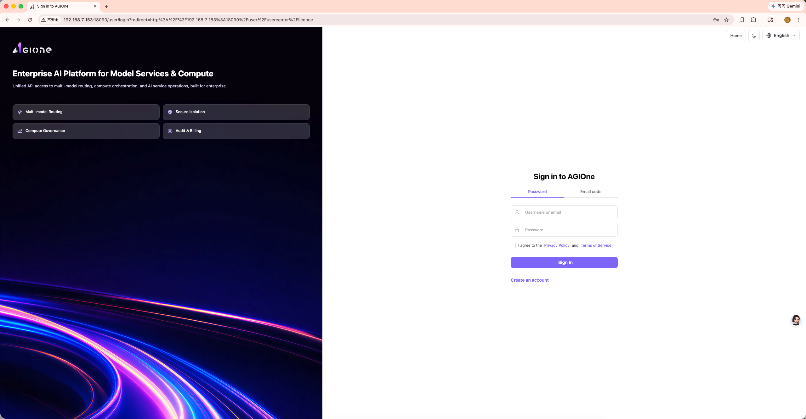
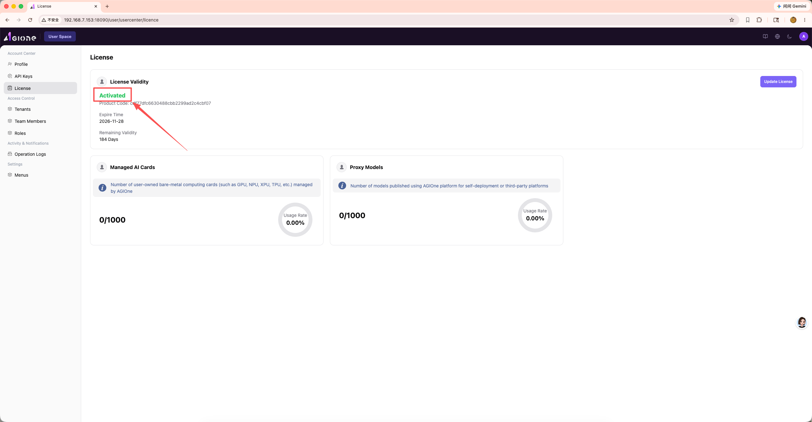

# 激活码与激活

## 文档说明

本文档用于说明通过激活码方式完成 AGIOne 平台许可证激活的完整步骤与校验项。

## 前置条件

- 已获取 AGIOne 平台访问权限
- 具有平台许可证管理访问权限
- 已准备实例信息（主机标识、组织、联系人）

## 操作流程

### 1. 登录 AGIOne 平台

打开浏览器，访问 AGIOne 平台地址，使用Admin权限账号密码登录系统。

### 2. 进入许可证页面

登录成功后，点击左侧导航栏 **Account Center > License**，进入许可证管理页面。

### 3. 获取机器码

在 License 页面，查看并复制当前实例的 **Product Code**（机器码）。该机器码是申请激活码的唯一标识。

### 4. 发送激活申请邮件

将获取到的机器码（Product Code）通过邮件发送至 **ecosys@oneprocloud.com**，邮件内容需包含以下信息：

- **机器码（Product Code）**：从 License 页面复制的完整字符串
- **组织/公司名称**：申请激活码所属的组织
- **联系人及联系方式**：便于后续沟通
- **申请用途说明**（可选）：简要说明激活场景

> **注意**：请确保邮件中的机器码完整无误，避免因复制不全导致激活失败。

### 5. 接收激活码

等待邮件回复，通常会在 1-2 个工作日内收到包含激活码的回复邮件。收到激活码后，请妥善保存。

### 6. 输入激活码完成激活

返回 AGIOne 平台的 License 页面，点击右上角的 **Update License** 按钮，在弹出的对话框中粘贴收到的激活码，然后点击 **Confirm** 确认。

### 7. 确认激活状态

激活成功后，页面将显示许可证的详细信息，包括：

- **License Validity**：显示为 `Activated`
- **Expire Time**：许可证到期时间
- **Remaining Validity**：剩余有效天数
- **Managed AI Cards**：已管理/总可用 AI 卡数量
- **Proxy Models**：已发布/总可用代理模型数量

## 验证清单

- [ ] 机器码已成功复制并发送至 ecosys@oneprocloud.com
- [ ] 已收到回复邮件中的有效激活码
- [ ] 激活码输入后页面显示 `Activated` 状态
- [ ] 到期时间与授权额度显示正确
- [ ] Managed AI Cards 和 Proxy Models 的配额显示正常
- [ ] 系统日志中无许可证相关阻塞错误

## 常见问题

| 问题 | 可能原因 | 解决方法 |
|------|----------|----------|
| 激活码无效 | 机器码与激活码不匹配 | 确认发送的 Product Code 完整无误，重新申请 |
| 激活后状态未更新 | 页面缓存 | 刷新页面或重新登录 |
| 未收到回复邮件 | 邮件被拦截 | 检查垃圾邮件箱，或更换邮箱重新发送 |
| 激活码过期 | 超过有效期 | 联系 ecosys@oneprocloud.com 重新申请 |
