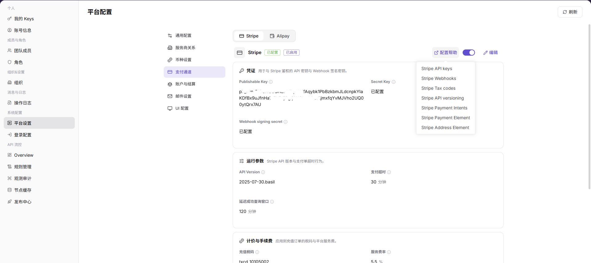
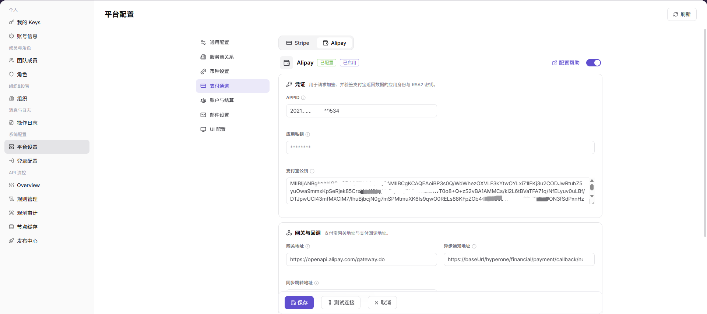
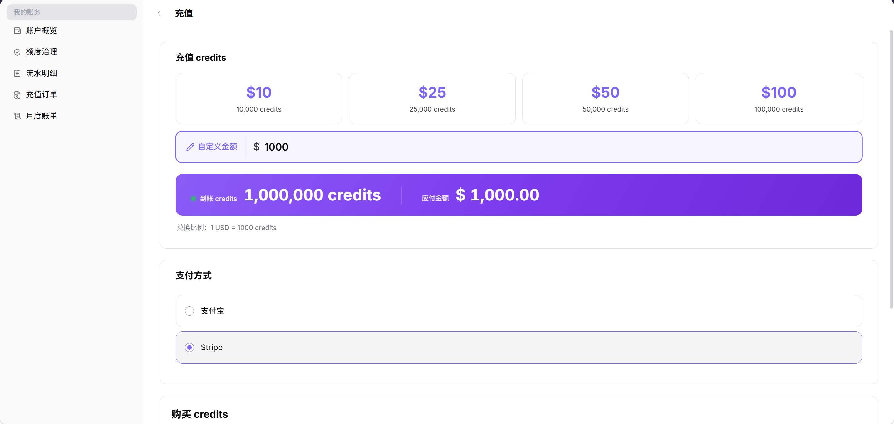
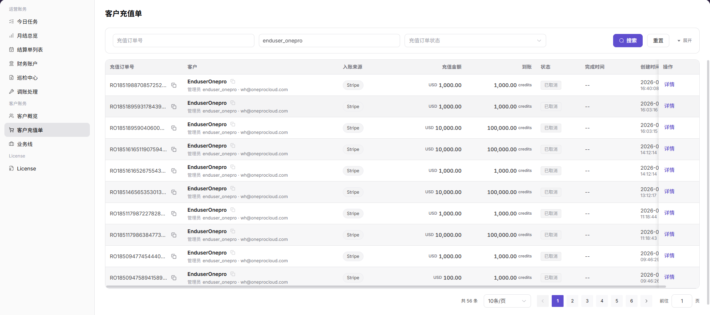

# 在线支付激活

::: info 文档信息
版本：v1.0
更新日期：2026-07-15
:::

## 功能概述

在线支付激活用于验证平台支付通道、终端用户充值和运营方充值记录核对是否形成闭环。本文覆盖 `Stripe` 和 `Alipay` 两种在线支付方式：先由运营方管理员配置支付通道并完成连接测试，再由终端用户发起 credits 充值，最后由运营方管理员在客户充值单中核对充值记录。

本文只描述配置位置、字段含义和操作流程，不包含真实账号、密码、内部登录参数、测试账号信息、真实支付凭证或真实密钥。

## 适用场景

- 首次启用 Stripe 或 Alipay 在线充值能力。
- 验证终端用户 credits 充值链路是否可用。
- 排查用户已支付但平台侧 credits、充值订单或客户充值单未正确更新的问题。
- 上线前使用测试配置、测试账号和测试金额验证支付链路。

## 前提条件

1. 运营方管理员具备平台设置、支付通道配置和客户充值单查看权限。
2. 已准备 Stripe 或 Alipay 的测试配置，不使用生产支付配置做首次验证。
3. 终端用户已完成注册或创建，并具备登录、访问账务页面和发起充值的权限。
4. 已确认充值金额、支付方式和 credits 换算规则均用于验证，不用于真实扣费。
5. 已确认不会在文档、截图、工单或聊天中写入真实密钥、账号密码、验证码或支付凭证。

::: warning 安全提醒
`测试连接`、`保存` 和 `充值` 都会影响配置或账务链路。实际执行前必须确认使用测试配置、测试账号和测试金额，避免误触发生产支付或真实账务变更。
:::

## 流程总览

| 步骤 | 操作角色 | 操作内容 | 预期结果 |
| --- | --- | --- | --- |
| 1 | 运营方管理员 | 配置 Stripe 支付通道 | Stripe 通道可测试、可保存 |
| 2 | 运营方管理员 | 配置 Alipay 支付通道 | Alipay 通道可测试、可保存 |
| 3 | 终端用户 | 注册或登录账号 | 用户可访问充值入口 |
| 4 | 终端用户 | 选择 Stripe 或支付宝充值 credits | 形成充值订单并完成支付 |
| 5 | 运营方管理员 | 在客户充值单核对记录 | 可定位并核对充值记录 |

## 一、配置 Stripe 支付通道

### 获取 Stripe 配置信息

1. 登录 Stripe 后台，并切换到用于验证的测试模式。
2. 在开发者或密钥配置区域获取：
   - `Publishable Key`
   - `Secret Key`
3. 在 Webhook 配置区域创建或选择用于接收支付结果回调的 Endpoint。
4. 获取该 Endpoint 对应的 `Webhook signing secret`。
5. 将配置信息对应到以下占位符，后续只在平台配置页面填写，不写入文档明文：

| 配置项 | 占位符 |
| --- | --- |
| Publishable Key | `<stripe_publishable_key>` |
| Secret Key | `<stripe_secret_key>` |
| Webhook signing secret | `<stripe_webhook_signing_secret>` |

页面截图：

### 编辑 Stripe 配置

1. 运营方管理员登录平台。
2. 进入 `设置 > 系统配置 > 平台设置 > 支付通道`。
3. 选择 `Stripe`。
4. 点击 `配置帮助`，按帮助内容确认 Stripe 密钥和 Webhook 配置来源。
5. 点击 `编辑`，进入 Stripe 配置编辑状态。
6. 填写 Stripe 配置：
   - `Publishable Key`：填写 `<stripe_publishable_key>`。
   - `Secret Key`：填写 `<stripe_secret_key>`。
   - `Webhook signing secret`：填写 `<stripe_webhook_signing_secret>`。
7. 按页面真实字段继续确认运行参数、计价手续费、限额等配置。
8. 确认单笔最小金额和单笔最大金额不会阻断后续测试充值。

页面截图：

### 测试连接

1. 确认 Stripe 必填字段已填写完成。
2. 点击 `测试连接`。
3. 等待平台返回连接测试结果。
4. 如果测试失败，按错误提示核对 `Secret Key`、Webhook 签名密钥、API Version、网络连通性和测试模式是否一致。
5. 测试未通过时不要保存为可用配置。

页面截图：

### 保存配置

1. 确认 `测试连接` 已通过。
2. 再次确认当前配置为测试配置，不包含生产支付密钥。
3. 点击 `保存`。
4. 保存后确认 `Stripe` 显示为已配置、已启用或平台定义的可用状态。

## 二、配置 Alipay 支付通道

### 获取 Alipay 配置信息

1. 登录支付宝开放平台或对应支付配置后台。
2. 进入应用配置页，确认当前应用用于测试验证。
3. 获取并准备：
   - `APPID`
   - `应用私钥`
   - `支付宝公钥`
4. 将配置信息对应到以下占位符，后续只在平台配置页面填写，不写入文档明文：

| 配置项 | 占位符 |
| --- | --- |
| APPID | `<alipay_app_id>` |
| 应用私钥 | `<alipay_app_private_key>` |
| 支付宝公钥 | `<alipay_public_key>` |

::: tip
如果使用沙箱或测试应用，应确认支付宝后台、平台支付通道和终端用户充值流程都指向同一套测试配置。
:::

页面截图：

### 编辑 Alipay 配置

1. 运营方管理员登录平台。
2. 进入 `设置 > 系统配置 > 平台设置 > 支付通道`。
3. 选择 `Alipay`。
4. 点击 `配置帮助`，按帮助内容确认 APPID、应用私钥和支付宝公钥的获取位置。
5. 点击 `编辑`，进入 Alipay 配置编辑状态。
6. 填写 Alipay 配置：
   - `APPID`：填写 `<alipay_app_id>`。
   - `应用私钥`：填写 `<alipay_app_private_key>`。
   - `支付宝公钥`：填写 `<alipay_public_key>`。
7. 按页面真实字段继续确认运行参数、计价手续费、限额等配置。
8. 确认单笔最小金额和单笔最大金额不会阻断后续测试充值。

页面截图：

### 测试连接

1. 确认 Alipay 必填字段已填写完成。
2. 点击 `测试连接`。
3. 等待平台返回连接测试结果。
4. 如果测试失败，按错误提示核对 `APPID`、应用私钥、支付宝公钥、应用环境和网络连通性。
5. 测试未通过时不要保存为可用配置。

页面截图：

### 保存配置

1. 确认 `测试连接` 已通过。
2. 再次确认当前配置为测试配置，不包含生产支付密钥或真实支付凭证。
3. 点击 `保存`。
4. 保存后确认 `Alipay` 显示为已配置、已启用或平台定义的可用状态。

## 三、注册 enduser

1. 通过平台支持的自助注册流程创建终端用户账号，或由平台管理员按既有流程创建终端用户账号。
2. 不在文档、截图或工单中记录真实账号、密码、手机号、邮箱或一次性验证码。
3. 确认终端用户可以完成登录。
4. 确认终端用户具备访问账务页面和发起 credits 充值的权限。
5. 如果注册后看不到充值入口，先检查组织、角色、账务权限、业务线和支付通道配置。

## 四、enduser 充值 credits

1. 终端用户登录平台。
2. 进入账务， `账务 > 我的账务 > 账户概览`。
3. 点击 `充值`，进入充值流程。
4. 输入用于验证的充值金额或 credits 数量。
5. 在支付方式中选择 `Stripe` 或 `支付宝`。
6. 按页面提示完成支付。
7. 支付完成后返回平台。
8. 在账户概览、充值订单或流水明细中确认 credits 是否到账。
9. 记录充值订单号、支付方式、支付状态和完成时间时应脱敏，不要暴露真实支付信息。

页面截图：

### 选择 Stripe 支付

1. 在支付方式中选择 `Stripe`。
2. 确认充值金额和到账 credits。
3. 跳转或进入 Stripe 支付页面后，使用测试支付方式完成支付。
4. 支付完成后返回平台，查看充值订单状态和 credits 余额。

### 选择支付宝支付

1. 在支付方式中选择 `支付宝`。
2. 确认充值金额和到账 credits。
3. 跳转或进入支付宝支付页面后，使用测试支付方式完成支付。
4. 支付完成后返回平台，查看充值订单状态和 credits 余额。

::: warning
充值操作会产生支付和账务记录。验证时只使用测试金额、测试账号和测试支付通道，不要使用真实客户资金。
:::

## 五、operator 核对客户充值单

1. 运营方管理员登录平台。
2. 进入 `账务 > 客户账务 > 客户充值单`。
3. 按 enduser、订单号、支付方式、支付状态或时间范围筛选。
4. 确认可看到对应充值记录。
5. 核对以下信息：
   - 客户信息。
   - 支付方式。
   - 充值金额。
   - credits 到账额度。
   - 支付状态。
   - 支付时间。
   - 订单号。
6. 如果充值记录不存在，先扩大时间范围或使用订单号重新查询。
7. 如果充值记录存在但 credits 未到账，继续核对用户侧充值订单、流水明细和支付回调状态。

## 参数说明

| 参数 | 支付方式 | 说明 |
| --- | --- | --- |
| Publishable Key | Stripe | Stripe 前端公开密钥，用于支付页面初始化。 |
| Secret Key | Stripe | Stripe 服务端密钥，用于服务端鉴权。 |
| Webhook signing secret | Stripe | Stripe Webhook 签名密钥，用于校验回调来源。 |
| APPID | Alipay | 支付宝应用标识。 |
| 应用私钥 | Alipay | 平台调用支付宝接口时使用的应用私钥。 |
| 支付宝公钥 | Alipay | 用于校验支付宝返回结果和通知签名。 |
| credits | 通用 | enduser 充值到账的平台额度。 |

页面截图：

## 结果校验

| 检查项 | 成功表现 | 异常时处理 |
| --- | --- | --- |
| Stripe 支付通道 | Stripe 显示已配置、已启用或平台定义的可用状态。 | 核对 Stripe 密钥、Webhook 签名密钥、测试模式和保存结果。 |
| Alipay 支付通道 | Alipay 显示已配置、已启用或平台定义的可用状态。 | 核对 APPID、应用私钥、支付宝公钥、应用环境和保存结果。 |
| 测试连接 | `测试连接` 返回通过。 | 按支付方式分别核对密钥、网络和应用环境。 |
| enduser 充值 | 终端用户可选择 Stripe 或支付宝完成充值。 | 检查充值入口权限、业务线、支付通道和单笔金额限制。 |
| credits 到账 | 用户侧账户 credits 增加，或充值订单显示成功。 | 检查支付回调、充值订单状态和流水明细。 |
| 客户充值单记录 | 运营方管理员可在 `客户充值单` 中看到对应充值记录。 | 使用订单号、支付方式和时间范围重新筛选。 |
| 充值记录状态 | 状态显示成功、已支付或平台定义的成功状态。 | 对比支付渠道结果、平台回调记录和账务流水。 |

## 常见问题

### 测试连接失败

**问题现象：**

点击 `测试连接` 后返回失败。

**可能原因：**

- 支付通道配置字段填写错误。
- Stripe 密钥或 Alipay 应用配置与当前环境不匹配。
- 回调签名配置不一致。
- 当前环境无法访问对应支付渠道。

**处理方式：**

1. 回到对应支付后台确认配置来源。
2. 确认使用的是测试配置。
3. 核对平台页面字段与支付后台字段是否一一对应。
4. 修正后重新点击 `测试连接`。

### enduser 看不到充值入口

**问题现象：**

终端用户登录后无法进入充值页面，或页面中没有 `充值` 按钮。

**可能原因：**

- 账号未完成注册或未加入正确组织。
- 当前角色没有账务或充值权限。
- 业务线或支付渠道未启用。

**处理方式：**

1. 检查终端用户账号状态。
2. 检查组织、角色和账务权限。
3. 检查 Stripe 或 Alipay 支付通道是否可用。
4. 检查业务线是否允许使用对应支付方式。

### 支付完成但 credits 没有增加

**问题现象：**

终端用户完成支付后，账户 credits 未变化。

**可能原因：**

- 支付结果尚未回调到平台。
- 平台回调校验失败。
- 充值订单仍处于处理中。
- 用户查看了错误账号、组织或业务线。

**处理方式：**

1. 在用户侧查看充值订单状态。
2. 在运营侧客户充值单中按订单号查询。
3. 核对支付通道回调配置和签名配置。
4. 等待短暂同步后刷新页面，再确认 credits 和流水明细。

### 客户充值单查不到记录

**问题现象：**

运营方管理员在客户充值单中看不到终端用户的充值记录。

**可能原因：**

- 筛选条件过窄。
- 客户、组织或业务线选择错误。
- 支付方式筛选错误。
- 充值订单未创建成功。
- 支付未完成或已取消。

**处理方式：**

1. 使用订单号精确查询。
2. 放宽时间范围后重新搜索。
3. 按支付方式分别查看 Stripe 或支付宝记录。
4. 确认终端用户所属客户、组织和业务线。
5. 对照用户侧充值订单和支付渠道结果。

## 注意事项

- 不要在文档、截图、工单或聊天中写入真实密钥、账号密码、验证码或支付凭证。
- Stripe 和 Alipay 的配置字段以页面真实 UI 为准，支付后台字段名称如有变化，应按实际页面更新。
- 生产支付配置只能在正式上线前由授权人员确认后使用；验证流程优先使用测试配置和测试金额。
- `保存` 会改变平台支付通道配置，执行前应确认影响范围。
- 终端用户充值会产生支付和账务记录，执行前应确认账号、金额和支付方式均符合验证目的。
- 客户充值单包含客户、金额、订单号和状态等敏感账务信息，对外沟通或截图时应脱敏。
- 如果支付结果、credits 到账和客户充值单记录不一致，应以订单号为主线串联用户侧订单、运营侧充值单和支付渠道结果。
