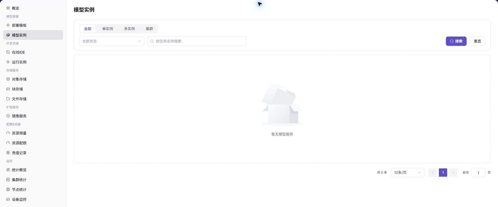

# 单节点多卡多模型部署最佳实践

::: info 文档信息
版本：v1.0
更新日期：2026-07-15
:::

本文面向 POC、私有化交付和本地算力资源整合场景，说明如何基于 AGIOne 本地算力平台，将一台多卡 NPU/GPU 节点纳管为可调度资源，并通过资源规格、租户额度、推理模板和模型实例完成多模型部署验证。

## 适用场景

当客户只有一台或少量多卡服务器时，常见目标不是简单启动一个模型，而是验证平台能否把有限算力拆分成可复用资源套餐，让不同模型、不同业务或不同租户在明确边界内共享资源。

| 场景 | 说明 |
| --- | --- |
| 单节点多模型部署 | 在一台多卡 NPU/GPU 节点上同时运行多个模型实例。 |
| POC 能力验证 | 验证资源纳管、规格配置、额度控制、模型部署和资源隔离。 |
| 本地算力平台化 | 将裸机或 Kubernetes 集群纳入 AGIOne 统一调度和监控。 |
| 标准化交付 | 通过推理模板沉淀模型、框架、镜像、规格和默认参数。 |
| 新模型试运行 | 使用模型实例或自定义部署方式验证尚未模板化的模型。 |

本文以“一台 8 卡 NPU 节点部署多个模型”为示例。GPU 场景同样适用，但需要按实际硬件、驱动、设备插件和监控采集能力调整。

## 能力映射

这类实践主要归属 `AI Infra On-Prem / 本地算力平台`，与模型发布、模型市场和调用计费不是同一条主流程。整理方案时应先把资源供给和模型运行环境讲清楚，再连接到模型服务调用。

| 目标 | AGIOne 能力 | 参考入口 |
| --- | --- | --- |
| 纳管 Kubernetes 集群和节点 | 集群管理、集群节点、设备监控 | [集群管理](/zh-CN/usermanual/ai-infra-on-prem/operator/resource-pools/clusters/) |
| 定义可选算力套餐 | 规格指标、资源规格、集群关联规格 | [资源规格](/zh-CN/usermanual/ai-infra-on-prem/operator/resource-pools/resource-specs/) |
| 控制组织或租户可用资源 | 租户额度、配额与计量 | [计量明细](/zh-CN/usermanual/ai-infra-on-prem/operator/quotas-metering/metering-details/) |
| 封装标准模型部署方式 | 推理模板、模型配置、框架、镜像、显存配置 | [推理模板](/zh-CN/usermanual/ai-infra-on-prem/operator/templates/inference-templates/) |
| 部署并检查模型服务 | 模型实例、实例状态、日志、访问排障 | [模型实例](/zh-CN/usermanual/ai-infra-on-prem/user/model-deployment/instances/) |
| 查看资源健康和容量 | 统计概览、集群监控、节点监控、设备监控、作业监控 | [统计概览](/zh-CN/usermanual/ai-infra-on-prem/operator/monitoring/overview/) |

## 角色与职责边界

单节点多卡部署涉及运营方和普通用户两类主要操作者。模型供应方只有在发布模型、聚合模型或对外提供模型服务时才进入主流程，不建议把所有模型部署动作都默认归给模型供应方。

| 角色 | 负责内容 | 不负责内容 |
| --- | --- | --- |
| 运营方 | 纳管集群、维护加速卡、创建资源规格、关联集群、配置租户额度、维护推理模板、排查资源和调度问题。 | 代替业务用户长期管理模型调用逻辑。 |
| 普通用户 | 在已授权范围内选择模板、规格和参数，创建模型实例，查看部署状态、日志和调用信息。 | 管理底层 Kubernetes、物理节点、资源规格和平台级额度。 |
| 模型供应方 | 在模型发布场景中维护模型资产、提交审核、查看客户调用和收益。 | 管理平台级资源池、集群和租户额度。 |
| 平台管理员 | 管理组织、用户、角色和平台访问基础配置。 | 日常算力运营和模型部署。 |

判断责任归属时可以按一句话区分：运营方准备“可用的资源和模板”，普通用户创建“可运行的模型实例”，模型供应方负责“可发布和可售卖的模型服务”。

## 推荐资源规划

### 资源规格设计

资源规格不是单纯的“卡数”。在 AGIOne 中，资源规格应同时包含 CPU、内存、AI 加速卡指标、数量、状态和可用集群关系。对于一台 8 卡节点，建议至少准备 1 卡、2 卡、4 卡三个规格档位。

| 规格示例 | 加速卡数量 | 建议 CPU / 内存 | 典型用途 |
| --- | ---: | --- | --- |
| `npu-1c-small` | 1 卡 | 按模型最低运行要求预留 | 小模型、功能测试、轻量推理、Notebook 验证。 |
| `npu-2c-standard` | 2 卡 | 按中等模型和并发需求预留 | 中等规模模型、常规推理服务。 |
| `npu-4c-large` | 4 卡 | 按较大模型和上下文长度预留 | 大模型验证、核心推理服务。 |

不建议在 POC 阶段只创建一个 8 卡大规格。只创建大规格虽然能验证单模型启动，但无法验证资源拆分、多模型共存、额度边界和调度失败边界。

### 部署组合示例

| 部署组合 | 资源占用 | 验证目标 |
| --- | ---: | --- |
| 1 个 4 卡模型 + 1 个 2 卡模型 + 2 个 1 卡实例 | 8 卡 | 同时验证大、中、小规格共存。 |
| 2 个 4 卡模型 | 8 卡 | 验证两个大规格模型并行运行。 |
| 4 个 2 卡模型 | 8 卡 | 验证多个中等规格模型共享资源池。 |
| 1 个 4 卡模型 + 2 个 2 卡模型 | 8 卡 | 验证混合规格部署和容量耗尽边界。 |

### 租户额度设计

租户额度用于控制组织或租户在资源池中的可消费资源范围。额度充足不代表实例一定可以创建成功，还需要同时满足规格可选、集群容量、模板约束和调度策略。

| 租户示例 | 额度 | 验证目的 |
| --- | ---: | --- |
| 租户 A | 4 卡 | 验证一个 4 卡模型或两个 2 卡模型。 |
| 租户 B | 2 卡 | 验证中等额度边界。 |
| 租户 C | 1 卡 | 验证小规格实例部署。 |

POC 中应保留额度不足和资源池耗尽两类失败场景。前者证明额度控制生效，后者证明平台不会在底层容量不足时继续创建实例。

## 实施流程

### 1. 运营方纳管集群和设备

资源纳管是整个流程的起点。只有 Kubernetes 集群和 NPU/GPU 节点完成接入，后续的资源规格、租户额度和模型实例才有调度基础。

上图展示集群管理列表，可先确认目标集群状态、CPU、内存、显卡和节点数量。

| 项目 | 内容 |
| --- | --- |
| 操作角色 | 运营方 |
| 页面入口 | `资源池 > 集群管理` |
| 输入 | Kubernetes 集群连接信息、节点资源、设备插件和监控采集能力 |
| 输出 | AGIOne 可调度、可监控的本地算力集群 |

关键检查：

1. 集群已出现在集群列表中，状态符合预期。
2. 集群节点可见，节点状态为 `Ready` 或符合交付预期。
3. 设备监控能看到 GPU/NPU 型号、数量、显存、利用率和健康状态。
4. 后续承载作业前，目标集群已关联可用资源规格。

### 2. 运营方创建资源规格并关联集群

资源规格定义单个模型实例、在线 IDE 或运行实例可申请的资源套餐。创建规格后，还需要在目标集群详情中关联该规格，否则用户创建实例时可能无法选择。

上图展示资源规格列表，适合核对 1 卡、2 卡、4 卡等规格是否已按卡型、CPU 和内存组合创建。

| 项目 | 内容 |
| --- | --- |
| 操作角色 | 运营方 |
| 页面入口 | `资源池 > 资源规格`、`资源池 > 集群管理 > 集群详情` |
| 输入 | CPU、内存、AI 加速卡指标、数量、规格名称 |
| 输出 | 用户创建模型实例时可选择的资源规格 |

关键检查：

1. 规格中的加速卡指标与集群实际上报的资源 key 匹配。
2. 规格名称能体现卡型、卡数和用途，便于排障。
3. 目标集群详情中可以看到已关联规格。
4. 用户创建实例时能在对应地域、可用区或集群范围内选择该规格。

上图展示集群详情中的已关联规格。若规格已创建但用户不可选，优先检查这里是否已经完成关联。

### 3. 运营方配置租户额度

租户额度控制组织或租户可使用的 CPU、GPU/NPU、内存等资源范围。资源规格控制单个实例使用多少资源，租户额度控制租户总共可以使用多少资源，两者必须同时满足。

上图展示租户额度列表，可用于确认目标租户 CPU、GPU 和内存额度是否满足 POC 计划。

| 概念 | 作用 |
| --- | --- |
| 资源规格 | 控制单个模型实例使用多少资源。 |
| 租户额度 | 控制租户在资源池中总共可以使用多少资源。 |
| 集群容量 | 控制底层实际是否还有可调度资源。 |

验证示例：

| 操作 | 预期结果 | 说明 |
| --- | --- | --- |
| 租户 A 使用 4 卡额度创建 1 个 4 卡实例 | 成功 | 总使用量未超过额度。 |
| 租户 A 使用 4 卡额度创建 2 个 2 卡实例 | 成功 | 累计使用量为 4 卡。 |
| 租户 A 已使用 4 卡后继续创建 1 卡实例 | 失败 | 超过租户额度。 |
| 资源池 8 卡全部占用后继续创建实例 | 失败 | 底层容量不足。 |

### 4. 运营方沉淀推理模板

对于标准模型，建议使用推理模板封装模型、框架、镜像、资源规格、显存测算、端口、环境变量和默认参数。这样普通用户创建模型实例时只需要选择模板、规格和必要参数，不需要理解底层启动命令。

上图展示推理模板列表。模板发布前，应确认模型、框架、镜像、规格范围和可见范围均符合目标租户。

| 项目 | 内容 |
| --- | --- |
| 操作角色 | 运营方 |
| 页面入口 | `模板 > 推理模板` |
| 输入 | 模型配置、框架、运行镜像、资源规格、显存配置、参数表单 |
| 输出 | 普通用户可选择的模型部署模板 |

发布前检查：

1. 模板关联的模型、框架、镜像、规格均可用。
2. 模板规格范围与 1 卡、2 卡、4 卡部署目标匹配。
3. 默认参数不包含真实密钥、内部路径或临时测试地址。
4. 可见范围包含目标租户或用户。

### 5. 普通用户创建模型实例

当运营方完成资源和模板准备后，普通用户可以在授权范围内创建模型实例。平台会综合检查模板、规格、额度、集群容量和调度条件。

上图展示模型实例列表，可用于检查实例状态、实例类型和后续日志或访问排障入口。

| 项目 | 内容 |
| --- | --- |
| 操作角色 | 普通用户 |
| 页面入口 | `模型部署 > 模型实例` |
| 输入 | 推理模板、资源规格、实例参数、访问配置 |
| 输出 | 可运行、可检查、可调用的模型服务实例 |

部署后检查：

1. 模型实例创建成功，状态进入运行中或符合预期状态。
2. 实例事件和日志没有镜像拉取、模型加载、端口或健康检查错误。
3. 设备监控和作业监控显示资源占用与所选规格一致。
4. 服务访问方式可用，调用凭据和 Endpoint 不在文档或截图中明文暴露。

### 6. 验证实例资源隔离

实例创建成功不等于资源隔离完全符合预期。POC 阶段应验证实例内部可见资源与资源规格一致。

上图展示设备监控页面，可与实例内命令输出一起核对 GPU/NPU 资源占用和健康状态。

| 资源规格 | 实例内预期可见资源 |
| --- | --- |
| 1 卡规格 | 1 张 NPU/GPU 卡 |
| 2 卡规格 | 2 张 NPU/GPU 卡 |
| 4 卡规格 | 4 张 NPU/GPU 卡 |

验证方式：

1. GPU 环境可使用 `nvidia-smi` 查看实例内可见 GPU。
2. NPU 环境使用硬件厂商对应命令查看实例内可见 NPU。
3. 同时保留页面状态、设备监控、作业监控和实例内命令输出作为 POC 证据。

不要把硬件命令写成固定通用命令。不同 NPU 厂商、驱动和容器镜像内置工具可能不同，应以客户实际环境为准。

## POC 验收清单

| 类别 | 验收项 | 预期结果 |
| --- | --- | --- |
| 集群纳管 | 集群注册和状态同步 | 成功 |
| 设备识别 | NPU/GPU 设备型号、数量和状态可见 | 成功 |
| 资源规格 | 1/2/4 卡规格创建并关联目标集群 | 成功 |
| 租户额度 | 目标租户额度配置生效 | 成功 |
| 模板能力 | 推理模板可被目标用户选择 | 成功 |
| 模型部署 | 1 卡模型实例创建 | 成功 |
| 模型部署 | 2 卡模型实例创建 | 成功 |
| 模型部署 | 4 卡模型实例创建 | 成功 |
| 额度边界 | 超过租户额度继续创建实例 | 失败且提示可解释 |
| 容量边界 | 资源池耗尽后继续创建实例 | 失败且提示可解释 |
| 资源隔离 | 实例内可见资源与规格一致 | 成功 |
| 调用验证 | 模型服务可被授权用户调用 | 成功 |

## 常见问题

### 为什么不建议只创建一个 8 卡规格？

只创建 8 卡规格只能验证单个大模型能否启动，无法验证多模型共存、多规格调度、租户额度边界和资源池耗尽后的失败行为。POC 阶段至少应准备 1 卡、2 卡、4 卡三个档位。

### 资源规格和租户额度有什么区别？

资源规格控制单个实例使用多少资源，租户额度控制租户总共可以使用多少资源。即使某个规格可选，如果租户额度不足，实例仍应创建失败。

### 租户额度足够但规格不可选怎么办？

优先检查三个位置：

1. 资源规格是否启用。
2. 目标集群是否已关联该规格。
3. 推理模板是否限制了可选规格范围。

### 部署失败时先看哪里？

建议按以下顺序排查：

1. 模型实例事件和日志。
2. 推理模板关联的模型、框架、镜像和参数。
3. 资源规格是否关联目标集群。
4. 租户额度和资源池剩余容量。
5. 集群、节点和设备监控。

### 新模型还没有推理模板怎么办？

可以先按自定义部署或运行实例方式验证模型权重、镜像和启动命令。验证稳定后，再由运营方沉淀为推理模板，减少后续重复配置成本。

## 客户沟通口径

可以这样解释单节点多卡部署方案：

AGIOne 不直接把整台多卡服务器暴露给某个用户使用，而是由运营方先纳管 Kubernetes 集群和 NPU/GPU 节点，再把底层资源抽象成 1 卡、2 卡、4 卡等资源规格，并通过租户额度控制整体使用边界。

在一台 8 卡节点上，用户可以根据模型规模选择不同规格，例如一个模型使用 4 卡，另一个模型使用 2 卡，再部署两个 1 卡测试实例。平台会同时检查资源规格、租户额度、集群容量和模板约束，确保资源可以被清晰分配、稳定调度和可观测排查。

对于标准模型，运营方将部署经验沉淀为推理模板；对于新模型，可以先做自定义验证，稳定后再模板化。这样既能提升资源利用率，也能让 POC 验证结果更容易复盘和交付。

## 相关文档

- [集群管理](/zh-CN/usermanual/ai-infra-on-prem/operator/resource-pools/clusters/)
- [资源规格](/zh-CN/usermanual/ai-infra-on-prem/operator/resource-pools/resource-specs/)
- [计量明细](/zh-CN/usermanual/ai-infra-on-prem/operator/quotas-metering/metering-details/)
- [推理模板](/zh-CN/usermanual/ai-infra-on-prem/operator/templates/inference-templates/)
- [模型实例](/zh-CN/usermanual/ai-infra-on-prem/user/model-deployment/instances/)
- [多算力池异构推理调度最佳实践](./multi-compute-pool-heterogeneous-inference-scheduling)
