# 核心能力与功能

:::: info 文档信息
版本：v1.1
更新日期：2026-07-23
功能事实基线：2026-07-22 更新的用户手册与当前 AI Infra On-Cloud 业务链路
::::

## 概览

AGIOne 是面向企业级大模型生产化运营的 **一站式智能算力与模型管理平台**，围绕「**算力 → 模型 → 服务 → 运营**」的端到端闭环，提供八项核心能力：

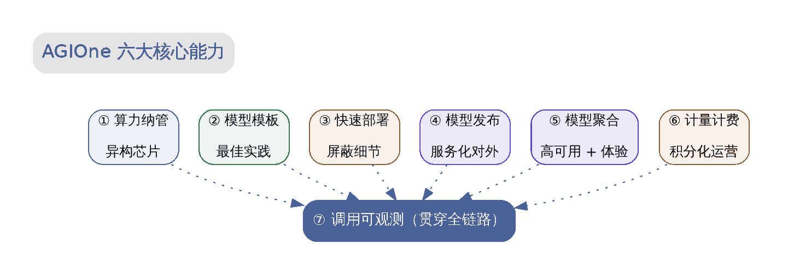

<i>图 1   AGIOne 八项核心能力总览（六段业务链路与两项横向能力）</i>

> 前六项能力构成从算力准备到财务运营的业务链路；第七项「**调用可观测**」提供全链路可视化、分析与异常排查，第八项「**设置与访问控制**」提供身份、组织、权限、审计和 API 流控治理。

> 前三项能力分别按 **AI Infra On-Prem** 与 **AI Infra On-Cloud** 展开：On-Prem 说明本地算力与模型部署，On-Cloud 说明多云资源接入、云侧部署资产和推荐式部署。

::: warning 阅读说明
本页保留原有能力框架和方案示意。图中的时间、策略、性能与计费数字用于解释设计思路，不构成当前版本承诺；当前用户手册已将**财务**和**设置**作为产品模块补充到财务、License、身份、审计和 API 流控运营中。实际功能以[用户手册](../../usermanual/)、[支持矩阵](../limitations/support-matrix)和目标环境为准。当前状态：华为云接入暂不支持；RAG 和 Function Calling 为规划中能力。
:::

## 一、算力资源 — 本地纳管与多云接入

### 1.1 AI Infra On-Prem

#### 1.1.1 能力概述

AGIOne 通过 AI Infra On-Prem 管理地域、可用区、集群、节点和加速卡资源，并通过规格、模板、配额与授权范围为工作负载提供可选算力。是否能够纳管和运行模型，仍需验证芯片、驱动、运行时、镜像、推理引擎和模型组合。

#### 1.1.2 支持的异构芯片清单

| 厂商 | 架构 / 系列 | 典型型号 | 适配说明 |
|---|---|---|---|
| **NVIDIA** | Hopper | H800 / H200 / H100 / H20 | 驱动、CUDA、镜像和推理引擎需按项目验证 |
| **NVIDIA** | Ampere | A100 / A800 / A40 / A30 / A10 / RTX A 系列 / RTX 30 系列 | 显存和数据中心部署条件需按型号确认 |
| **NVIDIA** | Ada | L40 / L40S / L20 / L20S / L4 / L2 / RTX 4090 等 | 工作站或消费级型号需额外确认稳定性与交付条件 |
| **Huawei Ascend** | Ascend 910 | Ascend 910B / Ascend 910C | CANN、MindIE、驱动、镜像和模型需按项目验证 |
| **Enflame** | Enflame | 106 | 厂商驱动、运行时、推理框架和模型需验证 |
| **Biren** | Biren | S60 | 厂商驱动、运行时、推理框架和模型需验证 |
| **Hygon** | BW | BW200 | 厂商驱动、运行时、推理框架和模型需验证 |

#### 1.1.3 核心子能力

##### 节点纳管与生命周期管理

- **集群与节点纳管**：运营方维护地域、可用区、集群、节点和加速卡对象，实际接入范围取决于网络与安装条件；
- **节点初始化**：按[纳管算力节点安装指南](../../installation/quick-install-for-managing-compute-nodes)准备 Kubernetes、容器运行时、驱动和设备插件；
- **镜像与运行环境**：通过镜像、镜像服务和模板维护工作负载所需环境；
- **异常处理**：结合节点、设备、作业监控和事件记录定位问题，恢复方式以 Kubernetes 配置和交付方案为准。

##### 资源调度与分配策略

| 调度维度         | 策略                                                           | 适用场景 |
|--------------|--------------------------------------------------------------|---|
| **按硬件标签调度** | 使用节点与设备标签区分加速卡类型 | 不同运行环境选择对应芯片 |
| **按算力规格调度** | 从当前可用规格中选择满足卡型、卡数和显存要求的配置 | 模型部署与训练任务 |
| **按授权范围调度** | 仅使用当前租户、业务或用户可见的地域、资源池和规格 | 多租户资源使用 |
| **多卡任务配置** | 根据模板、模型和集群条件配置卡数与并行参数 | 单机多卡或多机多卡任务 |

##### 硬件监控指标

平台可在设备与监控页面展示已采集的加速卡指标。具体采集组件、指标项和刷新周期取决于芯片类型、监控配置和部署版本，例如：

- **GPU/NPU 计算利用率** & SM 占用率
- **显存使用量** & 显存带宽
- **核心温度** & 显存温度
- **实时功耗** & TDP 使用率
- **NVLink / InfiniBand 带宽** & 健康状态

### 1.2 AI Infra On-Cloud

#### 1.2.1 能力概述

AGIOne 通过 AI Infra On-Cloud 统一接入云平台、云账号、地域、资源池和算力规格，把不同云厂商的推理资源整理为可授权、可筛选、可用于模型部署的候选算力。运营方负责准备云侧资源和访问范围，普通用户在授权范围内使用推荐方案完成部署。

云上资源准备遵循以下关系：

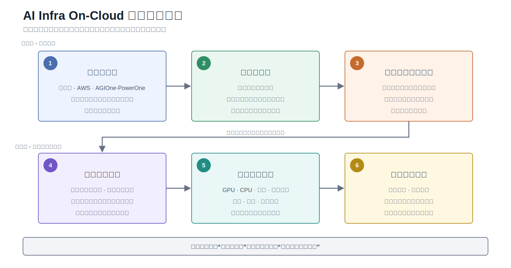

<i>图 1-A   AI Infra On-Cloud 多云资源接入流程</i>

#### 1.2.2 核心资源对象

| 资源对象 | 作用 | 使用边界 |
|---|---|---|
| **云平台** | 标识阿里云、AWS、AGIOne-PowerOne 等已接入的云厂商能力 | 实际可用平台以当前环境和部署版本为准 |
| **云账号** | 提供平台调用云厂商资源所需的访问凭据 | 用户确认部署时只能选择与候选云商匹配的可用账号 |
| **地域与资源池** | 组织云厂商地域、可用资源和专属资源范围 | 资源池创建后仍需完成业务授权 |
| **业务区域授权** | 限定业务或租户可访问的云平台与地域组合 | 用于多租户隔离、合规和成本控制 |
| **算力规格** | 描述 GPU、CPU、内存、实例数量、价格和计费周期 | 规格和价格必须按云平台与地域分别确认 |

#### 1.2.3 多云资源管理

- **账号与地域管理**：运营方维护云平台和账号，并同步可用地域、资源池及规格；
- **授权范围控制**：通过资源池授权和业务区域授权，控制不同业务可见的云商与地域；
- **规格与成本信息**：部署候选可以展示卡型、卡数、CPU、内存、实例数量、预估成本和币种；
- **云厂商适配**：底层通过云厂商组件完成资源查询和服务创建，不同云平台的字段及生命周期能力可能不同；
- **运行观测**：部署后结合任务状态、云厂商事件、调用日志和资源监控查看运行情况。

## 二、模型部署资产 — 本地模板与云侧配置

On-Prem 与 On-Cloud 的资产组成不同，分别服务于本地算力部署和云上模型部署：

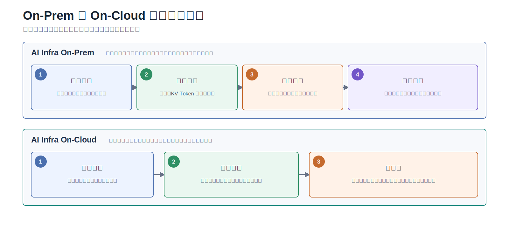

<i>图 2   On-Prem 与 On-Cloud 模型部署资产</i>

| 部署范围 | 组成 | 用户手册入口 |
|---|---|---|
| **On-Prem** | 模型配置、显存测算、框架配置、推理模板 | [模型配置](../../usermanual/ai-infra-on-prem/operator/templates/models/) / [显存测算](../../usermanual/ai-infra-on-prem/operator/templates/vram-config/) / [框架配置](../../usermanual/ai-infra-on-prem/operator/templates/frames/) / [推理模板](../../usermanual/ai-infra-on-prem/operator/templates/inference-templates/) |
| **On-Cloud** | 推理镜像、推理框架、模型库；模型库继续关联元模型、云侧部署点、云上模型、算力方案和输出配置 | [推理镜像](../../usermanual/ai-infra-on-cloud/operator/deploy-assets/runtime-images/) / [推理框架](../../usermanual/ai-infra-on-cloud/operator/deploy-assets/frameworks/) / [模型库](../../usermanual/ai-infra-on-cloud/operator/deploy-assets/models/) |

### 2.1 AI Infra On-Prem

#### 2.1.1 能力概述

AGIOne 通过模型配置、显存测算、框架配置和推理模板沉淀可复用的本地部署参数。模板是否可用取决于运营方配置、目标模型、算力规格、镜像和推理引擎验证结果。

#### 2.1.2 内置模型模板示例

##### 主流大模型预置模板示例

> 下表保留为容量评估示例，不代表当前环境已内置对应模型，也不构成型号、卡数、上下文或推理引擎兼容承诺。交付时应以当前模板列表和实际测试结果为准。

| 模型系列         | 典型版本                                    |        参数规模        | 推荐算力规格                 | 推理引擎 |        上下文支持        |
|--------------|-----------------------------------------|:------------------:|------------------------|:---:|:-------------------:|
| **DeepSeek** | V3.1 / R1                               | 671B MoE / 14B-70B | H200×8 / H20×2         | vLLM         |    32K/64K/128K     |
| **Qwen**     | QwQ-32B                                 |        32B         | H20×1 / L20×4          | vLLM         |       32K/64K       |
| **Qwen-VL**  | 2 / 3                                   |     14B / 72B      | L20×1 / L20×4          | vLLM         |         多模态         |
| **Llama3**   | 8B                                      |         8B         | L20S×1 / Ascend 910B×1 | vLLM/MindIE  |         32K         |
| **GLM**      | 5.1                                     |        744B        | H20×16                 | vLLM         | 32K/64K/128K        |
| **嵌入/重排**    | bge-m3 / bge-reranker / qwen3-embedding |         —          | L20×1 / L4×2           | vLLM         |          —          |

#### 2.1.3 模板版本管理

- **On-Prem 平台模板**：由运营方维护当前环境可用的模型配置、显存测算、框架配置和推理模板；
- **项目模板**：项目可以基于已验证的模型、镜像、算力和参数组合沉淀专用模板，复用前仍需确认版本与资源条件；

### 2.2 AI Infra On-Cloud

#### 2.2.1 能力概述

AI Infra On-Cloud 将模型展示信息与云侧部署能力组合为可发布、可推荐的模型记录。模型名称、标签和能力可以来自统一的元模型；AGIOne 负责维护该模型能够在哪些云平台和地域部署、使用什么运行时和规格，以及如何形成可访问的推理服务。

云侧模型资产准备流程为：

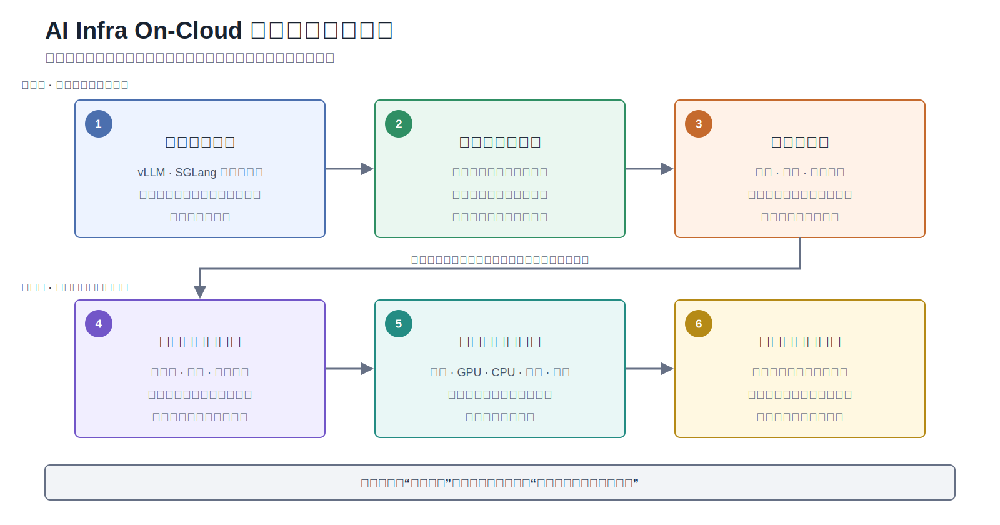

<i>图 2-A   AI Infra On-Cloud 云侧模型资产发布流程</i>

#### 2.2.2 云侧部署资产

| 部署资产 | 主要内容 | 作用 |
|---|---|---|
| **推理框架** | vLLM、SGLang 等推理框架类型 | 定义模型采用的推理运行时 |
| **框架版本** | 版本、端口、启动参数、环境变量和兼容条件 | 为不同模型和云厂商提供可复用运行配置 |
| **运行时镜像** | 云平台实际可用的容器镜像及关联状态 | 承载推理框架与模型启动环境 |
| **模型库记录** | 元模型关联、上架状态和模型能力引用 | 形成用户侧模型市场中的可部署模型 |
| **云侧部署点** | 云平台、地域、模型来源、框架、镜像和输出配置 | 描述模型在某个云环境中的完整部署能力 |
| **算力方案** | 规格、GPU、CPU、内存、实例数和计费信息 | 形成推荐部署的资源候选 |

#### 2.2.3 模型信息与部署信息边界

| 信息范围 | 主要来源 | 展示或使用方式 |
|---|---|---|
| **名称、标签与模型能力** | 统一元模型 | 用于模型市场展示和筛选 |
| **上架状态与可见范围** | AGIOne 模型库 | 决定模型是否可被用户发现 |
| **云平台、地域与规格** | 云侧部署点和算力方案 | 用于过滤和生成部署候选 |
| **框架、镜像与启动配置** | 推理框架及运行时镜像 | 由运营方维护，用户部署时由平台自动匹配 |
| **模型来源与输出配置** | 云厂商模型资产或模型存储配置 | 用于创建服务并生成访问方式 |

#### 2.2.4 发布前检查

- 已关联可展示的元模型，并确认名称、标签和能力信息；
- 至少存在一个完整的云侧部署点；
- 部署点已经关联可用的推理框架版本和运行时镜像；
- 算力方案中可以确认规格、资源信息和计费口径；
- 模型来源、输出配置和 API 访问配置满足目标云厂商要求；
- 实际发布能力仍以当前环境、云厂商接口和部署验证结果为准。

## 三、快速部署 — 本地与云上两种路径

### 3.1 AI Infra On-Prem

#### 3.1.1 能力概述

基于已准备的模型、框架、镜像、规格和授权资源，AGIOne 提供 **「选模型 → 选规格 → 提交部署」** 的产品化流程。运营方负责准备底层资源和部署资产，普通用户从当前可见范围发起快速部署并查看结果。

#### 3.1.2 三步快速部署流程

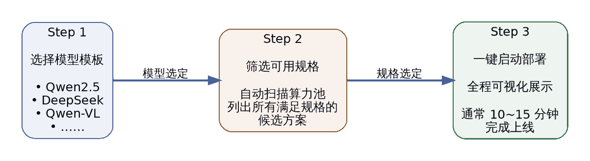

<i>图 3   快速部署三步流程</i>

#### 3.1.3 智能规格筛选

用户选定模型后，页面根据当前已配置并授权的云平台、地域、模型和算力方案展示可选部署组合。以下条件用于说明部署前需要核对的资源关系：

| 筛选条件 | 自动判断逻辑 |
|---|---|
| **显存够不够**       | 计算模型权重 × 量化系数 + KV Cache 预留 + 系统开销 |
| **卡数够不够**       | 检查目标算力池中空闲卡数 ≥ `tensor_parallel_size` |
| **网络满不满足**     | 多机部署时验证 RDMA 带宽与延迟 |

#### 3.1.4 部署过程可视化

部署启动后，UI 上 **逐阶段实时显示** 全过程，让用户对部署状态心中有数：

|     阶段     | UI 或状态页关注内容 | 时间说明 |
|:----------:|-------------------------------------------|:-----------:|
| **① 资源分配** | 检查所选地域、资源池、规格和额度是否可用 | 取决于资源状态 |
| **② 容器调度** | 检查工作负载调度、节点匹配和配额结果 | 取决于集群状态 |
| **③ 镜像拉取** | 检查镜像仓库、认证和网络是否正常 | 取决于镜像大小与网络 |
| **④ 模型加载** | 检查权重存储、挂载、显存和模型启动状态 | 取决于模型与存储 |
| **⑤ 健康检查** | 检查部署状态、监控和事件记录 | 取决于启动与探测配置 |

部署耗时取决于算力供给、镜像、模型权重、存储、网络和集群状态，不在产品文档中承诺固定完成时间。

#### 3.1.5 失败回滚与诊断

- **部署失败时**先查看部署状态、监控、事件和相关日志，确认失败阶段；
- **常见原因**包括配额或容量不足、镜像不可用、存储挂载失败、模型资产不匹配和网络异常；
- **资源清理与重试**应按当前页面能力和交付方案执行，不默认承诺自动回滚。

### 3.2 AI Infra On-Cloud

#### 3.2.1 能力概述

AI Infra On-Cloud 采用推荐式部署。普通用户只需要表达模型、部署模式、业务偏好和云厂商范围等业务意图，平台根据运营方已经准备的云账号、地域、框架、镜像、部署点和算力方案生成候选方案，并自动补齐底层运行配置。

推荐式部署主流程为：

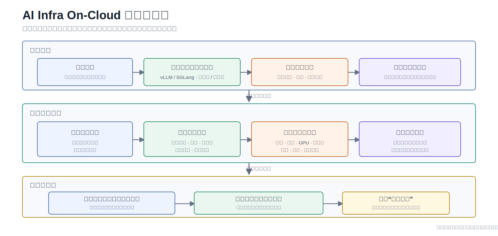

<i>图 3-A   AI Infra On-Cloud 推荐式部署流程</i>

#### 3.2.2 用户选择与平台自动匹配

| 范围 | 用户负责选择 | 平台负责处理 |
|---|---|---|
| **模型与运行方式** | 模型、推理框架类型 | 兼容的具体框架版本和运行时镜像 |
| **部署方式** | 单节点部署或高可用部署 | 对应的云侧部署点、节点组合和运行配置 |
| **业务偏好** | 成本优先、成本与体验均衡或性能优先 | 按资源、价格和可用条件排序候选方案 |
| **云厂商范围** | 指定云厂商或使用全部可用范围 | 按业务区域授权过滤云平台和地域 |
| **最终确认** | 部署名称、推荐方案和匹配的云账号 | 模型来源、规格、输出配置和服务创建参数 |

#### 3.2.3 推荐方案关注内容

用户选择候选方案时，重点比较下列业务信息：

- **云平台与地域**：服务将部署到哪个云厂商和地域；
- **部署模式**：单节点方案适合快速验证，高可用方案用于需要多节点保障的场景；
- **资源规格**：GPU 类型与数量、CPU、内存和实例数量；
- **成本信息**：预估成本、币种和计费周期，实际账单以云厂商和当前环境为准；
- **框架类型**：方案采用的推理框架类型，具体版本和镜像由平台自动匹配；
- **可用账号**：确认部署时只能选择与方案云厂商匹配且当前租户可用的云账号。

#### 3.2.4 部署过程与结果

| 阶段 | 页面关注内容 |
|---|---|
| **部署前校验** | 云账号、地域授权、部署点、框架、镜像和规格是否完整可用 |
| **云服务创建** | 平台向目标云厂商提交推理服务创建请求 |
| **服务启动** | 查看云侧任务状态、实例状态和厂商返回事件 |
| **健康与访问检查** | 确认服务健康状态、访问地址和认证信息是否已生成 |
| **运行管理** | 在“我的部署”中查看详情，并按页面能力执行启动、停止或删除 |

#### 3.2.5 失败诊断

- **账号或授权问题**：检查云账号是否有效，目标云商和地域是否在当前业务授权范围内；
- **部署资产问题**：检查部署点是否缺少框架版本、镜像、模型来源或输出配置；
- **规格问题**：检查目标地域下的规格是否存在、可供应，并确认价格和币种没有跨地域复用；
- **云厂商任务失败**：结合部署状态、云厂商事件和错误摘要定位创建或启动失败阶段；
- **访问不可用**：检查服务健康状态、访问地址、认证信息以及目标云厂商的调用协议。

## 四、模型发布 — 服务化对外暴露

### 4.1 能力概述

Model Services 支持模型提供方发布单模型、BYOK Endpoint 或聚合模型，配置当前页面提供的可见范围、定价和限流字段并提交审核；运营方审核后，普通用户可以发现、体验和调用已授权模型。

### 4.2 Endpoint 标准化封装

| 封装维度 | 内容 |
|---|---|
| **协议与字段** | 以目标模型详情页和快速开始中展示的调用示例为准，按部署版本确认 |
| **Endpoint URL** | 使用目标模型页面提供的实际 Endpoint 和模型标识，不复用文档示例地址 |
| **请求 / 响应能力** | 取决于目标模型与当前版本；Function Calling 当前为规划中能力 |

### 4.3 认证与权限

- **调用凭据**：使用模型页面提供或当前环境分配的访问凭据，按安全策略保存和轮换；
- **角色职责**：模型提供方负责发布，运营方负责审核，普通用户负责体验和调用；
- **授权范围**：租户、角色、模型可见范围和资源授权共同决定账号能够执行的操作。

### 4.4 定价配置

模型提供方可以配置当前发布页面提供的价格字段。下表仅为计价需求示例，实际计价维度、币种和价格以环境配置与商业规则为准：

| 计价模式 | 适用场景 | 配置示例 |
|---|---|---|
| **按 Token 计价（输入 / 输出分价）** | 通用对话、文档生成 | DeepSeek-V3：输入 ¥0.12/千 Token，输出 ¥0.48/千 Token |
| **按调用次数计价**     | 固定结构请求（OCR、向量化） | Embedding：¥0.001 / 次 |
| **按时长计价**         | 流式输出、长任务 | 语音合成：¥0.05 / 秒 |

### 4.5 多维限流配置

模型发布页面可以配置当前版本提供的调用限制字段。具体限制维度和生效方式以页面与调用结果为准：

| 限流维度 | 配置粒度 | 典型场景 |
|---|---|---|
| **按租户 RPM/TPM** | 每租户独立配额 | 智能制造事业部：RPM=500, TPM=2,000,000 |

超限后的响应状态、排队或拒绝行为需要在目标版本中验证，不在本文固定承诺。

## 五、模型聚合 — 多目标优化的智能编排

### 5.1 能力概述

聚合模型（Aggregated Model）由模型提供方使用符合条件的已发布成员模型创建，对外提供统一模型入口。成员模型选择、可用路由策略、价格和限制字段以当前创建页面为准；普通用户不负责创建聚合模型。

### 5.2 聚合模型匹配策略

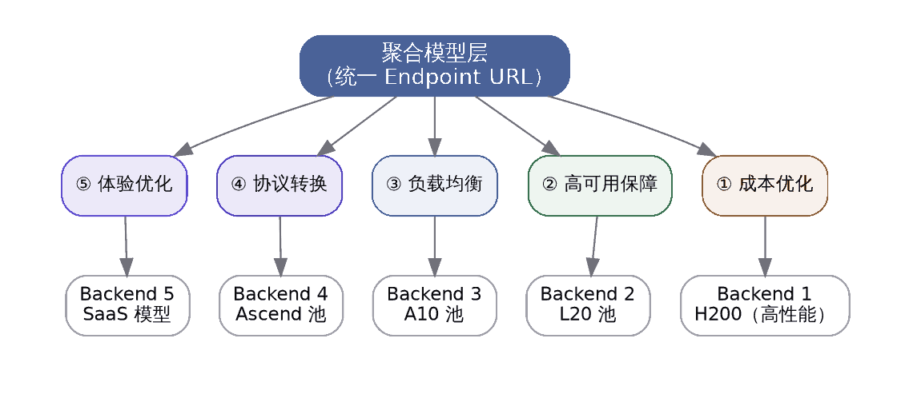

<i>图 4   聚合模型的五种匹配策略</i>

> 当前创建页面提供成本优先、成功率优先、成本与体验均衡、随机和轮询五种匹配策略。协议一致性属于创建前检查项，不是平台自动完成的协议转换策略。

### 5.3 五种匹配策略说明

#### 5.3.1 成本优化型聚合

- **作用**：在可用成员模型中优先考虑成本；
- **验证**：价格和实际路由结果以当前配置及调用记录为准。

#### 5.3.2 成功率优先

- **作用**：在可用成员模型中优先考虑调用成功率；
- **验证**：成功率统计口径和实际成员选择结果以当前版本及调用记录为准。

#### 5.3.3 成本与体验均衡

- **作用**：综合考虑成员模型的成本和调用体验；
- **验证**：本文不预设固定权重公式，实际结果通过调用记录确认。

#### 5.3.4 随机

- **作用**：从符合条件的成员模型中随机选择；
- **验证**：使用多次调用记录检查成员选择结果，不固定声明分布比例。

#### 5.3.5 轮询

- **作用**：按轮询方式在符合条件的成员模型之间选择；
- **验证**：成员变化后重新检查调用记录，确认轮询结果符合预期。

### 5.4 多场景聚合配置

| 聚合场景 | 可选策略 | 配置与验证重点 |
|---|---|---|
| **成本敏感调用** | 成本优先 | 核对成员价格配置和实际路由结果 |
| **优先保障成功调用** | 成功率优先 | 核对成功率统计口径和异常成员处理结果 |
| **兼顾成本与体验** | 成本与体验均衡 | 通过调用记录验证综合选择结果 |
| **成员间分配请求** | 随机或轮询 | 通过多次调用检查成员选择分布 |

### 5.5 聚合模型的成员调整与验证

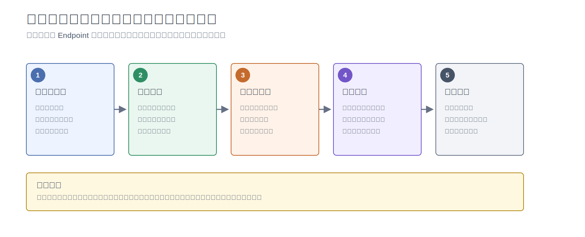

<i>图 5   聚合模型成员调整与调用连续性验证流程</i>

成员模型或匹配策略发生变化时，应先记录原配置，再按页面完成调整和必要审核，并通过调用、调用统计和调用日志验证结果。本文不默认承诺 Endpoint 保持不变、自动扩缩容或业务无感。

## 六、计量、账务与财务运营 — 精细化运营管控

### 6.1 能力概述

AGIOne 提供调用日志、用量、计量明细、额度、收益、用户账务、客户财务、运营财务、结算、对账和 License 状态等运营页面，用于查看当前环境记录的数据。计费维度、精度、币种、积分规则、结算方式、License 额度和财务账户流程以商业配置、模型返回字段、同步状态与部署版本为准。

### 6.2 多维计量数据采集

平台可记录或汇总下列计量维度；是否存在、精度和完整性取决于目标模型返回字段、计量配置和同步状态：

| 计量维度 | 采集内容 | 数据边界 |
|---|---|---|
| **输入 Token 数** | 模型返回或平台记录的输入 Token | 是否包含系统提示词和对话历史，以目标模型返回字段和计量配置为准 |
| **输出 Token 数** | 模型返回或平台记录的输出 Token | 流式中断场景的数据完整性需要按目标模型验证 |
| **调用次数**       | API 调用次数及成功、失败状态 | 统计口径以调用日志和当前页面为准 |
| **推理时长**       | 调用耗时、首 Token 时间等页面已记录字段 | 时间精度以当前页面、采集配置和部署版本为准 |
| **多模态计量**     | 模型返回的图像、音频或其他多模态用量 | 是否存在及单位取决于模型返回字段 |

### 6.3 积分制定价体系

平台可以使用额度或积分记录资源与调用消耗，具体单位和兑换关系由当前环境配置：

- **统一记录**：在用量与计量页面查看当前账号范围内的消耗数据；
- **配置关系**：币种、价格和额度关系以运营方维护的当前配置为准；
- **角色范围**：运营方、模型提供方和普通用户看到的数据范围不同；
- **结果核对**：调用、用量、计量和收益数据应按同一时间范围交叉核对。

#### 计费规则示例

> 以下数字只用于说明计算方式，不代表当前模型价格、兑换比例或结算规则。

| 模型规格 | 输入计费 | 输出计费 | 适用场景 |
|---|:---:|:---:|---|
| **DeepSeek-V3 / 128K** | 12 积分 / 千 Token | 48 积分 / 千 Token | 高价值复杂推理 |
| **Qwen2.5-72B / 64K**  | 8 积分 / 千 Token  | 32 积分 / 千 Token | 标准文档处理 |
| **DeepSeek-7B / 32K**  | 2 积分 / 千 Token  | 8 积分 / 千 Token  | 高并发轻量场景 |
| **Embedding 模型**     | 1 积分 / 千 Token  | —                  | 知识库索引、检索 |
| **OCR 服务**           | 5 积分 / 次        | —                  | 图像识别 |

> **💡 积分 ⇄ 金额示例**
>
> 假设兑换比例 `1 元 = 100 积分`：
> - 一次 1000 输入 + 500 输出 Token 的 DeepSeek-V3 调用 = 12 + 24 = **36 积分** = ¥0.36
> - 智能制造事业部月初下发 **10,000,000 积分**（折合 ¥10 万），可在月内自由消费。

### 6.4 计量清单与扣减清单

平台提供计量明细、用量、调用日志和收益等记录入口，可用于核对；实际字段、数据范围和同步时效以当前页面为准。

#### 6.4.1 计量清单（按调用维度）

记录 **每一次 API 调用** 的完整计量数据：

| 字段 | 示例 |
|---|---|
| 调用 ID | `req_2026042701000123` |
| 时间戳 | `2026-04-27 10:23:45.123` |
| 租户 / 用户 | 智能制造事业部 / zhangsan |
| 模型 / Endpoint | `deepseek-v3-128k-aggregated` |
| 输入 Token | 1,243 |
| 输出 Token | 587 |
| 推理时长（ms） | 8,234 |
| 调用结果 | Success |
| 应扣积分 | 1243×0.012 + 587×0.048 = **42.7 积分** |

#### 6.4.2 扣减清单（按账户维度）

按租户 / 用户 / 时段汇总积分扣减情况：

| 维度 | 维度示例 | 周期 | 起始积分 | 累计扣减 | 余额 |
|---|---|:---:|---:|---:|---:|
| 智能制造事业部 | （部门级） | 2026-04 | 10,000,000 | 6,234,891 | 3,765,109 |
| 智能制造事业部 / 张三 | （用户级） | 2026-04 | — | 432,156 | — |
| 智能制造事业部 / 示例应用 | （应用级） | 2026-04 | — | 1,892,344 | — |

### 6.5 财务与 License 运营

财务模块把计量数据扩展为面向账务和财务运营的流程，区分用户侧账务、模型提供方收益、客户财务、运营财务、巡检对账、结算和 License 管理。

| 范围 | 典型对象 | 用户手册入口 |
| --- | --- | --- |
| 用户账务 | 当前账号可见的余额、额度、交易流水、充值订单和月度账单 | [我的财务](../../usermanual/billing/user/billing/overview/) |
| 模型提供方收益 | 授权范围内的客户列表、收益和结算记录 | [收益](../../usermanual/billing/user/earnings/revenue/) |
| 客户财务 | 客户档案、业务线、充值订单和客户财务状态 | [客户财务](../../usermanual/billing/operator/customer-billing/customer-overview/) |
| 运营财务 | 今日任务、月结总览、结算单、财务账户、巡检对账和调账 | [运营财务](../../usermanual/billing/operator/finance-operations/monthly-overview/) |
| License | License 额度、有效期、激活状态和模块授权 | [License](../../usermanual/billing/operator/license/license/) |

涉及金额和结算结论时，应在具体财务页面中统一账期、组织、客户、账户和同步状态后判断，不应只依据模型调用计量结果直接推断结算结果。

## 七、调用可观测 — 全链路监控分析

### 7.1 能力概述

调用可观测通过调用总览、分析、日志以及 On-Prem 监控页面连接业务调用与资源状态。可关联到的链路范围和指标取决于角色权限、采集配置、目标模型返回字段与部署版本。

### 7.2 三类排查证据

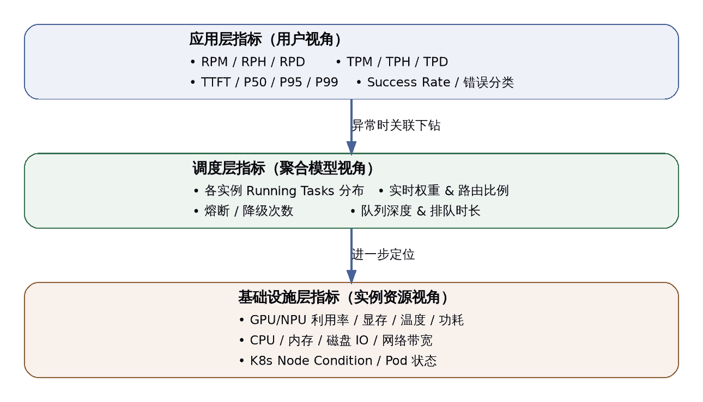

<i>图 6   调用问题排查的三类证据</i>

### 7.3 多维度调用统计

#### 7.3.1 按模型维度

- 查看模型或聚合模型的调用总量、成功、失败、限流触发和 Token 消耗；
- 使用调用统计进入目标模型的日志入口；
- 在调用日志中核对调用时间、状态、使用情况、耗时、首 Token 时间、失败类型和错误信息。

#### 7.3.2 按客户 / 租户维度

- 普通用户查看当前账号发起的调用；
- 模型提供方在授权范围内查看客户调用、用量和收益；
- 具体客户、租户和 Key 维度取决于当前页面、角色权限与部署版本。

#### 7.3.3 按时段维度

- 在调用概览或调用统计中选择相同时间范围比较调用趋势；
- 当前用户手册未确认自动生成未来 30 天 RPM/TPM 容量预测。

### 7.4 异常联动排查流程

当用户反馈调用异常时，可以按 **应用调用 → 模型与审核状态 → Endpoint 与配额 → 部署与资源监控** 的顺序排查：

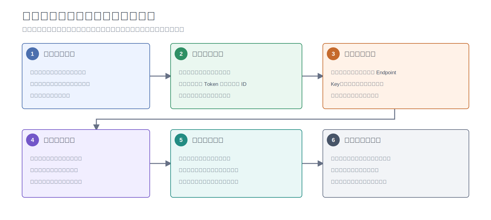

<i>图 7   从调用异常到资源状态的排查流程</i>

## 八、设置与访问控制 — 平台治理工作区

### 8.1 能力概述

设置模块集中维护身份、组织、审计、登录安全、平台配置和 API 流控能力。它用于支撑模型与算力流程周边的控制面治理，不直接承担模型发布或调用任务。

| 范围 | 典型对象 | 用户手册入口 |
| --- | --- | --- |
| 个人设置 | Key、账号信息、项目和个人工作台 | [我的 Keys](../../usermanual/settings/user/personal/my-keys/) |
| 成员与角色 | 团队成员、角色、成员额度和额度申请 | [团队成员](../../usermanual/settings/operator/members-roles/members/) |
| 组织 | 组织记录和用户侧组织设置 | [组织](../../usermanual/settings/operator/tenants/tenants/) |
| 消息与日志 | 操作日志和配置变更追踪 | [操作日志](../../usermanual/settings/operator/activity-notifications/operation-logs/) |
| 系统配置 | 平台设置和登录配置 | [平台设置](../../usermanual/settings/operator/system-settings/platform-settings/) |
| API 流控 | 规则管理、观测审计、节点缓存和发布中心 | [API 流控概览](../../usermanual/settings/operator/api-rate-control/overview/) |

设置变更可能影响真实用户、访问凭据、登录行为、审计可见性和 API 流量。修改成员、角色、登录策略、Key 或流控规则前，应确认角色范围、组织范围和回退方式。

## 九、能力联动闭环

AGIOne 的前六项业务链路能力可以按资源准备、模型配置、部署、发布、调用和运营顺序组合使用：

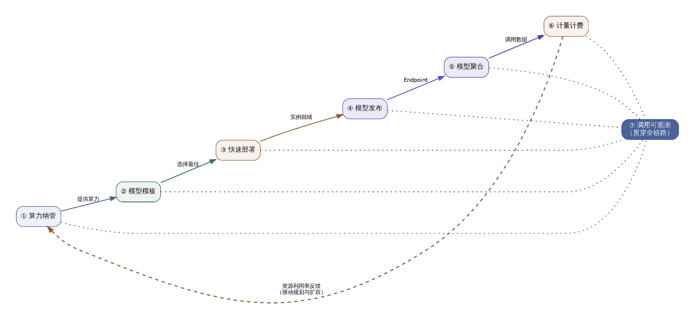

<i>图 8   AGIOne 前六项业务链路能力联动闭环</i>

**典型业务闭环**：

1. ① **算力纳管** 提供资源底座 →
2. ② **模型模板** 沉淀部署经验 →
3. ③ **快速部署** 将模型上线 →
4. ④ **模型发布** 转为商业服务 →
5. ⑤ **模型聚合** 优化用户体验 →
6. ⑥ **计量计费** 驱动财务核算 →
7. ⑦ **调用可观测** 反哺资源规划与模板优化 → 回到 ①
