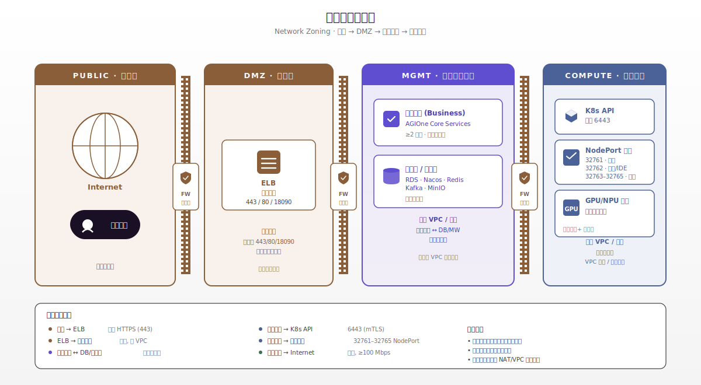
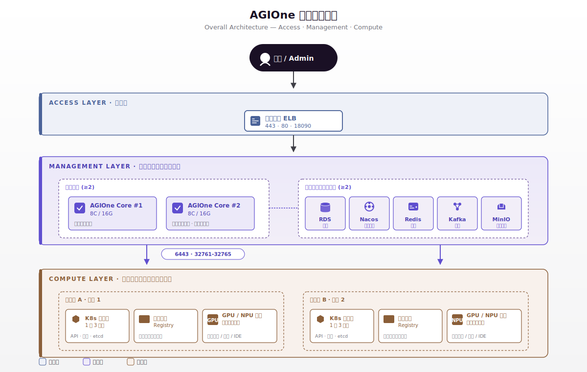
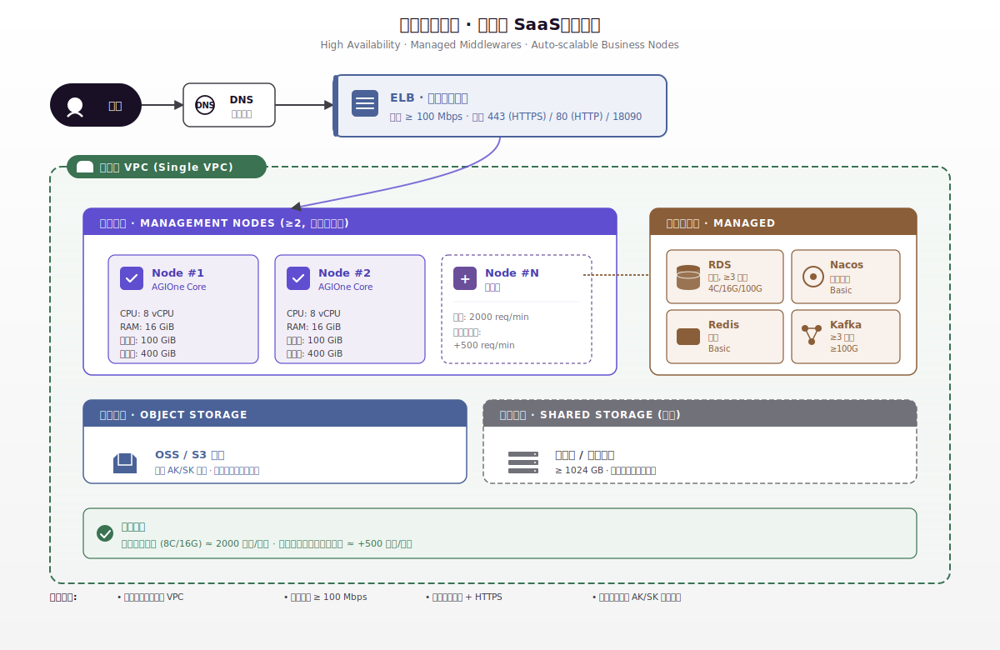
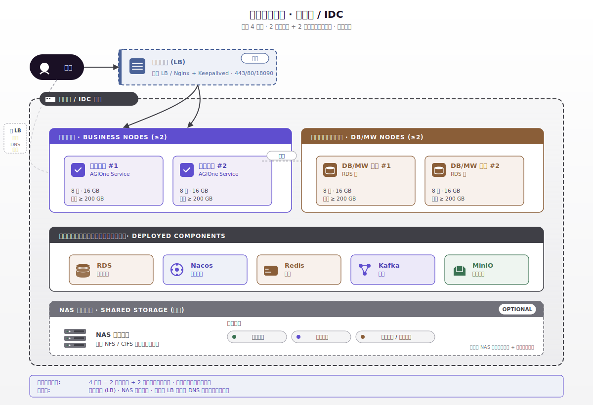
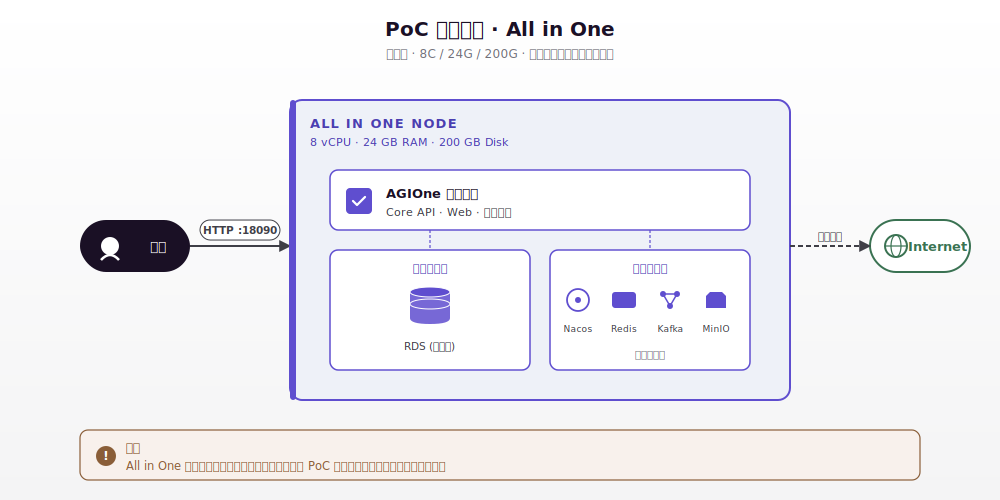
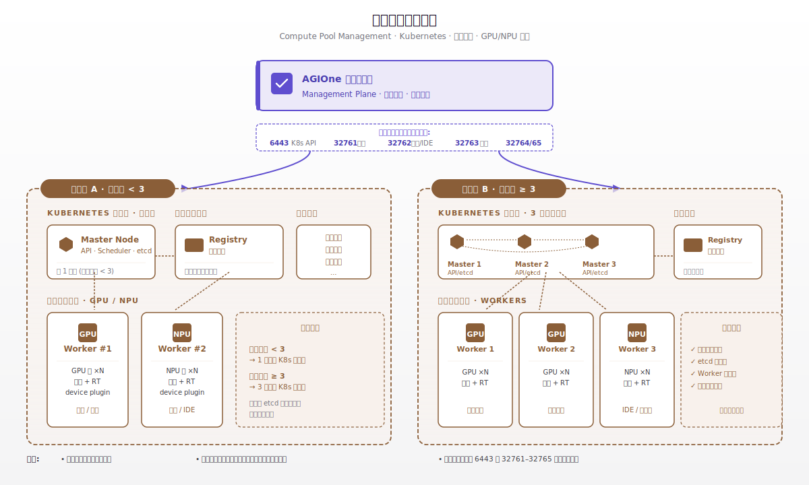

# 部署网络规划方案

:::: info 文档信息
版本：v1.1
更新日期：2026-07-13
端口事实基线：当前安装指南
::::
## 1. 文档目的

本文用于指导 AGIOne 平台在 PoC、公有云 SaaS、私有云 / IDC 等场景下的网络规划、网络分区、访问路径、安全组 / 防火墙放行策略与端口清单确认。

AGIOne 在逻辑上分为两个相对独立的网络域：

- 平台管理域：承载 AGIOne 控制面、业务服务、数据库、中间件、对象存储与对外访问入口。
- 算力节点域：承载 GPU / NPU 等算力节点、Kubernetes 集群、监控接口、模型 / IDE 访问能力与近端镜像服务。

两个网络域需要通过内网、VPC 对等连接、专线或等价方式实现互通。平台管理侧通过 Kubernetes API 与扩展 NodePort 端口管理和访问算力集群。

## 2. 部署模式与网络原则

| 部署模式 | 适用场景 | 对外入口 | 内部网络要求 | 互联网要求 |
| --- | --- | --- | --- | --- |
| PoC All in One | 概念验证、功能演示、内部测试 | HTTP `18090` | 单节点本机访问为主 | 可访问互联网，或具备包含所需镜像与运行资产的完整离线包 |
| 公有云 SaaS 生产 | 正式生产、对外提供服务 | ELB + 域名 + HTTPS `443` | 管理节点、中间件位于同一 VPC；算力池通过 VPC 对等 / 专线互通 | 建议保留出站能力，带宽 >= 100 Mbps |
| 私有云 / IDC 生产 | 数据合规、内网隔离、用户自持环境 | LB / DNS 轮询 + HTTPS `443` | 业务节点与数据 / 中间件节点内网互通；算力池通过内网 / 专线互通 | 建议具备受控出站能力；离线环境需准备离线镜像 |

生产环境建议优先满足以下原则：

- 用户入口统一收敛到 ELB / LB，不直接暴露业务节点。
- 生产访问使用域名与 HTTPS，`80` 端口仅用于 HTTP 到 HTTPS 跳转。
- 数据库与中间件仅开放在 VPC / 内网内部，不对公网暴露。
- 安全组 / 防火墙默认拒绝，仅按端口清单放行必要来源。
- 算力集群按地域算力池独立规划，避免跨地域调度导致网络抖动。
- 每个地域算力池建议部署近端镜像服务，减少大体积镜像跨地域拉取。

## 3. 逻辑网络分区

| 网络区域 | 主要组件 | 访问特征 | 规划建议 |
| --- | --- | --- | --- |
| 公网访问区 | 用户、域名、ELB / LB | 用户通过公网访问 AGIOne 平台 | 生产环境开放 `443`，可开放 `80` 做跳转 |
| 平台业务区 | AGIOne 业务节点 | 接收 ELB / LB 转发流量，访问数据库、中间件、对象存储和算力集群 | 与数据 / 中间件同 VPC 或同内网，建议 >= 2 节点 |
| 数据中间件区 | RDS / MySQL、Nacos、Redis、Kafka、MinIO | 仅供平台业务节点内网访问 | 禁止公网暴露；根据生产规模拆分独立节点 |
| 对象存储区 | 云 OSS / S3 / MinIO | 存放图片、静态资源等 | 公有云可使用 AK/SK 访问，优先使用 VPC Endpoint |
| 算力控制区 | Kubernetes API Server、控制面节点 | 平台管理层调用 Kubernetes API | 对平台管理层开放 `6443` |
| 算力服务区 | 监控、模型服务、IDE、扩展 NodePort | 平台管理层调用算力侧能力 | 对平台管理层开放 `32761-32765` |
| 镜像服务区 | 近端镜像仓库 | 算力节点拉取镜像 | 建议与算力节点位于同一二层或低延迟网络，带宽 >= 千兆 |

## 4. 推荐网络拓扑

### 4.1 整体逻辑架构

AGIOne 整体由用户访问入口、平台管理层、算力节点纳管层组成。平台管理层通过 Kubernetes API `6443` 与扩展端口 `32761-32765` 调度并访问算力集群。

### 4.2 公有云 SaaS 生产拓扑

### 4.3 私有云 / IDC 生产拓扑

### 4.4 PoC All in One 拓扑

PoC 节点必须能够访问所需镜像仓库和依赖源，或使用完整离线包。PoC 模式不具备高可用和数据冗余能力，不建议用于生产。

### 4.5 算力节点纳管架构

每个独立地域算力池作为一个逻辑单元独立部署。算力节点侧需提前完成 GPU / NPU 驱动、容器运行时和 device plugin 校验，并在近端部署镜像服务以提升镜像拉取速度。

## 5. 资源配置要求

### 5.1 PoC All in One 资源要求

| 项 | 最低要求 | 说明 |
| --- | --- | --- |
| 节点数 | 1 | 单节点承载业务服务、数据库和中间件 |
| CPU | >= 8 核 | 用于概念验证、功能演示、内部测试 |
| 内存 | >= 24 GB | 单节点混部，内存需覆盖业务与中间件 |
| 磁盘 | >= 200 GB | 用于应用、镜像、日志和基础数据 |
| 网络 | 在线或离线交付路径 | 必须能够取得全部所需镜像、依赖和运行资产 |
| 操作系统 | Linux | 推荐 Ubuntu 22.04 / CentOS 7+ |
| 对外端口 | `18090` | 默认 HTTP 服务端口 |

### 5.2 公有云 SaaS 生产资源要求

#### 5.2.1 管理节点

| 项 | 要求 | 说明 |
| --- | --- | --- |
| 节点数 | >= 2 | 业务节点可水平扩展 |
| 单节点 CPU | >= 8 vCPU | 基准规格 |
| 单节点内存 | >= 16 GiB | 基准规格 |
| 单节点磁盘 | >= 200 GiB | 应用、日志、本地缓存 |
| 内网 | 所有管理节点位于同一 VPC | 与数据库、中间件低延迟互通 |
| 公网 / 出站 | 可访问互联网，带宽 >= 100 Mbps | 用于镜像拉取、升级和依赖下载 |
| 共享存储 | 可选，>= 1024 GB | 供管理节点共享使用 |

#### 5.2.2 数据库与中间件

| 组件 | 用途 | CPU | 内存 | 磁盘 | 节点数 | 网络要求 |
| --- | --- | --- | --- | --- | --- | --- |
| RDS（关系型数据库） | 存储 AGIOne 平台主数据 | >= 4 vCPU | >= 16 GiB | >= 100 GiB | >= 3 | 与管理节点同 VPC |
| Nacos | 服务注册与发现 | Basic 规格 | - | - | 1 | 与管理节点同 VPC |
| Redis | 缓存数据 | Basic 规格 | - | - | 1 | 与管理节点同 VPC |
| Kafka | 核心服务消息总线 | 集群节点规格 | - | >= 100 GiB | >= 3 | 与管理节点同 VPC |
| 对象存储 | 存储图片等静态资源 | - | - | - | - | 通过 AK/SK 访问，优先走 VPC Endpoint |
| ELB | AGIOne API 负载均衡 | - | - | >= 100 GiB | 1 | 内网同 VPC；公网可访问，带宽 >= 100 Mbps |

#### 5.2.3 容量与扩展参考

| 项 | 参考值 |
| --- | --- |
| 单个业务节点基准容量 | 8 vCPU / 16 GiB 约 `2000 请求/分钟` |
| 扩容参考 | 长连接或耗时请求较多时，每新增 1 个业务节点约增加 `500 请求/分钟` |
| 评估因素 | 请求复杂度、模型推理时长、并发会话数、长连接比例 |

### 5.3 私有云 / IDC 生产资源要求

#### 5.3.1 必选资源

| 角色 | 节点数 | 单节点 CPU | 单节点内存 | 单节点磁盘 | 网络 | 说明 |
| --- | --- | --- | --- | --- | --- | --- |
| 业务节点 | >= 2 | >= 8 核 | >= 16 GB | >= 200 GB | 内网；可访问外部网络，带宽建议 >= 100 Mbps | 部署 AGIOne 业务服务 |
| 数据库 / 中间件节点 | >= 2 | >= 8 核 | >= 16 GB | >= 200 GB | 内网 | 部署 MySQL / RDS 等价组件、Nacos、Redis、Kafka、MinIO |
| 合计 | >= 4 | - | - | - | - | 生产私有化最小规模 |

#### 5.3.2 可选资源

| 资源 | 必选 / 可选 | 推荐配置 | 用途说明 |
| --- | --- | --- | --- |
| 负载均衡 LB | 可选，生产推荐 | 硬件 LB（F5 等）或软件 LB（Nginx / HAProxy + Keepalived） | 统一入口、流量分发、健康检查。未部署时可使用 DNS 轮询直连业务节点 |
| NAS 共享存储 | 可选 | 容量 >= 1024 GB；通过 NFS / CIFS 挂载到所有节点 | 存放公共日志、服务配置、共享文件 / 临时数据等跨节点访问内容 |
| 日志收集服务 | 可选 | Filebeat / Fluent Bit 等 | 未部署 NAS 时，用于汇聚本地日志 |
| 出站代理 / 离线仓库 | 按环境选择 | NAT / 代理 / 离线镜像仓库 | 受控出站或完全离线环境的软件包与镜像来源 |

### 5.4 算力节点纳管资源要求

| 项 | 要求 | 说明 |
| --- | --- | --- |
| 地域算力池 | 每个地域独立部署 | 避免跨地域调度造成网络抖动 |
| Kubernetes 控制面 | 算力池 < 3 节点时可 1 节点；>= 3 节点时建议 3 节点 | 3 控制面提供 etcd 多副本与高可用 |
| 算力节点 | 按 GPU / NPU 资源池规划 | 需提前安装并校验驱动、containerd 等容器运行时与 device plugin |
| 近端镜像服务 | 每个地域算力池建议部署 | 可复用已纳管节点资源，建议与算力节点低延迟互通 |
| 镜像网络 | 建议 >= 千兆 | 提升大体积模型镜像拉取速度 |
| 对平台开放端口 | `6443`, `32761-32765` | 平台管理层调度、监控、模型 / IDE 调用 |

### 5.5 资源规格速查

| 部署模式 | 最少节点 | 单节点最低规格 | 总资源参考 |
| --- | --- | --- | --- |
| PoC All in One | 1 | 8C / 24G / 200G | 8C / 24G / 200G |
| 公有云 SaaS（业务节点） | 2 | 8C / 16G / 200G | 16C / 32G / 400G+，另含托管数据库与中间件 |
| 私有云 / IDC | 4 | 8C / 16G / 200G | 32C / 64G / 800G+ |

## 6. VPC / 子网规划

### 6.1 公有云推荐规划

| 项目 | 规划项 | 示例 / 填写 |
| --- | --- | --- |
| 平台管理 VPC | VPC 名称 | `vpc-agione-mgmt-prod` |
| 平台管理 VPC | CIDR | `10.10.0.0/16` |
| 业务节点子网 | CIDR | `10.10.10.0/24` |
| 数据中间件子网 | CIDR | `10.10.20.0/24` |
| LB 子网 | CIDR | `10.10.30.0/24` |
| 算力池 VPC | VPC 名称 | `vpc-agione-compute-region-a` |
| 算力池 VPC | CIDR | `10.20.0.0/16` |
| 算力控制面子网 | CIDR | `10.20.10.0/24` |
| 算力节点子网 | CIDR | `10.20.20.0/22` |
| 近端镜像子网 | CIDR | `10.20.30.0/24` |
| 管理 VPC 与算力 VPC | 互通方式 | VPC 对等连接 / 云企业网 / 专线 |

### 6.2 私有云 / IDC 推荐规划

| 项目 | 规划项 | 示例 / 填写 |
| --- | --- | --- |
| 平台管理网段 | CIDR | `172.16.10.0/24` |
| 数据中间件网段 | CIDR | `172.16.20.0/24` |
| LB / 入口网段 | CIDR | `172.16.30.0/24` |
| 算力控制面网段 | CIDR | `172.16.40.0/24` |
| 算力节点网段 | CIDR | `172.16.50.0/22` |
| 近端镜像网段 | CIDR | `172.16.60.0/24` |
| 跨网段路由 | 互通方式 | 静态路由 / 动态路由 / 专线 |
| 出站互联网 | 访问方式 | NAT / 代理 / 离线镜像 |

> 实际 CIDR 应结合客户现有网络统一规划，避免与办公网、生产网、云上 VPC、容器 Pod CIDR、Service CIDR 冲突。

## 7. IP 地址规划模板

### 7.1 平台管理节点

| 角色 | 主机名 | IP 地址 | 所属子网 | 规格 | 备注 |
| --- | --- | --- | --- | --- | --- |
| 业务节点 1 |  |  |  | >= 8C / 16G / 200G | 生产必选 |
| 业务节点 2 |  |  |  | >= 8C / 16G / 200G | 生产必选 |
| 数据 / 中间件节点 1 |  |  |  | >= 8C / 16G / 200G | 私有云 / IDC 必选 |
| 数据 / 中间件节点 2 |  |  |  | >= 8C / 16G / 200G | 私有云 / IDC 必选 |
| LB / ELB |  |  |  | 云服务或等价 LB | 生产推荐 |
| NAS / 共享存储 |  |  |  | >= 1024 GB | 可选 |

### 7.2 算力集群节点

| 角色 | 主机名 | IP 地址 | 所属子网 | 规格 | 备注 |
| --- | --- | --- | --- | --- | --- |
| K8s 控制面 1 |  |  |  |  | < 3 节点算力池可单控制面 |
| K8s 控制面 2 |  |  |  |  | >= 3 节点算力池建议 3 控制面 |
| K8s 控制面 3 |  |  |  |  | >= 3 节点算力池建议 3 控制面 |
| 算力节点 1 |  |  |  | GPU / NPU | 需完成驱动与 device plugin 校验 |
| 算力节点 2 |  |  |  | GPU / NPU | 需完成驱动与 device plugin 校验 |
| 近端镜像服务 |  |  |  |  | 建议与算力节点低延迟互通 |

## 8. 网络访问矩阵

| 访问方向 | 源 | 目的 | 协议 / 端口 | 网络要求 | 说明 |
| --- | --- | --- | --- | --- | --- |
| 用户访问平台 | 公网用户 / 内网用户 | ELB / LB | TCP `443` | 公网或用户内网可达 | 生产 HTTPS 入口 |
| HTTP 跳转 | 公网用户 / 内网用户 | ELB / LB | TCP `80` | 可选 | 通常用于 301 跳转到 `443` |
| PoC 访问 | 用户 | PoC 节点 | TCP `18090` | 用户到 PoC 节点可达 | PoC 默认 HTTP 服务端口 |
| 入口转发 | ELB / LB | 业务节点 | TCP / HTTP(S) | 同 VPC / 内网 | 仅允许 LB 到业务节点 |
| 业务访问数据库 | 业务节点 | RDS / MySQL | TCP `3306` | 同 VPC / 内网低延迟 | 禁止公网暴露 |
| 业务访问 Nacos | 业务节点 | Nacos | TCP `8848`, `9848`, `9849` | 同 VPC / 内网 | 端口以实际部署配置为准 |
| 业务访问 Redis | 业务节点 | Redis | TCP `6379` | 同 VPC / 内网 | 禁止公网暴露 |
| 业务访问 Kafka | 业务节点 | Kafka | TCP `9092` | 同 VPC / 内网 | 禁止公网暴露 |
| 业务访问对象存储 | 业务节点 | OSS / S3 / MinIO | HTTPS 或 TCP `9000`, `9001` | VPC Endpoint / 内网优先 | 公有云通过 AK/SK 鉴权 |
| 平台管理算力集群 | 业务节点 / 平台管理层 | Kubernetes API Server | TCP `6443` | 管理域到算力域可达 | 调度与集群管理 |
| 平台采集监控 | 业务节点 / 平台管理层 | 算力集群 NodePort | TCP `32761` | 管理域到算力域可达 | 监控接口 |
| 平台访问模型 / IDE | 业务节点 / 平台管理层 | 算力集群 NodePort | TCP `32762` | 管理域到算力域可达 | 模型及 IDE 调用 |
| 扩展备用 | 业务节点 / 平台管理层 | 算力集群 NodePort | TCP `32763-32765` | 管理域到算力域可达 | 扩展备用端口 |
| 算力拉取镜像 | 算力节点 | 近端镜像服务 | 以镜像服务配置为准 | 算力池近端网络，建议 >= 千兆 | 避免跨地域拉取大镜像 |
| 管理节点出站 | 管理节点 | Internet / 镜像仓库 | HTTPS / 按需 | 使用在线资产时需要；具备完整离线包时可不开放 | 用于镜像拉取、升级、依赖下载 |

## 9. 端口放行清单

### 9.1 平台管理入口端口

| 端口 | 协议 | 来源 | 目的 | 用途 | 是否公网开放 |
| --- | --- | --- | --- | --- | --- |
| `18090` | TCP / HTTP | 用户 / 内部 | PoC 节点或业务节点 | 默认 HTTP 服务端口，PoC 默认使用 | PoC 按需开放 |
| `80` | TCP / HTTP | 公网用户 / 内网用户 | ELB / LB | 生产环境 HTTP，通常跳转到 HTTPS | 可选 |
| `443` | TCP / HTTPS | 公网用户 / 内网用户 | ELB / LB | 生产环境 HTTPS 入口 | 是 |

### 9.2 算力集群对平台管理层开放端口

| 端口 | 协议 | 来源 | 目的 | 用途 |
| --- | --- | --- | --- | --- |
| `6443` | TCP | 平台管理层 | Kubernetes API Server | Kubernetes API |
| `32761` | TCP | 平台管理层 | 算力集群 NodePort | 监控接口 |
| `32762` | TCP | 平台管理层 | 算力集群 NodePort | 模型及 IDE 调用 |
| `32763` | TCP | 平台管理层 | 算力集群 NodePort | 扩展备用端口 |
| `32764` | TCP | 平台管理层 | 算力集群 NodePort | 扩展备用端口 |
| `32765` | TCP | 平台管理层 | 算力集群 NodePort | 扩展备用端口 |

### 9.3 内部中间件参考端口

| 组件 | 默认端口 | 来源 | 暴露范围 | 说明 |
| --- | --- | --- | --- | --- |
| RDS / MySQL | `3306` | 业务节点 | VPC / 内网 | 存储 AGIOne 平台主数据 |
| Nacos | `8848`, `9848`, `9849` | 业务节点 | VPC / 内网 | 服务注册与发现 |
| Redis | `6379` | 业务节点 | VPC / 内网 | 缓存数据 |
| Kafka | `9092` | 业务节点 | VPC / 内网 | 核心服务消息总线 |
| MinIO | `9000`, `9001` | 业务节点 | VPC / 内网 | 私有化对象存储 |

实际端口以部署时使用的版本与配置为准。

## 10. 安全组 / 防火墙策略

### 10.1 公网入口安全组

| 规则 | 方向 | 来源 | 目的端口 | 动作 | 说明 |
| --- | --- | --- | --- | --- | --- |
| 允许 HTTPS | 入站 | `0.0.0.0/0` 或指定用户网段 | `443` | Allow | 生产主入口 |
| 允许 HTTP 跳转 | 入站 | `0.0.0.0/0` 或指定用户网段 | `80` | Allow | 可选，仅做跳转 |
| 限制 PoC HTTP | 入站 | 指定办公网 / 测试网段 | `18090` | Allow | PoC 场景使用 |
| 默认拒绝 | 入站 | Any | Any | Deny | 不开放其他端口 |

### 10.2 平台业务安全组

| 规则 | 方向 | 来源 | 目的端口 | 动作 | 说明 |
| --- | --- | --- | --- | --- | --- |
| LB 到业务节点 | 入站 | ELB / LB 安全组 | 业务服务端口 | Allow | 仅允许入口层转发 |
| 业务到中间件 | 出站 | 业务节点 | `3306`, `6379`, `8848`, `9848`, `9849`, `9092`, `9000`, `9001` | Allow | 访问内部数据与中间件 |
| 业务到算力集群 | 出站 | 业务节点 | `6443`, `32761-32765` | Allow | 管理和访问算力集群 |
| 业务到互联网 | 出站 | 业务节点 | `443` 等按需 | Allow | 镜像拉取、升级、依赖下载 |

### 10.3 数据中间件安全组

| 规则 | 方向 | 来源 | 目的端口 | 动作 | 说明 |
| --- | --- | --- | --- | --- | --- |
| 业务访问 RDS / MySQL | 入站 | 业务节点安全组 / 业务子网 | `3306` | Allow | 禁止公网访问 |
| 业务访问 Redis | 入站 | 业务节点安全组 / 业务子网 | `6379` | Allow | 禁止公网访问 |
| 业务访问 Nacos | 入站 | 业务节点安全组 / 业务子网 | `8848`, `9848`, `9849` | Allow | 禁止公网访问 |
| 业务访问 Kafka | 入站 | 业务节点安全组 / 业务子网 | `9092` | Allow | 禁止公网访问 |
| 业务访问 MinIO | 入站 | 业务节点安全组 / 业务子网 | `9000`, `9001` | Allow | 私有化部署场景 |
| 默认拒绝 | 入站 | Any | Any | Deny | 数据组件不得公网暴露 |

### 10.4 算力集群安全组

| 规则 | 方向 | 来源 | 目的端口 | 动作 | 说明 |
| --- | --- | --- | --- | --- | --- |
| 平台管理到 K8s API | 入站 | 平台业务子网 / 业务节点安全组 | `6443` | Allow | Kubernetes API Server |
| 平台管理到监控接口 | 入站 | 平台业务子网 / 业务节点安全组 | `32761` | Allow | 监控接口 |
| 平台管理到模型 / IDE | 入站 | 平台业务子网 / 业务节点安全组 | `32762` | Allow | 模型及 IDE 调用 |
| 平台管理到扩展端口 | 入站 | 平台业务子网 / 业务节点安全组 | `32763-32765` | Allow | 扩展备用 |
| 算力节点到近端镜像 | 出站 | 算力节点 | 镜像服务端口 | Allow | 镜像拉取 |
| 默认拒绝 | 入站 | Any | Any | Deny | 不允许公网直接访问算力节点 |

## 11. 域名与证书规划

| 项目 | 规划内容 | 示例 / 填写 |
| --- | --- | --- |
| 平台访问域名 | AGIOne 控制台访问入口 | `agione.example.com` |
| DNS 解析 | 域名解析目标 | ELB / LB 公网地址或内网地址 |
| HTTPS 证书 | 证书来源 | 公有 CA / 企业 CA |
| HTTP 访问策略 | `80` 端口处理方式 | 301 跳转到 `443` |
| 证书更新机制 | 更新责任人 / 方式 | 手动更新 / 自动续期 |

生产环境必须在 ELB / LB 或入口代理上配置 HTTPS 证书，避免用户直接通过 HTTP 访问平台。

## 12. 带宽与延迟建议

| 网络路径 | 建议 |
| --- | --- |
| 用户到 ELB / LB | 根据并发用户量规划公网带宽，生产建议 >= 100 Mbps 起步 |
| ELB / LB 到业务节点 | 同 VPC / 内网转发，保持低延迟 |
| 业务节点到数据库 / 中间件 | 同 VPC / 同内网，低延迟、稳定连接 |
| 平台管理层到算力集群 | 使用 VPC 对等、云企业网、专线或等价内网链路，避免公网绕行 |
| 算力节点到近端镜像 | 建议 >= 千兆网络；多地域部署时每个地域维护独立近端镜像 |
| 管理节点出站互联网 | 在线交付时提供受控出站；否则准备并验证完整离线包 |

## 13. 部署前网络检查清单

### 13.1 基础网络

- [ ] 已确定部署模式：PoC / 公有云 SaaS / 私有云 IDC。
- [ ] 已完成 VPC / 子网 / 网段规划，且与现有网络无冲突。
- [ ] 平台管理节点位于同一 VPC 或同一内网可达区域。
- [ ] 数据库、中间件、对象存储仅在内网暴露。
- [ ] 管理节点可访问互联网，或已准备离线镜像与离线依赖。
- [ ] NTP / 时钟同步可用，各节点时区一致。

### 13.2 入口与域名

- [ ] 已申请并解析生产访问域名。
- [ ] 已准备 HTTPS 证书。
- [ ] 已规划 ELB / LB 监听 `443`。
- [ ] 如开放 `80`，已配置跳转到 `443`。
- [ ] PoC 场景已限制 `18090` 访问来源。

### 13.3 安全组 / 防火墙

- [ ] 公网仅开放必要入口端口。
- [ ] 业务节点仅允许 ELB / LB 或指定来源访问。
- [ ] 数据库与中间件端口未对公网开放。
- [ ] 平台管理层到算力集群已放行 `6443` 和 `32761-32765`。
- [ ] 安全组 / 防火墙默认拒绝未声明端口。

### 13.4 算力集群

- [ ] 已按地域算力池独立规划网络。
- [ ] 已确认每个算力池 Kubernetes 控制面规模：1 节点或 3 节点。
- [ ] 算力节点 GPU / NPU 驱动、容器运行时、device plugin 已完成校验。
- [ ] 近端镜像服务已规划，并与算力节点低延迟互通。
- [ ] 多地域场景已避免跨地域拉取大体积镜像。

## 14. 待确认事项

| 序号 | 待确认项 | 当前状态 | 责任人 | 备注 |
| --- | --- | --- | --- | --- |
| 1 | 最终部署模式 | 待确认 |  | PoC / 公有云 SaaS / 私有云 IDC |
| 2 | 生产访问域名 | 待确认 |  |  |
| 3 | HTTPS 证书来源 | 待确认 |  |  |
| 4 | VPC / 子网 CIDR | 待确认 |  | 需避免与现网冲突 |
| 5 | 平台管理到算力集群互通方式 | 待确认 |  | VPC 对等 / 专线 / 内网路由 |
| 6 | 是否允许管理节点出站互联网 | 待确认 |  | 不允许时需准备离线镜像 |
| 7 | 近端镜像服务部署位置 | 待确认 |  | 每地域算力池建议独立部署 |
| 8 | 安全组 / 防火墙审批流程 | 待确认 |  |  |

## 15. 附录：端口速查

| 类别 | 端口 | 用途 |
| --- | --- | --- |
| 平台入口 | `18090` | PoC 默认 HTTP 服务端口 |
| 平台入口 | `80` | 生产 HTTP，通常跳转到 HTTPS |
| 平台入口 | `443` | 生产 HTTPS |
| 算力集群 | `6443` | Kubernetes API Server |
| 算力集群 | `32761` | 监控接口 |
| 算力集群 | `32762` | 模型及 IDE 调用 |
| 算力集群 | `32763-32765` | 扩展备用端口 |
| 数据库 | `3306` | RDS / MySQL |
| 注册中心 | `8848`, `9848`, `9849` | Nacos |
| 缓存 | `6379` | Redis |
| 消息队列 | `9092` | Kafka |
| 对象存储 | `9000`, `9001` | MinIO |
