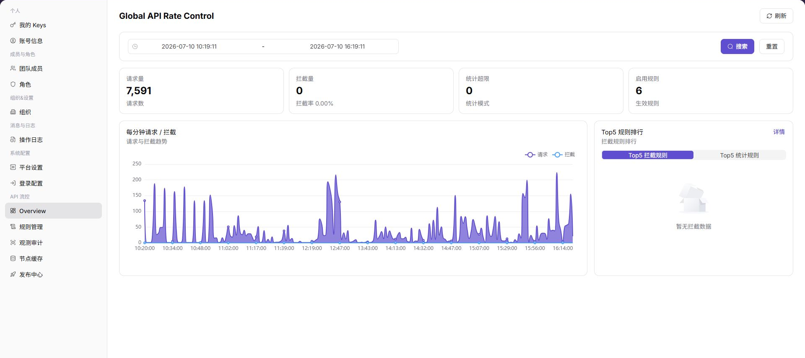
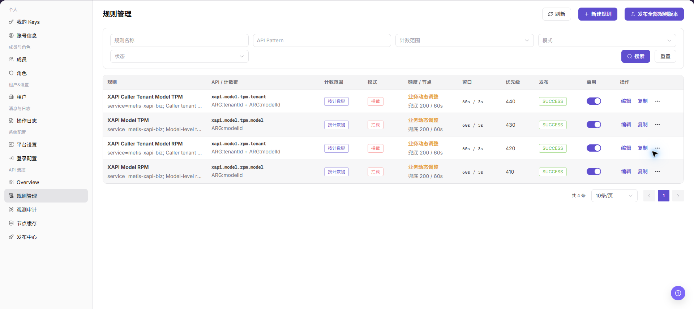
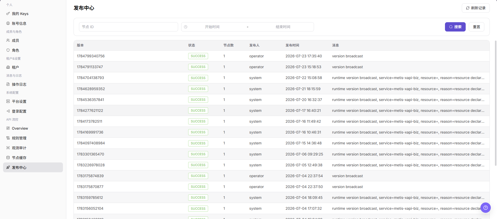
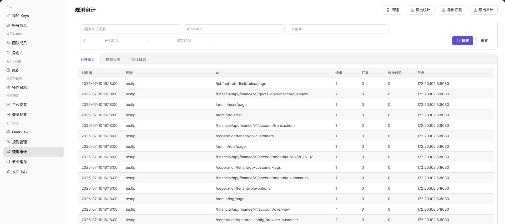

# 发布并审计 API 流控规则

本任务用于安全发布一版 API 流控规则，并验证节点生效情况和业务影响。

## 适用角色

- 平台运营方、API 网关管理员、安全与审计人员

## 开始前准备

1. 记录目标 API、租户或模型范围及当前正常请求基线。
2. 明确统计模式或拦截模式、阈值、观察窗口和回退条件。
3. 确认发布权限、审批要求和目标节点范围。

## 操作流程

### 1. 记录流量基线

进入[API 流控概览](../../../usermanual/settings/operator/api-rate-control/overview/)，选择覆盖正常和峰值的时间范围，记录请求量、拦截请求、统计超限和 Top 规则。不要只根据总请求量判断规则是否合理。

### 2. 创建或复核规则

进入[规则管理](../../../usermanual/settings/operator/api-rate-control/rule-management/)，核对 API Pattern、计数范围、模式、额度、窗口和优先级。新规则宜先使用统计或小范围观察方式验证，确认不会误匹配其他 API 后再扩大范围。

### 3. 发布并核对节点版本

按审批要求发布目标规则版本，然后进入[发布中心](../../../usermanual/settings/operator/api-rate-control/publish-center/)核对版本、状态、节点数、发布人和消息；再进入[节点缓存](../../../usermanual/settings/operator/api-rate-control/node-cache/)确认目标节点加载了相同版本。存在失败节点时先定位原因，不要反复全量发布。

### 4. 观察命中和审计明细

回到概览查看请求和拦截趋势，再进入[观测审计](../../../usermanual/settings/operator/api-rate-control/observability-audit/)，按相同 API、节点和时间范围核对分钟统计、拦截日志和审计日志。发现误拦截或异常增长时，按预案调整或回退规则。

## 完成检查

> **用途：** 以下检查确认发布动作已经转化为可观察、可解释的节点行为。任一项失败时，应先停止扩大规则范围。

| 检查项 | 通过标准 |
| --- | --- |
| 规则配置 | API 匹配、计数范围、阈值、模式和优先级正确。 |
| 发布记录 | 目标版本、节点数、状态和发布消息符合预期。 |
| 节点缓存 | 所有目标节点加载相同有效版本。 |
| 命中审计 | 概览指标与审计记录可对应，误拦截在可接受范围。 |
| 回退能力 | 回退条件、责任人和验证方法已明确。 |

## 常见失败分支

| 现象 | 优先检查 |
| --- | --- |
| 发布成功但规则不生效 | 启用状态、API Pattern、规则优先级和节点缓存版本 |
| 仅部分节点生效 | 发布目标、失败消息、节点在线状态和缓存更新时间 |
| 拦截量异常升高 | 业务峰值、调用方重试、匹配范围和阈值 |
| 概览有拦截但审计查不到 | 时间范围、页签、API Path、节点和数据上报延迟 |
