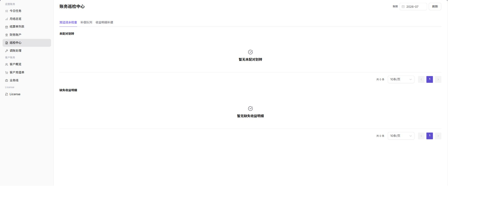

# 运营账期对账与结算

本任务用于完成一次运营侧账期检查、异常处理和结算确认。

## 适用角色

- 平台运营方、账务运营人员、财务对账人员

## 开始前准备

1. 确认目标账期、组织、客户和业务线。
2. 确认当前账号具备查看财务账户、巡检和结算单的权限。
3. 对生成结算单、补偿、补建或调账操作完成影响评估。

## 操作流程

### 1. 确认月结状态与待办

进入[月结总览](../../../usermanual/billing/operator/finance-operations/monthly-overview/)，选择目标账期，核对收入、支出、净变动、异常数量和更新时间；再进入[今日任务](../../../usermanual/billing/operator/finance-operations/today-tasks/)处理会影响结算的高优先级任务。

### 2. 核对财务账户

进入[财务账户](../../../usermanual/billing/operator/finance-operations/financial-accounts/)，在同一账期和组织范围内核对平台清分账户、收益账户及交易流水。金额不一致时先统一筛选条件，不直接进入调账。

### 3. 处理巡检异常

进入[巡检中心](../../../usermanual/billing/operator/finance-operations/reconciliation-center/)，刷新目标账期，检查未配对划转、缺失收益明细和补偿队列。必要时执行双边流水检查或收益明细补建，并记录处理结论。

### 4. 查看或生成结算单

进入[结算单列表](../../../usermanual/billing/operator/finance-operations/settlement-list/)，按账期、状态和组织搜索。生成前确认前述页面没有阻塞异常；生成后进入详情核对结算构成、状态和入账确认信息。

### 5. 必要时执行调账并复核

只有差异来源已定位且审批依据充分时，才进入[调账处理](../../../usermanual/billing/operator/finance-operations/account-adjustment/)。完成后返回月结总览、财务账户、巡检中心和结算单列表复核结果。

## 完成检查

> **用途：** 以下检查用于确认当前账期任务已经形成可追溯的结算结果。任一项不满足时，请先按“常见失败分支”处理。

| 检查项 | 通过标准 |
| --- | --- |
| 账期范围 | 所有页面使用同一账期和组织范围。 |
| 账户流水 | 汇总金额能够回溯到财务账户和交易流水。 |
| 巡检异常 | 阻塞异常已处理，剩余事项有明确结论。 |
| 结算结果 | 结算单金额、状态和入账信息正确。 |
| 调账复核 | 调账前后差异和审批依据可追溯。 |

## 常见失败分支

| 现象 | 优先检查 |
| --- | --- |
| 月结汇总与账户金额不一致 | 账期、组织、交易类型和数据更新时间 |
| 巡检异常长期未消除 | 补偿队列、缺失收益明细和责任人 |
| 结算单无法生成 | 月结状态、阻塞异常、权限和生成条件 |
| 调账后数据仍不一致 | 调账方向、影响账期、关联单据和同步状态 |
