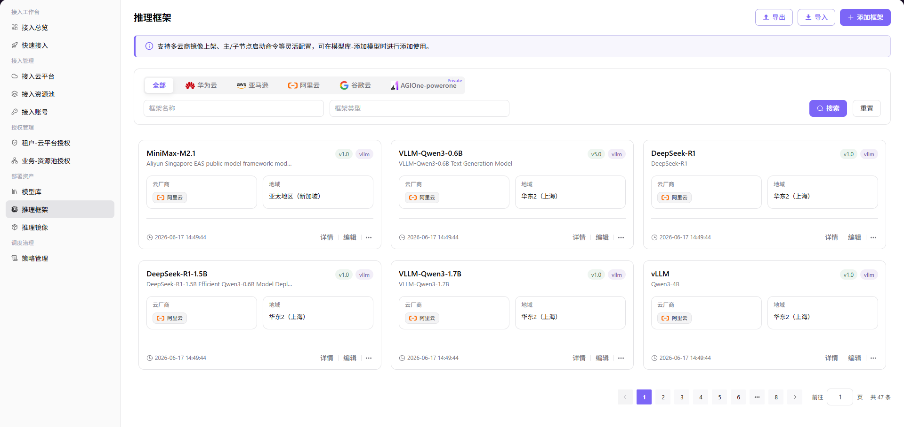

# 推理框架

本任务把推理镜像、启动命令、服务端口和框架类型组合为可复用的部署运行时。

## 场景目标

推理框架能够使用目标镜像启动服务，并暴露预期端口供模型资产引用。

## 适用角色

- 平台运营方（Operator）

## 开始前准备

- 已准备并验证推理镜像。
- 已确认框架类型、启动命令、模型占位符、服务端口和健康检查方式。

## 操作步骤

### 添加框架

1. 进入平台首页，点击左侧导航栏的 **"部署资产 > 推理框架"** 菜单，进入推理框架页面。
2. 点击页面右上角的 **"添加框架"** 按钮，弹出「添加框架」窗口。

3. 在「基本信息」区域填写：
   - **"框架图标"**：点击 **"选择图片"** 上传框架 logo（支持 jpg/png/svg，文件 ≤ 1MB，最佳尺寸 64x64）。
   - **"框架名称"**（多语言）：中文简体（如 `vllm`）/ English（如 `vllm`）两个 Tab 独立维护。
   - **"框架类型"**（多选枚举）：vllm / tgi / sglang / ollama / asr / tts / sdk-stable-diffusion / comfyui，至少选 1 个。
   - **"框架描述"**（多语言）：中文简体 / English 两个 Tab 独立维护，支持富文本格式。
4. 在「运行时环境」区域填写：
   - **"镜像"**：点击 **"选择镜像"** 按钮，从镜像列表（如 `eas-registry-vpc.cn-shanghai.cr.aliyuncs.com/pai-eas/vllmv:0.9.1-modelgallery`）中单选目标镜像，鼠标悬停镜像可查看版本。
   - **"端口"**：填写框架运行时对外暴露的服务端口（默认 `8000`）。
   - **"启动命令"**（多选表单）：以列表形式维护框架的启动命令（如 `--port 8000 --model {model_name} --trust-remote-code`），每个命令项含 协议（如 http）/ 命令内容，支持添加/删除。
5. 确认所有配置无误后，点击 **"保存"** 按钮完成框架添加；如需放弃，点击 **"取消"**。

#### 参数说明 - 基本信息

| 字段名称 | 字段类型 | 示例 | 说明 |
|----------|----------|------|------|
| 框架图标 | 上传 | — | 必填，支持 jpg/png/svg，文件 ≤ 1MB，最佳 64x64 |
| 框架名称（多语言） | 文本 | 中文 `vllm` / English `vllm` | 必填，两个 Tab 独立维护 |
| 框架类型 | 多选 | `vllm`、`tgi`、`sglang` | 必填，至少选 1 个 |
| 框架描述（多语言） | 富文本 | — | 选填，两个 Tab 独立维护 |

#### 参数说明 - 运行时环境

| 字段名称 | 字段类型 | 示例 | 说明 |
|----------|----------|------|------|
| 镜像 | 单选 | `eas-registry-vpc.cn-shanghai.cr.aliyuncs.com/pai-eas/vllmv:0.9.1-modelgallery` | 必填，从镜像列表中选择 |
| 端口 | 数值 | `8000` | 必填，框架对外暴露的服务端口 |
| 启动命令 | 列表 | `--port 8000 --model {model_name} --trust-remote-code` | 必填，支持多条命令 |

## 完成检查

> **用途：** 以下检查是当前功能任务的退出条件，用于判断操作结果是否可观察、可复核，以及是否可以继续当前场景的下一步。它不是操作步骤的重复；任一项不满足时，请按下方“常见失败分支”继续排查。

| 检查项 | 通过标准 |
| --- | --- |
| 1 | 镜像、框架类型、启动命令和端口相互兼容。 |
| 2 | 服务健康和 API 行为可验证。 |
| 3 | 模型资产配置可以选择该框架。 |

## 常见失败分支

| 现象 | 优先检查 |
| --- | --- |
| 框架启动失败 | 镜像兼容性、命令参数、模型路径和端口 |
| 模型资产选不到框架 | 框架状态、框架类型和目标云兼容性 |

## 操作手册

[查看“推理框架”的完整字段、校验规则和常见问题](/zh-CN/usermanual/ai-infra-on-cloud/operator/deploy-assets/frameworks/)
