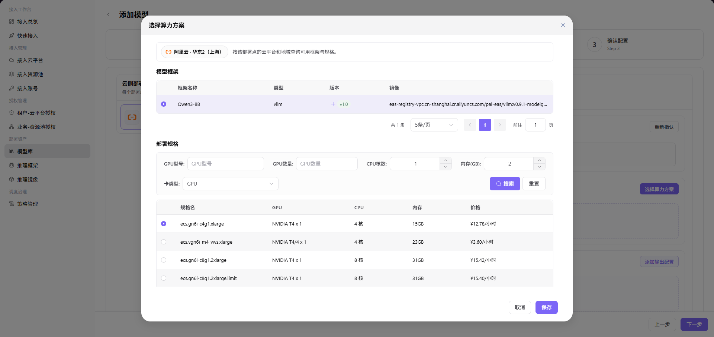
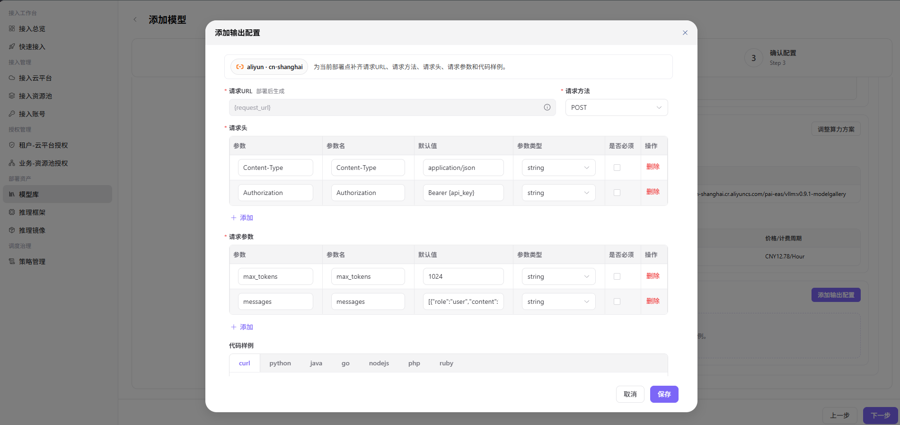

# 模型库

## 操作步骤

### 添加模型

1. 进入平台首页，点击左侧导航栏的 **"部署资产 > 模型库"** 菜单，进入模型库页面。
2. 点击页面右上角的 **"添加模型"** 按钮，进入添加模型流程（3 步）。

3. **Step 1：元模型 / 上架版本**：
   - **"元模型筛选"**：在筛选器（全部作者 / 全部类型 / 关键字搜索）中定位目标元模型，已选元模型会作为标签展示在筛选器下方，可点击标签删除。
   - **"元模型选择"**：在元模型列表中单选目标元模型（如 `Qwen3-8b`），右侧展示元模型详情（能力与接入约束：上下文窗口 128 / 最大输入 96 / 最大输出 8 / 模态：输入:文本 输出:文本 / 能力：工具调用 深度思考 / 协议兼容：openai/chat_completions；元模型资料：系列 Qwen3 / 元模型类型 对话模型 / 模型作者 Qwen / 元模型子类型 LLM / 场景 文本生成 / 描述）。
   - **"上架版本"**：填写 **"版本"**（如 `1.0.0`）与 **"版本描述"**（富文本）。
   - 点击 **"下一步"**。

1. **Step 2：部署配置**：
   - **"云侧部署点"**：左侧管理部署点（每个部署点绑定一个云平台 + 地域），可点击 **"+ 添加部署点"** 新增。

   - **"云上模型"**：点击 **"指认云上模型"** 按钮，配置元模型与云账号下的云上模型（如 `aliyun-wh-dev` / `Qwen3-8B`），点击 **"保存"**。

   - **"算力配置"**：点击 **"选择算力方案"** 按钮，单选目标模型框架（如 `Qwen3-8B` / vllm / v1.0 / `eas-registry-vpc.cn-shanghai.cr.aliyuncs.com/pai-eas/vllmv:0.9.1-modelgallery`）与部署规格（如 `ecs.gn6i-c4g1.xlarge` / NVIDIA T4 x 1 / 4 核 / 15GB / CNY12.78/Hour），点击 **"保存"**。

   - **"输出配置"**：点击 **"添加输出配置"** 按钮，配置请求 URL（部署后自动生成，模板 `{request_url}`）、请求方法（如 `POST`）、请求头（Content-Type: application/json / Authorization: Bearer {api_key}）、请求参数（max_tokens: 1024 / messages: [{"role":"user","content":"hello"}]）与多语言代码样例（curl / python / java / go / nodejs / php / ruby），点击 **"保存"**。

   - 点击 **"下一步"**。
1. **Step 3：确认配置**：核对模板整体配置信息（元模型信息 / 能力与接入约束 / 元模型资料 / 部署配置：云上模型 + 算力配置 + 输出配置），确认无误后点击 **"提交"** 完成模型添加；如需修改，点击 **"上一步"** 返回对应步骤。

#### 参数说明 - 元模型/上架版本（Step 1）

| 字段名称 | 字段类型 | 示例 | 说明 |
|----------|----------|------|------|
| 元模型 | 单选 | `Qwen3-8b`（唯一标识 `qwen/qwen3-8b`） | 必填，选择基础元模型 |
| 上架版本 - 版本 | 文本 | `1.0.0` | 必填，模型上架版本号 |
| 上架版本 - 版本描述 | 富文本 | — | 选填，说明该版本更新内容 |

#### 参数说明 - 部署配置（Step 2）

| 字段名称 | 字段类型 | 示例 | 说明 |
|----------|----------|------|------|
| 云侧部署点 | 列表 | `阿里云·华东2（上海）` | 必填，每个部署点绑定一个云平台 + 地域 |
| 云账号 | 下拉选择 | `aliyun-wh-dev` | 必填，模型部署使用的云账号 |
| 云上模型 | 下拉选择 | `Qwen3-8B` | 必填，指认到云账号下的云上模型 |
| 模型框架 | 单选 | `Qwen3-8B` / vllm / v1.0 / `eas-registry-vpc.cn-shanghai.cr.aliyuncs.com/pai-eas/vllmv:0.9.1-modelgallery` | 必填，模型框架与运行时版本 |
| 部署规格 | 单选 | `ecs.gn6i-c4g1.xlarge` / NVIDIA T4 x 1 / 4 核 / 15GB / CNY12.78/Hour | 必填，GPU 型号 / 数量 / CPU 核数 / 内存 |
| 请求 URL | URL | `{request_url}`（部署后生成） | 必填，模型调用端点 |
| 请求方法 | 下拉选择 | `POST` | 必填，HTTP 请求方法 |
| 请求头 - Content-Type | 文本 | `application/json` | 必填，请求内容类型 |
| 请求头 - Authorization | 文本 | `Bearer {api_key}` | 必填，访问凭证 |
| 请求参数 - max_tokens | 数值 | `1024` | 必填，最大生成 Token 数 |
| 请求参数 - messages | 数组 | `[{"role":"user","content":"hello"}]` | 必填，对话消息内容 |

