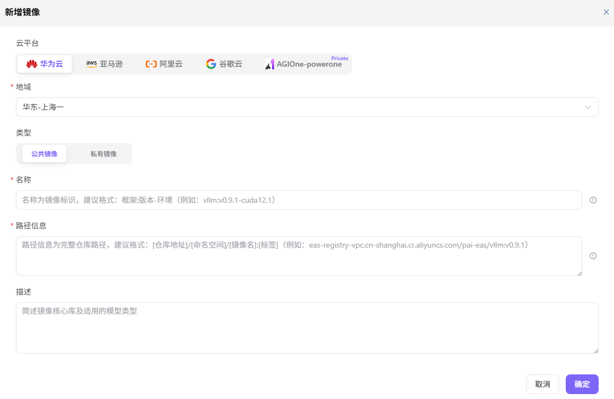

# 推理镜像

本任务登记推理框架运行时使用的云端镜像，镜像可用性会直接影响后续服务启动。

## 场景目标

目标云环境可以拉取该镜像，推理框架配置时能够选择它。

## 适用角色

- 平台运营方

## 开始前准备

- 确认完整仓库地址、受控版本 Tag 和支持的框架类型。
- 确认目标云环境具备镜像仓库的网络和拉取权限。

## 操作步骤

### 添加镜像

1. 进入平台首页，点击左侧导航栏的 **"部署资产 > 推理镜像"** 菜单，进入推理镜像页面。
2. 点击页面右上角的 **"添加镜像"** 按钮，弹出「添加镜像」窗口。

3. 在窗口中填写：
   - **"镜像名称"**（多语言）：中文简体（如 `vllm`）/ English（如 `vllm`）两个 Tab 独立维护。
   - **"镜像仓库地址"**：填写镜像仓库完整地址（如 `eas-registry-vpc.cn-shanghai.cr.aliyuncs.com/pai-eas/vllmv`）。
   - **"镜像 Tag"**：填写镜像版本标签（如 `0.9.1-modelgallery`）。
   - **"框架类型"**（多选枚举）：vllm / tgi / sglang / ollama / asr / tts / sdk-stable-diffusion / comfyui，至少选 1 个，用于关联到推理框架。
   - **"是否内置"**：单选 `是` / `否`，标识该镜像是否为平台内置镜像。
   - **"描述"**（多语言）：中文简体 / English 两个 Tab 独立维护，说明镜像用途（如 `vllm 0.9.1 modelgallery`）。
4. 确认所有配置无误后，点击 **"保存"** 按钮完成镜像添加；如需放弃，点击 **"取消"**。

#### 参数说明

| 字段名称 | 字段类型 | 示例 | 说明 |
|----------|----------|------|------|
| 镜像名称（多语言） | 文本 | 中文 `vllm` / English `vllm` | 必填，两个 Tab 独立维护 |
| 镜像仓库地址 | 文本 | `eas-registry-vpc.cn-shanghai.cr.aliyuncs.com/pai-eas/vllmv` | 必填，完整镜像仓库地址 |
| 镜像 Tag | 文本 | `0.9.1-modelgallery` | 必填，镜像版本标签 |
| 框架类型 | 多选 | `vllm`、`tgi`、`sglang` | 必填，至少选 1 个，关联到推理框架 |
| 是否内置 | 单选 | `是` / `否` | 必填，标识是否为平台内置镜像 |
| 描述（多语言） | 文本 | 中文 `vllm 0.9.1 modelgallery` / English `vllm 0.9.1 modelgallery` | 选填，两个 Tab 独立维护 |

## 完成检查

> **用途：** 以下检查是当前功能任务的退出条件，用于判断操作结果是否可观察、可复核，以及是否可以继续当前场景的下一步。它不是操作步骤的重复；任一项不满足时，请按下方“常见失败分支”继续排查。

| 检查项 | 通过标准 |
| --- | --- |
| 1 | 仓库地址和 Tag 能唯一定位受控镜像。 |
| 2 | 目标云环境可以拉取镜像。 |
| 3 | 推理框架配置可以选择该镜像。 |

## 常见失败分支

| 现象 | 优先检查 |
| --- | --- |
| 镜像拉取失败 | 仓库地址、Tag、拉取权限、网络和架构 |
| 能拉取但服务启动失败 | 镜像内容、框架兼容性、启动命令和端口 |

## 操作手册

[查看“推理镜像”的完整字段、校验规则和常见问题](/zh-CN/usermanual/ai-infra-on-cloud/operator/deploy-assets/runtime-images/)
