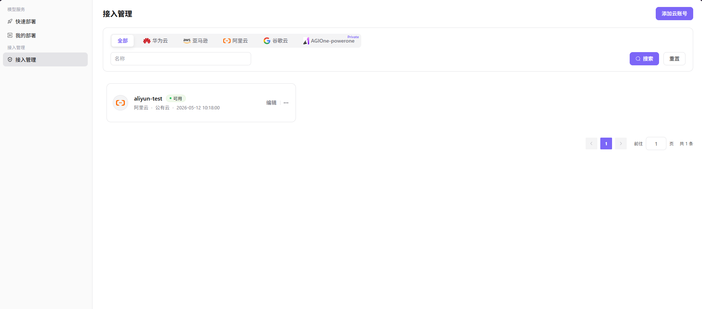

# 接入账号

## 操作步骤

### 添加云账号

1. 进入平台首页，点击左侧导航栏的 **"接入账号"** 菜单，进入接入账号管理页面。
2. 点击页面右上角的 **"添加云账号"** 按钮，弹出「新增账号」窗口。

3. 配置账号信息：
   - 填写 **"账号名称"**（如 `aliyun-wh-dev`）；
   - 从下拉列表中选择 **"选择云平台"**（如 阿里云、华为云、亚马逊等）；
   - 输入目标云平台的 **"Access Key ID"**（如 `LTAI5tM8xHnXoLuBW...`）；
   - 输入目标云平台的 **"Access Key Secret"**（如 `flsBCIDPLksdaNh05J...`）。
4. 确认所有信息配置无误后，点击 **"确定"** 按钮完成添加；如需放弃，点击 **"取消"**。

#### 参数说明

| 字段名称 | 字段类型 | 示例 | 说明 |
|----------|----------|------|------|
| 账号名称 | 文本 | `aliyun-wh-dev` | 必填，自定义账号标识 |
| 选择云平台 | 下拉选择 | `阿里云` | 必填，选择账号所属的云平台 |
| Access Key ID | 文本 | `LTAI5tM8xHnXoLuBW...` | 必填，云平台的访问密钥 ID |
| Access Key Secret | 密码 | `flsBCIDPLksdaNh05J...` | 必填，云平台的访问密钥 Secret |
