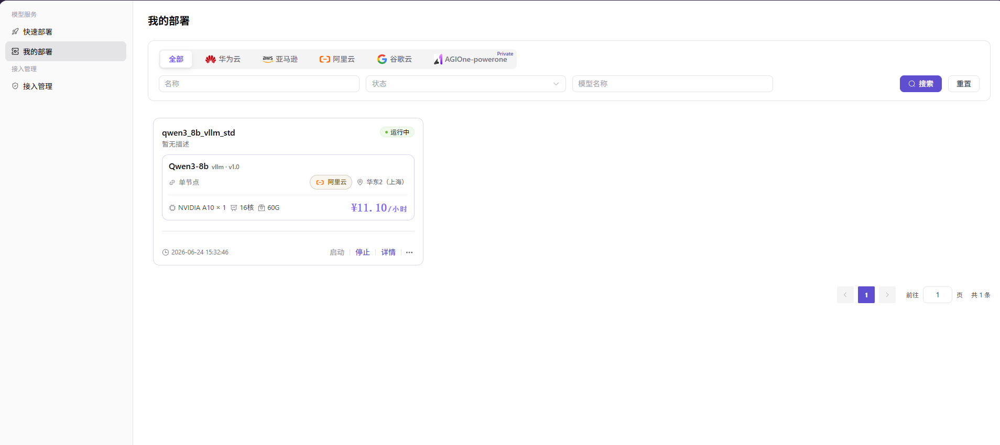

# 我的部署

本任务用于检查云上模型服务的运行状态、事件、监控和 API，并在不再使用时停止或释放资源。

## 场景目标

部署达到健康状态，受控调用成功，并且可以持续监控和正确释放资源。

## 适用角色

- 平台用户
- 需要把已验证部署发布为模型服务的模型提供方

## 开始前准备

- 记录部署名称、已支持的云平台、地域和预期创建时间。
- 准备无副作用的测试请求；运行中的云资源可能持续产生费用。

## 操作步骤

1. 进入**我的部署**，按名称、已支持的云平台和地域定位目标服务。

2. 查看部署状态和事件，等待服务进入健康运行状态；如持续创建中或失败，先根据事件定位云账号、配额、容量、镜像或启动命令问题。
3. 打开监控信息，选择与服务运行时段一致的时间范围，检查资源水位和异常趋势。
4. 打开 API 调用信息，核对请求 URL、请求方法、请求头和参数规范；使用经过处理的接口地址与认证示例完成一次受控调用。
5. 根据使用计划启动、停止或删除部署。停止和删除前确认业务影响、费用变化和数据保留要求。

### 发布模型（扩展操作）

1. 在目标部署卡片上点击 **"..."**，选择 **"发布"**。
2. 选择发布区域：
   - **私有区**：仅团队或租户内部可见；
   - **公有区**：进入公开目录，可独立配置计费与限流。
3. 填写模型类型、来源、地域、请求 URL 占位值、模型 ID、请求头、输入输出模态、Token 限制、当前已开放的能力和支持协议。
4. 补充模型标识与描述，选择立即发布或定时发布，核对后提交。

## 其他操作

| 操作名称 | 操作步骤 |
| --- | --- |
| 切换云平台 Tab | 选择当前版本已支持的云平台或“全部”，查看对应部署；华为云接入当前暂不支持 |
| 重置筛选 | 点击 **"重置"**，清空名称、状态和模型名称筛选条件 |
| 查看部署详情 | 点击 **"详情"**，查看基本信息、API 调用、监控和事件记录 |
| 启动部署 | 点击 **"启动"**，启动已停止的部署任务 |
| 停止部署 | 点击 **"停止"**，停止运行中的部署任务并核对费用变化 |
| 发布模型 | 点击 **"..."**，选择 **"发布"**，再选择私有区或公有区 |
| 删除部署 | 点击 **"..."**，选择 **"删除"**；删除不可逆，操作前确认依赖和数据保留要求 |

## 完成检查

> **用途：** 以下检查是当前功能任务的退出条件。任一项不满足时，请按下方“常见失败分支”继续排查。

| 检查项 | 通过标准 |
| --- | --- |
| 1 | 运行状态和事件中没有重复失败。 |
| 2 | 监控时间范围与服务运行时段一致。 |
| 3 | 使用页面给出的 API 信息完成一次受控调用。 |
| 4 | 停止或删除后资源状态和费用占用按预期变化。 |

## 常见失败分支

| 现象 | 优先检查 |
| --- | --- |
| 部署长时间创建中或失败 | 事件记录、云账号、配额、容量、镜像拉取和启动命令 |
| 服务运行但调用失败 | API 地址、请求头、模型参数、服务端口和限流 |

## 操作手册

[查看“我的部署”的详情、事件、监控、API 和生命周期说明](/zh-CN/usermanual/ai-infra-on-cloud/user/model-services/my-deployments/)
