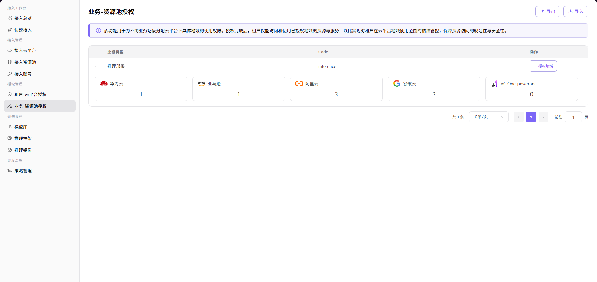
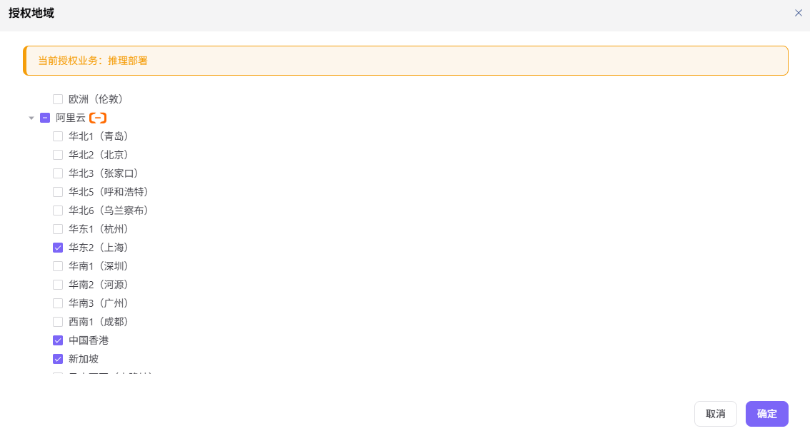

# 业务-资源池授权

本任务按业务类型限制可使用的云地域，例如只允许推理部署使用指定资源池。

## 场景目标

每类业务只能调度到已批准的云平台和地域。

## 适用角色

- 平台运营方

## 开始前准备

- 需要授权的资源池地域已启用。
- 已明确每种业务类型允许使用的地域范围。

## 操作步骤

### 授权地域

1. 进入平台首页，点击左侧导航栏的 **"业务-资源池授权"** 菜单，进入资源池授权管理页面。
2. 展开业务类型后，下方展示各云平台已授权地域数量卡片网格（每行 5 个），如 华为云 `1` / aws 亚马逊 `1` / 阿里云 `3` / 谷歌云 `2` / AGIOne-powerone `0`，便于快速查看授权统计。
3. 点击业务类型右侧的 **"+ 授权地域"** 按钮，弹出「授权地域」窗口。

4. 窗口顶部蓝色信息条显示 **"当前授权业务：推理部署"**。
5. 在树形结构中按云平台分组勾选需要授权的地域（如 阿里云下的 华东2(上海)、中国香港、新加坡 等），未勾选的地域默认不授权。
6. 确认选择无误后，点击 **"确定"** 按钮完成地域授权；如需放弃，点击 **"取消"**。

> 注：该功能用于为不同业务场景分配云平台下具体地域的使用权限。授权完成后，租户仅能访问和使用已授权地域的资源与服务，以此实现对租户在云平台地域使用范围的精准管控，保障资源访问的规范性与安全性。

#### 参数说明

| 字段名称 | 字段类型 | 示例 | 说明 |
|----------|----------|------|------|
| 业务类型 | 单选 | `推理部署` | 必填，标识需要进行资源池授权的业务场景 |
| 云平台 | 复选框 | `阿里云` / `亚马逊` | 必填，选择需要授权的云平台（按树形结构分组） |
| 地域 | 复选框 | `华东2（上海）` / `中国香港` | 必填，在已选云平台下选择需要授权的具体地域 |

## 完成检查

> **用途：** 以下检查是当前功能任务的退出条件，用于判断操作结果是否可观察、可复核，以及是否可以继续当前场景的下一步。它不是操作步骤的重复；任一项不满足时，请按下方“常见失败分支”继续排查。

| 检查项 | 通过标准 |
| --- | --- |
| 1 | 业务类型只包含预期地域。 |
| 2 | 刷新页面后授权结果仍然存在。 |
| 3 | 用户部署范围与授权地域一致。 |

## 常见失败分支

| 现象 | 优先检查 |
| --- | --- |
| 没有可选地域 | 资源池启用状态和云平台状态 |
| 部署出现非预期地域 | 业务类型、已保存地域和租户云平台授权 |

## 操作手册

[查看“业务-资源池授权”的完整规则和常见问题](/zh-CN/usermanual/ai-infra-on-cloud/operator/auth-management/business-region-auth/)
