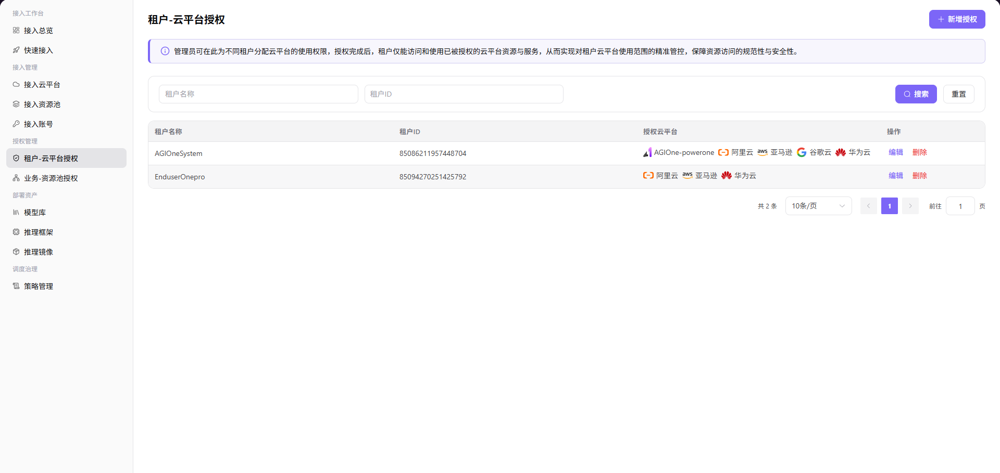

# 租户-云平台授权

本任务决定哪些租户可以看到并使用已接入的云平台，是资源可见性的第一层控制。

## 场景目标

目标租户能看到被授权云平台，未授权租户看不到该平台。

## 适用角色

- 平台运营方（Operator）

## 开始前准备

- 目标租户已存在，云平台已启用。
- 已确认授权对象是单个租户还是全部租户。

## 操作步骤

### 新增授权

1. 进入平台首页，点击左侧导航栏的 **"授权管理 > 租户-云平台授权"** 菜单，进入云平台授权管理页面。
2. 点击页面右上角的 **"新增授权"** 按钮，弹出「新增授权」窗口。

3. 在「选择云平台」下拉列表中，勾选需要授权的云平台（支持多选，如 华为云、亚马逊、AGIOne-powerone）。
4. 选择授权范围（二选一）：
   - **"单个租户授权"**：为指定租户授权，此时需在 **"选择租户"** 输入框中填写目标租户名称；
   - **"授权所有租户"**：为所有租户授权，无需填写租户名称。
5. 确认所有配置无误后，点击 **"确定"** 按钮完成授权；如需放弃，点击 **"取消"**。

> 注：管理员可在此为不同租户分配云平台的使用权限，授权完成后租户仅能访问和使用已被授权的云平台资源与服务，以此实现对租户云平台使用范围的精准管控，保障资源访问的规范性与安全性。

#### 参数说明

| 字段名称 | 字段类型 | 示例 | 说明 |
|----------|----------|------|------|
| 选择云平台 | 多选下拉 | `华为云`、`亚马逊`、`AGIOne-powerone` | 必填，支持同时选择多个云平台 |
| 授权范围 | 单选 | `单个租户授权` / `授权所有租户` | 必填，决定授权对象 |
| 选择租户 | 文本 | `dushuangyan01` | **单个租户授权时**必填，填写目标租户名称 |

## 完成检查

> **用途：** 以下检查是当前功能任务的退出条件，用于判断操作结果是否可观察、可复核，以及是否可以继续当前场景的下一步。它不是操作步骤的重复；任一项不满足时，请按下方“常见失败分支”继续排查。

| 检查项 | 通过标准 |
| --- | --- |
| 1 | 只有目标租户获得云平台权限。 |
| 2 | 目标租户重新登录后能看到授权结果。 |
| 3 | 撤销授权后平台不再可见。 |

## 常见失败分支

| 现象 | 优先检查 |
| --- | --- |
| 租户看不到云平台 | 租户选择、授权范围、平台状态和重新登录后的会话 |
| 非目标租户也能看到平台 | 是否误选“授权所有租户” |

## 操作手册

[查看“租户-云平台授权”的完整规则和常见问题](/zh-CN/usermanual/ai-infra-on-cloud/operator/auth-management/tenant-cloud-auth/)
