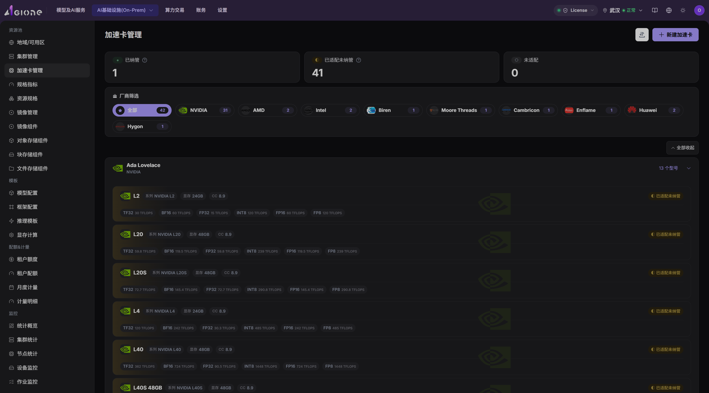

# 维护加速卡型号

## 功能入口

- **角色**：运营管理员
- **菜单**：AI 基础设施（On-Prem） > 资源池 > 加速卡管理
- **路由**：`/powerone/resourcepool/accelerators`

## 操作步骤

1. 在厂商筛选中选择目标 NPU 厂商，例如 Huawei。
2. 查找实际卡型，核对系列、型号、单卡显存和适配状态。
3. 如果型号不存在，点击 **新建加速卡**，填写硬件信息和 Kubernetes 资源名称。
4. 将卡型关联到与集群设备插件一致的规格指标。
5. 保存后确认卡型进入“已纳管”或预期的适配状态。

## 4 张 NPU 卡的配置要点

- 卡的数量不在此页面录入；此页面维护的是“卡型字典”。实际数量由集群节点上报。
- 同一型号 4 张卡应使用同一个资源 key，例如设备插件实际暴露的 `vendor.com/npu`。
- 单卡显存和型号信息会影响资源规格、模板选择和部署可行性判断。

## 完成检查

- 列表中能找到目标 NPU 型号。
- 适配状态和规格指标关联正确。
- 资源 key 与集群实际值一致。

## 操作手册

[查看加速卡管理完整字段说明](/zh-CN/usermanual/ai-infra-on-prem/operator/resource-pools/accelerators/)
