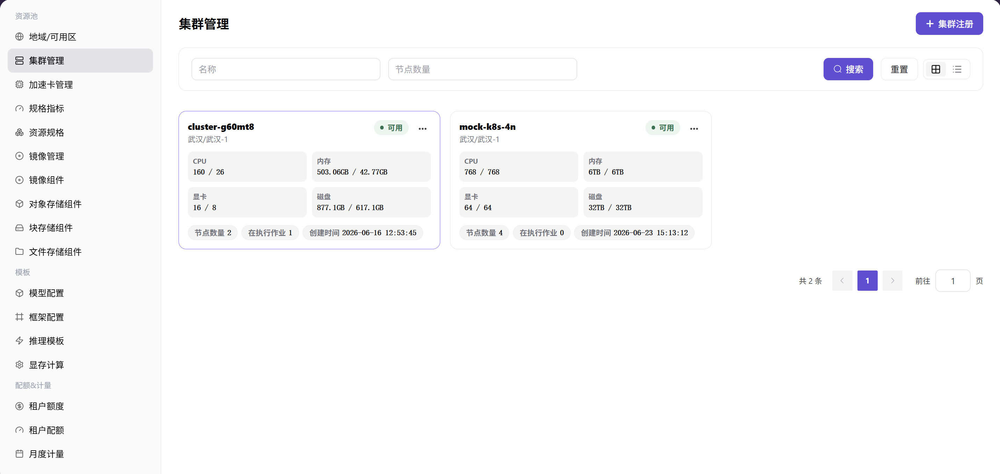

# 接入集群并核对设备

## 场景目标

集群状态可用，4 张 NPU 卡全部出现在预期节点，并可关联兼容资源规格。

## 适用角色

- 平台运营方

## 开始前准备

- 准备集群地址、注册信息、网络路由和所需 Agent 或凭证。
- 记录预期节点数以及 4 张 NPU 卡的物理分布。

## 功能入口

- **角色**：运营管理员
- **菜单**：AI 基础设施（本地算力平台） > 资源池 > 集群管理
- **路由**：`/powerone/resourcepool/cluster`

## 操作步骤

1. 确认地域和可用区已创建。
2. 点击 **集群注册**，填写 kubeconfig、API Server、认证方式和网络信息。
3. 提交后等待集群进入“可用”状态。
4. 打开集群详情和节点列表，核对节点均为 Ready。
5. 核对设备总量，确认目标 NPU 数量为 4，且没有掉卡或重复上报。

## 4 张 NPU 卡的核对方法

| 检查项 | 预期结果 |
| --- | --- |
| 集群状态 | 可用 |
| 节点状态 | 所有承载 NPU 的节点均为 Ready |
| 设备总量 | 4 张 NPU 卡 |
| 可分配量 | 扣除运行中作业后与实际占用一致 |
| 资源 key | 与加速卡管理和规格指标一致 |

## 完成检查

> **用途：** 以下检查是当前功能任务的退出条件，用于判断操作结果是否可观察、可复核，以及是否可以继续当前场景的下一步。它不是操作步骤的重复；任一项不满足时，请按下方“常见失败分支”继续排查。

| 检查项 | 通过标准 |
| --- | --- |
| 1 | 集群、节点和设备信息均可见。 |
| 2 | 4 张 NPU 卡全部被识别。 |
| 3 | 测试作业可以申请至少 1 张 NPU 卡并进入调度流程。 |

## 常见失败分支

| 现象 | 优先检查 |
| --- | --- |
| 集群注册失败 | 地址、网络、注册信息、Agent 状态和时间同步 |
| 只发现部分 NPU 卡 | 节点健康、驱动、设备插件、加速卡映射和硬件可见性 |

## 操作手册

[查看集群注册和维护完整说明](/zh-CN/usermanual/ai-infra-on-prem/operator/resource-pools/clusters/)
