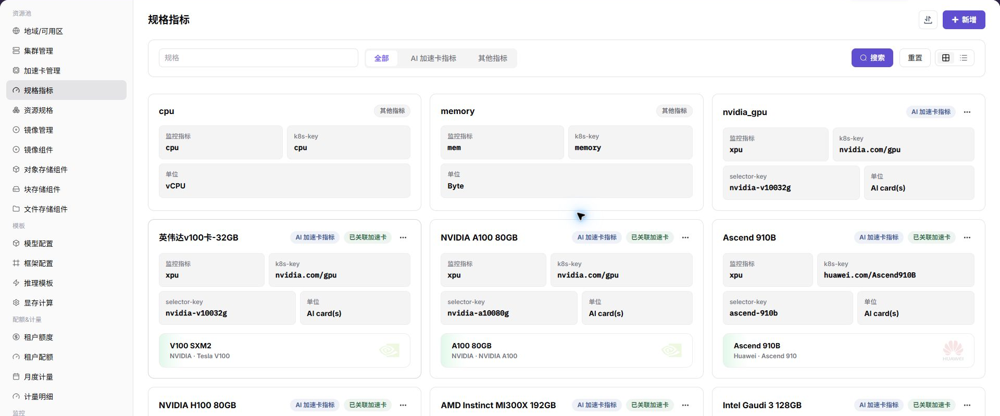

# 配置规格指标与资源规格

## 场景目标

用户可以选择清晰的 1 卡、2 卡和 4 卡 NPU 方案，每种方案都映射到正确的调度资源键。

## 适用角色

- 平台运营方

## 开始前准备

- 确认加速卡型号和集群设备插件上报的资源键。
- 明确支持的卡数组合，以及 CPU、内存与 NPU 数量的配比。

## 功能入口

- **角色**：运营管理员
- **菜单**：AI 基础设施（本地算力平台） > 资源池 > 规格指标 / 资源规格
- **路由**：`/powerone/resourcepool/flavor/type`、`/powerone/resourcepool/flavor/list`

## 操作步骤

1. 进入**规格指标**，确认 NPU 指标的 k8s-key 与设备插件上报的资源 key 一致；需要定向调度时，再补充型号或节点组选择器。

2. 进入**资源规格**，分别创建 1 卡、2 卡和 4 卡规格。
3. 配置 CPU、内存、NPU 数量和存储要求，并把规格关联到目标集群。

4. 先用测试作业验证 1 卡规格，再验证 2 卡和 4 卡规格。

## 4 张 NPU 卡的推荐规划

| 规格 | NPU 数量 | 适用场景 |
| --- | ---: | --- |
| `npu-1` | 1 | 功能验证、小模型推理 |
| `npu-2` | 2 | 双卡并行或中等规模推理 |
| `npu-4` | 4 | 单任务独占全部卡 |

创建 4 卡规格前，应确认 4 张卡能否被同一节点或同一调度拓扑同时分配。若卡分布在多个节点，不要默认单个 Pod 可以跨节点申请全部 4 张卡。

## 完成检查

> **用途：** 以下检查是当前功能任务的退出条件，用于判断操作结果是否可观察、可复核，以及是否可以继续当前场景的下一步。它不是操作步骤的重复；任一项不满足时，请按下方“常见失败分支”继续排查。

| 检查项 | 通过标准 |
| --- | --- |
| 1 | 三档规格都能在模板或作业创建页被选择。 |
| 2 | 规格申请的资源 key 与节点上报一致。 |
| 3 | 1 卡测试作业成功后，再验证 2 卡和 4 卡规格。 |

## 常见失败分支

| 现象 | 优先检查 |
| --- | --- |
| 用户选不到规格 | 规格状态、租户配额、集群关联和地域可用性 |
| 作业长时间排队 | 调度资源键、申请卡数、空闲容量和节点标签 |

## 操作手册

- [规格指标](/zh-CN/usermanual/ai-infra-on-prem/operator/resource-pools/spec-metrics/)
- [资源规格](/zh-CN/usermanual/ai-infra-on-prem/operator/resource-pools/resource-specs/)
