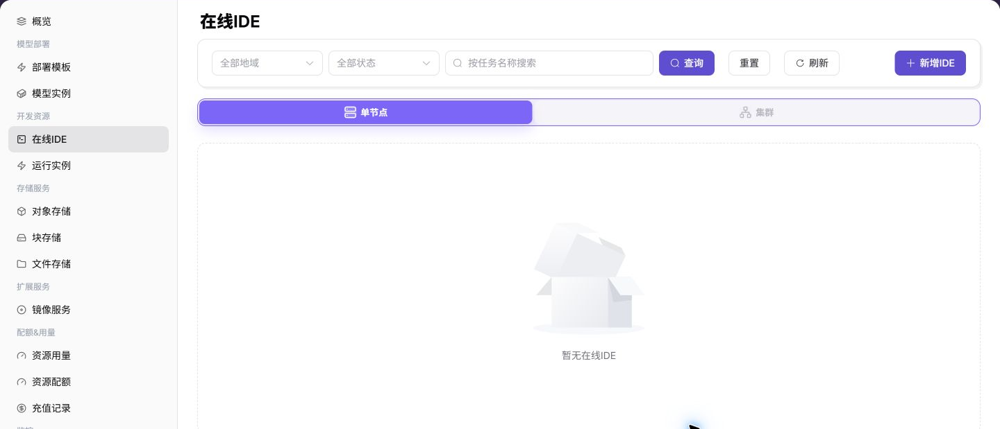
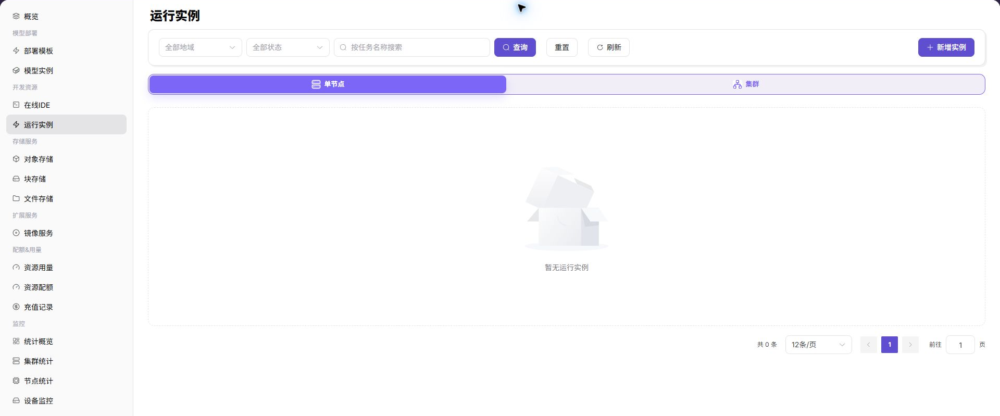

# On-Prem 开发训练与资产沉淀

本场景指导普通用户使用 On-Prem 算力创建在线开发环境或运行实例，并把代码、数据、镜像和模型产物沉淀为可复用资产。

## 场景目标

- 用户能选择可用镜像、资源规格和存储创建开发或训练环境。
- 代码与数据放在持久化存储中，不依赖临时容器文件系统。
- 定制环境能够保存为镜像，模型和结果能够保存到受控存储位置。
- 作业完成后可以查看日志、监控和资源用量，并按需释放资源。

## 开始前准备

1. 运营方已开放目标地域、镜像、存储、规格和租户配额。
2. 明确开发、训练或批处理任务需要的 CPU、内存、加速卡和运行时长。
3. 准备代码仓库、数据路径、基础镜像和输出目录。
4. 确认数据合规、镜像来源和外部网络访问边界。

## 操作流程

| 步骤 | 操作 | 参考手册 | 完成标志 |
| --- | --- | --- | --- |
| 1 | 准备对象或文件存储 | [对象存储](../../../usermanual/ai-infra-on-prem/user/storage/object-storage/)、[文件存储](../../../usermanual/ai-infra-on-prem/user/storage/file-storage/) | 数据和输出路径可访问 |
| 2 | 准备或选择运行镜像 | [镜像服务](../../../usermanual/ai-infra-on-prem/user/extensions/images/) | 目标地域可拉取镜像 |
| 3 | 创建在线 IDE 进行开发调试 | [在线 IDE](../../../usermanual/ai-infra-on-prem/user/development/dev-environments/) | IDE 运行且工作目录已挂载 |
| 4 | 创建运行实例执行训练或批处理 | [运行实例](../../../usermanual/ai-infra-on-prem/user/development/model-training/) | 作业进入运行状态并持续输出日志 |
| 5 | 保存镜像、模型和结果 | [镜像服务](../../../usermanual/ai-infra-on-prem/user/extensions/images/)、[对象存储](../../../usermanual/ai-infra-on-prem/user/storage/object-storage/) | 产物可由后续任务复用 |
| 6 | 查看监控与用量并释放闲置资源 | [作业监控](../../../usermanual/ai-infra-on-prem/user/monitoring/jobs/)、[资源用量](../../../usermanual/ai-infra-on-prem/user/quotas-usage/usage/) | 用量可追溯，闲置实例已停止 |

## 资产沉淀建议

| 资产 | 推荐保存位置 | 不应只保存在 |
| --- | --- | --- |
| 代码与配置 | 版本库和持久化工作目录 | 临时容器目录 |
| 数据集 | 对象存储或文件存储 | 本地临时盘 |
| 运行环境 | 版本化镜像 | 手工安装记录 |
| 模型权重 | 受控对象存储或模型目录 | 单个实例文件系统 |
| 日志与结果 | 持久化输出目录 | 终端滚动输出 |

## 完成检查

- [ ] 开发或训练实例状态正常，日志没有持续错误。
- [ ] 重启或重建实例后，持久化代码和数据仍可访问。
- [ ] 镜像、模型和结果具备明确版本与所有者。
- [ ] 作业消耗的规格、时长和用量记录符合预期。
- [ ] 不再使用的实例和临时资源已停止或清理。

## 常见失败分支

| 现象 | 优先检查 |
| --- | --- |
| 无可选镜像或规格 | 地域、授权、镜像状态、集群关联和配额 |
| IDE 无法打开 | 实例状态、服务端口、网络入口和日志 |
| 数据不可见 | 存储组件、挂载路径、权限和地域 |
| 作业排队或失败 | 规格容量、镜像、启动命令、加速卡和配额 |
| 产物丢失 | 是否写入临时目录、任务结束前是否完成上传或同步 |

## 功能截图

