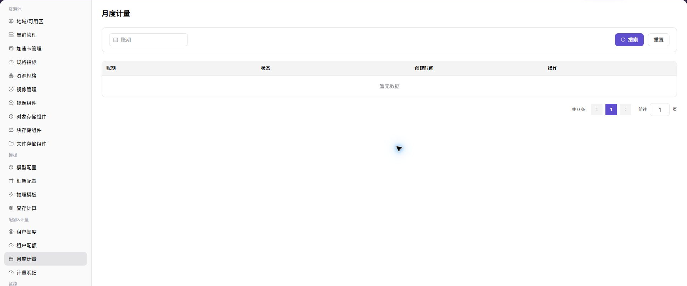

# 核对本地资源月度计量与明细

## 场景目标

在同一租户和账期内，将租户额度、月度用量和计量明细对应到实际实例或作业。

## 适用角色

- 平台运营方
- 查看自身资源消耗的模型提供方和平台用户

## 开始前准备

- 明确目标租户、账期、实例或作业标识和计量单位。
- 确认监控与计量采集持续上报，任务开始和结束时间可定位。

## 操作步骤

1. 进入当前 UI 提供的额度、配额或用量治理页面，核对期初、分配、已用和剩余量等信息。

2. 进入[月度用量](../../../../usermanual/ai-infra-on-prem/operator/quotas-metering/monthly-usage/)，选择同一租户和账期，核对资源类型、规格和汇总用量。

3. 进入[计量明细](../../../../usermanual/ai-infra-on-prem/operator/quotas-metering/metering-details/)，按实例、作业和时间范围追溯汇总值。

4. 对照设备、节点和作业监控中的运行时间及规格，确认停止时间、卡数和计量单位一致。

## 完成检查

> **用途：** 以下检查用于确认“额度变化为什么发生、月度汇总由哪些任务组成”，避免只看到一个汇总数字就结束核对。

| 检查项 | 通过标准 |
| --- | --- |
| 额度变化 | 期初、分配、扣减和剩余额度可解释。 |
| 月度汇总 | 租户、账期、资源类型和计量单位一致。 |
| 明细追溯 | 汇总用量可追溯到实例或作业及其时间范围。 |
| 监控对应 | 卡数、运行时长和停止时间与监控记录一致。 |

## 常见失败分支

| 现象 | 优先检查 |
| --- | --- |
| 月度用量与明细合计不一致 | 账期边界、时区、聚合延迟和计量单位 |
| 实例停止后仍有用量 | 作业结束时间、残留实例和状态同步 |
| 额度充足但任务不能创建 | 租户配额、规格容量、模板和集群空闲资源 |
