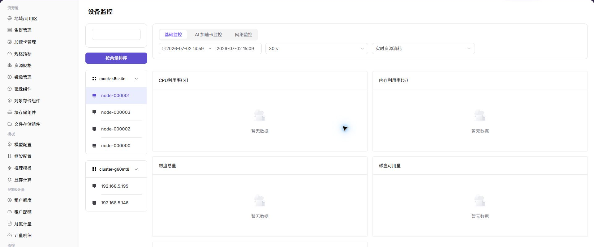
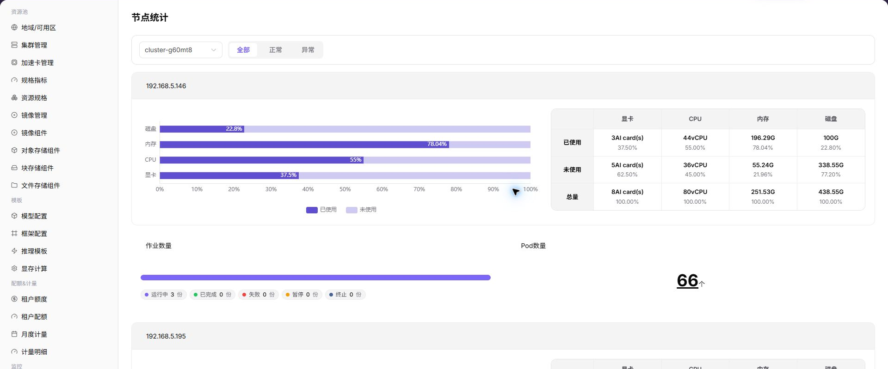

# 监控设备、节点与作业

## 场景目标

4 张 NPU 卡的健康和利用率都可追踪，并能在同一时间范围定位关联节点与作业。

## 适用角色

- 平台运营方
- 查看已授权作业监控的平台用户

## 开始前准备

- 记录纳管和部署时使用的集群、节点、设备及作业名称。
- 设备、节点和作业页面使用同一时间范围进行对比。

## 功能入口

- **角色**：运营管理员
- **菜单**：AI 基础设施（本地算力平台） > 监控 > 设备监控 / 节点统计 / 作业监控
- **路由**：`/powerone/monitor/device`、`/powerone/monitor/node`、`/powerone/monitor/work`

## 操作步骤

1. 进入**设备监控**，确认 4 张 NPU 卡都可见，并逐卡比较利用率、显存、温度和健康状态。

2. 进入**节点统计**，确认加速节点处于就绪状态且没有资源压力。

3. 进入**作业监控**，定位正在占用各张卡的部署或训练作业。

4. 先建立“异常设备—所属节点—占用作业”的关联，再判断应处理硬件、驱动、配额还是应用问题。

## 4 张 NPU 卡的巡检表

| 检查项 | 预期结果 |
| --- | --- |
| 设备数量 | 4 张卡全部可见 |
| 健康状态 | 无离线、掉卡或持续告警 |
| 设备占用 | 与运行中作业申请卡数一致 |
| 节点状态 | Ready，指标持续更新 |
| 作业状态 | 无异常排队或反复失败 |

## 完成检查

> **用途：** 以下检查是当前功能任务的退出条件，用于判断操作结果是否可观察、可复核，以及是否可以继续当前场景的下一步。它不是操作步骤的重复；任一项不满足时，请按下方“常见失败分支”继续排查。

| 检查项 | 通过标准 |
| --- | --- |
| 1 | 可以从设备定位到节点和占用作业。 |
| 2 | 作业申请卡数、设备占用和租户配额三者一致。 |
| 3 | 异常设备能够被单独识别，不会误判为整个集群不可用。 |

## 常见失败分支

| 现象 | 优先检查 |
| --- | --- |
| 设备指标为空 | 监控 Agent、设备插件、时间范围、集群状态和设备映射 |
| 有卡空闲但作业排队 | 申请规格、调度事件、节点标签、配额和卡健康状态 |

## 操作手册

- [设备监控](/zh-CN/usermanual/ai-infra-on-prem/operator/monitoring/devices/)
- [节点统计](/zh-CN/usermanual/ai-infra-on-prem/operator/monitoring/nodes/)
- [作业监控](/zh-CN/usermanual/ai-infra-on-prem/operator/monitoring/jobs/)
