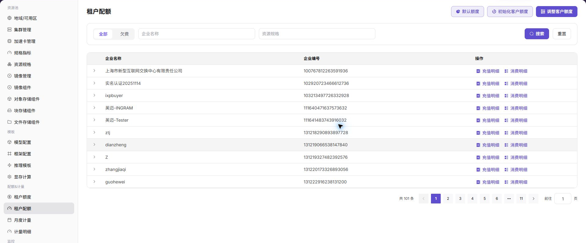

# 配置租户 NPU 配额

## 场景目标

租户能申请获批的 NPU 方案，同时不会占用超过其在 4 卡资源池中的授权份额。

## 适用角色

- 平台运营方（Operator）

## 开始前准备

- 确认总容量、现有分配，以及配额按卡数还是按规格计量。
- 明确租户可并发运行的单卡、2 卡和 4 卡任务上限。

## 功能入口

- **角色**：运营管理员
- **菜单**：AI 基础设施（On-Prem） > 配额&计量 > 租户配额
- **路由**：`/powerone/quota-metric/tenant`

## 操作步骤

1. 按租户名称定位目标租户。
2. 查看当前 NPU 资源配额和已使用量。
3. 根据业务需要调整配额；如需允许单任务独占 4 张卡，租户上限至少为 4。
4. 保存后让用户重新打开部署页面，确认 4 卡规格可选。
5. 提交测试作业，核对配额已用量随资源申请变化。

## 配额策略

- 只有 4 张卡时，不建议默认给多个租户各分配 4 张可同时使用的保证额度。
- 区分“资源规格为 4 卡”和“租户配额上限为 4 卡”；两者必须同时满足。
- 保留必要的运维或验证余量，避免所有卡长期被单个作业占满。

## 完成检查

> **用途：** 以下检查是当前功能任务的退出条件，用于判断操作结果是否可观察、可复核，以及是否可以继续当前场景的下一步。它不是操作步骤的重复；任一项不满足时，请按下方“常见失败分支”继续排查。

| 检查项 | 通过标准 |
| --- | --- |
| 1 | 目标租户的 NPU 配额已更新。 |
| 2 | 用户能够选择授权范围内的 NPU 规格。 |
| 3 | 配额不足时系统给出明确提示，而不是无原因排队。 |

## 常见失败分支

| 现象 | 优先检查 |
| --- | --- |
| 配额充足但创建失败 | 规格可用性、租户额度、集群容量和已有任务 |
| 释放后配额未恢复 | 实例最终状态、计量延迟和残留分配 |

## 操作手册

[查看租户配额完整说明](/zh-CN/usermanual/ai-infra-on-prem/operator/quotas-metering/tenant-quotas/)
