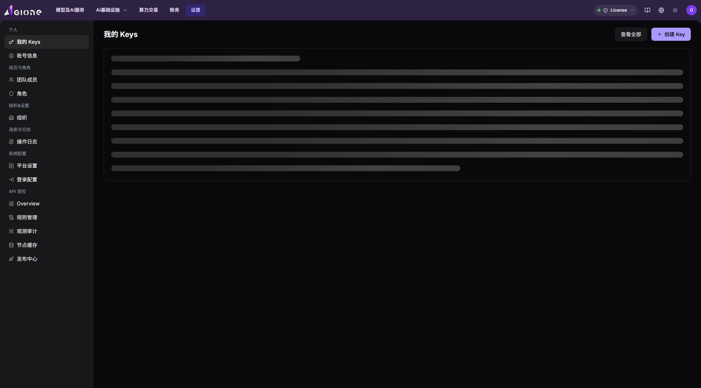

# 平台治理与访问控制

本场景把身份权限、资源授权、模型可见范围、API 调用凭据、限流和额度控制组合成一条治理检查路径，用于回答“谁可以访问什么、能使用多少、如何追溯”。

## 场景目标

- 用户、租户和角色构成清晰的组织边界。
- 云资源、On-Prem 资源和模型只对授权范围开放。
- API Key、项目、模型、配额和限流共同限制调用能力。
- 权限与额度调整后，可以通过实际账号验证并追溯变更。

## 治理层次

| 层次 | 控制对象 | 主要入口 |
| --- | --- | --- |
| 身份 | 租户、用户、角色、菜单和按钮 | [身份授权](../identity-authorization/) |
| 云资源 | 云平台、地域和租户授权 | [On Cloud 云资源接入](../on-cloud-resource-access/) |
| On-Prem 资源 | 地域、规格、租户配额和额度 | [On-Prem 算力纳管](../on-prem-compute-onboarding/)、[资源计量与监控](../on-prem-resource-metering-monitoring/) |
| 模型 | 公有/私有范围、发布审批和模型可见性 | [发布模型](../publish-model/)、[模型发布审批](../model-publishing-approval/) |
| 调用 | Personal Key、项目、模型授权、限流和余额 | [模型的体验与调用](../model-experience-api-calling/) |

## 开始前准备

1. 明确治理对象、责任人、租户和业务范围。
2. 采用最小权限原则，列出必须允许和必须禁止的能力。
3. 明确资源上限、调用限流、费用或额度上限和有效时间。
4. 准备运营方、提供方和调用方验证账号。

## 操作流程

1. 按 [用户、租户与角色设计逻辑](../../../product/identity-access-model) 确认身份边界。
2. 完成角色和菜单授权，并用目标账号验证入口可见性。
3. 按资源类型完成云资源授权或 On-Prem 规格、配额分配。
4. 对模型设置公有或私有范围，按需完成发布审批。
5. 为调用方准备个人调用凭据、项目或模型授权，并设置限流和额度。
6. 使用目标账号完成一次只读检查或受控调用，确认权限和限制生效。
7. 记录变更原因、范围、验证结果和回退方式。

## 完成检查

- [ ] 未授权账号看不到目标菜单、资源或模型。
- [ ] 已授权账号只看到约定范围，不具备额外治理权限。
- [ ] 超过配额、额度或限流时，系统按规则拒绝或限制操作。
- [ ] 凭据撤销或授权回收后，新请求不再获得访问能力。
- [ ] 变更记录能够关联责任人、租户、对象和时间。

## 常见失败分支

| 现象 | 优先检查 |
| --- | --- |
| 菜单可见但资源为空 | 资源授权、地域、租户范围和筛选条件 |
| 模型可见但不能调用 | Personal Key、模型授权、限流、余额和协议 |
| 调整配额后仍无法创建 | 账户额度、集群容量、规格关联和模板范围 |
| 回收权限后仍可操作 | 当前会话、缓存、接口权限和授权是否真正保存 |
| 用户权限过大 | 角色继承、多个角色叠加和平台级菜单权限 |

## 功能截图

