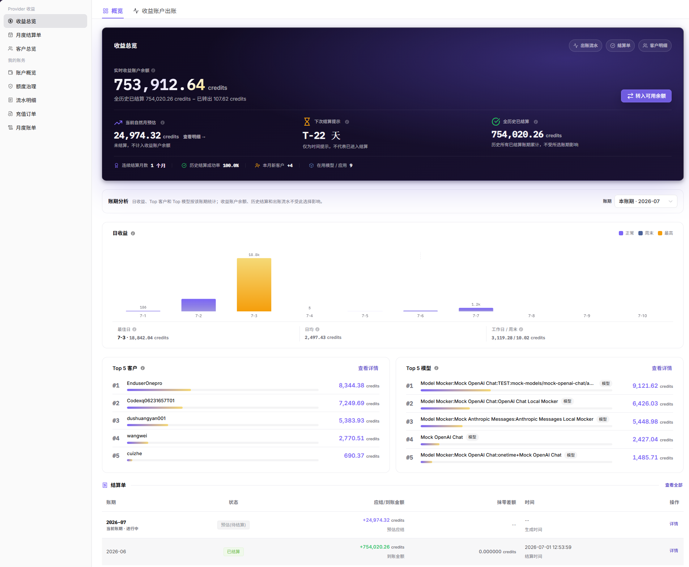
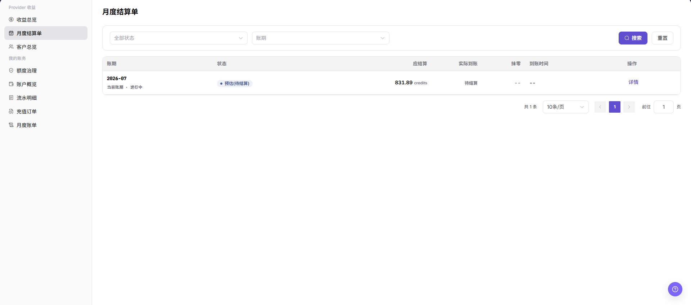

# 服务商收益与结算核对

本任务用于解释服务商收益来源并确认月度结算结果。

## 适用角色

- 模型提供方、服务商财务查看人员、收益运营人员

## 开始前准备

- 明确目标账期及需要核对的客户或模型。
- 确认当前账号具备服务商收益和结算查看权限。
- 涉及余额转入时，先确认目标账户、操作人和复核人。

## 操作流程

### 1. 查看收益总览

进入[收益总览](../../../usermanual/billing/user/earnings/revenue/)，确认收益账户余额、当前自然月预估、下次结算提示和账期趋势。

### 2. 解释收益来源

选择目标账期，查看 Top 客户和 Top 模型；再进入[客户总览](../../../usermanual/billing/user/earnings/customers/)，按客户或标签筛选并打开详情核对收益贡献。

### 3. 核对月度结算单

进入[月度结算单](../../../usermanual/billing/user/earnings/settlements/)，按状态和账期搜索，核对应结算、实际到账、抹零、到账时间和处理状态。

### 4. 处理余额转入

只有账期、金额、到账账户和结算状态均符合预期时，才使用转入入口。存在差异时取消操作，返回收益总览、客户总览和结算单继续核对。

## 完成检查

> **用途：** 以下检查用于确认当前收益任务已经形成从来源到结算的可复核结果。任一项不满足时，不应执行余额转入。

| 检查项 | 通过标准 |
| --- | --- |
| 收益汇总 | 余额、预估收益和账期趋势已确认。 |
| 收益来源 | 主要客户和模型贡献能够解释。 |
| 结算状态 | 应结算、实际到账和状态一致。 |
| 转入条件 | 金额、账户、权限和复核人已确认。 |

## 常见失败分支

| 现象 | 优先检查 |
| --- | --- |
| 收益余额与预期不一致 | 账期、模型调用、价格规则和同步时间 |
| 客户收益为空 | 客户范围、标签筛选和有效调用 |
| 应结算与实际到账不一致 | 结算状态、抹零、到账时间和出账流水 |
| 转入按钮不可用 | 结算状态、账号权限和目标账户 |
