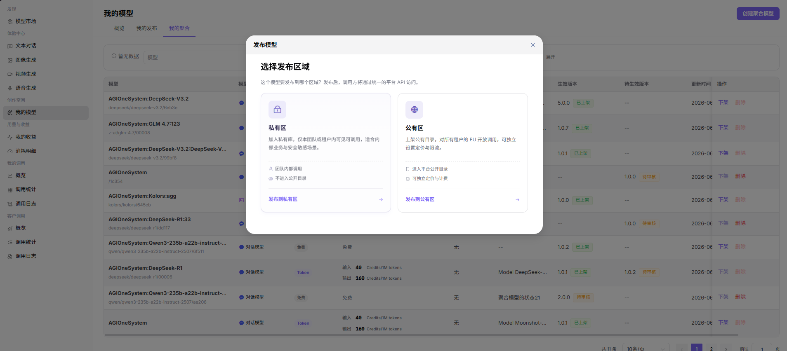
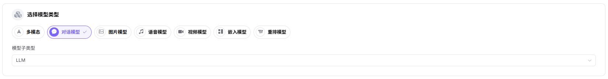
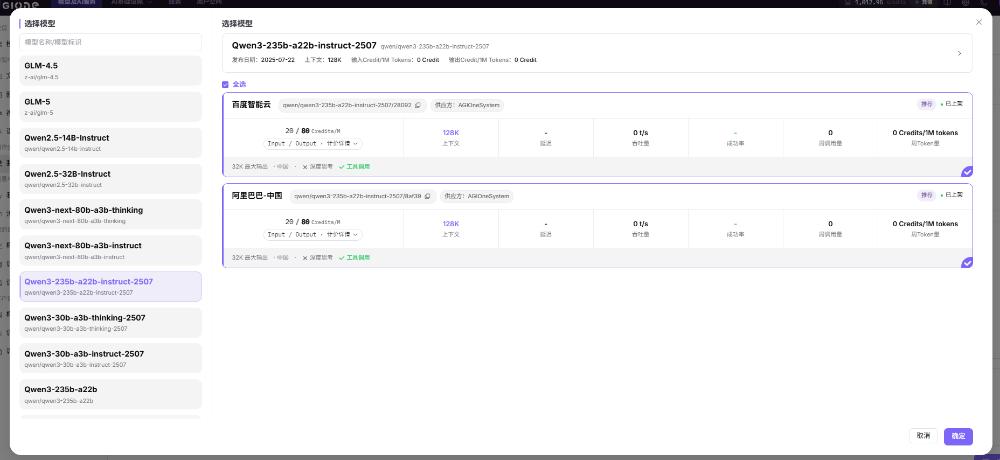

# 添加聚合模型

## 操作步骤

1. 进入平台首页，点击左侧导航栏的 **"我的模型"** 菜单，进入模型管理页面。
2. 切换至 **"我的聚合"** Tab，可通过页面顶部 **"公共模型 / 私有模型"** 切换查看不同区域的聚合模型。
3. 点击页面右上角的 **"创建聚合模型"** 按钮，弹出"选择发布区域"对话框。
4. 选择发布区域：
   - **"发布到私有区"**：仅本团队或租户内可见可调用，加入私有库，不进入公开目录；
   - **"发布到公有区"**：上架公有目录，对所有租户的 EU 开放调用，可独立设置定价与限流。
5. 点击  **"发布到公有区"** 进入发布配置流程（Step 1：基本信息）。   

### **Step 1：基本信息**
- 选择 **"模型类型"**（多模态 / 对话模型 / 图片模型 / 语音模型 / 视频模型 / 嵌入模型 / 重排模型）；
- 选择 **"模型子类型"**（如 LLM）。

- **模型选择**：在"模型选择"列表中点击 **"添加模型"** 按钮，弹出"选择模型"对话框：
   - 左侧为 **模型名称/模型标识** 列表，可输入关键字快速过滤；
   - 右侧展示该模型下的多个供应方实例（含 发布日期、上下文、输入/输出 Credit/1M Tokens、吞吐量、成功率、周调用量、周 Token 量、最大输出、地区、能力标签等指标）；
   - 勾选目标供应方实例（可多选，列表头有 **"全选"**），点击 **"确定"** 完成添加。

- **配置成员模型参数**：为每个添加的成员模型配置：
   - **是否启用**：开关控制；
   - **最低成功率**：百分比（如 80%）；
   - **最高并发率**：数值（如 1500）；
   - **上下文最大长度**：数值（如 128K）；
   - **成本**：分别设置 输入 Token 成本、输出 Token 成本；
   - 点击 **"删除"** 移除该成员模型。

- **基本信息**：
   - 填写 **"个性化标识"**（如 Qwen3-235b-a22b-instruct-2507）；
   - 选择 **"匹配策略"**：**"成本优先"** / **"成功率优先"** / **"成本&体验均衡"** / **"随机"** / **"轮询"**；
   - 选择 **"标签"**（如 文本生成）；
   - 填写 **"描述"**。

- **发布方式**：选择 **"立即发布"** 或 **"定时发布"**。

- 点击 **"下一步"** 进入 Step 2：计费配置。

### **Step 2：计费配置**
- 选择 **"计费方式"**：**"免费"** 或 **"收费"**；
- 选择 **"计费模式"**：**"统一计费"** / **"输入/输出计费"** / **"阶梯计费"**；
- 设置价格（Credits/1M tokens）：
- **"输入原价"**：模型输入价格的参考原价，用于展示价格对比；
- **"输入售价"**：模型输入售价，该价格将作为用户实际使用时的结算价格；
- **"输出原价"**：模型输出价格的参考原价，用于展示价格对比；
- **"输出价格"**：模型输出售价，该价格将作为用户实际使用时的结算价格。

- 点击 **"仅保存"** 或 **"提交审核"** 完成发布。

#### 参数说明 - 聚合模型配置项

| 字段名称 | 字段类型 | 示例 | 说明 |
|----------|----------|------|------|
| 模型类型 | 单选 | `对话模型 / 图片模型` | 必填，聚合模型的功能类型 |
| 模型子类型 | 下拉选择 | `LLM` | 必填，聚合模型的具体子类型 |
| 成员模型 | 列表选择 | `百度智能云 / 阿里巴巴-中国 等多个供应方实例` | 必填，选择 2 个及以上已发布的模型（多选） |
| 是否启用 | 开关 | `启用 / 关闭` | 必填，控制该成员模型是否参与路由 |
| 最低成功率 | 百分比 | `80%` | 必填，低于该成功率的成员模型将被剔除 |
| 最高并发率 | 数值 | `1500` | 必填，成员模型的最大并发数限制 |
| 上下文最大长度 | 数值 | `128K` | 必填，成员模型支持的上下文上限 |
| 输入 Token 成本 | 数值 | `2000` | 必填，每百万输入 Token 的成本参考 |
| 输出 Token 成本 | 数值 | `8000` | 必填，每百万输出 Token 的成本参考 |
| 个性化标识 | 文本 | `Qwen3-235b-a22b-instruct-2507` | 必填，聚合模型对外展示的自定义标识 |
| 匹配策略 | 单选 | `成本优先 / 成功率优先 / 成本&体验均衡 / 随机 / 轮询` | 必填，模型调用时的路由策略 |
| 标签 | 下拉选择 | `文本生成` | 选填，聚合模型所属标签 |
| 描述 | 文本 | `聚合模型...` | 选填，聚合模型的说明描述 |
| 发布方式 | 单选 | `立即发布 / 定时发布` | 必填，聚合模型的上线时机 |
| 计费方式 | 单选 | `免费 / 收费` | 必填，聚合模型的收费方式 |
| 计费模式 | 单选 | `统一计费 / 输入/输出计费 / 阶梯计费` | 必填，收费时的计价方式 |
| 输入原价 | 数值 | `40.00 Credits/1M tokens` | 选填，模型输入价格的参考原价，用于展示价格对比 |
| 输入售价 | 数值 | `20.00 Credits/1M tokens` | 必填，模型输入售价，作为用户实际使用时的结算价格 |
| 输出原价 | 数值 | `160.00 Credits/1M tokens` | 选填，模型输出价格的参考原价，用于展示价格对比 |
| 输出价格 | 数值 | `80.00 Credits/1M tokens` | 必填，模型输出售价，作为用户实际使用时的结算价格 |
