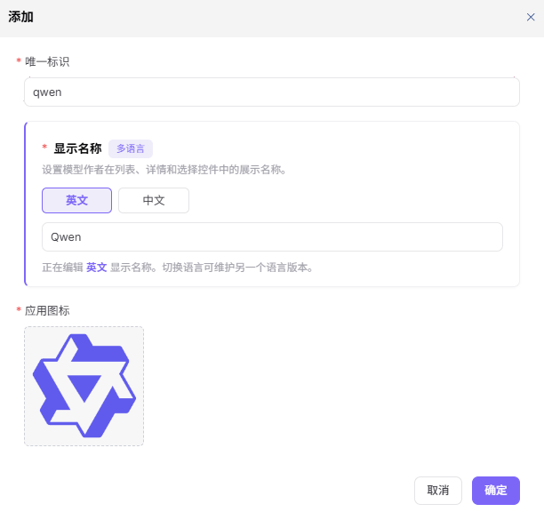
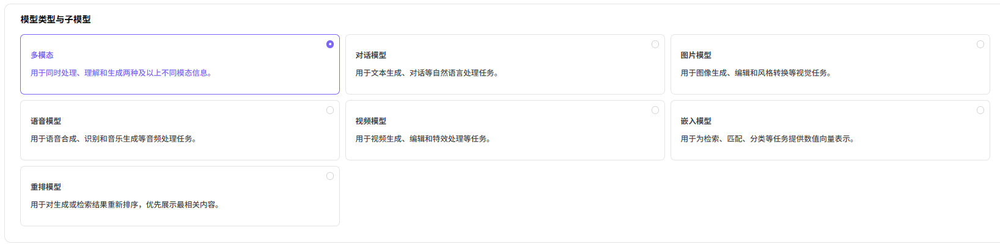
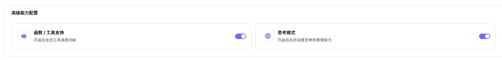
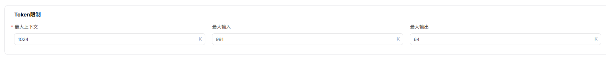

# 元模型

## 操作步骤

1. 进入平台首页，点击左侧导航栏的 **"元模型"** 菜单，进入元模型管理页面。
2. 在左侧模型作者列表上方，点击 **"添加"** 按钮，弹出「添加」窗口。

3. 配置模型作者信息：
   - 填写 **"唯一标识"**（如 `qwen`），用于在系统中唯一标识该模型作者；
   - **"显示名称"**（标注"多语言"）：用于设置模型作者在列表、详情和选择控件中的显示名称。点击 **"英文"** / **"中文"** 标签切换语言 Tab，**"正在编辑 英文 显示名称。切换语言可维护另一个语言版本"**，分别在对应 Tab 下填写英文与中文简体环境下的名称（如 英文：Qwen / 中文：通义千问）；
   - 上传 **"应用图标"**（如 Qwen 品牌图标）。
4. 确认所有信息配置无误后，点击 **"确定"** 按钮完成添加；如需放弃，点击 **"取消"**。

#### 参数说明

| 字段名称 | 字段类型 | 示例 | 说明 |
|----------|----------|------|------|
| 唯一标识 | 文本 | `qwen` | 必填，模型作者的唯一标识 |
| 显示名称 | 多语言文本 | `Qwen / 通义千问` | 必填，分别在"英文"和"中文"Tab 下配置显示名称 |
| 应用图标 | 图片 | `Qwen 品牌图标` | 必填，模型作者展示图标 |

### 添加元模型

1. 在「元模型」管理页面，选择目标模型作者（如 `Qwen`），点击右侧的 **"+ 添加"** 按钮，进入「添加元模型」流程。

2. **元模型配置**——填写基础信息：
   - 选择 **"模型作者"**（如 Qwen）；
   - 填写 **"名称"**（如 Qwen3.6-Plus）；
   - 填写 **"系列"**（如 Qwen3.6）；
   - 填写 **"唯一标识"**（如 `qwen/qwen3.6-plus`，自动格式化为 `作者/系列-名称`）；
   - 选择 **"场景"**（如 语言与文本处理 / 文本生成）；
   - 选择 **"状态"**（启用 / 禁用）；
   - 选择 **"官方发布时间"**（日期选择器，如 2026-04-02）。
   - **多语言描述**：点击 **"模型描述"** 卡片顶部的 **"多语言"** 标签切换语言 Tab（英文 / 中文），在富文本编辑器中分别填写各语言版本的模型介绍，**"多语言"** 表示该字段需要同时维护多语言版本。填写内容可插入链接（可维护 model_url），切换语言时可维护另一个语言版本。

1. **模型类型与子类型**：在"模型类型与子类型"区块选择目标类型（可多选，按需勾选）：
   - **"多模态"**：用于同时处理、理解和生成两种及以上模态信息；
   - **"对话模型"**：用于文本生成、对话等自然语言处理任务；
   - **"图片模型"**：用于图像生成、编辑和风格转换等视觉任务；
   - **"语音模型"**：用于语音合成、识别和音乐生成等音频处理任务；
   - **"视频模型"**：用于视频生成、编辑和特效处理等任务；
   - **"嵌入模型"**：用于为检索、匹配、分类等任务将查询向量内嵌表示；
   - **"重排模型"**：用于对生成或检索结果重新排序，优先展示最相关内容。

1. **输入/输出模态**：在"输入/输出模态"区块分别选择：
   - **"输入模态"**（多选）：文本 / 图片 / 语音 / 视频；
   - **"输出模态"**（多选）：文本 / 图片 / 语音 / 视频。

1. **高级能力配置**：开启相关能力开关：
   - **"函数 / 工具支持"**：开启后支持工具调用功能；
   - **"思考模式"**：开启后支持深度思考和推理能力。

1. **Token 限制**：在"Token 限制"区块分别设置：
   - **"最大上下文"**（如 1024K）；
   - **"最大输入"**（如 991K）；
   - **"最大输出"**（如 64K）。

1. **官方原生协议与默认参数**：在"官方原生协议与默认参数"区块为每个协议配置：
   - **OpenAI-ChatCompletions**（协议代号 `openai/chat_completions`）：填写 **"Endpoint"**（如 `/compatible-mode/v1/chat/completions`），配置 **"输入参数"**（Temperature、Top-P、N、Stream、Max Tokens、Presence Penalty、Frequency Penalty、User、Seed、Parallel Tool Calls 等，可设置"是否必填"）；
   - **OpenAI-Responses**（协议代号 `openai/responses`）：填写 **"Endpoint"**（如 `/compatible-mode/v1/responses`），配置 **"输入参数"**；
   - **Anthropic-Messages**（协议代号 `anthropic/messages`）：填写 **"Endpoint"**（如 `/apps/anthropic/v1/messages`），配置 **"输入参数"**。

1. 点击 **"下一步"** 进入元模型详情。
2. **元模型详情**：在富文本编辑器中填写模型的完整详细介绍（支持富文本格式、插入链接等）。

3. 确认所有信息无误后，点击 **"提交"** 按钮完成添加。

#### 参数说明

| 字段名称 | 字段类型 | 示例 | 说明 |
|----------|----------|------|------|
| 模型作者 | 下拉选择 | `Qwen` | 必填，归属的模型作者 |
| 名称 | 文本 | `Qwen3.6-Plus` | 必填，自定义元模型标识 |
| 系列 | 文本 | `Qwen3.6` | 必填，模型所属版本系列 |
| 唯一标识 | 文本 | `qwen/qwen3.6-plus` | 必填，模型在系统中的唯一标识（自动格式化为 `作者/系列-名称`） |
| 场景 | 下拉选择 | `语言与文本处理 / 文本生成` | 必填，模型应用业务场景 |
| 状态 | 下拉选择 | `启用 / 禁用` | 必填，控制模型是否可用 |
| 官方发布时间 | 日期 | `2026-04-02` | 必填，模型官方发布日期 |
| 多语言描述 | 多语言富文本 | `英文 + 中文 模型简介` | 必填，适配多语言环境展示 |
| 模型类型 | 多选 | `多模态 / 对话模型 / 图片模型 / 语音模型 / 视频模型 / 嵌入模型 / 重排模型` | 必填，划分模型功能类别（按需勾选） |
| 输入模态 | 多选 | `文本 / 图片 / 语音 / 视频` | 必填，模型支持的输入数据类型 |
| 输出模态 | 多选 | `文本 / 图片 / 语音 / 视频` | 必填，模型支持的输出数据类型 |
| 高级能力 - 函数/工具支持 | 开关 | `开启 / 关闭` | 选填，开启后支持工具调用功能 |
| 高级能力 - 思考模式 | 开关 | `开启 / 关闭` | 选填，开启后支持深度思考和推理 |
| 最大上下文 | 数值 | `1024K` | 必填，Token 上下文长度上限 |
| 最大输入 | 数值 | `991K` | 必填，单次输入 Token 上限 |
| 最大输出 | 数值 | `64K` | 必填，单次输出 Token 上限 |
| 官方原生协议 - OpenAI-ChatCompletions | 开关 + 协议代号 | `openai/chat_completions` | 必填，启用后需配置 Endpoint 与输入参数 |
| 官方原生协议 - OpenAI-Responses | 开关 + 协议代号 | `openai/responses` | 必填，启用后需配置 Endpoint 与输入参数 |
| 官方原生协议 - Anthropic-Messages | 开关 + 协议代号 | `anthropic/messages` | 必填，启用后需配置 Endpoint 与输入参数 |
| Endpoint | URL | `/compatible-mode/v1/chat/completions` | 必填，协议对应的端点路径 |
| 输入参数 | 参数列表 | `Temperature / Top-P / N / Stream / Max Tokens / Presence Penalty / Frequency Penalty / User / Seed / Parallel Tool Calls` | 选填，按协议预设的输入参数（可设置是否必填） |
| 元模型详情 | 富文本 | `模型特性、参数介绍` | 必填，模型完整详细说明 |

