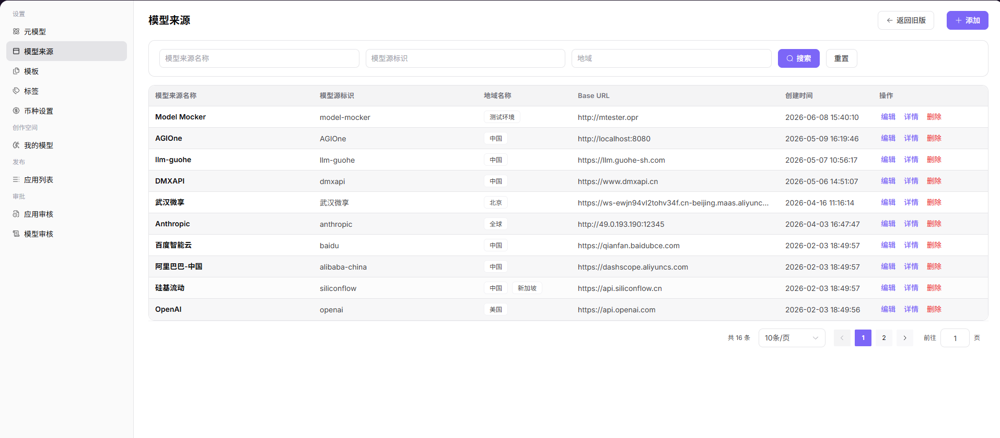
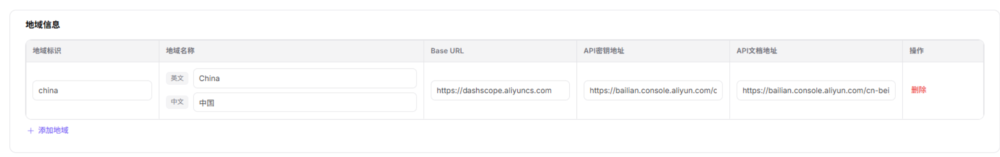

# 模型来源

## 场景目标

把厂商接口、地域、文档地址和认证请求头模板维护为可复用来源，不保存真实 API Key。

## 适用角色

- 平台运营方

## 开始前准备

- 确认厂商 Base URL、支持地域、API Key 获取页和 API 文档。
- 认证请求头使用占位符模板，不填写真实凭证。

## 操作步骤

1. 进入平台首页，点击左侧导航栏的 **"模型来源"** 菜单，进入模型来源管理页面。
2. 点击页面右上角的 **"添加"** 按钮，进入「添加模型源」配置页面。

3. **基本信息**：
   - **"名称"**（标注"多语言"）：用于设置在列表、详情和选择控件中展示的模型来源名称。点击 **"英文"** / **"中文"** 标签切换语言 Tab，**"正在编辑 英文 名称。切换语言可维护另一个语言版本"**，分别在对应 Tab 下填写英文与中文简体环境下的名称（如 英文：Alibaba / 中文：阿里巴巴）；
   - 填写 **"模型源标识"**（如 `alibaba-china`），用于唯一标识该模型来源。

1. **地域信息**：在表格中添加地域节点，每行一个地域，包含 5 个字段：
   - **"地域标识"**（如 `china`）；
   - **"地域名称"**（多语言，标注"英文/中文"双 Tab）：如 英文：China / 中文：中国；
   - **"Base URL"**（如 `https://dashscope.aliyuncs.com`）；
   - **"API 密钥地址"**（如 `https://bailian.console.aliyun.com`）；
   - **"API 文档地址"**（如 `https://bailian.console.aliyun.com/cn-bei`）；
   - 点击行末 **"删除"** 移除该地域；可点击 **"+ 添加地域"** 新增更多地域节点。

1. **请求头配置**：认证字段默认为 `Authorization: Bearer <key>`，可点击 **"+ 添加请求头"** 增加自定义请求头（认证字段名称 + 认证值）。

2. 确认所有信息配置无误后，点击 **"确定"** 按钮完成添加；如需放弃，点击 **"取消"**。
### 参数说明

| 字段名称 | 字段类型 | 示例 | 说明 |
|----------|----------|------|------|
| 名称 | 多语言文本 | `Alibaba / 阿里巴巴` | 必填，分别在"英文"和"中文"Tab 下配置展示名称 |
| 模型源标识 | 文本 | `alibaba-china` | 必填，模型来源的唯一标识 |
| 地域标识 | 文本 | `china` | 必填，地域节点的唯一标识 |
| 地域名称 | 多语言文本 | `China / 中国` | 必填，地域节点的多语言名称（英文/中文双 Tab） |
| Base URL | URL | `https://dashscope.aliyuncs.com` | 必填，模型服务的基础 API 地址 |
| API 密钥地址 | URL | `https://bailian.console.aliyun.com` | 选填，获取 API 密钥的官方地址 |
| API 文档地址 | URL | `https://bailian.console.aliyun.com/cn-bei` | 选填，模型服务的 API 文档地址 |
| 请求头 - 认证字段名称 | 文本 | `Authorization` | 选填，请求头中的认证字段键名 |
| 请求头 - 认证值 | 文本 | `Bearer <key>` | 选填，请求头中的认证值，支持模板变量 |

## 完成检查

> **用途：** 以下检查是当前功能任务的退出条件，用于判断操作结果是否可观察、可复核，以及是否可以继续当前场景的下一步。它不是操作步骤的重复；任一项不满足时，请按下方“常见失败分支”继续排查。

| 检查项 | 通过标准 |
| --- | --- |
| 1 | 名称、唯一标识、地域和 Base URL 准确。 |
| 2 | 请求头使用占位符，未保存真实 API Key。 |
| 3 | 模型模板可以选择该来源和地域。 |

## 常见失败分支

| 现象 | 优先检查 |
| --- | --- |
| 连通性测试失败 | Base URL、地域、网络、请求头模板和厂商状态 |
| 模板无法引用来源 | 来源状态、唯一标识、地域和厂商映射 |

## 操作手册

[查看“模型来源”的完整字段和常见问题](/zh-CN/usermanual/model-services/operator/settings/model-source/)
