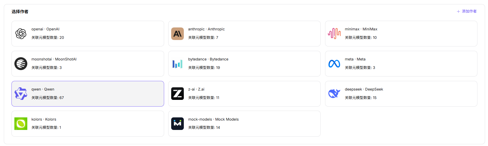
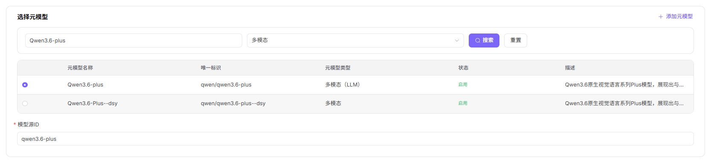
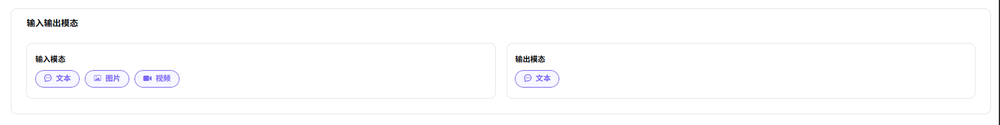
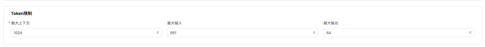
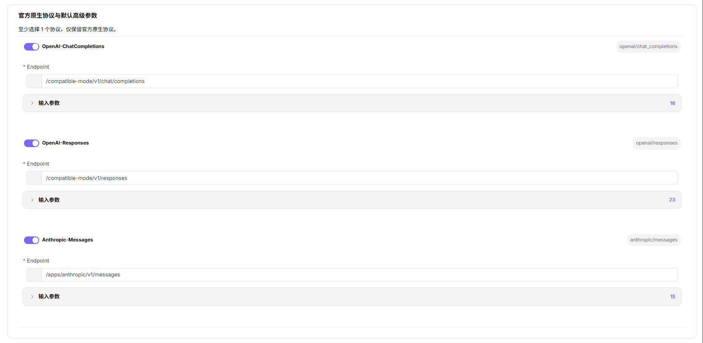

# 模板

## 操作步骤

1. 进入平台首页，点击左侧导航栏的 **"模板"** 菜单，进入模板管理页面。
2. 点击页面右上角的 **"添加"** 按钮，进入添加模板流程。

3. **Step 1：模型供应方/作者**：
   - **"选择作者"**：在作者卡片列表中选择目标作者（卡片含标识、显示名称、关联元模型数量），也可点击 **"+ 添加作者"** 新建作者。

   - **"供应方信息"**：
     - 选择 **"供应方"**（必填）；
     - 选择 **"地域"**（必填）；
     - 页面展示 **"当前厂商配置预览"**：含 Base URL、API 密钥地址、API 文档地址，以及请求头配置代码片段（如 `{ "Authorization": "Bearer <key>" }`）；
     - 可点击 **"+ 添加模型来源"** 新建模型来源。

   - 点击 **"下一步"**。
4. **Step 2：元模型**：
   - **"选择元模型"**：在元模型列表中通过搜索栏（元模型名称/唯一标识 + 元模型类型下拉）筛选并单选目标元模型（列表列头含元模型名称、唯一标识、元模型类型、状态、描述），也可点击 **"+ 添加元模型"** 新建元模型。
   - 填写 **"模型源ID"**（必填，如 `qwen3.6-plus`）。

   - **输入/输出模态**：分别选择 **"输入模态"**（多选：文本/图片/视频）与 **"输出模态"**（多选）。

   - **高级能力配置**：开启 **"函数 / 工具支持"**、**"思考模式"** 能力开关。

   - **Token 限制**：设置 **"最大上下文"**、**"最大输入"**、**"最大输出"**。

   - **官方原生协议与默认高级参数**：至少选择一个协议（OpenAI-ChatCompletions / OpenAI-Responses / Anthropic-Messages），填写 Endpoint 并配置输入参数。

   - 点击 **"下一步"**。
1. **Step 3：预览**：核对模板整体配置信息（选择作者、供应方信息、元模型、输入/输出模态、高级能力配置、Token 限制、官方原生协议与默认高级参数），确认无误后点击 **"提交"** 完成模板添加；如需修改，点击 **"上一步"** 返回对应步骤。

#### 参数说明 - 基础关联信息（Step 1）

| 字段名称 | 字段类型 | 示例 | 说明 |
|----------|----------|------|------|
| 模型作者 | 卡片选择 | `qwen / Qwen` | 必填，选择模板归属的模型作者（含关联元模型数量） |
| 供应方 | 下拉选择 | `阿里巴巴-中国` | 必填，选择模型调用的来源渠道 |
| 地域 | 下拉选择 | `中国` | 必填，选择模型来源对应的可用地域 |
| 厂商配置预览 - Base URL | URL | `https://dashscope.aliyuncs.com` | 选填，模型服务的基础 API 地址（仅展示） |
| 厂商配置预览 - API 密钥地址 | URL | `https://bailian.console.aliyun.com/...` | 选填，获取 API 密钥的官方地址（仅展示） |
| 厂商配置预览 - API 文档地址 | URL | `https://bailian.console.aliyun.com/...` | 选填，模型服务的 API 文档地址（仅展示） |
| 厂商配置预览 - 请求头 | JSON | `{ "Authorization": "Bearer <key>" }` | 选填，请求头配置代码片段（仅展示） |

#### 参数说明 - 元模型配置信息（Step 2）

| 字段名称 | 字段类型 | 示例 | 说明 |
|----------|----------|------|------|
| 元模型 | 单选 | `Qwen3.6-plus`（唯一标识 `qwen/qwen3.6-plus`） | 必填，选择需要生成模板的元模型 |
| 模型源 ID | 文本 | `qwen3.6-plus` | 必填，模型在对应源平台的唯一标识 |
| 输入模态 | 多选 | `文本 / 图片 / 视频` | 必填，配置模板支持的输入数据类型 |
| 输出模态 | 多选 | `文本` | 必填，配置模板支持的输出数据类型 |
| 高级能力 - 函数/工具支持 | 开关 | `开启 / 关闭` | 选填，开启后支持工具调用功能 |
| 高级能力 - 思考模式 | 开关 | `开启 / 关闭` | 选填，开启后支持深度思考和推理 |
| 最大上下文 | 数值 | `1024K` | 必填，Token 上下文长度上限 |
| 最大输入 | 数值 | `991K` | 必填，单次输入 Token 上限 |
| 最大输出 | 数值 | `64K` | 必填，单次输出 Token 上限 |
| 官方原生协议 - OpenAI-ChatCompletions | 开关 + 协议代号 | `openai/chat_completions` | 必填，模板适配的接口协议类型 |
| 官方原生协议 - OpenAI-Responses | 开关 + 协议代号 | `openai/responses` | 必填，模板适配的接口协议类型 |
| 官方原生协议 - Anthropic-Messages | 开关 + 协议代号 | `anthropic/messages` | 必填，模板适配的接口协议类型 |
| Endpoint | URL | `/compatible-mode/v1/chat/completions` | 必填，协议对应的端点路径 |
| 输入参数 | 参数列表 | `Temperature / Top-P / N / Stream / Max Tokens / Presence Penalty / Frequency Penalty / User / Seed / Parallel Tool Calls` | 选填，按协议预设的输入参数（可设置是否必填） |

