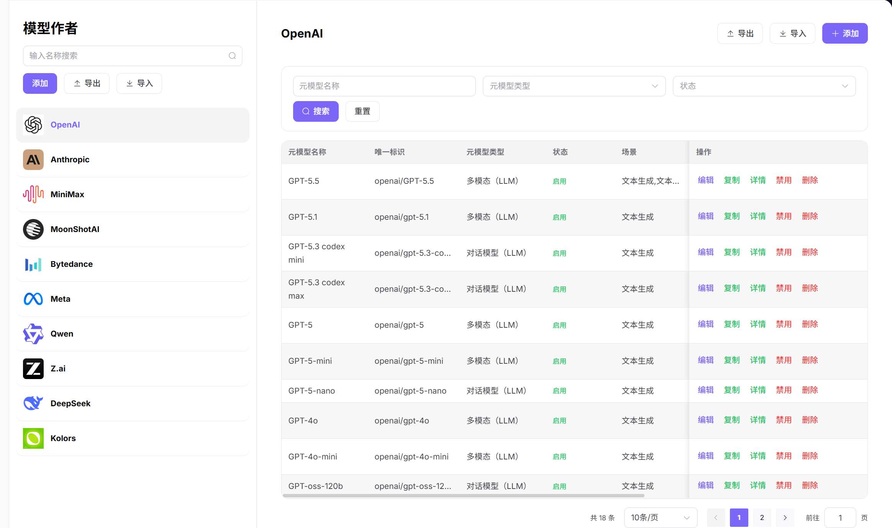
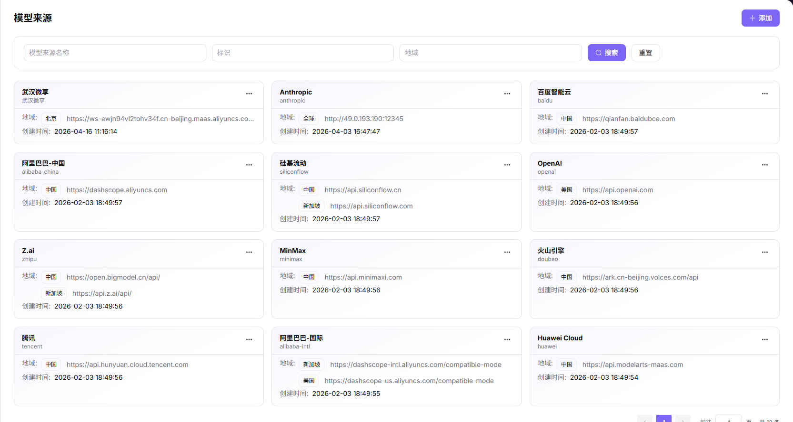
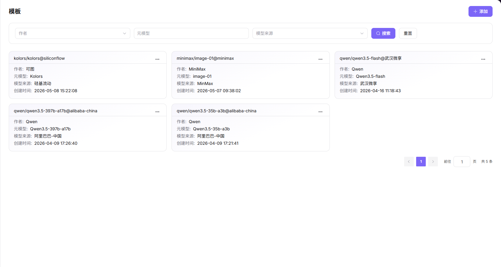
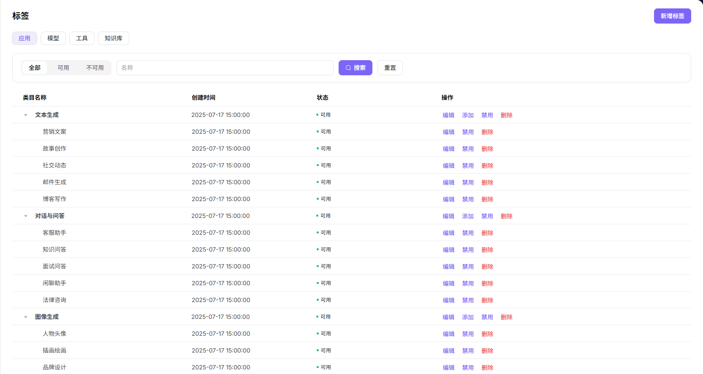
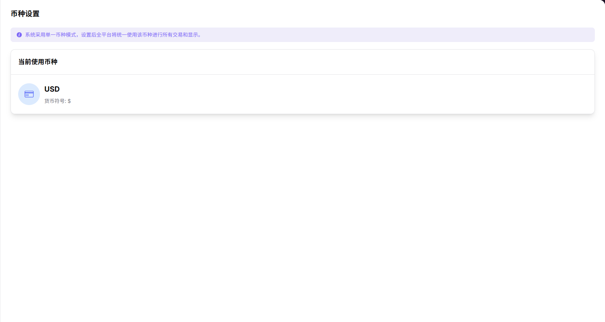
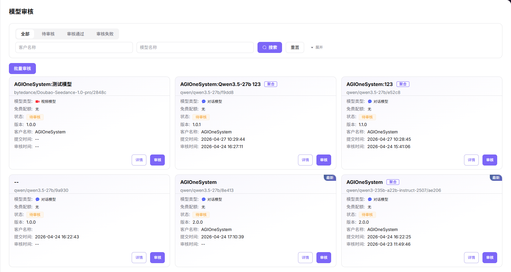

# 模型发布：预配置说明

本指南说明 Provider 发布公有模型前，Operator 需要先在 **Model Services** 中完成的预配置。

开始前，使用 Operator 账号登录 AGIOne，打开 **"模型及AI服务"**，确认左侧菜单中可以看到 **"设置"** 和 **"审批"**。

## 1. 添加元模型

1. 在左侧菜单中进入 **"设置 > 元模型"**。
2. 在左侧模型作者列表上方点击 **"添加"**。
3. 填写模型作者的 **唯一标识**，例如 `qwen`。
4. 配置模型作者的中文和英文显示名称。
5. 上传模型作者图标。
6. 点击 **"确定"** 保存模型作者。
7. 在左侧模型作者列表中选择刚创建的模型作者。
8. 点击右侧元模型列表的 **"+ 添加"**。
9. 填写元模型名称和系列。
10. 选择模型场景。
11. 将状态设置为 **启用**。
12. 填写官方发布时间。
13. 选择模型类型。
    - 按模型实际能力选择，例如对话模型、图片模型、多模态模型。
14. 配置输入 / 输出模态。
    - 可多选。
    - 按模型实际支持的交互介质选择，例如文本、图片、语音、视频。
15. 按模型能力开启高级能力。
    - 按模型实际能力开启，例如函数调用、工具支持、思考模式。
    - 模型不支持的能力不要开启。
16. 设置 Token 限制。
    - 按模型官方能力填写最大上下文、最大输入和最大输出。
    - 避免填写超过模型能力的数值，导致 Provider 发布模型后测试失败。
17. 选择官方原生协议。
    - 可多选。
    - 按模型服务兼容的协议选择，例如 `OpenAI-ChatCompletions`、`OpenAI-Responses`。
18. 填写元模型详情。
19. 点击 **"提交"** 保存元模型。

元模型是后续模板和模型发布的基础数据。禁用元模型后，基于该元模型发布的模型将无法对外提供服务。

## 2. 添加模型来源

1. 在左侧菜单中进入 **"设置 > 模型来源"**。
2. 点击页面右上角的 **"添加"**。
3. 填写模型来源的中文和英文名称。
4. 填写模型源标识，例如 `alibaba-china`。
    - 用于区分不同模型来源。
    - 保存后应保持稳定，避免影响后续模板关联。
5. 添加地域信息。
    - 如果同一模型来源有多个区域节点，可以添加多个地域。
    - Provider 发布模型时需要选择实际调用地域。
6. 填写地域标识和地域名称。
7. 填写 **BASE URL**。
    - 填写模型服务的基础 API 地址。
    - 不要填写具体模型或单个接口路径。
8. 填写 API 密钥地址。
    - 填写获取 API Key 的官方页面地址，用于引导 Provider 获取密钥。
9. 填写 API 文档地址。
    - 填写模型服务文档地址，用于后续核对协议、Endpoint 和参数。
10. 配置请求头认证字段，例如 `Authorization`。
11. 配置认证值模板，例如 `Bearer <key>`。
    - 只写模板或占位符。
    - 不要写真实 API Key。
12. 点击 **"确定"** 保存模型来源。

这里不要填写或公开真实 API Key。正式文档中只保留占位符，真实密钥由 Provider 在发布模型或测试协议时按权限填写。

## 3. 添加模板

1. 在左侧菜单中进入 **"设置 > 模板"**。
2. 点击页面右上角的 **"添加"**。
3. 选择模型作者。
    - 选择在 **"设置 > 元模型"** 中已经创建的作者。
4. 选择模型来源。
    - 选择在 **"设置 > 模型来源"** 中已经创建的来源。
5. 选择模型来源对应的地域。
    - 选择在 **"设置 > 模型来源"** 中已经创建的地域。
6. 点击 **"下一步"**。
7. 选择元模型。
    - 选择已经启用的元模型。
8. 填写模型源 ID。
    - 填写模型在来源平台中的真实模型标识，例如供应商文档或控制台中的 model id。
9. 配置输入 / 输出模态。
    - 可多选。
    - 应与元模型配置保持一致。
10. 按需要开启高级能力。
    - 应与元模型和实际来源服务能力保持一致。
11. 设置 Token 限制。
    - 应与元模型和实际来源服务能力保持一致。
12. 选择官方原生协议。
    - 可多选。
    - 应与元模型配置和来源服务支持的协议保持一致。
13. 点击 **"下一步"**。
14. 核对模型作者、模型来源、地域、元模型、模型源 ID、模态、Token 限制和协议。
15. 点击 **"提交"** 保存模板。

模板用于把模型作者、模型来源、地域、元模型、模型源 ID 和协议能力串起来。Provider 发布模型时，如果这里缺少模板或模板配置不完整，发布流程中可能无法选择目标配置，或协议测试失败。

## 4. 添加模型标签

1. 在左侧菜单中进入 **"设置 > 标签"**。
2. 在标签类型中选择模型相关类型。
    - 不要把模型标签建到应用、工具或知识库标签下。
3. 如需新增标签，点击 **"新增标签"**。
4. 填写标签编码，例如 `text_generation`。
    - 保存后不建议修改。
    - 建议使用稳定、可读的英文编码。
5. 配置中文和英文名称。
    - 需要同时维护中文和英文，避免多语言环境中展示不完整。
6. 配置备注。
7. 点击 **"确定"** 保存。
8. 在标签列表中确认该标签状态为可用。
9. 如标签已存在但处于禁用状态，点击 **"启用"**。
10. 如标签需要分层展示，在一级标签下添加子标签。
    - 不需要分层时只保留一级标签。

标签用于模型市场分类展示。公有模型发布前，应提前准备常用标签，避免模型上架后分类不清晰或无法按标签筛选。

## 5. 确认币种设置

1. 在左侧菜单中进入 **"设置 > 币种设置"**。
2. 查看当前平台统一使用的币种。
    - 当前使用币种用于全平台交易和费用展示。
3. 如果公有模型需要收费，确认币种与运营定价口径一致。
4. 如需切换币种，点击当前币种卡片。
5. 在弹窗中选择目标币种。
    - 切换币种会影响平台费用展示口径。
    - 切换前需要确认运营定价、用户展示和历史记录展示影响。
6. 确认后保存。

币种设置会影响全平台交易和费用展示。已有线上交易后，不建议随意调整。

## 6. 审核模型发布申请

1. Provider 完成模型发布并提交审核后，在左侧菜单中进入 **"审批 > 模型审核"**。
2. 在模型审核列表中找到待审核模型。
    - 可按待审核、审核通过、审核失败筛选。
    - 优先处理待审核模型。
3. 如需缩小范围，按模型类型筛选。
    - 可按对话模型、图片模型、视频模型、多模态等类型筛选。
4. 点击 **"详情"** 查看模型信息、配置和测试情况。
5. 核对模型名称、模型类型、版本、客户、标签、计费配置和限流配置。
6. 确认协议测试已通过。
7. 点击 **"审核"**。
8. 信息准确时选择通过。
    - 仅在模型信息、协议测试、计费、限流和标签都符合要求时选择通过。
9. 信息不完整、协议测试异常或配置不符合平台要求时，选择拒绝。
    - 拒绝适用于信息缺失、协议测试未通过、配置不符合平台要求或存在展示风险的模型。
10. 拒绝时填写原因，便于 Provider 修改后重新提交。

模型审核通过后，公有模型才会正式进入对外可见或可用状态。

## 7. 发布前检查清单

Provider 提交公有模型前，Operator 至少确认以下内容：

1. **元模型已启用**：模型作者、元模型、模态、Token 限制和官方原生协议已配置。
2. **模型来源可用**：来源标识、地域、BASE URL、API 文档地址和认证请求头已配置。
3. **模板已完整**：模板已关联模型作者、模型来源、地域、元模型、模型源 ID 和协议。
4. **标签已可用**：模型市场展示所需标签已创建并启用。
5. **币种已确认**：收费模型使用的币种与运营定价口径一致。
6. **审核入口可处理**：Operator 可以在 **"审批 > 模型审核"** 中查看并处理模型发布申请。

## 8. 牢记这几点

1. 不要把 API Key、AK/SK、Cookie、真实请求头值或账号密码写入公开文档。
2. 模型来源、元模型和模板必须能对应上，否则 Provider 发布时会缺少可选项或无法通过协议测试。
3. 公有模型发布后会对外可见，审核前必须核对名称、标签、计费、限流和协议测试结果。
4. 本文只适用于 Model Services 的模型发布预配置。
