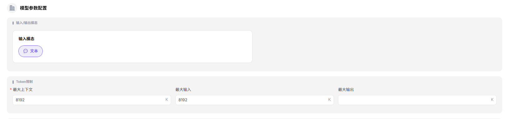
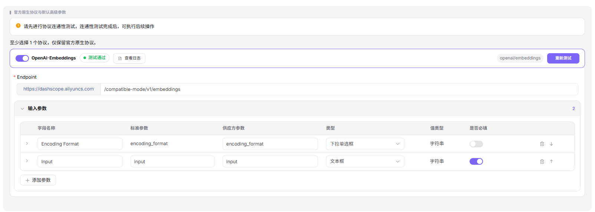
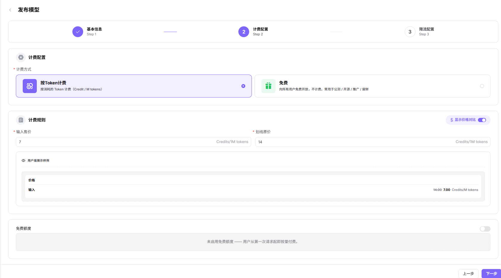
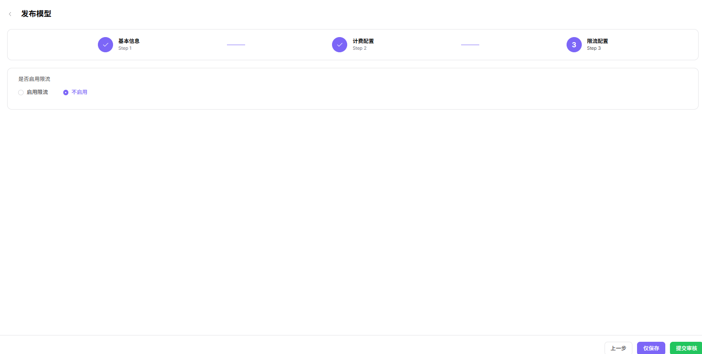

# 发布模型（嵌入模型）

## 场景目标

嵌入模型通过协议测试，在目标范围发布，并返回维度符合预期的向量。

## 适用角色

- 模型提供方

## 开始前准备

- 准备模型来源、模型标识、API 凭证和嵌入接口地址。
- 确认输入格式、向量维度、计费单位和限流策略。

## 操作步骤

1. 进入平台首页，点击左侧导航栏的 **"我的模型"** 菜单，进入模型管理页面。
2. 默认进入 **"我的发布"** Tab，可通过页面顶部 **"公共模型 / 私有模型"** 切换查看不同区域的模型；也可切换至 **"概览"** 或 **"我的聚合"** Tab。
3. 点击页面右上角的 **"发布模型"** 按钮，弹出"选择发布区域"对话框。
4. 选择发布区域：
   - **"发布到私有区"**：仅本团队或租户内可见可调用，加入私有库，不进入公开目录，适合内部业务与安全敏感场景；
   - **"发布到公有区"**：上架公有目录，对所有租户的 EU 开放调用，可独立设置定价与限流。
5. 点击  **"发布到公有区"** 进入发布配置流程（Step 1：基本信息）。

### **Step 1：基本信息**：
- **模型源/元模型信息**：
    - 选择 **"元模型"**（如 text-embedding-v1）；
    - 选择 **"模型源"**（如 阿里巴巴-中国）；
    - 填写 **"请求URL"**（如 `https://dashscope.aliyuncs.com`，区域默认"中国"）；
    - 填写 **"API密钥"**（如 `sk-***`）；
    - 填写 **"模型源ID"**（如 `text-embedding-v1`，即发往上游厂商的精确模型名称）。

- **模型类型**：在"模型类型"区块默认 **"嵌入模型"**。

- **请求头配置**：认证字段默认为 `Authorization: Bearer <key>`，可点击 **"添加请求头"** 增加自定义字段。
   

- **模型参数配置**：
    - 默认 **"输入模态"**（文本）；
    - 嵌入模型无输出模态选项（输出为向量）。
    - **Token 限制**：设置 **"最大上下文"**（如 8192K）、**"最大输入"**（如 8192K）；**"最大输出"** 留空（嵌入模型不限制输出 Token）。

- **支持协议与默认参数**：至少选择一个协议（嵌入模型仅 OpenAI-Embeddings 可选），只有先进行协议连通性测试，连通性测试成功后可执行后续操作；测试通过后填写 **"接口地址"**（如 `https://dashscope.aliyuncs.com/compatible-mode/v1/embeddings`）并配置 **"输入参数"**（Encoding Format、Input 等，可设置"是否必填"）。嵌入模型**无调用配置 / 回调地址 / 返回结果解析**区块（默认同步调用、返回结构固定）。

- **基本信息**：
   - 填写 **"个性化标识"**（如 text-embedding-v1）、**"描述"**。

   - **发布方式**：选择 **"立即发布"** 或 **"定时发布"**。

- 点击 **"下一步"** 进入 Step 2：计费配置。

### **Step 2：计费配置**：
- **计费配置**：
    - 选择 **"计费方式"**：
-  **"按Token计费"**（按消耗的 Token 计费，Credit / M tokens）
        -  **"免费"**（向所有用户免费开放）；
- **计费规则**：
    - 开启 **"显示价格A对比"** 开关后可展示划线原价；
    - 在 **"计费规则 — 价格录入"** 区块设置：
        - **"输入售价"**（如 7 Credits/1M tokens）与 **"划线原价"**（如 14 Credits/1M tokens）；嵌入模型无输出售价/缓存/分阶梯配置；
    - **免费额度**：开启后可设置可领取额度、人数、总量；

- 点击 **"下一步"** 进入 Step 3：限流配置。

### **Step 3：限流配置**：
- 选择 **"是否启用限流"**：**"启用限流"** 或 **"不启用"**；
- 设置 **"默认限流"**：
    - **"RPM（每分钟请求数）"**：输入数值（如 2 次/分钟），可勾选 **"不限制"**；
    - **"TPM（每分钟Token数）"**：输入数值（如 100 Token/分钟），可勾选 **"不限制"**。

- 点击 **"仅保存"** 或 **"提交审核"** 完成发布。

#### 参数说明 - 发布流程配置项（嵌入模型）

| 字段名称 | 字段类型 | 示例 | 说明 |
|----------|----------|------|------|
| 元模型 | 下拉选择 | `text-embedding-v1`（含 text 8192K 标签） | 必填，选择基础元模型 |
| 模型源 | 下拉选择 | `阿里巴巴-中国` | 必填，模型的来源渠道 |
| 请求URL | URL | `https://dashscope.aliyuncs.com` | 必填，模型服务的 API 地址（可切换区域） |
| API密钥 | 文本 | `sk-***` | 必填，调用模型的密钥 |
| 模型源ID | 文本 | `text-embedding-v1` | 必填，发往上游厂商的精确模型名称 |
| 模型类型 | 单选 | `嵌入模型` | 必填，模型的功能类型（无子类型） |
| 请求头 | 键值对 | `Authorization: Bearer <key>` | 选填，认证与自定义请求头 |
| 输入模态 | 多选 | `文本` | 必填，模型支持的输入数据类型 |
| 输出模态 | — | （无） | 嵌入模型无输出模态选项（输出为向量） |
| 最大上下文 | 数值 | `8192K` | 必填，Token 上下文上限 |
| 最大输入 | 数值 | `8192K` | 必填，单次输入 Token 上限 |
| 最大输出 | 数值 | （留空） | 嵌入模型不限制输出 Token |
| 支持协议 | 多选 | `OpenAI-Embeddings` | 必填，嵌入模型兼容的 API 协议，需先进行连通性测试 |
| 接口地址 | URL | `https://dashscope.aliyuncs.com/compatible-mode/v1/embeddings` | 必填，协议对应的端点地址 |
| 输入参数 | 参数列表 | `Encoding Format / Input` | 选填，按协议预设的输入参数（可设置是否必填） |
| 个性化标识 | 文本 | `text-embedding-v1` | 必填，模型对外展示的自定义标识 |
| 描述 | 文本 | `文本向量化...` | 选填，模型的说明描述 |
| 发布方式 | 单选 | `立即发布 / 定时发布` | 必填，模型的上线时机 |
| 计费方式 | 单选 | `按Token计费 / 免费` | 必填，模型的收费方式 |
| 显示价格对比 | 开关 | `开启 / 关闭` | 选填，是否展示划线原价 |
| 输入售价 | 数值 | `7 Credits/1M tokens` | 必填，Token 的实际售价 |
| 划线原价 | 数值 | `14 Credits/1M tokens` | 选填，Token 的参考价 |
| 免费额度 | 开关 | `开启 / 未启用` | 选填，配置模型的免费调用额度 |
| 是否启用限流 | 单选 | `启用限流 / 不启用` | 选填，配置模型的调用频率限制 |
| RPM（每分钟请求数） | 数值 / 不限制 | `2 次/分钟` | 选填，每分钟请求数上限，可勾选"不限制" |
| TPM（每分钟Token数） | 数值 / 不限制 | `100 Token/分钟` | 选填，每分钟 Token 数上限，可勾选"不限制" |

## 完成检查

> **用途：** 以下检查是当前功能任务的退出条件，用于判断操作结果是否可观察、可复核，以及是否可以继续当前场景的下一步。它不是操作步骤的重复；任一项不满足时，请按下方“常见失败分支”继续排查。

| 检查项 | 通过标准 |
| --- | --- |
| 1 | 协议连通性测试通过，模型来源和标识准确。 |
| 2 | 发布或审核状态符合预期。 |
| 3 | 受控调用返回维度正确的向量，调用日志可定位。 |

## 常见失败分支

| 现象 | 优先检查 |
| --- | --- |
| 协议测试失败 | 接口地址、凭证、模型标识、请求体和模型来源网络 |
| 向量结果异常 | 输入格式、向量维度、返回映射和所选协议 |

## 操作手册

[查看“我的模型”完整字段和发布结果校验](/zh-CN/usermanual/model-services/user/studio/my-models/)
